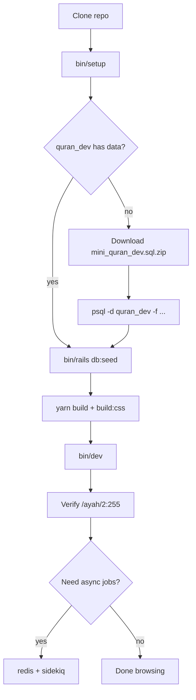

# Phase 17 — Local Setup

> **Onboarding series:** progressive deep-dive for becoming a legitimate QUL contributor.  
> **Prerequisites:** [Phases 1–16](phase-01-what-is-qul.md)  
> **This file:** get QUL running on your machine, load Quran data, and verify the stack works.

---

## What "working locally" means

Minimum viable dev environment:

| Service | Required for… |
|---|---|
| **PostgreSQL** | CMS DB + Quran DB |
| **Ruby 3.3.3** + Bundler | Rails app |
| **Node 20** + Yarn | esbuild + Tailwind |
| **Quran mini dump** | Any page touching verses/translations/audio |
| **Redis** | `perform_later` jobs, Sidekiq, Action Cable (optional for first browse) |

**FACT** — Official doc: `app/views/docs/markdown/project-setup.md` (served at `/docs/project-setup`).

**INFERENCE:** You can boot the app and browse `/docs` without the dump, but `/ayah/2:255`, `/resources` previews, and most contributor tools will error until `quran_dev` is populated.

---

## Version pins

| Tool | Pin | File |
|---|---|---|
| Ruby | **3.3.3** | `.ruby-version` |
| Node | **20.20.2** | `.node-version` |
| PostgreSQL | 14+ (16 tested) | docs / copilot-instructions |
| Redis | 7+ | `docker-compose.yml` |

**FACT** — Gemfile allows `ruby ">= 3.3.3", "<= 3.3.10"`. Stick to 3.3.3 unless you hit a documented reason to bump.

---

## Two databases (do not skip this)

```text
quran_community_tarteel   ← CMS (users, drafts, downloads metadata)
quran_dev                 ← Quran content (verses, translations, audio, …)
```

| After step | CMS DB | Quran DB |
|---|---|---|
| `bin/setup` | Migrated tables, empty data | Database exists, **empty** (`quran` schema only) |
| Load `mini_quran_dev.sql` | unchanged | ~90 tables with real data |
| `rails db:seed` | One admin user | unchanged |

**FACT** — `db/schema.rb` is **CMS only**. Quran schema comes from the SQL dump, not migrations.

---

## Setup path A — native Postgres (recommended)

### 1. Clone and install

```bash
git clone https://github.com/TarteelAI/quranic-universal-library.git
cd quranic-universal-library

# Ruby (rbenv/asdf/rvm — your choice)
ruby -v   # must be 3.3.3

bin/setup
```

**What `bin/setup` does** (`bin/setup`):

```text
bundle install
yarn install
bin/rails db:create:all    # both databases
bin/rails db:prepare       # CMS migrations
log/tmp clear
```

**What it does NOT do:**

- Load Quran dump
- Run `db:seed` (admin user)
- Start Redis, Sidekiq, or asset build
- Copy `.env.sample` → `.env`

### 2. Database connection env vars

`config/database.yml` reads:

```yaml
host:     <%= ENV['DB_HOST'] %>
username: <%= ENV['DB_USERNAME'] %>
password: <%= ENV['DB_PASSWORD'] %>
```

**INFERENCE** — With all three unset, Rails uses PostgreSQL defaults (often peer auth on macOS/Linux with local socket). If connection fails, set explicitly:

```bash
export DB_HOST=localhost
export DB_USERNAME=postgres
export DB_PASSWORD=your_password
```

Or create `.env` from `.env.sample` (S3 vars only in sample — add DB vars yourself).

**FACT** — `dotenv` gem is in the `:development` group but there is no obvious `Dotenv.load` in `config/`. **INFERENCE** — export vars in your shell or use a tool that loads `.env` before `bin/dev`.

### 3. Load the Quran mini dump (critical)

```bash
curl -L -o mini_quran_dev.sql.zip \
  https://static-cdn.tarteel.ai/qul/mini-dumps/mini_quran_dev.sql.zip
unzip mini_quran_dev.sql.zip
psql -d quran_dev -f mini_quran_dev.sql
```

Alternative (faster restore, binary format):

```bash
curl -L -o mini_quran_dev.dump.zip \
  https://static-cdn.tarteel.ai/qul/mini-dumps/mini_quran_dev.dump.zip
unzip mini_quran_dev.dump.zip
pg_restore --no-owner --no-privileges --no-tablespaces --no-acl \
  --dbname quran_dev -v mini_quran_dev.dump
```

**Verify in psql:**

```sql
\c quran_dev
\dt quran.*
SELECT count(*) FROM verses;   -- expect thousands, not 0
```

**INFERENCE** — If `\dt quran.*` shows no tables, the dump did not load into the right database or schema.

### 4. Seed CMS admin user (optional but useful)

`bin/setup` does **not** run seeds. Create the default super-admin manually:

```bash
bin/rails db:seed
```

**FACT** — `db/seed.rb` creates:

| Field | Value |
|---|---|
| Email | `admin@cms.com` |
| Password | `cms-password` |
| Role | `super_admin` |

Use this for `/cms` and `/sidekiq` (admin-only).

You can also register a normal user via Devise at `/users/sign_up` — approval workflow may apply for non-admin roles.

### 5. Build assets and run

```bash
# One-time or after JS/CSS changes
yarn build
yarn build:css

# Recommended: Rails + esbuild reload + Tailwind watch
bin/dev
```

**FACT** — `Procfile.dev`:

```text
web:      bin/rails server -p 3000
js:       yarn build --reload
tailwind: bin/rails tailwindcss:watch
```

App: [http://localhost:3000](http://localhost:3000)  
CMS: [http://localhost:3000/cms](http://localhost:3000/cms) (not `/admin` — redirects)

### 6. Redis + Sidekiq (when you need background jobs)

```bash
# Option A: docker
docker compose up redis -d

# Option B: local redis-server
redis-server

# Separate terminal
bundle exec sidekiq -e development -C config/sidekiq.yml
```

Without Sidekiq, `perform_later` jobs queue in Redis but never run. `perform_now` paths (mushaf save, single-draft approve) still work.

---

## Setup path B — Docker for Postgres only

`docker-compose.yml` provides **Postgres + Redis**, not the Rails app.

```bash
docker compose up -d db redis
```

Postgres is exposed on `localhost:5432` with:

| Var | Value |
|---|---|
| `POSTGRES_USER` | `postgres` |
| `POSTGRES_PASSWORD` | `password` |
| `POSTGRES_DB` | `quran_community_tarteel` |

`docker/dev/init-db.sh` also creates `quran_dev` and `quran` schema on first boot.

Then set env and run Rails on the host:

```bash
export DB_HOST=localhost
export DB_USERNAME=postgres
export DB_PASSWORD=password

bin/setup
# load mini dump (same as path A)
bin/dev
```

**FACT** — `docker/README.md` documents a **production** image build (`docker build`), not a dev all-in-one compose stack.

---

## Environment variables cheat sheet

| Variable | Needed when | Default / fallback |
|---|---|---|
| `DB_HOST`, `DB_USERNAME`, `DB_PASSWORD` | Postgres auth issues | unset → socket/peer |
| `QUL_STORAGE_*` | S3 export upload (`refresh_export!`) | `.env.sample` → `missing` / `https://fix.me` |
| `RAILS_MASTER_KEY` | Production Docker image | **Not required** for dev (`secrets.yml` has dev `secret_key_base`) |
| `REDIS_URL` | Action Cable prod | dev cable.yml defaults to `redis://localhost:6379/1` |

**INFERENCE** — You can develop and browse locally **without** real S3 credentials. Export-to-S3 admin actions will fail until credentials are configured.

---

## Verification checklist

Run these after setup. Treat as a smoke test, not a full test suite.

### 1. Rails boots

```bash
bin/rails runner 'puts Rails.version'
# expect 8.0.x
```

### 2. Both DBs connect

```bash
bin/rails runner 'puts "CMS users: #{User.count}"; puts "Verses: #{Verse.count}"'
```

| Result | Meaning |
|---|---|
| `Verses: 0` | Dump not loaded — go back to step 3 |
| `PG::UndefinedTable` on `verses` | Dump not loaded or wrong DB |
| `CMS users: 0` | Run `bin/rails db:seed` if you need admin login |

### 3. HTTP smoke

| URL | Expect |
|---|---|
| `http://localhost:3000` | Landing page loads |
| `http://localhost:3000/docs` | Docs index |
| `http://localhost:3000/ayah/2:255` | Ayah page with text (needs dump) |
| `http://localhost:3000/resources` | Resource catalog cards |
| `http://localhost:3000/cms` | Active Admin login |

### 4. Assets present

```bash
ls app/assets/builds/application.js
ls app/assets/builds/tailwind.css
```

If missing: `yarn build && yarn build:css`.

### 5. JS hot reload (optional)

`bin/dev` js process should log `[reload] listing on port 3005`. Editing a Stimulus file should trigger browser refresh.

---

## End-to-end setup diagram



---

## What works without extra setup

| Feature | Works without dump? | Works without Redis? |
|---|---|---|
| `/docs` | Yes | Yes |
| `/cms` login (after seed) | Yes | Yes |
| `/ayah/:key` | **No** | Yes |
| Translation proofreading | **No** | Mostly (bulk approve needs Sidekiq) |
| Mushaf layout save | **No** | Yes (`perform_now`) |
| Segment builder (Vue) | **No** | Yes |
| `refresh_export!` | **No** | No (needs Sidekiq + S3) |

---

## Common failures and fixes

| Symptom | Likely cause | Fix |
|---|---|---|
| `relation "verses" does not exist` | Empty `quran_dev` | Load mini dump |
| `PG::ConnectionBad` | Wrong host/user/password | Set `DB_*` env vars |
| `Your Ruby version is X, but Gemfile specified 3.3.3` | Wrong Ruby | `rbenv install 3.3.3` |
| Blank page / no styles | Assets not built | `yarn build:css` + `yarn build` |
| `could not connect to server: redis` | Redis not running | `docker compose up redis -d` |
| Admin export hangs forever | Sidekiq not running | Start sidekiq worker |
| Cypress/Puppeteer install fails | Network/sandbox | `CYPRESS_INSTALL_BINARY=0 PUPPETEER_SKIP_DOWNLOAD=true yarn install` |
| Jobs stuck in queue | Sidekiq not running | `bundle exec sidekiq -C config/sidekiq.yml` |

### Re-loading the dump

If you corrupt local Quran data:

```bash
dropdb quran_dev
createdb quran_dev
psql -d quran_dev -c 'CREATE SCHEMA IF NOT EXISTS quran;'
psql -d quran_dev -f mini_quran_dev.sql
```

**WARNING** — `ExportMiniDumpJob` deletes large portions of `quran_dev` before `pg_dump`. Never run it outside development.

---

## Stale documentation signals

| Doc says | Code reality | Label |
|---|---|---|
| `contributing.md`: "Edit files in `docs/` first" | Docs live in `app/views/docs/markdown/` + `config/docs.yml` | **FACT** — stale path |
| `.github/copilot-instructions.md`: admin at `/admin` | Routes redirect to `/cms` | **FACT** — stale URL |
| `copilot-instructions.md`: `rails db:create` only | `bin/setup` uses `db:create:all` for both DBs | **FACT** — incomplete |
| `project-setup.md` implies dump is optional for "running" | App boots but Quran pages error | **INFERENCE** — doc understates dump importance |

Prefer **`app/views/docs/markdown/project-setup.md`** and this onboarding series over root `contributing.md` for setup.

---

## macOS quick notes

**INFERENCE** — Common working combo:

- Postgres.app or Homebrew `postgresql@16`
- `rbenv` + `nodenv` for version pins
- `brew install redis` or Docker for Redis only

No QUL-specific Homebrew formula — standard Rails stack.

---

## Uncertainties

| # | Question | Label |
|---|---|---|
| 1 | Whether `dotenv` auto-loads `.env` without extra config | **UNKNOWN** — gem present, no explicit loader found |
| 2 | Official blessed dev path: native vs Docker Postgres | **INFERENCE** — `bin/setup` + host Rails is primary |
| 3 | Whether `config/master.key` is obtainable for contributors | **UNKNOWN** — not in repo; dev may not need it |
| 4 | Mini dump freshness / update cadence | **UNKNOWN** — CDN URL is static path |

---

## Phase 17 summary

```text
bin/setup          → gems, yarn, CMS migrate, create quran_dev (empty)
load mini dump     → quran_dev populated (required for real work)
db:seed            → admin@cms.com / cms-password
yarn build + bin/dev → http://localhost:3000
redis + sidekiq    → when testing exports / async admin actions
```

Local setup is **two-step database**: migrations for CMS, dump for Quran. Everything else is standard Rails 8 + esbuild.

---

## Stop here — questions before Phase 18

Phase 18 correlates **browser URLs to code** — mapping what you see at `/ayah/2:255` or `/translation_proofreadings` to controllers, views, and models.

1. Which database holds `verses`, and how do you populate it locally?
2. What does `bin/setup` not do that you still need manually?
3. What URL do you use for the CMS, and what are the default seed credentials?

Reply with questions, or say **"proceed"** for **Phase 18 — Browser ↔ Code Correlation**.
