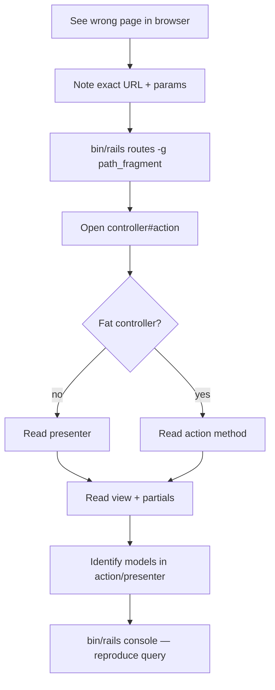

# Phase 18 — Browser ↔ Code Correlation

> **Onboarding series:** progressive deep-dive for becoming a legitimate QUL contributor.  
> **Prerequisites:** [Phases 1–17](phase-01-what-is-qul.md)  
> **This file:** trace what you see in the browser back to routes, controllers, views, presenters, and models.

---

## How to trace any URL (method)

Every browser request follows the same lookup chain:

```text
Browser URL
  → config/routes.rb          (which controller#action?)
  → app/controllers/*.rb      (what loads? what renders?)
  → app/presenters/*.rb       (view-model logic — very common in QUL)
  → app/views/**              (ERB templates, partials, Turbo frames)
  → app/models/**             (Active Record reads/writes)
  → lib/**                    (heavy import/export logic — usually not in controller)
```

**CLI shortcuts:**

```bash
bin/rails routes | grep ayah          # find route for a path fragment
bin/rails routes -c AyahController    # all routes for one controller
bin/rails routes -g translation_proof   # grep routes
```

**Log shortcut:** In development, each request logs `Processing by SomeController#action`. Start there when the URL is ambiguous.

---

## Controller inheritance (who runs your request)

```text
ActionController::Base
  └── ApplicationController          ← most public pages
        ├── CommunityController      ← contributor tools + resources + docs
        │     ├── TranslationProofreadingsController
        │     ├── MushafLayoutsController
        │     ├── SurahAudioFilesController
        │     └── ResourcesController
        ├── AyahController           ← ayah viewer (not under Community)
        ├── LandingController
        └── AdminsController         ← super_admin only tools
              └── WordMistakesController, TranslationDiffsController

ActionController::API
  └── Api::V1::ApiController         ← JSON only (/api/v1/*)

ActiveAdmin                          ← /cms/* (generated from app/admin/*.rb)
```

**FACT** — `CommunityController` sets `@presenter = CommunityPresenter` and provides `load_language`, `authorize_access!`, and docs helpers. Most contributor tools inherit from it.

**FACT** — `ApplicationController#init_presenter` runs on every HTML request unless a child overrides it.

---

## URL families at a glance

| URL pattern | Controller | Primary models |
|---|---|---|
| `/` | `LandingController#home` | — |
| `/ayah/:key` | `AyahController` | `Verse`, `Translation`, `Tafsir` |
| `/resources` | `ResourcesController#index` | `DownloadableResource` |
| `/resources/:type` | `ResourcesController#show` | `DownloadableResource` (by type slug) |
| `/resources/:type/:id` | `ResourcesController#detail` | `DownloadableResource`, `ResourceContent` |
| `/docs/:key` | `CommunityController#docs` | `DocsPageService` → markdown files |
| `/cms/*` | Active Admin | CMS models + `ResourceContent` hub |
| `/translation_proofreadings` | `TranslationProofreadingsController` | `Translation`, `Draft::Translation` |
| `/mushaf_layouts/:id` | `MushafLayoutsController` | `Mushaf`, `MushafWord`, `MushafPage` |
| `/surah_audio_files/...` | `SurahAudioFilesController` | `Audio::Recitation`, `Audio::Segment` |
| `/api/v1/*` | `Api::V1::*` | Same Quran models, JSON response |

---

## Trace 1 — `/ayah/2:255`

### Route

```ruby
get '/ayah/:key', to: 'ayah#show', as: :ayah
get '/ayah/:key/text', to: 'ayah#text', as: :ayah_text
# … translations, tafsirs, words, theme, recitation, etc.
```

`:key` is the **verse_key** string (`"2:255"`), not `verses.id`.

### Controller flow

```ruby
# AyahController — every action calls init_presenter via ApplicationController
def init_presenter
  @presenter = AyahPresenter.new(self)
  @ayah = @presenter.ayah          # Verse.find_by(verse_key: params[:key])
  head :not_found unless @presenter.found?
end
```

| Action | Renders | Turbo? |
|---|---|---|
| `show` | `app/views/ayah/show.html.erb` | Parent frame `:ayah_info` |
| `text` | partial `ayah/_ayah_text` | Lazy-loaded frame |
| `translations` | partial `ayah/_translations` | Lazy-loaded frame |
| `words` | partial `ayah/_words` | Lazy-loaded frame |

### View structure

```text
ayah/show.html.erb
  └── turbo_frame_tag :ayah_info
        ├── ayah/_title.html.erb        (prev/next nav)
        └── ayah/_info.html.erb
              ├── turbo_frame :ayah_text      → GET /ayah/2:255/text
              ├── turbo_frame :ayah_translations
              ├── turbo_frame :ayah_tafsirs
              └── … more tabs
```

**INFERENCE:** Tab switches are **separate HTTP requests** into Turbo Frames, not client-side tab state.

### Models touched

| Model | Role |
|---|---|
| `Verse` | Load ayah by `verse_key` |
| `Translation` | Tab content, filtered by `translation_ids` param |
| `Word` | Word-by-word tab |
| `Tafsir` | Tafsir tab |

### Stimulus

`data-controller="turbo-frame-loading"` on the section — shows spinner while frames load.

---

## Trace 2 — `/resources` and `/resources/translation/131`

### Catalog index

```
GET /resources  →  ResourcesController#index
```

| Layer | File / class |
|---|---|
| View | `app/views/resources/index.html.erb` |
| Helper | `ResourcesHelper#downloadable_resource_cards` |
| Model | `DownloadableResource.published` |

### Type listing

```
GET /resources/translation  →  ResourcesController#show
```

`params[:id]` = **`translation`** (resource type slug, not numeric ID).

Presenter selected by type:

```ruby
presenter_mapper = {
  mushaf_layout: MushafLayoutResourcesPresenter,
  translation: TranslationResourcePresenter,
  tafsir: TafsirResourcePresenter,
  # …
}
@presenter = presenter_class.new(self)
```

### Resource detail + download

```
GET /resources/translation/131  →  ResourcesController#detail
```

| Param | Meaning |
|---|---|
| `type` | `translation` (URL segment) |
| `id` | `DownloadableResource` slug or numeric id |

```ruby
@resource = DownloadableResource.published.find_by_slug_or_id!(params[:id])
@presenter.set_resource(@resource)
```

View: `app/views/resources/detail.html.erb` → renders type-specific preview partial under `app/views/resources/previews/`.

### Download click

```
GET /resources/:resource_id/:token/download  →  ResourcesController#download
```

Requires `authenticate_user!` → redirects to S3/file URL via `DownloadableFile`.

**Data chain:**

```text
DownloadableResource
  └── resource_content_id → ResourceContent
  └── downloadable_files → DownloadableFile (token, S3 attachment)
```

Export bytes were built by `refresh_export!` (Phase 11) — not generated on this request.

---

## Trace 3 — `/translation_proofreadings?resource_id=131`

### Route

```ruby
resources :translation_proofreadings, except: :destroy
# GET  /translation_proofreadings           → index
# GET  /translation_proofreadings/:id       → show  (:id = verse_id!)
# GET  /translation_proofreadings/:id/edit  → edit
# PUT  /translation_proofreadings/:id       → update
```

**Gotcha:** `:id` in the URL is **`verses.id`** (integer), not `verse_key`. Query param `resource_id` selects which translation package.

### Controller

```ruby
class TranslationProofreadingsController < CommunityController
  before_action :load_resource_access
  before_action :authenticate_user!, only: %i[edit update]
  before_action :authorize_access!, only: %i[edit update]

  def find_resource
    params[:resource_id] ||= 131   # default translation in dev
    @resource = ResourceContent.find(params[:resource_id])
  end
```

| Action | View | Models |
|---|---|---|
| `index` | `translation_proofreadings/index.html.erb` | `Translation` list, paginated |
| `show` | `translation_proofreadings/show.html.erb` | `Translation` + `Verse` |
| `edit` | `translation_proofreadings/edit.html.erb` | builds `Draft::Translation` |
| `update` | redirect | `Translation#save_suggestions` |

### Save path (contributor edit)

```text
PUT /translation_proofreadings/:verse_id
  → TranslationProofreadingsController#update
  → Translation#save_suggestions(params, current_user)
  → Draft::Translation.create (need_review: true)
  → NOT direct write to translations table
```

**FACT** — Contributor proofreading creates **draft rows** (Phase 9). CMS approve job promotes to `translations`.

### Permission

```ruby
@access = can_manage?(@resource)
# super_admin → always
# else → UserProject approved for resource_content_id
```

Edit/update require `@access` truthy.

### Stimulus

- `chapter-verses-filter` on index filter form
- `remote-form` on edit form
- `translation-footnote` on show view

---

## Trace 4 — `/cms/resource_contents/131`

### Route

```ruby
ActiveAdmin.routes(self)   # namespace :cms
# → /cms/resource_contents/:id
```

### Code location

| Piece | Path |
|---|---|
| Admin registration | `app/admin/content/resource_content.rb` |
| Model | `ResourceContent` (`QuranApiRecord`) |
| Actions | approve, import, export buttons → `perform_later` jobs |

This is the **editorial hub** (Phase 8). Browser shows Active Admin HTML; actions enqueue Sidekiq jobs.

**Correlate CMS row to public catalog:**

```text
ResourceContent (id: 131)
  ↔ DownloadableResource (via resource_content_id or slug)
  ↔ /resources/translation/131
```

**INFERENCE:** Not every `ResourceContent` has a `DownloadableResource` — check `with_downloadable_resources` scope in admin.

---

## Trace 5 — `/mushaf_layouts/7?page_number=42`

### Route

```ruby
resources :mushaf_layouts, except: [:destroy, :new] do
  member do
    put :save_page_mapping
    put :save_line_alignment
  end
end
```

`:id` = **`Mushaf.id`** (Quran DB), resolved to `ResourceContent` via `mushaf.resource_content`.

### Controller highlights

| Action | What happens |
|---|---|
| `show` | Page list or `show_page` when `page_number` set |
| `edit` | Word line mapping form |
| `update` | `MushafLayoutJob.perform_now` — **sync** write |
| `save_page_mapping` | Turbo Stream response |
| `save_line_alignment` | Writes `MushafLineAlignment` (CMS DB) |

### Models

| Model | DB | Role |
|---|---|---|
| `Mushaf` | Quran | Layout edition |
| `MushafPage` | Quran | Page stats |
| `MushafWord` | Quran | Per-word line position |
| `MushafLineAlignment` | CMS | Surah name / basmallah lines |
| `Word` | Quran | Canonical word identity |

### Views

```text
mushaf_layouts/show.html.erb        (all pages grid)
mushaf_layouts/show_page.html.erb   (single page editor)
mushaf_layouts/_page_mapping.html.erb
shared/_mushaf_page.html.erb        (rendered mushaf preview)
```

### Stimulus

`mushaf-page-builder`, `mushaf-page`, `page-search`, `turbo-frame-loading`

---

## Trace 6 — `/surah_audio_files/1/segment_builder?recitation_id=7`

### Route

```ruby
resources :surah_audio_files do
  member do
    get :segment_builder
    get :segments          # JSON for Vue
    post :save_segments
  end
end
```

`:id` = **chapter_id** (surah number 1–114), not audio file id.

### Page boot

```erb
<!-- segment_builder.html.erb -->
<%= javascript_include_tag "segments/index" %>
<div id="app" data-recitation="..." data-chapter="..." ...>
```

Vue app: `app/javascript/segments/` (Phase 16).

### JSON API (same controller, not `/api/v1`)

| Request | Action | Returns |
|---|---|---|
| `GET .../segments.json?chapter_id=1` | `segments` | ayah list + segment data |
| `POST .../save_segments.json` | `save_segments` | updates `Audio::Segment` |

### Models

`Audio::Recitation` → `Audio::ChapterAudioFile` → `Audio::Segment` (word timing JSON)

---

## Trace 7 — `/docs/getting-started`

### Route

```ruby
get 'docs/:key', to: 'community#docs', as: :docs
```

### Resolution chain

```ruby
DocsPageService.new.find(params[:key])
  → reads app/views/docs/markdown/getting-started.md
  → Redcarpet markdown → HTML
```

Navigation metadata: `config/docs.yml` (not `docs/` at repo root).

| Piece | Path |
|---|---|
| Markdown source | `app/views/docs/markdown/<slug>.md` |
| Nav manifest | `config/docs.yml` |
| Layout | `community/docs` view (layout false for xhr) |

**Staleness flag:** `contributing.md` still says edit `docs/` — **wrong**. Edit `app/views/docs/markdown/` + `config/docs.yml`.

---

## Trace 8 — `/tools`

```ruby
get 'tools', to: 'community#tools', as: :tools
```

`ToolsHelper#developer_tools` returns a hardcoded array of `ToolCard` objects with URLs → maps 1:1 to contributor controllers listed in Phase 7.

**INFERENCE:** Adding a new public tool requires: controller + routes + a `ToolCard` entry in `tools_helper.rb`.

---

## Params cheat sheet (common confusion)

| Param name | Often means | Example URL |
|---|---|---|
| `:key` | `verse_key` (`"2:255"`) | `/ayah/2:255` |
| `:id` (proofreadings) | `verses.id` (integer) | `/translation_proofreadings/1234` |
| `resource_id` (query) | `resource_contents.id` | `?resource_id=131` |
| `:id` (resources#show) | resource **type** slug | `/resources/translation` |
| `:id` (resources#detail) | `DownloadableResource` id/slug | `/resources/translation/131` |
| `:id` (mushaf_layouts) | `mushafs.id` | `/mushaf_layouts/7` |
| `:id` (surah_audio_files member) | `chapter_id` (surah 1–114) | `/surah_audio_files/1/segment_builder` |
| `recitation_id` (query) | `audio_recitations.id` | `?recitation_id=7` |

When a page 404s, check **which id namespace** the route expects.

---

## Presenters — where logic hides

QUL moves view logic out of ERB into presenters:

| Presenter | Used by |
|---|---|
| `AyahPresenter` | `AyahController` |
| `CommunityPresenter` | `CommunityController` children |
| `TranslationPresenter` | Translation proofreading |
| `ResourcePresenter` | Generic resource previews |
| `TranslationResourcePresenter` | Translation catalog/detail |

**Pattern:**

```ruby
def init_presenter
  @presenter = SomePresenter.new(self)  # self = controller, params available
end
```

Views call `@presenter.some_method` rather than fat helpers.

**When debugging:** If data looks wrong in the browser but the controller is thin, read the presenter.

---

## CMS ↔ public site correlation table

| CMS (Active Admin) | Public catalog | Contributor tool |
|---|---|---|
| `/cms/resource_contents/:id` | `/resources/:type/:id` | varies by sub_type |
| `/cms/draft_translations` | — | `/translation_proofreadings` |
| `/cms/audio_recitations/:id` | `/resources/recitation/:id` | `/surah_audio_files` |
| `/cms/downloadable_resources/:id` | download button on detail page | — |
| `/cms/mushafs/:id` | `/resources/mushaf-layout/:id` | `/mushaf_layouts/:id` |

---

## JSON API vs browser (same data, different path)

Browser pages mostly render HTML. Mobile/JS clients can hit parallel JSON:

| Browser | JSON equivalent |
|---|---|
| `/ayah/2:255/translations` | `GET /api/v1/translations/for_ayah/2:255` |
| Resource catalog (no full JSON mirror) | `GET /api/v1/resources/translations` |
| Segment builder `segments.json` | `GET /api/v1/audio/surah_segments/:id` |

**FACT** — Not every browser feature has an API equivalent. Downloads remain the stable integration path.

---

## Debugging workflow (practical)



**Console examples:**

```ruby
Verse.find_by(verse_key: '2:255')
ResourceContent.find(131)
DownloadableResource.find_by_slug_or_id('131')
Translation.where(resource_content_id: 131).count
```

---

## segment_pipeline — routes without controller

**FACT** — `config/routes.rb` defines `/segment_pipeline/*` → `SegmentPipeline::RunsController`, but **no controller file exists** in this repo (Phase 16 flag).

If you visit those URLs locally, expect routing/load errors until the missing code is added or routes are guarded.

---

## Phase 18 summary

```text
URL → routes.rb → controller#action
  → presenter (usually)
  → views/partials (+ Turbo frames)
  → models (ApplicationRecord vs QuranApiRecord)
  → lib/ for import/export (not on every request)
```

Learn the **param namespaces** (`verse_key` vs `verse_id` vs `resource_content_id`) and the **CMS ↔ catalog ↔ tool** triangle — that resolves most "where is this code?" questions.

---

## Stop here — questions before Phase 19

Phase 19 proposes **one controlled learning experiment** (a small, safe change you can make locally to verify understanding).

1. For `/translation_proofreadings/1234?resource_id=131`, what does `1234` refer to vs `131`?
2. Which file would you open first to trace `/ayah/2:255`?
3. Where does `/docs/getting-started` content actually live on disk?

Reply with questions, or say **"proceed"** for **Phase 19 — One Controlled Learning Experiment**.
