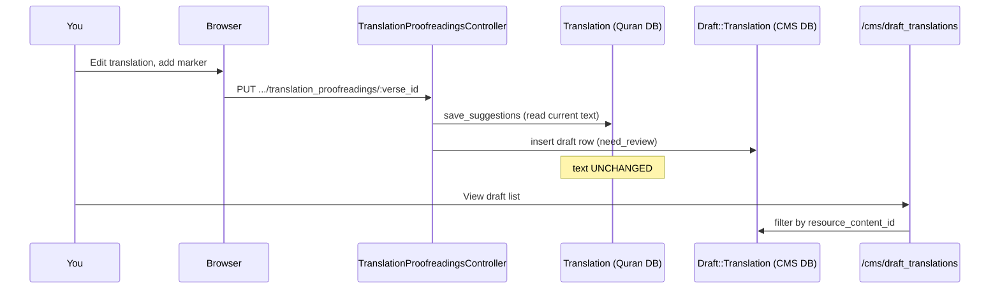

# Phase 19 — One Controlled Learning Experiment

> **Onboarding series:** progressive deep-dive for becoming a legitimate QUL contributor.  
> **Prerequisites:** [Phases 1–18](phase-01-what-is-qul.md), especially [Phase 17 (local setup)](phase-17-local-setup.md)  
> **This file:** one hands-on exercise that connects browser → controller → two databases → CMS — with clear success criteria and rollback.

---

## Purpose

Reading onboarding docs is not the same as **watching the system behave**. This phase gives you one safe, reversible experiment that validates:

- Two-database architecture (Phase 5)
- Contributor draft-first editing (Phases 9, 18)
- CMS vs published content boundary (Phases 3, 8)
- URL/param conventions (Phase 18)

**You run this locally.** This document does not modify the repo. Do not open a PR from this exercise unless you intentionally turn a finding into a real fix.

---

## Prerequisites checklist

Before starting, confirm:

| Check | Command / action |
|---|---|
| Quran dump loaded | `bin/rails runner 'puts Verse.count'` → **> 0** |
| App running | `bin/dev` → http://localhost:3000 |
| CMS admin exists | `bin/rails db:seed` → `admin@cms.com` / `cms-password` |
| Logged in as admin | `/users/sign_in` or seed user |
| Server log visible | Terminal running `bin/dev` or `tail -f log/development.log` |

**INFERENCE** — Seed user is `super_admin`, which bypasses `UserProject` checks for `can_manage?`.

---

## Recommended experiment

### Title: **Propose one translation fix and trace the draft row**

**Risk level:** Low — writes only to CMS `draft_translations`, not published `translations`.  
**Time:** ~20–30 minutes first time.  
**Phases exercised:** 5, 8, 9, 15 (no job needed), 17, 18.

---

### Step 0 — Pick constants (write these down)

Use the dev defaults unless you know otherwise:

| Symbol | Typical dev value | Meaning |
|---|---|---|
| `RESOURCE_ID` | `131` | `ResourceContent` for a translation package |
| `VERSE_KEY` | `1:1` | Easy first ayah to find |
| `MARKER` | `[onboarding-test]` | Unique string you'll search for |

Find `VERSE_ID` in console:

```bash
bin/rails runner "v = Verse.find_by(verse_key: '1:1'); puts v.id"
```

You'll need `VERSE_ID` for URLs (`:id` in proofreading routes = **verse id**, not translation id).

---

### Step 1 — Baseline: published translation unchanged

**Browser:** Open  
`http://localhost:3000/translation_proofreadings/#{VERSE_ID}?resource_id=#{RESOURCE_ID}`

Note the current translation text on screen.

**Console:**

```ruby
rc = ResourceContent.find(131)
t  = Translation.find_by(resource_content_id: rc.id, verse_key: '1:1')
puts t.text
puts t.updated_at
```

**Record:** `ORIGINAL_TEXT`, `ORIGINAL_UPDATED_AT`.

**Success criterion:** Page text matches `t.text`.

---

### Step 2 — Count drafts before

**Console:**

```ruby
Draft::Translation.where(resource_content_id: 131, verse_id: Verse.find_by(verse_key: '1:1').id).count
```

**Record:** `DRAFT_COUNT_BEFORE`.

**FACT** — `Draft::Translation` is `ApplicationRecord` → **CMS database** (`draft_translations` table in `db/schema.rb`).

---

### Step 3 — Submit a suggestion in the browser

1. On the show page, click **Edit** (requires login).
2. Append your marker to the translation, e.g. `... [onboarding-test]`.
3. Click submit (button label is **"Purpose changes"** — likely typo for "Propose"; **FACT** from `edit.html.erb`).
4. Expect redirect with notice: *"Your suggestions are saved successfully"*.

**If Edit is missing or redirects with permission error:**

- Confirm you're logged in as `admin@cms.com` (super_admin), or
- Have an approved `UserProject` for `resource_content_id: 131`.

---

### Step 4 — Watch the request in logs

In the server log, find:

```text
Processing by TranslationProofreadingsController#update
Parameters: { ... "draft_translation" => { "draft_text" => "...[onboarding-test]..." }, "resource_id" => "131", "id" => "<VERSE_ID>" }
```

**Map to code (Phase 18):**

```text
PUT /translation_proofreadings/:id
  → TranslationProofreadingsController#update
  → Translation#save_suggestions
  → Draft::Translation.create (need_review: true)
```

---

### Step 5 — Verify draft row (CMS DB)

**Console:**

```ruby
verse = Verse.find_by(verse_key: '1:1')
draft = Draft::Translation.where(resource_content_id: 131, verse_id: verse.id).order(id: :desc).first

puts draft.draft_text.include?('[onboarding-test]')  # => true
puts draft.need_review                                  # => true
puts draft.user&.email                                  # => your logged-in user
```

**Success criteria:**

| Check | Expected |
|---|---|
| `DRAFT_COUNT_AFTER` | `DRAFT_COUNT_BEFORE + 1` (or new row for same verse) |
| `draft.draft_text` | Contains `[onboarding-test]` |
| Published `t.text` | **Still equals `ORIGINAL_TEXT`** |
| `t.updated_at` | **Still equals `ORIGINAL_UPDATED_AT`** |

This proves **draft-first contributor flow** — the core QUL editorial safety model.

---

### Step 6 — See it in CMS (optional but valuable)

1. Log in at http://localhost:3000/cms
2. Open **Resource contents** → find id `131`
3. Follow link to **View draft translations** (filter pre-set), or go to:  
   `http://localhost:3000/cms/draft_translations?q[resource_content_id_eq]=131`
4. Find your row with `[onboarding-test]`

**INFERENCE** — You have now correlated three surfaces for the same logical edit:

```text
/translation_proofreadings  →  draft_translations (CMS)  →  /cms/draft_translations
                                      ↓ (not yet)
                                 translations (Quran DB)
```

---

### Step 7 — Rollback (clean up)

Delete only your test draft:

```ruby
Draft::Translation.where(resource_content_id: 131)
  .where("draft_text LIKE ?", "%[onboarding-test]%")
  .delete_all
```

Re-run Step 1 console check — published text should still be unchanged.

**Do not** click "Approve" in CMS for this experiment unless you intend to mutate published Quran data.

---

## Experiment diagram



---

## Alternative A — Read-only (no writes)

If you cannot or will not create drafts:

1. Open http://localhost:3000/ayah/2:255
2. Open DevTools → Network tab
3. Watch lazy Turbo Frame requests: `/ayah/2:255/text`, `/translations`, etc.
4. In logs, match each request to `AyahController#text`, `#translations`, …

**Success criterion:** You can name which partial each frame loads (`ayah/_ayah_text`, etc.) without modifying data.

**Phases exercised:** 16, 18.

---

## Alternative B — Console-only two-DB proof

No browser edits:

```ruby
# Quran DB connection
Verse.connection_db_config.database_name   # => "quran_dev"
Verse.count

# CMS DB connection
User.connection_db_config.database_name    # => "quran_community_tarteel"
Draft::Translation.count

# Cross-DB logical join (no FK)
v = Verse.find_by(verse_key: '2:255')
Translation.find_by(verse_id: v.id, resource_content_id: 131)
```

**Success criterion:** You can explain why `Verse` and `Draft::Translation` can join on `verse_id` but live in different Postgres databases.

**Phases exercised:** 5, 2.

---

## What NOT to do in this experiment

| Action | Why avoid |
|---|---|
| Approve draft in CMS | Mutates published `translations` — save for a deliberate Phase 8 exercise |
| `refresh_export!` on a real resource | Needs Sidekiq + S3; out of scope |
| Edit mushaf layout | Direct Quran DB writes — different pattern (Phase 13) |
| Run `ExportMiniDumpJob` | Destructive to local Quran DB |
| Commit test marker text | Pollutes repo; local DB only |

---

## Optional stretch goals (after core experiment)

Only if the main experiment succeeded:

1. **Approve path (supervised):** In CMS, approve the draft for that one ayah → watch `DraftContent::ApproveDraftTranslationJob` in Sidekiq logs → verify `translations.text` updates. **Revert** by restoring from dump or manual SQL if needed.

2. **Trace param confusion:** Deliberately visit `/translation_proofreadings/2:255?resource_id=131` (verse_key in id slot) — observe 404 or wrong record. Compare to correct `/translation_proofreadings/#{VERSE_ID}?resource_id=131`.

3. **UI typo hunt:** Submit button says "Purpose changes" in `app/views/translation_proofreadings/edit.html.erb` — a real contribution would be a one-line fix to "Propose changes" with a screenshot in the PR.

---

## Self-assessment rubric

| Question | Pass if you can answer without looking |
|---|---|
| Which DB holds `draft_translations`? | CMS (`quran_community_tarteel`) |
| Which DB holds `translations`? | Quran (`quran_dev`) |
| What does `:id` mean in `/translation_proofreadings/:id`? | `verses.id` |
| What does `resource_id` query param mean? | `resource_contents.id` |
| Did published text change after suggest? | **No** |
| What model method creates the draft? | `Translation#save_suggestions` |
| Where do admins review the row? | `/cms/draft_translations` |

---

## Uncertainties

| # | Question | Label |
|---|---|---|
| 1 | Whether `resource_id=131` exists in every mini dump | **INFERENCE** — common default in code; verify `ResourceContent.find(131)` |
| 2 | Whether non-admin users can complete Step 3 without `UserProject` | **FACT** — `authorize_access!` blocks edit without access |
| 3 | Whether approving a single ayah draft is exposed in CMS UI without bulk job | **UNKNOWN** — stretch goal; may require admin draft screens |

---

## Phase 19 summary

```text
Edit translation in browser
  → Draft::Translation row in CMS (need_review)
  → published Translation unchanged
  → visible in /cms/draft_translations
  → delete draft to rollback
```

If this experiment feels clear, you understand QUL's most important contributor safety boundary. If something didn't match (no edit button, draft not created, wrong DB), **that's valuable** — note where reality diverged before contributing production code.

---

## Stop here — before Phase 20

Phase 20 covers **testing and data integrity verification** — how QUL checks quality (RuboCop, specs, admin integrity tools).

1. After your experiment, did published `translations.text` change before CMS approve?
2. Which table grew a new row — `draft_translations` or `translations`?
3. What URL would you use to find the draft in Active Admin?

Reply with what you observed (especially surprises), or say **"proceed"** for **Phase 20 — Testing & Data Integrity**.
