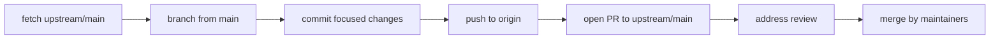

# Phase 22 — OSS Git Workflow

> **Onboarding series:** progressive deep-dive for becoming a legitimate QUL contributor.  
> **Prerequisites:** [Phases 1–21](phase-01-what-is-qul.md)  
> **This file:** fork → branch → sync → PR mechanics for `TarteelAI/quranic-universal-library` — practical git commands and hygiene.

---

## Target repository

| Remote | URL | Role |
|---|---|---|
| **upstream** | `https://github.com/TarteelAI/quranic-universal-library.git` | Canonical repo — PRs merge here |
| **origin** | Your fork on GitHub | Where you push branches |

**FACT** — Default branch is **`main`**. CI (CodeQL) and deploy workflows trigger on `main`.

**INFERENCE:** PRs target `main`, not `master` or long-lived develop branches.

---

## One-time fork setup

### 1. Fork on GitHub

Click **Fork** on https://github.com/TarteelAI/quranic-universal-library

### 2. Clone your fork

```bash
git clone https://github.com/YOUR-USERNAME/quranic-universal-library.git
cd quranic-universal-library
```

### 3. Add upstream remote

```bash
git remote add upstream https://github.com/TarteelAI/quranic-universal-library.git
git remote -v
# origin    → your fork
# upstream  → TarteelAI/quranic-universal-library
```

**FACT** — Documented in `app/views/docs/markdown/contributing.md`.

### 4. Local environment

Follow [Phase 17](phase-17-local-setup.md): `bin/setup`, load mini dump, `bin/dev`.

---

## Daily workflow (feature branch)



### Sync before starting work

```bash
git fetch upstream
git switch main
git merge upstream/main    # or: git rebase upstream/main
```

**Guideline:** Never build a feature branch on stale `main` — QUL moves fast (segments, treebank, docs).

### Create a branch

```bash
git switch -c fix/segment-validator-overlap
# or
git switch -c docs/project-setup-dump-steps
```

**Branch naming** (convention, not enforced):

| Prefix | Use |
|---|---|
| `fix/` | Bug fixes |
| `feat/` | New behavior |
| `docs/` | Documentation only |
| `chore/` | Tooling, deps, CI |

Recent upstream commits mix styles (`fix:`, `docs:`, plain imperative) — **pick one and stay consistent within your PR**.

### Commit

```bash
git add path/to/changed/files
git commit -m "fix: flag ayah overlap in segment validator"
```

**Commit message patterns from upstream history:**

```text
Fix typo in quran-script group description (#745)
docs: clarify that audio_url points at Tarteel's CDN (#693)
fix: paginate word mistakes by per_page instead of hardcoded 100 (#721)
Segment validation improvement (#708)
```

**Guidelines:**

- Present tense or imperative ("Fix", "Add", not "Fixed")
- Reference issue number in body or title when applicable
- PR number `(#745)` is added **by maintainer at merge** — don't fake it in local commits

### Push to your fork

```bash
git push -u origin fix/segment-validator-overlap
```

### Open PR

**GitHub UI:** Compare `TarteelAI/quranic-universal-library` `main` ← `YOUR-USERNAME/quranic-universal-library` `fix/segment-validator-overlap`

**CLI (`gh`):**

```bash
gh pr create \
  --repo TarteelAI/quranic-universal-library \
  --base main \
  --head YOUR-USERNAME:fix/segment-validator-overlap \
  --title "fix: flag ayah overlap in segment validator" \
  --body "$(cat <<'EOF'
## Description
…

## Related Issue
Fixes #___

## How Has This Been Tested?
- `bin/rails test test/services/audio/segment_validator_test.rb`
EOF
)"
```

**FACT** — PR template lives at `.github/PULL_REQUEST_TEMPLATE/pull_request_template.md`.

---

## Keeping your fork current (during review)

While your PR is open, upstream `main` may advance. Update your branch:

### Option A — merge (simpler)

```bash
git fetch upstream
git switch fix/segment-validator-overlap
git merge upstream/main
git push origin fix/segment-validator-overlap
```

### Option B — rebase (linear history)

```bash
git fetch upstream
git switch fix/segment-validator-overlap
git rebase upstream/main
git push --force-with-lease origin fix/segment-validator-overlap
```

**When to rebase:** Maintainer asks, or you want a clean single-commit PR.  
**When to merge:** You're uncomfortable with force-push, or PR has multiple logical commits to preserve.

**Never:** `git push --force` to `upstream` or `main`.

---

## What belongs in git (and what doesn't)

### Do commit

| Path | When |
|---|---|
| `app/`, `lib/`, `config/`, `test/` | Code/tests |
| `app/views/docs/markdown/` + `config/docs.yml` | User-facing docs |
| `onboarding/` | If maintainers want this series upstream (ask first) |

### Do NOT commit

| Path | Why |
|---|---|
| `.env` | Secrets |
| `config/master.key` | Credentials |
| `mini_quran_dev.sql` / dumps | Huge; download separately |
| `app/assets/builds/` | Generated by `yarn build` |
| `node_modules/`, `log/`, `tmp/` | Gitignored |
| Local DB state | Not portable |

**FACT** — `.env.sample` documents S3 vars with empty defaults — copy to `.env` locally, never commit `.env`.

### Onboarding files in your clone

The `onboarding/phase-*.md` series may be **untracked** in your working tree (local learning artifact). Before pushing:

```bash
git status
```

Decide: include in a `docs/onboarding` PR, keep local only, or publish separately. Don't accidentally mix 24 onboarding files into an unrelated code PR.

---

## PR hygiene checklist

```text
□ Branch is based on latest upstream/main
□ Only intended files changed (git diff upstream/main...HEAD)
□ No debug puts, commented-out code, or unrelated formatting
□ Commits are focused (or squash before merge if messy)
□ PR title describes user-visible outcome
□ Issue linked when required (Phase 21)
□ "How Has This Been Tested?" filled in (Phase 20)
□ Screenshots attached for UI
□ No secrets in diff
```

### Inspect your diff before opening

```bash
git fetch upstream
git diff upstream/main...HEAD --stat
git diff upstream/main...HEAD
```

### Useful commands

```bash
git log upstream/main..HEAD --oneline    # commits only on your branch
git diff --name-only upstream/main       # files changed vs upstream
gh pr status                              # PR state if using gh CLI
gh pr checks                              # CodeQL status
```

---

## After merge

```bash
git switch main
git fetch upstream
git merge upstream/main
git push origin main          # sync your fork's main

git branch -d fix/my-branch   # delete local branch
```

**INFERENCE:** Upstream likely uses **squash merge** (one commit per PR with `(#NNN)` in title) — your branch commit hashes won't appear on `main`; that's normal.

---

## Handling review feedback

| Reviewer asks | You do |
|---|---|
| "Please add a test" | Commit to same branch, push |
| "Rebase on main" | `git rebase upstream/main`, force-with-lease push |
| "Split this PR" | New branches from clean `main`, close or narrow original PR |
| "Fix RuboCop" | `bundle exec rubocop -a`, commit, push |
| "Wrong docs path" | Edit `app/views/docs/markdown/`, not root `docs/` |

Reply on the PR with what you changed and re-run tests you cite.

---

## Common git mistakes (QUL-specific)

| Mistake | Consequence | Fix |
|---|---|---|
| PR from `main` on fork with merged junk | Huge diff | New branch from clean `upstream/main`, cherry-pick |
| Committed `onboarding/` + code together | Unreviewable PR | `git reset`, split branches |
| Based branch on months-old `main` | Conflicts, stale CI | `git rebase upstream/main` |
| Pushed to wrong remote | PR head wrong | `git push -u origin branch-name` |
| Edited wrong docs folder | Maintainer reject | `app/views/docs/markdown/` |
| Included SQL dump in commit | Repo bloat | `git rm --cached`, rewrite history if not pushed |

---

## Fork vs upstream mental model

```text
         ┌─────────────────────────────┐
         │  TarteelAI/quranic-universal-library  │  ← upstream (read + PR target)
         │  main                                       │
         └──────────────▲──────────────────────────────┘
                        │ PR merge (maintainers)
         ┌──────────────┴──────────────────────────────┐
         │  YOUR-USERNAME/quranic-universal-library      │  ← origin (your push target)
         │  main + feature branches                    │
         └──────────────▲──────────────────────────────┘
                        │ git push
                   ┌────┴────┐
                   │ laptop  │
                   └─────────┘
```

You **never** need write access to `TarteelAI/*` — fork + PR is the whole model.

---

## Issue + branch workflow (recommended)

```bash
# 1. Open issue on upstream (or find existing)
# 2. Comment "I'd like to work on this"
# 3. Branch
git fetch upstream && git switch main && git merge upstream/main
git switch -c fix/123-short-description

# 4. Work, commit, push, PR with "Fixes #123"
```

**FACT** — PR template encourages linking open issues.

---

## CI on your PR

**FACT** — `.github/workflows/codeql.yml` runs on PRs to `main`.

**FACT** — No automated `rails test` or `rubocop` workflow (Phase 20).

**INFERENCE:** Green CodeQL ≠ full quality gate. Run tests locally and say so in the PR.

---

## First-contribution path (minimal)

Good first PRs for a React/Node engineer new to Rails:

| PR type | Effort | Example |
|---|---|---|
| Docs fix | Low | Correct `contributing.md` docs path → `app/views/docs/markdown/` |
| Typo / copy | Low | "Purpose changes" → "Propose changes" button |
| Service test | Medium | Add case to `segment_validator_test.rb` |
| Stimulus bug | Medium | Fix with screenshot + manual steps |

```bash
git fetch upstream
git switch main && git merge upstream/main
git switch -c docs/fix-contributing-path

# edit app/views/docs/markdown/contributing.md
git add app/views/docs/markdown/contributing.md
git commit -m "docs: point contributors to app/views/docs/markdown for edits"
git push -u origin docs/fix-contributing-path
gh pr create --repo TarteelAI/quranic-universal-library --fill
```

---

## Uncertainties

| # | Question | Label |
|---|---|---|
| 1 | Squash vs merge commit strategy | **INFERENCE** — squash from PR numbers in commit titles |
| 2 | Required signed commits | **UNKNOWN** — not documented |
| 3 | Branch protection rules on `main` | **INFERENCE** — PRs required; exact rules on GitHub settings |
| 4 | Whether `onboarding/` will be accepted upstream | **UNKNOWN** — coordinate with maintainers |

---

## Phase 22 summary

```text
fork → origin
TarteelAI → upstream
sync main from upstream before each branch
small feature branch → push origin → PR to upstream/main
test + describe locally (CI is thin)
never commit secrets or dumps
```

Git mechanics are standard OSS; QUL-specific gotchas are **docs path**, **don't commit dumps**, and **keep data changes out of drive-by code PRs**.

---

## Stop here — questions before Phase 23

Phase 23 is the **contribution surface map + readiness assessment** — where you can plausibly contribute now, and an honest checklist of what you still need before calling yourself "onboarded."

1. What remote should `git push` target — `origin` or `upstream`?
2. Which branch do PRs merge into?
3. What should you run before opening a PR if CI doesn't run tests?

Reply with questions, or say **"proceed"** for **Phase 23 — Contribution Surface Map & Readiness**.
