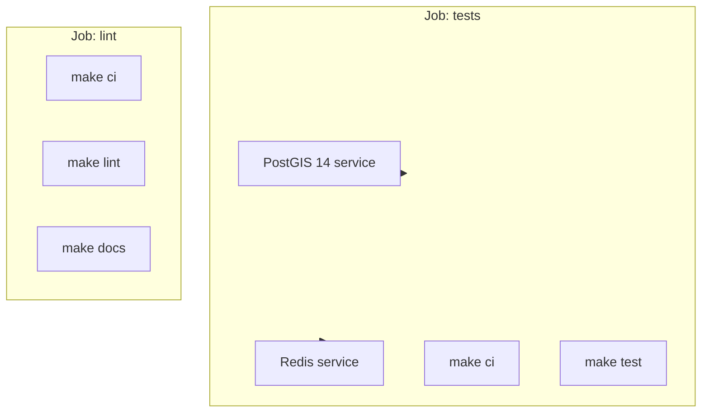
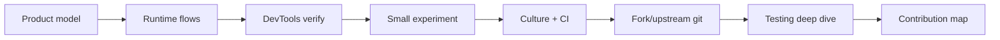

# Intégration uMap — Phase 10 : Culture d'ingénierie

> **Statut :** Phase 10 sur 13 · Investigation en lecture seule · S'appuie sur la [Phase 9](phase-9-controlled-learning-experiment.md)  
> **Objectif :** Comprendre à quoi les mainteneurs de uMap s'attendent en matière de travail — avant de forker, créer une branche ou ouvrir une PR

---

## Comment lire cette phase

Vous connaissez le produit (Phases 1–3), le code (4–6), l'exécution (5, 8) et la configuration locale (7). La Phase 10 est **sociale et procédurale** : comment les contributions sont façonnées, revues, testées et publiées.

Preuves : **OBSERVÉ** depuis le dépôt/docs/CI ; **INFÉRENCE** à partir des habitudes des mainteneurs ; **INCONNU** lorsque non vérifié.

---

## uMap est plus vaste que les pull requests

**OBSERVÉ** `docs/contributing.md` liste quatre domaines de contribution :

| Domaine | Point d'entrée | Bon premier pas |
|---|---|---|
| **Traduction** | [Transifex](https://www.transifex.com/openstreetmap/umap/) | Corriger une chaîne d'interface dans votre langue |
| **Tri des bugs** | [GitHub Issues](https://github.com/umap-project/umap/issues) | Reproduire + commenter un bug ouvert |
| **Documentation** | `docs/`, `docs-users/` | Corriger `frontend.md` obsolète (références à `umap.js`) |
| **Code** | Ce dépôt | Correction de bug + test, ou petite amélioration avec accord sur l'issue |

**INFÉRENCE :** Répondre aux questions du forum ou confirmer un rapport de bug est une participation OSS légitime — pas un chemin « inférieur » vers un premier merge.

**Canaux communautaires** (depuis `README.md`) :

- Matrix : [#umap:matrix.org](https://matrix.to/#/#umap:matrix.org)
- Forum : [forum.openstreetmap.fr — uMap](https://forum.openstreetmap.fr/c/utiliser/umap/29)
- Liste de diffusion : [lists.openstreetmap.org/umap](https://lists.openstreetmap.org/listinfo/umap)

---

## Licence : AGPLv3 compte

**OBSERVÉ** `LICENSE` — **GNU Affero General Public License v3**.

**INFÉRENCE pour les contributeurs :**

- Les changements exposés sur le réseau (l'app Django) restent soumis aux obligations AGPL si vous distribuez ou exécutez en tant que service.
- Les bibliothèques vendored dans `umap/static/umap/vendors/` ont leurs propres licences.
- Note historique : le projet est passé de WTFPL à AGPLv3 pour conformité sponsor/OSI (`docs/changelog.md`, ~#1605).

Vous n'avez pas besoin d'être expert en licences pour contribuer, mais **ne supprimez pas les en-têtes de licence** et ne supposez pas une permissivité de type MIT.

---

## Culture des issues : reproduire ou risquer l'ignorance

**OBSERVÉ** le modèle de bug (`.github/ISSUE_TEMPLATE/bug_report.md`) est direct :

> **⚠️ TRÈS IMPORTANT ! Votre issue sera probablement ignorée sans ce lien**

Requis pour les bugs :

1. **Lien vers une carte** (publique, ou carte de repro minimale)
2. **Étapes de reproduction** sur cette carte
3. Navigateur/OS/captures d'écran si nécessaire

**INFÉRENCE :** Les mainteneurs optimisent pour la **reproductibilité**, pas pour les listes de souhaits sans contexte. Pour les améliorations, utilisez le modèle de fonctionnalité — décrivez le problème, la solution proposée, les alternatives.

**Forme d'un bon rapport de bug :**

```markdown
## Map
https://umap.org/en/map/…

## Steps
1. Open map in edit mode (Chrome 130, macOS)
2. Add remote layer with proxy enabled, URL …
3. Pan west past …

## Expected
Layer reloads with new features

## Actual
Console: … Network: 412 on …/datalayer/update/…
```

Reliez les rapports aux **compétences de la Phase 8** (onglet Network, état console `U.MAP`).

---

## Normes des pull requests

### Ce que disent les docs

**OBSERVÉ** `docs/contributing.md` :

- `make develop` avant de coder
- Travailler sur une **branche**, ouvrir une PR pour revue
- **Une approbation de mainteneur** requise pour merger
- **Soyez patient** — la latence de revue est normale

### Ce que montre l'historique git

**OBSERVÉ** commits récents sur `master` :

| Motif | Exemple |
|---|---|
| préfixe `fix:` | `fix: fix race in tableeditor when editing from a cell (#3481)` |
| préfixe `chore:` | `chore: bump ruff from 0.15.22 to 0.16.4 (#3478)` |
| PRs Dependabot | `chore: bump social-auth-core … (#3477)` |
| Numéro de PR au merge | `(#3481)` sur les commits squash/merge |

**INFÉRENCE :** Utilisez des **préfixes conventionnels en minuscules** (`fix:`, `chore:`, `feat:` si vous ajoutez une fonctionnalité). Gardez la ligne de sujet à l'impératif et précise. Le corps doit expliquer le **pourquoi** pour les changements non évidents.

### Taille et périmètre de la PR

**INFÉRENCE** à partir de la forme du projet (grande surface JS, suite Playwright) :

| Type de PR | Bien vu par les mainteneurs |
|---|---|
| Un bug + test | ✅ Idéal pour une première PR de code |
| Correction de docs avec preuves | ✅ Très bienvenu |
| Mise à jour de dépendance (Dependabot) | ✅ Automatisé |
| Refactor + changement de comportement | ⚠️ Nécessite une justification solide |
| Nettoyage « pendant que j'y étais » | ❌ À séparer |

**OBSERVÉ** note Phase 4 : `.github/workflows/` dans cet arbre exécute **test-docs** au push/PR — pas un fichier matrix géant séparé, mais `make test` + `make lint` + `make docs` en CI.

---

## CI : ce qui s'exécute avant le merge

**OBSERVÉ** `.github/workflows/test-docs.yml` :



| Étape | Commande | Ce que ça couvre |
|---|---|---|
| Install | `make ci` | `uv sync` + Playwright chromium-headless-shell |
| Test | `make test` | Python unit + integration + `make testjs` |
| Lint | `make lint` | ESLint, djlint, isort, ruff format check |
| Docs | `make docs` | Le build MkDocs doit réussir |

**Matrix :** Python **3.12** et **3.14** sur Ubuntu.

**Env en CI :** `UMAP_SETTINGS=umap/tests/settings.py`, Redis sur localhost, `PLAYWRIGHT_TIMEOUT=20000`.

**INCONNU / particularité :** Le déclencheur `pull_request` du workflow utilise `path:` (singulier) et non `paths:` — peut limiter quand la CI s'exécute sur les PRs. **INFÉRENCE :** Exécutez `make test` et `make lint` en local avant de pousser ; ne vous fiez pas uniquement à l'UI GitHub verte sans vérifier.

---

## Chaîne d'outils : formater avant de débattre

### Une commande pour les vérifications de style

```bash
make lint    # check
make format  # auto-fix Python templates + much JS workflow
```

**OBSERVÉ** décomposition du `Makefile` :

| Outil | Cible | Fichiers |
|---|---|---|
| **ruff format** | Python | `umap/` (longueur de ligne 88, cible py310) |
| **isort** | Imports Python | profil black |
| **djlint** | Templates Django | `umap/templates/` |
| **ESLint** | JS compat | `umap/static/umap/js/` (via `npx eslint`) |
| **Biome** | Format/lint JS | `make pretty` → `umap/static/umap/js/` |

**OBSERVÉ** `biome.json` : indentation 2 espaces, guillemets simples, largeur de ligne **88** (aligné sur ruff), point-virgules `asNeeded`.

**OBSERVÉ** `docs/contributing.md` : formater le JS avec Biome ; **nouvelle ligne en fin de fichier**.

**INFÉRENCE :** Habitude type EditorConfig — la nouvelle ligne finale évite les diffs bruyants.

### Style Python en pratique

**OBSERVÉ** fichiers de test : fonctions pytest simples, commentaires minimaux, noms `test_*` descriptifs (`test_merge_features.py`).

**OBSERVÉ** `pyproject.toml` : Django 6.x dans l'extra dev alors que la dépendance runtime est `Django>=5.1` — dev/CI peut exécuter une version Django plus récente que le minimum supporté.

---

## Modèle mental des tests (aperçu de la Phase 12)

Trois suites — **OBSERVÉ** `Makefile` + `docs/contributing.md` :

| Suite | Commande | Emplacement | Nécessite |
|---|---|---|---|
| **Python unit** | `make test-unit` | `umap/tests/` (pas `integration/`) | Base PostGIS `test_umap` |
| **Integration** | `make test-integration` | `umap/tests/integration/` | Postgres + Playwright + Redis |
| **JS unit** | `make testjs` | `umap/static/umap/unittests/` | `npm install` uniquement |

### Quand ajouter quel test

| Vous avez modifié… | Préférer |
|---|---|
| Algorithme `umap/utils.py` | Python unit (style `test_merge_features.py`) |
| Vue / formulaire / modèle Django | Python unit (`test_datalayer_views.py`, `test_map_views.py`) |
| Flux save/draw/UI client | Playwright (`test_save.py`, `test_edit_marker.py`) |
| Helper JS pur (`urls.js`, `rules.js`) | Mocha dans `unittests/` |
| Structure HTML de template | Souvent Playwright ; parfois djlint seulement |

**OBSERVÉ** exemple de test d'intégration (`test_save.py`) : enregistre les requêtes réseau pendant undo/save pour affirmer que **seul le POST datalayer** part — teste le comportement navigateur réel, pas des mocks.

**OBSERVÉ** défauts pytest : workers parallèles (`--numprocesses auto`), `--reuse-db`, `--no-migrations`. Sur Postgres Mac en peer-auth, utilisez `pytest -n 0` selon les docs contributing.

**Debug intégration :**

```bash
PWDEBUG=1 uv run pytest --headed -n1 -k test_save umap/tests/integration/
```

---

## Internationalisation (i18n)

### Runtime

**OBSERVÉ** les chaînes client utilisent `translate('English source string')` (`i18n.js`). Fichiers de locale : `umap/static/umap/locale/{lang}.js` et `.json`.

Le serveur charge le script de locale dans `js.html` quand `locale` est défini dans le contexte du template.

### Chemin de contribution

**OBSERVÉ** `docs/contributing.md` :

- **Traductions :** Transifex — pas de PRs directes vers `en.json` pour les locales de production
- **Mainteneurs qui tirent les traductions :** `tx pull -f` → `make compilemessages`

**INFÉRENCE pour vos premières PRs :**

- **Faites** ajouter de nouvelles clés `translate('…')` dans le JS source anglais lors d'ajouts d'UI
- **Ne faites pas** d'édition en masse de `fr.json` / `de.json` sauf sync Transifex coordonné avec les mainteneurs
- Docs utilisateur dans `docs-users/` (les tutoriels français sont substantiels selon la Phase 4)

---

## Dépendances et vendoring

**OBSERVÉ** `docs/dev/dependencies.md` :

| Pile | Épinglage | Mises à jour |
|---|---|---|
| **Python** | Épinglé dans `pyproject.toml` | Dependabot hebdomadaire (PRs `chore:`) |
| **npm** | Plages semver `^` | Manuel ; pas de Dependabot dans la config observée |
| **Bibliothèques navigateur** | Copiées dans `vendors/` | `scripts/vendorsjs.sh` + `make vendors` |

**INFÉRENCE :** Ajouter une nouvelle bibliothèque JS est **non trivial** (package.json + script vendors + importmap dans `js.html`). Préférez les dépendances existantes (Turf, simple-statistics, togeojson, etc.).

---

## Versionnement et releases

**OBSERVÉ :**

- Version dans `umap/__init__.py` → `VERSION = "3.8.1"`
- `make version` → `uv run hatch version`
- `make patch` / `make minor` → bump hatch
- `docs/changelog.md` — notes de release avec crédits PR (`* fix … by @user in #1234`)
- Tags d'image Docker dans `docker-compose.yml` souvent **en retard** sur la version du checkout (Phase 7)

**INFÉRENCE :** Les contributeurs coupent rarement les releases ; les mainteneurs bumpent version + changelog. Votre PR peut apparaître dans la prochaine ligne de changelog après merge.

---

## Culture de la documentation

| Doc | Public | Niveau de confiance |
|---|---|---|
| `docs/install.md` | Auto-hébergeurs | Plutôt exact ; quelques noms OAuth obsolètes |
| `docs/contributing.md` | Contributeurs | Exact ; chemin de test JS erroné (`static/test` vs `unittests/`) |
| `docs/dev/frontend.md` | Développeurs | **Obsolète** (`umap.js`, `U.Map`) — vérifier contre `app.js` |
| `docs/changelog.md` | Tous | Utile pour « ce qui a changé récemment » |
| `docs-users/fr/` | Utilisateurs finaux | Vrais tutoriels |

**INFÉRENCE :** **Les corrections de docs sont valorisées** et des premières PRs à faible risque — surtout quand liées au code que vous avez vérifié (Phases 4–8). Exécutez `make docs` avant de soumettre des changements doc-only.

---

## Communication et étiquette de revue

**INFÉRENCE** à partir des modèles d'issues + ton contributing :

| À faire | À éviter |
|---|---|
| Lier cartes et étapes de reproduction | « Ça ne marche pas » sans URL |
| Mentionner navigateur + version uMap | Supposer que le mainteneur a votre état DB local |
| Garder la description PR courte avec plan de test | Force-push sans commentaire |
| Répondre aux commentaires de revue | Disparaître des semaines en pleine revue |
| Séparer les changements sans lien | Mélanger refactor + feature + sync i18n |

**OBSERVÉ :** Le merge nécessite **un** mainteneur — pas un consensus de plusieurs. La revue peut être approfondie ou légère selon le risque.

**Contexte financement** (`README.md`) : NLnet / NGI — le projet a du développement sponsorisé ; file de revue toujours bénévole.

---

## Archétypes de bonnes premières PR (classés)

| Rang | Type de PR | Pourquoi |
|---|---|---|
| 1 | **Correction doc** avec preuve fichier:ligne | Faible risque, aide tout le monde |
| 2 | **Correction de bug + pytest** | Montre que vous avez lu le code + la culture de test |
| 3 | **Test Mocha** pour helper JS pur | Pas de Postgres (Phase 9 Expérience B) |
| 4 | **Commentaire de tri d'issue** avec repro | Zéro code ; construit la réputation |
| 5 | **Traduction Transifex** | Pas de git ; impact visible utilisateur |

| Reporter | Pourquoi |
|---|---|
| Internes migration OpenLayers | Gros refactor actif (changelog 3.8.x) |
| Changements algorithme de merge | Nécessite couverture unit + intégration soignée |
| Nouvelle dépendance npm | Cérémonie de vendoring |
| `local.py.sample` + docs settings ensemble | Bonne PR mais touche plusieurs sujets — toujours valide avec description claire |

---

## Checklist pré-PR (copier avant d'ouvrir)

```markdown
## Scope
- [ ] One logical change (or explained split)
- [ ] Issue linked (or maintainer agreed in issue/forum)

## Quality
- [ ] `make lint` (or `make format` then `make lint`)
- [ ] `make test-unit` at minimum; integration if UI touched
- [ ] `make testjs` if JS modules changed
- [ ] `make docs` if docs touched

## Description
- [ ] What / why / how to test
- [ ] Screenshots or map URL if visual

## i18n
- [ ] New UI strings use translate()
- [ ] Did NOT edit non-English locale files (unless Transifex sync)
```

---

## Comment la culture relie votre arc d'intégration



La Phase 10 est le pont entre **apprendre** (Phases 1–9) et **faire pour de vrai** (Phases 11–13).

---

## Résumé Phase 10

### À COMPRENDRE MAINTENANT

1. **Bugs reproductibles** — URL de carte + étapes, sinon l'issue peut être ignorée
2. **CI ≈ `make test` + `make lint` + `make docs`** sur Python 3.12/3.14
3. **Trois couches de test** — pytest unit, Playwright intégration, Mocha JS
4. **Biome + ruff + djlint + ESLint** — exécutez `make lint` avant la PR
5. **Traductions via Transifex** — `translate()` anglais dans le code, pas d'éditions aléatoires de JSON de locale
6. **Merge par un mainteneur** — PRs patientes et ciblées gagnent
7. **AGPLv3** — projet copyleft réseau

### UTILE PLUS TARD

- `PWDEBUG=1` pour les tests Playwright en échec
- `make changelog` (aide mainteneur pour les notes de release)
- Matrix/forum pour les questions de design avant de coder

### Peut attendre

- Pipelines de release Helm/Docker
- Workflow mainteneur `tx push` / Transifex
- Hatch `make publish` vers PyPI

---

## Ce qui reste incertain

| Sujet | Statut |
|---|---|
| Si la CI PR s'exécute toujours (typo workflow `path:`) | **INCONNU** — exécutez les checks en local |
| Guide de style informel au-delà des outils | **INFÉRENCE** depuis les commits — pas de doc style `CONTRIBUTING` |
| CLA requis | **OBSERVÉ** aucun dans le dépôt — AGPL + flux fork GitHub uniquement |

---

## Ce qu'on explore ensuite — Phase 11 : Workflow Git OSS

La Phase 11 est **obligatoire** avant votre première vraie PR :

- Fork `umap-project/umap` vs travail sur clone
- Remote `upstream`, fetch, rebase vs merge
- Nommage de branche, étiquette force-push
- Ouvrir une PR avec `gh pr create`
- Rester synchronisé avec `master`

---

## Pause ici

Vous devriez savoir **à quoi ressemble le « terminé »** pour les mainteneurs : petit diff, tests, lint vert, étapes de repro, patience.

**Questions avant la Phase 11 :**

- Voulez une **liste courte d'idées de première PR** adaptée à vos compétences (fond React → quelles zones uMap) ?
- Curieux des implications **AGPL** pour l'auto-hébergement seul ?
- Prêt à **`continuer vers la Phase 11`** (workflow git) ?

Dites **« continuer vers la Phase 11 »** ou posez des questions.
