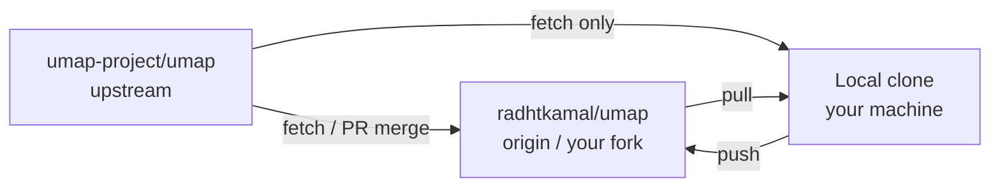
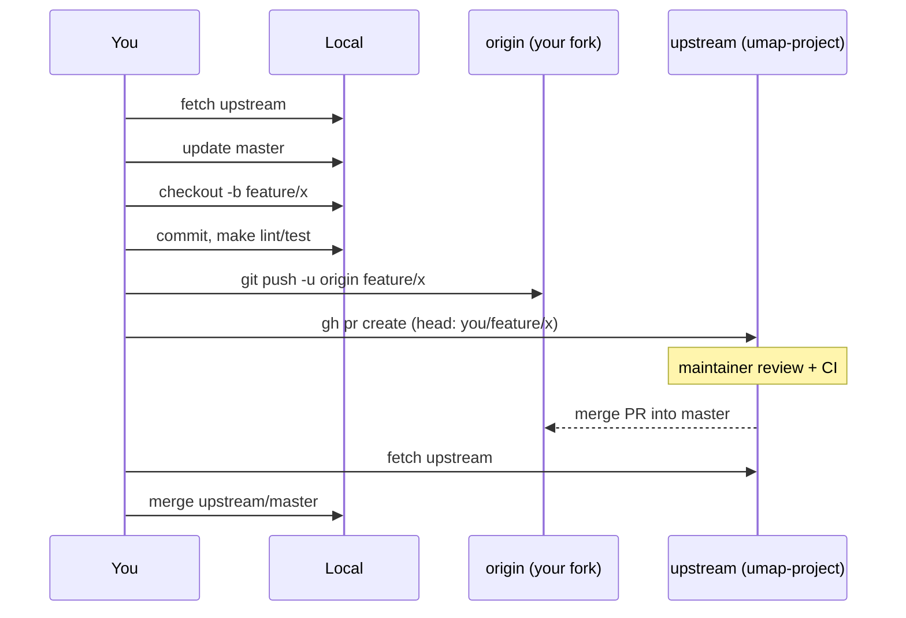

# Intégration uMap — Phase 11 : Workflow Git OSS

> **Statut :** Phase 11 sur 13 · Investigation en lecture seule · **Obligatoire avant votre première vraie PR** · S'appuie sur la [Phase 10](phase-10-engineering-culture.md)  
> **Objectif :** Travailler comme un contributeur externe — fork, sync avec upstream, branche, push, ouvrir PR — sans surprises git

---

## Comment lire cette phase

La Phase 10 décrivait **ce que les mainteneurs attendent**. La Phase 11 décrit **comment vous le livrez** avec Git et GitHub.

Cette phase utilise **votre clone réel** quand c'est possible, plus la disposition upstream standard de uMap.

Preuves : **OBSERVÉ** / **INFÉRENCE** / **INCONNU**.

---

## Votre clone aujourd'hui (OBSERVÉ)

Vérifié sur cette machine :

```text
origin   https://github.com/radhtkamal/umap.git      (your fork)
upstream https://github.com/umap-project/umap.git   (official repo)
branch   master  →  tracks origin/master
HEAD     1047364d  chore: try to fix flaky tests in CI
untracked onboarding/   (your learning notes — not in upstream)
```

**Bonne nouvelle :** Fork + remote `upstream` sont **déjà configurés** — vous sautez les étapes « configuration fork première fois » ci-dessous.

**Note :** La branche par défaut de uMap est **`master`**, pas `main` (**OBSERVÉ** `origin/HEAD → origin/master`, CI déclenchée sur `master`).

---

## Modèle mental : trois dépôts, deux remotes



| Remote | Lecture | Push | Rôle |
|---|---|---|---|
| **upstream** | ✅ | ❌ jamais | Code canonique ; ouvrir les PRs **depuis votre fork vers** celui-ci |
| **origin** | ✅ | ✅ | Votre fork GitHub ; héberge les branches que vous poussez |
| **local** | — | — | Où vous commitez |

**INFÉRENCE :** Traitez `upstream` comme un historique sacré en lecture seule. Toutes vos écritures vont vers `origin` sur des branches de fonctionnalité.

---

## Configuration unique (si vous n'aviez pas les remotes)

À sauter si votre `git remote -v` correspond déjà au tableau ci-dessus.

### 1. Fork sur GitHub

GitHub → [umap-project/umap](https://github.com/umap-project/umap) → **Fork** → crée `YOUR_USER/umap`.

### 2. Cloner votre fork

```bash
git clone https://github.com/YOUR_USER/umap.git
cd umap
```

### 3. Ajouter upstream

```bash
git remote add upstream https://github.com/umap-project/umap.git
git fetch upstream
```

### 4. Suivre la bonne branche par défaut

```bash
git checkout master
git branch -u origin/master
```

---

## Sync quotidienne : rester à jour avant de brancher

**INFÉRENCE :** Commencez chaque session de travail (ou au moins chaque nouvelle branche) depuis un `upstream/master` frais.

```bash
cd /path/to/umap

# 1. Fetch latest from official repo (no merge yet)
git fetch upstream

# 2. Update local master from upstream
git checkout master
git merge upstream/master
# Alternative (linear history): git rebase upstream/master

# 3. Push updated master to YOUR fork (keeps origin in sync)
git push origin master
```

### Merge vs rebase sur upstream

| Approche | Commande sur `master` | Historique | Quand |
|---|---|---|---|
| **Merge** | `git merge upstream/master` | Commit de merge OK | Défaut simple et sûr |
| **Rebase** | `git rebase upstream/master` | Linéaire | Vous préférez un log propre sur le fork personnel |

**Pour les branches de fonctionnalité**, rebaser sur le dernier `upstream/master` avant la PR est courant :

```bash
git checkout my-feature-branch
git fetch upstream
git rebase upstream/master
git push --force-with-lease origin my-feature-branch
```

Utilisez **`--force-with-lease`**, pas `--force` seul — annule si quelqu'un d'autre a poussé sur votre branche.

---

## Workflow de branche de fonctionnalité (la boucle contributeur)

### 1. Branche depuis master à jour

```bash
git checkout master
git merge upstream/master   # or rebase
git checkout -b fix/ajax-proxy-cache-sample
```

### Nommage de branche (INFÉRENCE — non imposé, mais lisible)

| Motif | Exemple |
|---|---|
| `fix/short-description` | `fix/local-py-sample-proxy-dir` |
| `feat/short-description` | `feat/datalayer-version-header-test` |
| `docs/short-description` | `docs/frontend-app-entry` |
| `onboarding/...` | Apprentissage personnel uniquement — **ne pas ouvrir de PR** sauf intentionnel |

### 2. Faire des commits (atomiques)

**OBSERVÉ** style de commit upstream : `fix: …`, `chore: …` avec `(#PR)` optionnel.

```bash
# After each logical slice:
git add path/to/changed/files
git commit -m "$(cat <<'EOF'
fix: document AJAX_PROXY_CACHE_DIR in local.py.sample

Sample settings omitted mandatory proxy cache dir since 3.8.0,
causing umap.E001 on first local boot.

EOF
)"
```

**Règles (Phase 10 + hygiène git) :**

- Un sujet par commit quand possible
- Le message explique le **pourquoi**
- Ne pas commiter `umap/settings/local.py` (secrets/chemins locaux gitignored)
- Ne pas commiter `var/`, `.env`, identifiants

### 3. Exécuter les checks en local

```bash
make lint
make test-unit          # minimum before most PRs
# make testjs           # if JS changed
# make test-integration # if UI/integration paths changed
```

### 4. Pousser la branche vers votre fork

```bash
git push -u origin fix/ajax-proxy-cache-sample
```

### 5. Ouvrir une pull request (cible : umap-project/umap)

**Avec GitHub CLI** (`gh`) :

```bash
# Ensure gh is authenticated: gh auth status

gh pr create \
  --repo umap-project/umap \
  --head YOUR_GITHUB_USER:fix/ajax-proxy-cache-sample \
  --base master \
  --title "fix: document AJAX_PROXY_CACHE_DIR in local.py.sample" \
  --body "$(cat <<'EOF'
## Summary
- Add `AJAX_PROXY_CACHE_DIR` to `local.py.sample` with repo-relative default
- Mention requirement in install troubleshooting (optional second commit)

## Test plan
- [ ] Copy sample to `local.py`, run `uv run umap check` — no umap.E001
- [ ] `make lint`

## Issue
Fixes #(issue) if applicable

EOF
)"
```

**INFÉRENCE :** `--head YOUR_USER:branch` est requis quand la PR provient d'un **fork** ; la base est toujours **`master`** pour uMap.

**Sans gh :** UI GitHub → votre fork → « Compare & pull request » → dépôt de base `umap-project/umap` base `master`.

### 6. Après la revue

```bash
# More commits on same branch:
git add …
git commit -m "fix: address review comment on path default"
git push origin fix/ajax-proxy-cache-sample
# PR updates automatically

# If you rebased after review started:
git push --force-with-lease origin fix/ajax-proxy-cache-sample
```

Commentez sur la PR quand vous force-pushez pour que les relecteurs sachent que l'historique a changé.

---

## Diagramme de bout en bout



---

## Et `onboarding/` ?

**OBSERVÉ :** `onboarding/` est **non suivi** dans votre clone — ces notes de phase sont pour **votre apprentissage**, pas partie de l'upstream uMap.

| Intention | Action |
|---|---|
| Garder les notes privées / locales uniquement | Ajouter `onboarding/` à **votre** `.git/info/exclude` ou ne pas commiter |
| Partager les notes dans votre fork uniquement | Commiter sur la branche `onboarding/notes`, **pas de PR** vers upstream |
| Contribuer des docs à uMap | Extraire les corrections pertinentes en PRs `docs/` — pas toute la série onboarding sauf si les mainteneurs le souhaitent |

**INFÉRENCE :** Une PR contenant uniquement `onboarding/phase-*.md` est peu probable qu'elle corresponde au périmètre upstream sauf proposition sur une issue d'abord.

---

## Maintenance du fork

### Garder le `master` du fork aligné

Après merge de votre PR (ou chaque semaine) :

```bash
git fetch upstream
git checkout master
git merge upstream/master
git push origin master
```

### Supprimer les branches mergées

```bash
git branch -d fix/ajax-proxy-cache-sample
git push origin --delete fix/ajax-proxy-cache-sample
```

UI GitHub : « Delete branch » après merge.

---

## Résolution de conflits (quand le rebase échoue)

```bash
git fetch upstream
git rebase upstream/master
# CONFLICT in umap/views.py

# Edit files, then:
git add umap/views.py
git rebase --continue

# Abort if needed:
git rebase --abort
```

**INFÉRENCE :** Pour uMap, les conflits apparaissent souvent dans `umap/static/umap/js/modules/` pendant le développement actif — résolvez avec soin, exécutez `make test` sur les zones touchées.

---

## Étiquette force-push

| Situation | OK ? |
|---|---|
| Force-push **votre** branche de fonctionnalité avant revue | ✅ avec `--force-with-lease` après rebase |
| Force-push **votre** branche après retour de revue | ✅ si vous avez rebasé ; laissez un commentaire PR |
| Force-push `master` sur votre fork | ⚠️ Seulement si vous êtes sûr ; préférez merge |
| Force-push `umap-project/umap` | ❌ Vous n'avez pas la permission |

---

## Référence rapide `gh`

```bash
gh auth login
gh repo fork umap-project/umap --clone=false   # if starting fresh

gh pr list --repo umap-project/umap
gh pr view 3481 --repo umap-project/umap
gh pr checkout 3481 --repo umap-project/umap    # review someone else's PR locally

gh issue list --repo umap-project/umap
gh issue create --repo umap-project/umap
```

---

## Erreurs courantes (et corrections)

| Erreur | Correction |
|---|---|
| PR depuis `master` avec beaucoup de commits sans lien | Nouvelle branche depuis `upstream/master` propre, cherry-pick ou refaire |
| PR ouverte contre le mauvais dépôt (fork → fork) | Fermer ; rouvrir base `umap-project/umap` |
| Push vers `upstream` par erreur d'URL | Devrait échouer (pas d'accès écriture) ; push vers `origin` |
| `local.py` commité | `git rm --cached` ; faire tourner les secrets si besoin ; déjà dans gitignore |
| Branche basée sur master obsolète | `git fetch upstream && git rebase upstream/master` |
| `onboarding/` inclus par accident | `git reset`, unstage, ou séparer la PR |
| Utilisé `main` comme base | uMap utilise **`master`** |

---

## Checklist : première vraie PR

```markdown
## Before coding
- [ ] Issue or maintainer ack (for non-trivial work)
- [ ] `git fetch upstream` && master updated

## Branch
- [ ] `git checkout -b fix/…` from current upstream/master
- [ ] onboarding/ and local.py NOT in commits (unless intentional)

## Quality
- [ ] make lint
- [ ] make test-unit (and integration/js if relevant)

## Publish
- [ ] git push -u origin fix/…
- [ ] gh pr create → base umap-project/umap master
- [ ] PR body: summary + test plan + issue link

## After merge
- [ ] fetch upstream, update local + origin master
- [ ] delete feature branch
```

---

## Lien avec les Phases 12–13

| Phase | Sujet |
|---|---|
| **12** | Modèle mental des tests — ce que la CI exécute, détails pytest/Playwright/Mocha |
| **13** | Carte de surface de contribution + évaluation de préparation |

La Phase 11 est le **rail git** ; la Phase 12 est le **rail qualité**. Vous avez besoin des deux avant de vous dire « prêt à contribuer ».

---

## Résumé Phase 11

### À COMPRENDRE MAINTENANT

1. **`upstream` = canonique en lecture seule ; `origin` = votre fork**
2. **La branche par défaut est `master`**
3. **Sync `fetch upstream` → mettre à jour master → branche → push `origin` → PR vers `umap-project/umap`**
4. **`gh pr create --head YOUR_USER:branch --base master`**
5. **`--force-with-lease` sur les branches de fonctionnalité uniquement**, avec commentaire PR
6. **`onboarding/` est séparé** de la contribution upstream sauf si vous le planifiez

### UTILE PLUS TARD

- `gh pr checkout` pour tester localement les PRs des autres
- Cherry-pick pour les branches de backport (`upstream/2.9.x` etc. existent pour les anciennes releases)

### Peut attendre

- Workflows de branche de release (`make patch`, publish Docker)
- Permissions de merge mainteneur sur upstream

---

## Votre clone : commandes suggérées (aucun changement effectué)

Quand vous êtes prêt pour une vraie contribution (pas maintenant sauf si vous le dites) :

```bash
cd ~/Documents/ChatGPT/umap
git fetch upstream
git checkout master
git merge upstream/master
git push origin master
git checkout -b fix/your-first-fix
# … edit, test, commit …
git push -u origin fix/your-first-fix
gh pr create --repo umap-project/umap --head radhtkamal:fix/your-first-fix --base master
```

Remplacez le nom de branche et le contenu de la PR par votre correction réelle.

---

## Pause ici

La Phase 11 est complète quand vous pouvez expliquer le diagramme fork/upstream sans regarder.

**Questions avant la Phase 12 :**

- Parcourir l'ouverture d'une **PR brouillon** sans changement de code (dry run) ?
- Quelle **cible de première PR** vous correspond (docs vs pytest vs test JS) ?
- **`continuer vers la Phase 12`** (plongée tests) ?

Dites **« continuer vers la Phase 12 »** ou posez des questions sur le workflow git.
