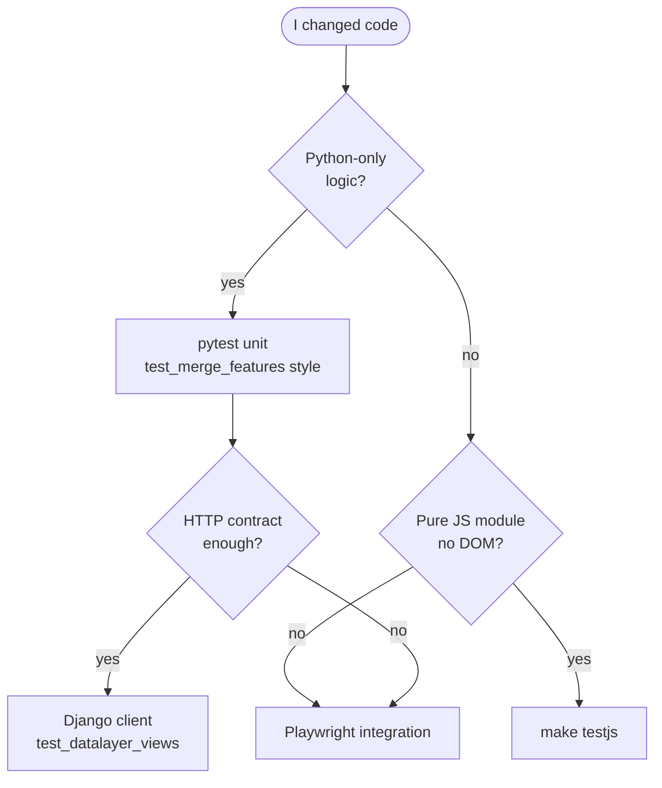

# Intégration uMap — Phase 12 : Modèle mental des tests

> **Statut :** Phase 12 sur 13 · Investigation en lecture seule · S'appuie sur la [Phase 11](phase-11-oss-git-workflow.md)  
> **Objectif :** Savoir quels tests existent, ce qu'ils nécessitent, comment les exécuter, et quoi ajouter quand vous modifiez du code

---

## Comment lire cette phase

La Phase 10 a donné un aperçu des tests. La Phase 12 va **suffisamment en profondeur pour exécuter et étendre les tests** sans mémoriser chaque fichier.

Preuves : **OBSERVÉ** / **INFÉRENCE** / **INCONNU**.

---

## La pyramide de tests (spécifique uMap)

```mermaid
pyramid
    title uMap test layers
    "Playwright integration (~50 files)" : 35
    "Python unit (~25 files)" : 45
    "Mocha JS unit (8 files)" : 20
```

| Couche | Nombre (approx.) | Vitesse | Confiance |
|---|---|---|---|
| **Mocha** (`unittests/`) | 8 fichiers spec | Secondes | Helpers JS purs, logique journal |
| **pytest unit** (`umap/tests/`, pas `integration/`) | ~25 modules | Secondes–minutes | Vues, modèles, `merge_features`, proxy |
| **pytest + Playwright** (`integration/`) | ~50 modules | Minutes | Navigateur réel, flux save/draw/import |

**INFÉRENCE :** La CI exécute **les trois** via `make test`. Une bonne PR ajoute généralement des tests à la **couche la plus basse qui prouve encore le comportement**.

---

## Aide-mémoire des commandes

| Objectif | Commande |
|---|---|
| Tout (style CI) | `make test` |
| Python unit uniquement | `make test-unit` |
| Intégration uniquement | `make test-integration` |
| JS unit uniquement | `make testjs` (nécessite `npm install`) |
| Un pytest par nom | `uv run pytest -k test_merge_with_ids -vv` |
| Un test d'intégration | `uv run pytest umap/tests/integration/test_save.py -vv` |
| pytest sériel (Mac peer auth) | `uv run pytest -n 0 -vv umap/tests/` |
| Debug test navigateur | `PWDEBUG=1 uv run pytest --headed -n1 -k test_save umap/tests/integration/` |
| Plonger dans l'échec | `uv run pytest -k failing_test --pdb` |

**OBSERVÉ** `Makefile` :

```makefile
test-unit:
	uv run pytest -vv umap/tests/ --ignore=umap/tests/integration

test-integration:
	uv run pytest -vv umap/tests/integration/ --dist=loadgroup --reruns 1 --maxfail 3
```

La suite d'intégration utilise **pytest-xdist `loadgroup`** (les tests websocket partagent un groupe), **1 rerun** sur flake, **arrêt après 3 échecs**.

---

## Paramètres de test ≠ votre `local.py`

**OBSERVÉ :** Les tests n'utilisent jamais `umap/settings/local.py`.

| Source des paramètres | Utilisé quand |
|---|---|
| `umap/tests/settings.py` | Tous les pytest (`DJANGO_SETTINGS_MODULE` dans `pyproject.toml`) |
| `UMAP_SETTINGS=umap/tests/settings.py` | Env explicite CI |
| Votre `local.py` | Serveur de dev uniquement |

**OBSERVÉ** points saillants des paramètres de test (`umap/tests/settings.py`) :

- `SECRET_KEY = "justfortests"`
- `AJAX_PROXY_CACHE_DIR = tempfile.gettempdir()`
- `PASSWORD_HASHERS = [MD5PasswordHasher]` — hashes rapides
- `REALTIME_ENABLED = True`, `REDIS_URL = redis://localhost:6379/15`
- Sur GitHub Actions : Postgres explicite `postgres`/`postgres`@localhost

**INFÉRENCE :** Si les tests d'intégration échouent en local avec des erreurs Redis, démarrez Redis (`brew services start redis` ou Docker). La CI a toujours Redis.

---

## Configuration pytest

**OBSERVÉ** `pyproject.toml` :

```ini
[tool.pytest.ini_options]
DJANGO_SETTINGS_MODULE = "umap.tests.settings"
addopts = "--pdbcls=IPython.terminal.debugger:Pdb --no-migrations --numprocesses auto --reuse-db"
asyncio_mode = "auto"
```

| Flag | Signification |
|---|---|
| `--no-migrations` | Sync DB depuis les modèles, ne pas exécuter les fichiers de migration (plus rapide) |
| `--reuse-db` | Garder la DB de test entre les exécutions |
| `--numprocesses auto` | Workers parallèles (xdist) |
| `--pdbcls=…` | Débogueur IPython à l'échec |

**OBSERVÉ** hooks `conftest.py` :

- `pytest_configure` : définit `MEDIA_ROOT` vers un répertoire temp ; **`multiprocessing.set_start_method("fork")`** pour Daphne/ASGI (note Python 3.14 dans le commentaire)
- `pytest_runtest_teardown` : efface le média temp + vide le cache

---

## Configuration de la base de données (local)

### Style GitHub Actions / Docker

Superutilisateur Postgres `postgres`/`postgres` — fonctionne tel quel avec les paramètres de test sur GHA.

### Peer auth macOS Homebrew

**OBSERVÉ** `docs/contributing.md` :

```bash
createuser -s $USER 2>/dev/null || true
createdb test_umap
psql test_umap -c "CREATE EXTENSION postgis"
uv run pytest -n 0 umap/tests/test_merge_features.py -vv
```

Utilisez **`-n 0`** avec une seule DB partagée `test_umap` — les workers parallèles veulent `test_umap_gw0`, `test_umap_gw1`, …

**INFÉRENCE :** Pour le travail unitaire quotidien sur Mac, `-n 0` est le chemin le moins frictionnel jusqu'à ce que vous créiez les DBs worker.

---

## Couche 1 — Tests unitaires Python

### Ce qu'ils testent

- **Vues** Django (statut HTTP, en-têtes, corps JSON)
- **Modèles** et helpers de stockage
- Fonctions pures (`merge_features` dans `umap/utils.py`)
- Commandes de management, utils, cas limites de permissions

### Motifs

**1. Fixtures Factory Boy** (`umap/tests/base.py` + `conftest.py`) :

| Factory / fixture | Crée |
|---|---|
| `UserFactory` | User, mot de passe `123123` |
| `MapFactory` | Map avec JSON `settings` réaliste |
| `DataLayerFactory` | Couche + fichier GeoJSON sur disque |
| `TileLayerFactory` | Modèle de tuile style OSM |
| `map`, `datalayer`, `openmap`, `tilelayer` | Fixtures pytest reliant les factories |

**OBSERVÉ** `DataLayerFactory` écrit du GeoJSON réel dans `ContentFile` — les tests touchent le stockage fichiers comme en production.

**2. Client de test Django** — pas de navigateur :

```python
pytestmark = pytest.mark.django_db

def test_get_with_public_mode(client, datalayer, map):
    map.share_status = Map.PUBLIC
    map.save()
    url = reverse("datalayer_view", args=(map.pk, datalayer.pk))
    response = client.get(url)
    assert response.status_code == 200
    assert response["X-Datalayer-Version"] is not None
```

(`umap/tests/test_datalayer_views.py`)

**3. Unit pur — pas de DB :**

```python
def test_changing_same_element():
    with pytest.raises(ConflictError):
        merge_features(["A", "B"], ["A", "D"], ["A", "C"])
```

(`umap/tests/test_merge_features.py` — correspond directement à l'algorithme Phase 6)

### Quand ajouter un test unitaire Python

| Vous avez modifié | Ajouter un test près de |
|---|---|
| `umap/utils.py` | `test_utils.py` ou `test_merge_features.py` |
| Endpoints datalayer `umap/views.py` | `test_datalayer_views.py` |
| CRUD carte / permissions | `test_map_views.py` |
| Commande cache proxy | `test_clear_proxy_cache.py` |
| Backend stockage S3 | `test_datalayer_s3.py` (utilise **moto**) |

---

## Couche 2 — Tests d'intégration Playwright

### Ce qu'ils testent

Comportement **navigateur de bout en bout** : mode édition, outils de dessin, file de sauvegarde, import, UI choroplèthe, sync websocket, paramètres query string, etc.

### Infrastructure

**OBSERVÉ** `umap/tests/integration/conftest.py` :

| Fixture | Rôle |
|---|---|
| `live_server` | Serveur de test Django (pytest-django) |
| `page` / `new_page` | Page Playwright ; log console + erreurs page |
| `mock_tiles` | Intercepte les URLs `tile.*` → PNG vide (plus rapide, pas de réseau) |
| `wait_for_loaded` | `U.MAP.dataloaded === true` |
| `wait_for_edit_mode` | `U.MAP.editEnabled === true` |
| `login` | Remplit le formulaire de connexion Django |
| `asgi_live_server` | Serveur ASGI **Daphne** pour les tests websocket |

**OBSERVÉ** timeouts : env `PLAYWRIGHT_TIMEOUT` (7500 ms par défaut, 20000 en CI).

### Exemple : sauvegarder uniquement la couche dirty

```python
def test_resetting_map_would_remove_from_save_queue(
    live_server, openmap, page, datalayer
):
    page.goto(f"{live_server.url}{openmap.get_absolute_url()}?edit")
    # … undo map name edit, edit layer name, save …
    assert requests == [
        ("POST", f"{live_server.url}/en/map/{openmap.pk}/datalayer/update/{datalayer.pk}/"),
    ]
```

(`umap/tests/integration/test_save.py` — prouve le chemin save Phase 8)

### Exemple : édition concurrente / merge

`test_optimistic_merge.py` ouvre **deux pages navigateur**, dessine des marqueurs, sauvegarde, attend merge ou comportement 412 — relie la Phase 6 à l'UI.

### Tests websocket

**OBSERVÉ :** `test_websocket_sync.py` marque les tests `@pytest.mark.xdist_group(name="websockets")` pour que les workers parallèles n'écrasent pas l'état Redis partagé.

**Nécessite :** Redis en cours d'exécution en local.

### Note plateforme

**OBSERVÉ** `test_edit_marker.py` utilise `Meta` vs `Control` pour l'édition Shift-clic sur Darwin vs Linux.

### Quand ajouter des tests d'intégration

| Vous avez modifié | Considérer un test d'intégration si… |
|---|---|
| Save client / journal | L'unit ne peut pas le détecter ; utiliser le motif `test_save.py` |
| Outil de dessin / popup UI | Playwright comme `test_edit_marker.py` |
| Assistant d'import | Famille `test_import.py` |
| Sync temps réel | `test_websocket_sync.py` + Redis |

**INFÉRENCE :** Les tests d'intégration sont **plus lents et plus flaky** — préférez les tests unitaires quand les assertions au niveau HTTP suffisent.

---

## Couche 3 — Tests unitaires Mocha JS

### Emplacement

**OBSERVÉ :** `umap/static/umap/unittests/` (pas le chemin obsolète `static/test` de `docs/contributing.md`).

| Fichier | Tests |
|---|---|
| `URLs.js` | Helpers de template d'URL |
| `journal.js` | Moteur journal, updaters |
| `hlc.js` | Horloge logique hybride |
| `schema.js` | Schéma des propriétés de carte |
| `utils.js`, `geoutils.js`, `i18n.js` | Utilitaires |

### Configuration

**OBSERVÉ** `.mocharc.json` :

```json
{ "file": "umap/static/umap/unittests/setup.js" }
```

`setup.js` charge **JSDOM** globalement avant l'import des modules (nécessaire pour `schema.js` / DOM purify).

### Exécution

```bash
npm install
make testjs
```

### Style

```javascript
import { describe, it } from 'mocha'
import pkg from 'chai'
const { expect } = pkg

import URLs from '../js/modules/urls.js'

describe('URLs', () => {
  it('should return the update URL if created is true', () => { … })
})
```

**OBSERVÉ :** Modules ES, Mocha 10, Chai `expect`, Sinon dans les tests journal.

### Quand ajouter des tests Mocha

| Vous avez modifié | Ajouter à |
|---|---|
| `urls.js`, `utils.js`, `geoutils.js` | `unittests/*.js` correspondant |
| `journal/engine.js` | `journal.js` (peut nécessiter des mocks) |
| `schema.js` | `schema.js` |
| Rendu Leaflet | Généralement **Playwright**, pas Mocha |

---

## Flux de décision : quel test écrire ?



| Exemple de changement | Bonne couche |
|---|---|
| Corriger un cas limite `merge_features` | `test_merge_features.py` |
| Corriger l'en-tête `X-Datalayer-Version` | `test_datalayer_views.py` |
| Corriger le routage URL `datalayer_save` | Mocha `URLs.js` |
| Corriger Ctrl+S qui ne sauvegarde pas la couche | Playwright `test_save.py` |
| Corriger l'édition shift-clic marqueur | Playwright `test_edit_marker.py` |
| Corriger la diffusion permission websocket | `test_websocket_sync.py` + Redis |

---

## Relier les tests aux phases d'intégration

| Sujet de phase | Ancre de test |
|---|---|
| Merge / 412 | `test_merge_features.py`, `test_optimistic_merge.py` |
| GET datalayer lazy load | `test_datalayer_views.py`, `test_lazy_loading.py` |
| Pipeline save | `test_save.py`, tests POST `test_datalayer_views.py` |
| Rules / choroplèthe | `test_conditional_rules.py`, `test_choropleth.py` |
| Remote / proxy | `test_remote_data.py`, ajax proxy `test_views.py` |
| Journal / undo | `unittests/journal.js`, `test_undo_redo.py` |

Utilisez `grep -r "keyword" umap/tests/` pour trouver la couverture existante avant d'écrire de nouveaux tests.

---

## Exécuter une boucle de test minimale (sans Postgres complet)

Si Postgres n'est pas encore prêt :

```bash
cd /path/to/umap
npm install
make testjs
```

**OBSERVÉ :** La suite JS ne nécessite **pas de base de données**.

Étape suivante quand Postgres existe :

```bash
make develop   # or make install
# create test_umap + postgis
uv run pytest -n 0 -vv umap/tests/test_merge_features.py
```

---

## Déboguer les tests en échec

### pytest

```bash
# Verbose, stop on first fail
uv run pytest -x -vv umap/tests/test_datalayer_views.py::test_get_with_public_mode

# Print locals on fail (addopts already sets IPython pdb class)
uv run pytest -k test_name --pdb
```

### Playwright

```bash
# Inspector + headed browser
PWDEBUG=1 uv run pytest --headed -n1 -k test_created_markers_are_merged umap/tests/integration/

# See browser console (integration conftest prints non-warning console lines)
uv run pytest -s umap/tests/integration/test_save.py -vv
```

### Tests d'intégration flaky

**OBSERVÉ :** La CI utilise `--reruns 1`. En local, réexécutez un seul test avant de supposer un bug.

**OBSERVÉ :** `test_optimistic_merge.py` a des `sleep(1)` autour des saves — sensible au timing ; source de flake documentée dans le commentaire.

---

## Ce que la CI impose (rappel)

Depuis `.github/workflows/test-docs.yml` :

1. Job **tests** : `make ci` → `make test` sur Python 3.12 + 3.14, services PostGIS + Redis
2. Job **lint** : `make lint` + `make docs`

**INFÉRENCE :** Une PR qui passe `make test-unit` + `make lint` en local est une base solide ; les mainteneurs peuvent encore attendre des tests d'intégration pour les changements UI.

---

## Anti-patterns (à éviter)

| Ne pas | Faire plutôt |
|---|---|
| Tester les internes Leaflet vendored | Tester le comportement du wrapper uMap |
| Mocker toute la pile Django pour des bugs de vue | `client.get` / `client.post` avec factories |
| Ajouter Playwright pour une correction pure `merge_features` | Test unitaire uniquement |
| Éditer `umap/tests/settings.py` pour une DB personnelle | Surcharge spécifique à l'env ou documenter dans la PR |
| Exécuter l'intégration sans Redis pour tester la sync | Démarrer Redis ou ignorer les tests websocket avec `-k 'not websocket'` |
| Supposer que `make test` passe sur Mac sans `test_umap` | Créer la DB ou utiliser `-n 0` |

---

## Résumé Phase 12

### À COMPRENDRE MAINTENANT

1. **Trois suites :** Mocha (JS pur), pytest unit (Django/HTTP/algos), Playwright intégration (navigateur)
2. **Les tests utilisent `umap/tests/settings.py`**, pas votre `local.py`
3. **`make test-unit`** = défaut rapide ; **`make test-integration`** nécessite Postgres + Playwright + Redis
4. **Factories** (`MapFactory`, `DataLayerFactory`) sont la façon standard de construire les fixtures
5. **Choisir la couche de test la plus basse** qui prouve votre changement
6. **Peer auth Mac :** `test_umap` + `pytest -n 0` sauf si vous créez `test_umap_gw*`

### UTILE PLUS TARD

- `moto` pour les tests S3
- `@pytest.mark.xdist_group` pour les ressources partagées
- `asgi_live_server` pour le debug websocket

### Peut attendre

- Écrire des tests Playwright pour chaque retouche UI
- `make test` complet avant chaque commit pendant l'exploration

---

## Ce qu'on explore ensuite — Phase 13 : Surface de contribution et préparation

La Phase 13 clôt l'intégration :

- Carte des **bonnes premières issues** par domaine de compétence (docs, JS, Python, SIG)
- Votre checklist de préparation (compétences × lacunes du dépôt)
- **Parcours contributeur 90 jours** suggéré
- Diagramme final du modèle mental reliant toutes les phases

---

## Pause ici

Vous devriez savoir **où vivent les tests** et **quelle commande exécuter** pour votre type de changement.

**Questions avant la Phase 13 :**

- Parcourir **la création d'un test** pour l'Expérience B (`URLs.has`) de bout en bout ?
- Aide pour **configurer `test_umap`** sur votre Mac ?
- **`continuer vers la Phase 13`** pour la carte de contribution et la préparation ?

Dites **« continuer vers la Phase 13 »** ou posez des questions sur les tests.
