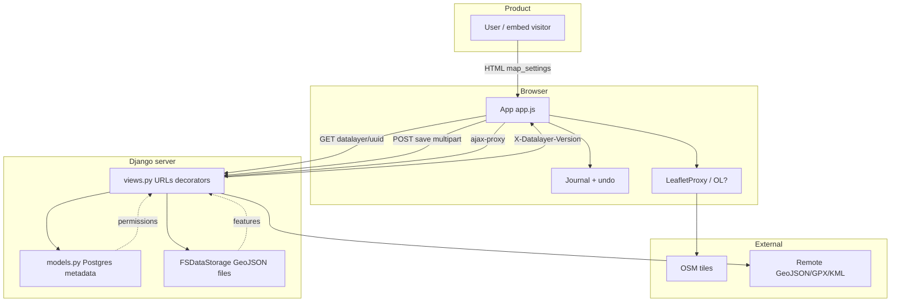

# Intégration uMap — Phase 13 : Surface de contribution et préparation

> **Statut :** Phase 13 sur 13 · Finale · S'appuie sur la [Phase 12](phase-12-testing-mental-model.md)  
> **Objectif :** Cartographier où vous pouvez contribuer, évaluer honnêtement votre préparation, et repartir avec un modèle mental durable — pas une liste d'« issues faciles »

---

## Vous avez parcouru tout l'arc

Treize phases, en lecture seule par conception jusqu'à ce que vous choisissiez autrement. Voici ce que vous avez maintenant qu'un contributeur de passage n'a pas :

| Phase | Vous pouvez maintenant… |
|---|---|
| [1 — Qu'est-ce que uMap ?](phase-1-what-is-umap.md) | Expliquer le périmètre produit vs éditeur OSM vs SIG |
| [2 — Primer domaine](phase-2-domain-primer.md) | Parler GeoJSON, couches, permissions, tuiles |
| [3 — Architecture](phase-3-architecture.md) | Dessiner les frontières serveur/client/stockage |
| [4 — Tour du dépôt](phase-4-repository-tour.md) | Naviguer vers le bon fichier en minutes |
| [5 — Parcours runtime](phase-5-runtime-walkthroughs.md) | Tracer ouvrir → éditer → sauvegarder → couche distante |
| [6 — Algorithmes](phase-6-algorithms-and-data-transformations.md) | Raisonner sur merge, import, rules, choroplèthe |
| [7 — Exécuter en local](phase-7-run-locally.md) | Bootstrap PostGIS + `uv` + `local.py` |
| [8 — DevTools](phase-8-connect-browser-to-code.md) | Relier l'onglet Network à `U.MAP` et au journal |
| [9 — Expérience](phase-9-controlled-learning-experiment.md) | Exécuter un changement réversible avec vérification |
| [10 — Culture](phase-10-engineering-culture.md) | Correspondre aux attentes des mainteneurs (lint, i18n, AGPL) |
| [11 — Workflow git](phase-11-oss-git-workflow.md) | Fork → branche → PR vers `umap-project/umap` `master` |
| [12 — Tests](phase-12-testing-mental-model.md) | Choisir pytest vs Playwright vs Mocha |

**INFÉRENCE :** Vous êtes **intégré au codebase**, pas encore un **contributeur éprouvé** — cela nécessite des PRs livrées et des cycles de revue.

---

## Modèle mental final (un diagramme)



**Version en une phrase :** uMap est une **couche Django de permissions et stockage** autour d'un **éditeur de carte vanilla JS** qui garde les entités dans des **fichiers GeoJSON versionnés** et les charge **paresseusement** dans un client **soutenu par un journal**.

---

## Carte de la surface de contribution

### Par type d'activité

| Surface | Effort pour démarrer | Impact | Votre adéquation (React/TS fort) |
|---|---|---|---|
| **Corrections docs** (`docs/`, `docs/dev/`) | Faible | Grande clarté pour tous | ★★★★★ |
| **Tri de bugs** (commentaires repro sur issues) | Faible | Débloque les mainteneurs | ★★★★☆ |
| **Transifex** (UI non anglaise) | Faible | Visible utilisateur | ★★★☆☆ (si multilingue) |
| **Tests unitaires Mocha** (`unittests/`) | Faible | Confiance CI | ★★★★★ |
| **UI client / flux édition** (`app.js`, `data/`, `rendering/`) | Moyen | Visible utilisateur | ★★★★☆ |
| **Import/export** (`formatter.js`) | Moyen | Pipelines de données | ★★★☆☆ |
| **Vues Django / merge** (`views.py`, `utils.py`) | Moyen–élevé | Exactitude | ★★☆☆☆ (apprentissage Python) |
| **Tests Playwright** (`integration/`) | Moyen | Sécurité régression | ★★★★☆ |
| **Temps réel / websockets** (`sync/`, Redis) | Élevé | Collaboration | ★★☆☆☆ |
| **Migration OpenLayers** (`?openlayers`) | Élevé | Stratégique | ★★★☆☆ |
| **Deploy / Helm / Docker** | Élevé | Ops | ★★☆☆☆ |

### Par zone du codebase (depuis la Phase 4)

| Zone | Exemple de travail | Tests typiques |
|---|---|---|
| `umap/static/umap/js/modules/app.js` | Raccourcis, comportement panneau, UX save | Playwright |
| `data/layer.js`, `data/features.js` | Chargement/sauvegarde couche, commit feature | Playwright + unit |
| `journal/` | Undo, état dirty, sync | Mocha + Playwright |
| `formatter.js` | Cas limites CSV/KML/GPX | Mocha + `test_import.py` |
| `rules.js`, `data/types.js` | Style, choroplèthe | `test_conditional_rules.py`, `test_choropleth.py` |
| `umap/views.py` | Codes HTTP, en-têtes, merge | `test_datalayer_views.py` |
| `umap/utils.py` | `merge_features`, `layers_tree` | `test_merge_features.py` |
| `umap/templates/` | HTML Bootstrap | djlint + Playwright |
| `docs/install.md`, `local.py.sample` | Lacunes d'intégration que vous avez trouvées | `make docs` |
| `docs-users/fr/` | Tutoriels utilisateur final | Revue manuelle |

---

## Paysage des issues (instantané OBSERVÉ)

Issues ouvertes récupérées sur `umap-project/umap` pendant l'intégration — **pas** une liste « choisissez celles-ci ». Utilisez pour voir les **thèmes** :

| Thème | Exemples d'issues | Angle contributeur |
|---|---|---|
| **Finition UI** | #3480 Escape ferme la popup ; #3492 désactiver le menu contextuel | Client + Playwright |
| **Légende / panneau** | #3493 nom barre légende quand panneau pas légende | `app.js` / panneau + test |
| **Import / champs** | #3473 champs personnalisés ; #3383 propriétés FeatureCollection à l'import | `formatter.js`, `layer.js` |
| **Docs / i18n** | #3249 mettre à jour la documentation ; #3490 pickup Transifex JA | PR docs ou process mainteneur |
| **Config / hébergement** | #3482 défaut OPENROUTESERVICE_HOST | Settings + petit pytest |
| **Bugs de données** | #3491 marqueurs bougent au hasard | Nécessite carte repro + investigation |

**INFÉRENCE :** uMap **n'étiquette pas beaucoup** `good first issue`. Meilleur chemin : trouver un bug **que vous pouvez reproduire**, commenter avec URL de carte + étapes (Phase 10), puis proposer une correction.

**Ne commencez pas par :** sync websocket, parité OpenLayers, ou mises à jour vendor.

---

## Auto-évaluation de préparation

Notez-vous **0–2** par ligne : 0 = pas encore, 1 = partiel, 2 = confiant.

| # | Critère | 0 | 1 | 2 |
|---|---|---|---|---|
| 1 | Expliquer Map → DataLayer → Feature sans notes | | | |
| 2 | Dessiner bootstrap vs GET datalayer lazy | | | |
| 3 | Décrire le chemin save via le journal | | | |
| 4 | Expliquer la limitation 412 / `merge_features` | | | |
| 5 | Exécuter uMap en local (ou expliquer les blocages) | | | |
| 6 | Utiliser `U.MAP` dans DevTools | | | |
| 7 | Exécuter `make testjs` ou `make test-unit` | | | |
| 8 | Flux fork/upstream/PR (`radhtkamal` → `umap-project`) | | | |
| 9 | Savoir quand Mocha vs pytest vs Playwright | | | |
| 10 | Identifier une zone de contribution correspondant à vos compétences | | | |

| Total | Préparation |
|---|---|
| 16–20 | **Prêt pour une première vraie PR** — choisir une issue ciblée |
| 11–15 | **Presque** — combler un écart (souvent exécution locale ou une suite de tests) |
| 0–10 | **Encore en apprentissage** — revisiter les phases notées 0–1 |

### Votre profil probable (INFÉRENCE depuis l'arc d'intégration)

| Force | Exploiter dans uMap |
|---|---|
| React/TS/Node | Modules client, Playwright, UX formulaire/panneau, fetch async |
| Modèle mental Firebase | Permissions, paramètres de carte en forme de document |
| Débutant Python | Commencer par docs + Mocha + pytest pur (`merge_features`), pas le monolithe `views.py` |
| Apprentissage SIG | La littératie GeoJSON suffit pour v1 ; reporter les internes PostGIS |

### Lacunes connues de ce clone (OBSERVÉ)

| Lacune | Débloquer |
|---|---|
| Serveur local non vérifié | Checklist Phase 7 |
| `onboarding/` non suivi | Notes personnelles — séparées des PRs upstream |
| `test_umap` non créé | Setup DB Phase 12 |
| Expérience Phase 9 non exécutée | `make testjs` ou retouche zoom local.py |

---

## Parcours contributeur 90 jours suggéré

Pas un engagement — une **trajectoire par défaut** pour quelqu'un avec votre profil.

### Jours 1–14 — Légitimité sans code

- [ ] Rejoindre Matrix ou lurker le forum — se présenter comme contributeur en apprentissage
- [ ] Reproduire un bug ouvert ; poster un commentaire avec URL de carte (même sans corriger)
- [ ] Exécuter `make testjs` avec succès
- [ ] Compléter le boot local Phase 7 OU documenter pourquoi bloqué

### Jours 15–30 — Premier artefact mergeable

Choisissez **un** :

| Option | Livrable |
|---|---|
| **A** | PR docs : corriger `docs/dev/frontend.md` (`app.js` / `App`, pas `umap.js`) |
| **B** | PR docs : ajouter `AJAX_PROXY_CACHE_DIR` à `local.py.sample` + note install |
| **C** | PR test : étendre `unittests/URLs.js` (Phase 9 Expérience B) |
| **D** | Petite correction + pytest si vous avez trouvé un bug serveur avec repro claire |

Exécutez `make lint` + tests pertinents ; ouvrez une PR via le flux Phase 11.

### Jours 31–60 — Deuxième PR client ou tests

- [ ] Corriger un petit problème UI que vous avez reproduit (style #3480) avec test Playwright
- [ ] Revoir la PR de quelqu'un d'autre sur GitHub — apprendre le vocabulaire de revue
- [ ] Exécuter `make test-unit` régulièrement ; tenter un fichier d'intégration avec `PWDEBUG=1`

### Jours 61–90 — Habitudes de contributeur récurrent

- [ ] Une PR par mois **ou** tri/commentaires réguliers
- [ ] Posséder une zone (ex. import, rules, UX panneau, docs)
- [ ] Lire le changelog à chaque release — noter ce qui a changé dans votre zone
- [ ] Optionnel : traductions Transifex si vous avez des compétences linguistiques

**INFÉRENCE :** « Contributeur OSS récurrent » = **petits merges soutenus + présence communautaire**, pas une PR héroïque unique.

---

## Modèles de première PR (concrets)

### Modèle 1 — Documentation uniquement

```text
Title: docs: align frontend.md with app.js entry point

- Replace umap.js / U.Map references with modules/app.js / App
- Note map_init.html bootstrap pattern
- Link to docs/dev/overview.md

Test plan: make docs
```

**Lignes obsolètes OBSERVÉES :** `docs/dev/frontend.md` lignes 25–32 (`umap.js`, `U.Map`).

### Modèle 2 — Correction paramètres sample

```text
Title: fix: add AJAX_PROXY_CACHE_DIR to local.py.sample

Mandatory since 3.8.0 (umap.E001). Uses repo-relative var/proxy-cache.

Test plan:
- Copy sample to local.py, mkdir var/proxy-cache, uv run umap check
```

### Modèle 3 — Comportement client + test

```text
Title: fix: close popup on Escape when focus in map

Fixes #3480

Test plan:
- PWDEBUG=1 pytest -k escape umap/tests/integration/… (new or extended test)
- make lint
```

---

## Ce que signifie « terminé » avec l'intégration

Vous êtes **diplômé de cette série d'intégration** quand :

1. Vous pouvez **naviguer** du symptôme → fichier sans ce doc
2. Vous avez **exécuté au moins une** boucle de vérification (test ou navigateur)
3. Vous avez **synchronisé** `upstream/master` et connaissez la cible PR
4. Vous avez **une première PR prévue** limitée à &lt; ~200 lignes

Vous n'êtes **pas** tenu de :

- Maîtriser Python/Django/PostGIS
- Compléter le travail de migration OpenLayers
- Exécuter `make test` complet sur chaque machine (la CI existe pour ça)

---

## Anti-objectifs (touriste vs contributeur)

| Touriste | Contributeur |
|---|---|
| « Des issues faciles ? » | « J'ai reproduit #3493 sur la carte X ; je propose une correction dans `panel.js` » |
| PR refactor géante | Correction ciblée + test |
| Éditer 20 fichiers de locale | Transifex ou `translate()` anglais uniquement |
| Disparaître après ouverture de PR | Répondre à la revue sous quelques jours |
| Fork jamais synchronisé | `fetch upstream` hebdomadaire |

---

## Gardez ces commandes sur un post-it

```bash
# Sync
git fetch upstream && git checkout master && git merge upstream/master

# Branch
git checkout -b fix/short-name

# Quality
make lint
make testjs                    # JS-only changes
uv run pytest -n 0 -k name …   # Python unit (Mac)

# PR
git push -u origin fix/short-name
gh pr create --repo umap-project/umap --head YOUR_USER:fix/short-name --base master
```

---

## Index d'intégration (toutes les phases)

| # | Fichier |
|---|---|
| 1 | [phase-1-what-is-umap.md](phase-1-what-is-umap.md) |
| 2 | [phase-2-domain-primer.md](phase-2-domain-primer.md) |
| 3 | [phase-3-architecture.md](phase-3-architecture.md) |
| 4 | [phase-4-repository-tour.md](phase-4-repository-tour.md) |
| 5 | [phase-5-runtime-walkthroughs.md](phase-5-runtime-walkthroughs.md) |
| 6 | [phase-6-algorithms-and-data-transformations.md](phase-6-algorithms-and-data-transformations.md) |
| 7 | [phase-7-run-locally.md](phase-7-run-locally.md) |
| 8 | [phase-8-connect-browser-to-code.md](phase-8-connect-browser-to-code.md) |
| 9 | [phase-9-controlled-learning-experiment.md](phase-9-controlled-learning-experiment.md) |
| 10 | [phase-10-engineering-culture.md](phase-10-engineering-culture.md) |
| 11 | [phase-11-oss-git-workflow.md](phase-11-oss-git-workflow.md) |
| 12 | [phase-12-testing-mental-model.md](phase-12-testing-mental-model.md) |
| 13 | **Ce fichier** |

---

## Résumé Phase 13 — toute l'histoire en un paragraphe

uMap permet aux gens de créer des **cartes thématiques partageables** sur fonds OSM. Le serveur (Django + métadonnées PostGIS + fichiers GeoJSON) démarre un éditeur **vanilla JS** (`App`) qui charge les couches paresseusement, édite via un **journal**, et sauvegarde par POST multipart avec **en-têtes de version** et **merge par différence d'ensembles** en cas de conflit. Vous contribuez en adaptant le travail à la bonne couche — docs, Mocha, pytest ou Playwright — en synchronisant votre **fork**, et en livrant des **petites PRs guidées par la repro** vers `umap-project/umap` `master` avec `make lint` et des tests ciblés au vert. La contribution récurrente est une habitude de **repro, correction, test, revue, répéter** — pas finir un tutoriel.

---

## Diplôme — et maintenant ?

La séquence d'intégration est **complète**. Prochaines étapes immédiates suggérées (choisissez une) :

1. **Exécuter l'Expérience B** — tests Mocha `URLs.has()` → première PR  
2. **PR docs** — `frontend.md` ou répertoire proxy `local.py.sample`  
3. **Tri** — reproduire #3493 ou #3480 avec une carte publique/minimale  
4. **Boot local** — Phase 7 jusqu'à ce que `U.MAP.dataloaded` soit true sur localhost  

Si vous voulez du pairing sur l'une de ces options, dites laquelle et nous passons du mode intégration au **mode contribution** (toujours pas de commits sauf si vous le demandez).

---

## Pause ici — questions finales

- Quelle **zone** voulez-vous posséder en premier : docs, UI client, import, ou serveur ?
- Besoin d'aide pour **cadrer une première PR** à partir des modèles ci-dessus ?
- `onboarding/` doit rester **local uniquement** ou être proposé upstream comme docs contributeur ?

Merci d'avoir parcouru les treize phases. Vous avez la carte ; le territoire est la prochaine PR.
