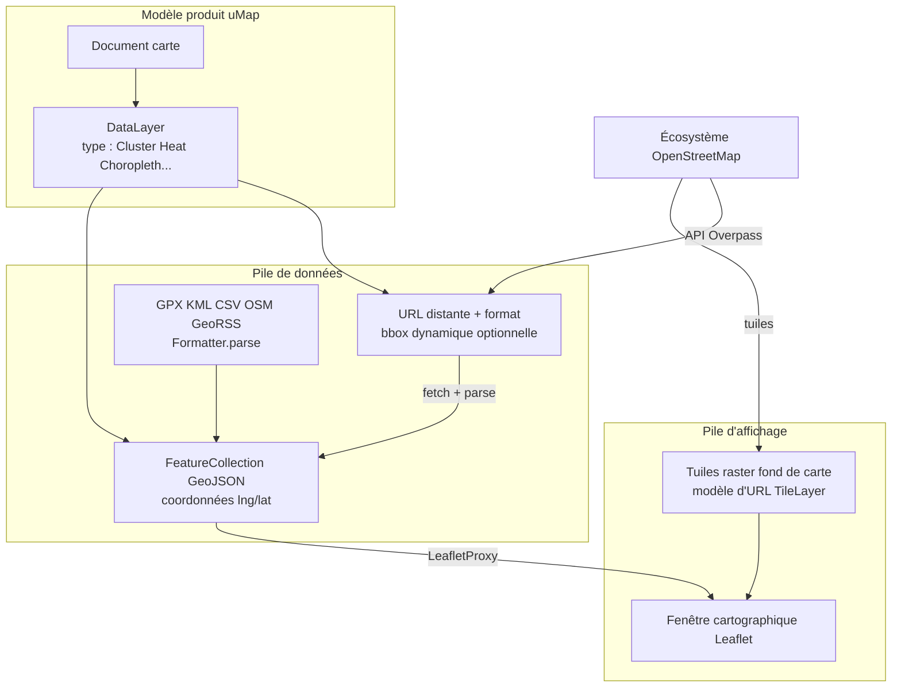

# Intégration uMap — Phase 2 : Primer domaine

> **Statut :** Phase 2 sur 13 · Investigation en lecture seule · S'appuie sur la [Phase 1](phase-1-what-is-umap.md)  
> **Objectif :** Enseigner uniquement les concepts géospatiaux que ce dépôt utilise réellement — pas de cours SIG générique

---

## Comment lire cette phase

Chaque concept ci-dessous répond à quatre questions :

1. **Qu'est-ce que c'est ?**
2. **Pourquoi existe-t-il ?**
3. **Où uMap l'utilise-t-il ?**
4. **À quel concept familier puis-je le comparer ?**

Labels :

- **FAITE** — directement issu du code, des tests ou de la documentation du dépôt
- **INFÉRENCE** — conclusion raisonnable à partir des preuves
- **INCONNU** — non établi à partir de ce dépôt seul

Les concepts marqués **À COMPRENDRE MAINTENANT** vous bloqueront aux Phases 3–5 si vous les sautez. **UTILE PLUS TARD** peut attendre jusqu'à ce que vous touchiez ce sous-système.

---

## La règle de coordonnées qui vous piégera

Avant tout : **GeoJSON et uMap stockent les positions en `[longitude, latitude]`**, pas `[lat, lng]`.

**FAITE :** Lorsqu'un marqueur est créé dans `umap.controls.js`, la géométrie est :

```javascript
geometry: { type: 'Point', coordinates: [latlng.lng, latlng.lat] }
```

**FAITE :** Leaflet utilise en interne des objets `LatLng` sous la forme `{ lat, lng }`. La couche de rendu convertit entre les conventions. Dans `leaflet.js`, le centre de carte issu des propriétés serveur est stocké en `[lon, lat]` mais passé à Leaflet en `[lat, lon]` :

```javascript
const [lon, lat] = this.app.properties.center
this.map.setView([lat, lon], this.app.properties.zoom)
```

**FAITE :** Le fixture de test `umap/tests/fixtures/test_circles_layer.geojson` montre des points dans la région de Nantes sous la forme `[-1.58, 47.19]` — longitude d'abord, latitude ensuite.

**Comparer à :** Les API JSON où l'ordre des champs importe rarement. Ici, **inverser lat/lng place silencieusement les entités dans le mauvais hémisphère**. Quand vous lisez des coordonnées, demandez-vous toujours : *quelle convention utilise cet objet ?*

**À COMPRENDRE MAINTENANT.**

---

## Entités géographiques et types de géométrie

### Qu'est-ce que c'est ?

Une **entité géographique** est quelque chose sur la carte avec une **géométrie** (où elle se trouve) et des **propriétés** (ce qu'elle signifie : nom, couleur, capacité, etc.).

**FAITE :** L'éditeur uMap crée trois types de géométrie principaux :

| Action utilisateur | Type GeoJSON | Exemple d'usage |
|---|---|---|
| Marqueur | `Point` | Un lieu, une place de parking, un libellé |
| Ligne / itinéraire | `LineString` | Un chemin, un itinéraire, un segment de frontière |
| Polygone | `Polygon` | Une zone, un périmètre, l'emprise d'un bâtiment |

**FAITE :** `formatter.js` et les utilitaires Turf gèrent aussi `MultiPoint`, `MultiLineString`, `MultiPolygon` — formes composées. `geoutils.js` a `shapeAt()` pour déterminer à quel sous-polygone ou sous-ligne un clic appartient.

### Pourquoi existe-t-il ?

Les cartes ont besoin à la fois de **localisation** et d'**attributs**. Séparer géométrie et propriétés permet à uMap de styliser selon les données (`population>10000` → rouge) sans modifier les coordonnées.

### Où uMap l'utilise-t-il ?

- Les outils de dessin dans `umap.controls.js` initialisent des géométries vides, puis Leaflet.Editable remplit les coordonnées au clic de l'utilisateur
- `umap/static/umap/js/modules/data/features.js` — les classes `Point`, `LineString`, `Polygon` encapsulent les entités individuelles
- Chaque fichier de calque stocké est finalement une `FeatureCollection` de ces objets

### Comparer à

Un document Firestore : `geometry` ≈ champ de localisation structuré ; `properties` ≈ le reste du document. Les popups et modèles lisent depuis `properties` ; le moteur de rendu cartographique lit depuis `geometry`.

**À COMPRENDRE MAINTENANT.**

---

## GeoJSON

### Qu'est-ce que c'est ?

**GeoJSON** est du JSON pour des données géographiques. Un fichier de calque est typiquement :

```json
{
  "type": "FeatureCollection",
  "features": [
    {
      "type": "Feature",
      "id": "capa0",
      "geometry": { "type": "Point", "coordinates": [-1.58, 47.19] },
      "properties": { "name": "...", "amenity": "bicycle_parking" }
    }
  ]
}
```

### Pourquoi existe-t-il ?

C'est la **lingua franca** entre le stockage uMap, les pipelines d'import, l'export, les API distantes et la couche `L.GeoJSON` de Leaflet.

**FAITE :** Vue d'ensemble développeur : *« Most of the data is stored as geoJSON files, on the server. »*

**FAITE :** `DataLayer.geojson` est un `FileField` Django — les entités de chaque calque vivent dans un fichier `.geojson` sur disque ou en stockage objet (`umap/models.py`).

**FAITE :** Les calques hérités peuvent embarquer des métadonnées sous `_umap_options` dans le fichier GeoJSON. `DataLayer._fallback_properties_from_file()` lit cela lorsque les `settings` en base sont vides. Le code plus récent normalise vers `properties` côté client (`app.js`).

### Où uMap l'utilise-t-il ?

| Étape | Emplacement |
|---|---|
| Persistance | Fichier `DataLayer.geojson` par calque |
| Livraison API | `MapViewGeoJSON`, vues datalayer servent le GeoJSON au client |
| Import | `Formatter.parse()` convertit d'autres formats → GeoJSON |
| Export | `EXPORT_FORMATS` dans `formatter.js` |
| Rendu | `LeafletProxy` ajoute les entités via les couches GeoJSON Leaflet |

### Comparer à

**GeoJSON est la représentation interne de uMap** — comme votre application React pourrait normaliser toutes les réponses API dans une seule interface TypeScript avant le rendu. GPX, KML, CSV, XML OSM sont des **adaptateurs d'entrée** ; GeoJSON est ce avec quoi l'application travaille réellement.

**À COMPRENDRE MAINTENANT.**

---

## Boîtes englobantes (bbox)

### Qu'est-ce que c'est ?

Une **boîte englobante** est le rectangle qui contient un ensemble d'entités ou la vue courante de la carte : bords ouest, sud, est, nord en degrés.

**FAITE :** `geoutils.js` documente explicitement la convention :

> *« Bounding boxes are kept in geojson order: [west, south, east, north]. »*

**FAITE :** `LeafletProxy.getGeoContext()` expose :

```javascript
{
  bbox: "west,south,east,north",  // chaîne jointe par des virgules
  north, south, east, west,
  lat, lng, zoom,
  left: west, bottom: south, right: east, top: north
}
```

**FAITE :** Les URL de données distantes peuvent inclure des variables de modèle comme `{bbox}`, `{south}`, `{west}`, `{north}`, `{east}` (FAQ + tutoriel 10). `app.renderUrl()` les substitue via `greedyTemplate()` avant le fetch.

### Pourquoi existe-t-il ?

- **Ajuster la carte aux données** — zoomer la fenêtre pour afficher toutes les entités
- **Requêtes distantes dynamiques** — ne récupérer que les POI visibles dans la vue courante (Overpass, OpenDataSoft `in_bbox()`)
- **Biais de recherche** — la recherche Photon peut utiliser l'étendue courante de la carte (`autocomplete.js`)

### Où uMap l'utilise-t-il ?

- `GeoUtils.bbox()`, `unionBbox()`, `bboxIntersects()` — helpers basés sur Turf
- `fetchRemoteData()` dans `data/layer.js` — re-fetch sur `moveend` lorsque `remoteData.dynamic` est vrai
- Interface import/filtre — filtrage par bbox dans le navigateur de données

### Comparer à

Un `WHERE lat BETWEEN ? AND ? AND lng BETWEEN ? AND ?` SQL — mais exprimé comme un rectangle géographique et souvent intégré dans des modèles d'URL plutôt que des constructeurs de requêtes.

**À COMPRENDRE MAINTENANT** pour les calques distants. **UTILE PLUS TARD** pour le choroplèthe/calculs de bornes.

---

## Projections et systèmes de coordonnées (version minimale)

### Qu'est-ce que c'est ?

La Terre est une sphère ; les écrans sont plats. Une **projection** mappe lat/lng vers des pixels x/y. **WGS84** (EPSG:4326) est le standard GPS lat/lng. **Web Mercator** (EPSG:3857) est ce que la plupart des tuiles cartographiques web utilisent.

### Pourquoi existe-t-il ?

Les serveurs de tuiles et Leaflet ont besoin d'un modèle mathématique cohérent pour placer correctement les niveaux de zoom et les panneaux.

### Où uMap l'utilise-t-il ?

**FAITE :** Le centre de carte est stocké comme un `PointField(geography=True)` Django sur `Map` — type geography PostGIS pour le centre par défaut de la carte.

**FAITE :** L'importateur OpenDataSoft demande `epsg=4326` dans les URL d'export (`opendata.js`) — lat/lng WGS84, pas des mètres projetés.

**FAITE :** Le modèle `TileLayer` a un booléen `tms` — certains schémas de tuiles inversent l'axe Y (TMS vs XYZ). Le commentaire renvoie au wiki OSM sur TMS.

**INFÉRENCE :** uMap **ne demande pas** aux utilisateurs de choisir des projections. Les données restent en degrés WGS84 ; Leaflet + les fournisseurs de tuiles gèrent la projection d'affichage. Vous touchez rarement aux maths de projection en tant que contributeur.

### Comparer à

Vous stockez les horodatages en UTC en base et laissez le navigateur formater selon la locale. uMap stocke des coordonnées WGS84 et laisse Leaflet projeter pour l'affichage.

**UTILE PLUS TARD** sauf si vous travaillez sur des bugs de couches de tuiles ou des requêtes PostGIS. **Ne vous enfoncez pas ici.**

---

## Tuiles, fonds de carte et TileLayer

### Qu'est-ce que c'est ?

Une **couche de tuiles raster** est une grille d'images cartographiques pré-rendues (PNG/WebP) récupérées par niveau de zoom et index x/y. Ensemble, elles forment le **fond de carte** — rues, libellés, relief — sous les vecteurs dessinés par l'utilisateur.

**FAITE :** Champs du modèle Django `TileLayer` : `url_template` (avec placeholders `{z}/{x}/{y}` selon le format de tuiles OSM), `minZoom`, `maxZoom`, `attribution`, `rank`, `tms`.

**FAITE :** `LeafletProxy` crée un `TileLayerManager` qui s'initialise depuis `app.properties.tilelayers` — configuré par carte, avec une valeur par défaut serveur via `TileLayer.get_default()`.

### Pourquoi existe-t-il ?

Rendre toute la planète en vecteurs dans le navigateur serait impossiblement lourd. Les tuiles sont des pyramides d'images mises en cache, adaptées au CDN.

### Où uMap l'utilise-t-il ?

- Carte d'arrière-plan pendant l'édition et la consultation
- Interface des paramètres de carte — les utilisateurs peuvent changer de fond de carte, ajuster l'opacité
- Commande de gestion `umap clean_tilelayer` — remplacement en masse des URL de tuiles dans les paramètres de carte stockés

### Comparer à

Une `background-image` CSS qui change de résolution au zoom — sauf que chaque « résolution » est une requête réseau distincte indexée par zoom/x/y.

**À COMPRENDRE MAINTENANT :** les tuiles de fond de carte ≠ vos calques de données. Ce sont des systèmes séparés qui se superposent visuellement.

---

## Vecteur vs. raster (seulement ce qui compte ici)

### Qu'est-ce que c'est ?

- **Raster :** images pixel (tuiles de fond de carte)
- **Vecteur :** objets géométriques (vos marqueurs, lignes, polygones, GeoJSON distant)

### Où uMap l'utilise-t-il ?

**FAITE :** Les entités utilisateur sont des **vecteurs** stockés/servis en GeoJSON, rendus par Leaflet en chemins SVG/Canvas et marqueurs.

**FAITE :** Le fond de carte est des tuiles **raster**.

**INFÉRENCE :** Le changelog récent mentionne le financement des tuiles vectorielles (subvention NLnet README pour « uMapVectorTiles ») — direction future, pas le modèle de stockage principal aujourd'hui.

**Comparer à :** Canvas Figma — image d'arrière-plan (raster) + formes vectorielles éditables par-dessus.

**À COMPRENDRE MAINTENANT** à ce niveau uniquement.

---

## Calques de données (le « calque » uMap — pas celui de Leaflet)

Ce mot est surchargé. uMap utilise « calque » dans **trois** sens liés :

### 1. DataLayer (concept produit) — **À COMPRENDRE MAINTENANT**

Un groupe nommé d'entités avec ses propres paramètres, permissions, entrée de légende et source de données distante optionnelle.

**FAITE :** Modèle Django `DataLayer` + classe client `DataLayer` dans `data/layer.js`.

### 2. Type de calque de rendu (mode de visualisation)

**FAITE :** D'après `docs/dev/frontend.md` et `data/types.js`, un calque de données a un **type** qui contrôle comment les entités sont dessinées :

| Type | Rôle |
|---|---|
| Default | Marqueurs/chemins standard |
| Cluster | Regroupe les points proches à faible zoom |
| Heat | Carte de chaleur de densité |
| Choropleth | Colore les polygones selon une propriété numérique |
| Categorized | Styles distincts par valeur de catégorie |
| Circles | Cercles proportionnels selon une valeur |

**FAITE :** Le choroplèthe utilise des classes statistiques — k-means, Jenks, quantiles, équidistant (`data/types.js` + `simple-statistics`).

### 3. Panneau / superposition Leaflet

**FAITE :** Chaque `DataLayer` crée un panneau de superposition (`createOverlayPane`) pour que l'ordre z et la visibilité soient par calque.

### Comparer à

- DataLayer ≈ une sous-collection Firestore avec son propre schéma et ses règles de sécurité
- Type de rendu ≈ type de graphique dans un tableau de bord (barres vs. camembert — mêmes données, encodage visuel différent)
- Panneau Leaflet ≈ contexte d'empilement CSS `z-index`

**Ne confondez pas** « basculer la visibilité d'un calque » (produit) avec « changer la couche de tuiles du fond de carte » (arrière-plan).

---

## Styles de carte, règles et propriétés

### Qu'est-ce que c'est ?

Le **style** contrôle l'apparence des entités : couleur, icône, épaisseur, opacité, libellés. uMap prend en charge :

- **Propriétés par entité** — définies dans le panneau d'édition
- **Valeurs par défaut du calque** — héritées par les nouvelles entités
- **Règles conditionnelles** — `property>value` → appliquer un style (syntaxe documentée dans la FAQ)
- **Variables de modèle** — `{name}`, `{lat}`, `{measure}` dans les descriptions et popups

### Où uMap l'utilise-t-il ?

**FAITE :** `rules.js` + propriété de schéma `rules` — évaluées côté client au rendu

**FAITE :** `features.js` construit le contexte de modèle via `getGeoContext()` plus les propriétés d'entité, le rang, le nom du calque, la mesure (longueur/surface via Turf dans `geoutils.js`)

### Comparer à

CSS avec classes conditionnelles, ou un tableur avec formatage conditionnel — présentation pilotée par les données sans modifier la géométrie sous-jacente.

**UTILE PLUS TARD** jusqu'à ce que vous travailliez sur le style, les popups ou le mapping de propriétés à l'import.

---

## Formats d'import et d'export

### Qu'est-ce que c'est ?

uMap accepte plusieurs **formats fichier/API**, normalisant toujours en GeoJSON en interne.

**FAITE :** `Formatter.parse()` prend en charge :

| Format | Gestionnaire | Notes |
|---|---|---|
| `geojson` | `JSON.parse` | Natif |
| `gpx` | `togeojson.gpx` | Traces, altitude — tutoriel 13 |
| `kml` | `togeojson.kml` | Google Earth |
| `csv` | `csv2geojson` | Nécessite colonnes `lat`/`lon` ou `geometry` |
| `osm` | `osm2geojson` | XML OSM — définit `osm_id`, `osm_type` sur les propriétés |
| `georss` | `GeoRSSToGeoJSON` | RSS avec extensions géo |

**FAITE :** Les tests d'intégration référencent aussi `umap` comme format d'import (`test_import.py`).

**FAITE :** Formats d'export dans `EXPORT_FORMATS` : geojson, gpx, kml, csv, wkt — plus export image (jpg/png) dans l'interface de partage.

### Pourquoi existe-t-il ?

Les utilisateurs arrivent avec des données de tableurs, appareils GPS, exports OSM et portails open data. uMap les accueille là où ils sont.

### Comparer à

La négociation de type de contenu de votre API — `Accept: application/json` vs. `text/csv` — sauf que uMap convertit tout vers un seul modèle interne.

**À COMPRENDRE MAINTENANT :** GeoJSON et XML OSM (pour Overpass). **UTILE PLUS TARD :** cas limites GPX/KML/CSV.

---

## Calques de données distants

### Qu'est-ce que c'est ?

Un calque de données dont les entités ne sont **pas** lues depuis le fichier GeoJSON stocké de uMap, mais **récupérées depuis une URL** à l'exécution (optionnellement re-fetchées quand la carte se déplace).

**FAITE :** Un calque est distant lorsque les deux sont définis (`data/layer.js`) :

```javascript
isRemoteLayer() {
  return Boolean(this.properties.remoteData?.url && this.properties.remoteData.format)
}
```

**FAITE :** Flux de fetch :

1. `renderUrl()` substitue `{bbox}`, `{zoom}`, etc.
2. **Proxy** optionnel via Django (`remoteData.proxy` + TTL) — mise en cache côté serveur (changelog 3.8.0 a déplacé le proxy vers Python)
3. `formatter.parse(raw, format)` → GeoJSON
4. `fromGeoJSON()` charge les entités en mémoire
5. Si `remoteData.dynamic`, `onMoveEnd()` déclenche un re-fetch

**FAITE :** Les calques distants affichent une icône distincte dans l'interface (`icon-remote` dans `app.js`). L'enregistrement ne persiste pas les entités récupérées dans le fichier du calque — `features.js` ignore certaines mutations pour les calques distants.

### Pourquoi existe-t-il ?

Les jeux de données live (disponibilité vélos, requêtes OSM, API open data) deviendraient obsolètes s'ils étaient copiés. Les calques dynamiques gardent les cartes légères et à jour.

### Comparer à

Un hook React Query qui fetch depuis une API quand les dépendances changent — ici la dépendance est souvent la **bbox de la carte** ou le **niveau de zoom**, pas une variable d'état React.

**À COMPRENDRE MAINTENANT** — c'est un différenciateur produit majeur et un point de contact contributeur fréquent.

---

## OpenStreetMap, Overpass et XML OSM

### Qu'est-ce que c'est ?

- **OpenStreetMap (OSM) :** base de données géographique collaborative (nœuds, ways, relations avec tags)
- **API Overpass :** langage de requête (Overpass QL) pour extraire des sous-ensembles OSM
- **XML OSM :** sérialisation XML des éléments OSM — distincte de la sortie JSON Overpass

### Pourquoi existe-t-il ?

OSM est l'univers de données par défaut de la communauté uMap. Overpass permet aux auteurs d'extraire des entités taguées (stationnement vélo, points d'eau, etc.) sans maintenir leur propre base.

### Où uMap l'utilise-t-il ?

**FAITE :** Tutoriel 11 (français) : Overpass Turbo utilise par défaut `[out:json]` ; uMap **ne peut pas** parser ce JSON Overpass. Les utilisateurs doivent utiliser **`[out:xml]`** et sélectionner le format **`osm`** dans les paramètres de données distantes uMap.

**FAITE :** Importateur Overpass intégré (`importers/overpass.js`) construit des requêtes, utilise Photon pour la recherche de zone, définit `importer.format = 'osm'`.

**FAITE :** Les entités OSM importées obtiennent les propriétés `osm_id` et `osm_type` (`formatter.fromOSM`) — correspondant aux variables de modèle de la FAQ.

### Comparer à

- OSM ≈ Wikipedia pour les cartes — source de vérité éditée par la communauté
- Overpass ≈ `SELECT` SQL contre la base OSM
- XML OSM dans uMap ≈ un **encodage de réponse** supporté — comme choisir `Content-Type: application/xml` vs. une forme JSON propriétaire

**À COMPRENDRE MAINTENANT** si vous touchez l'import/données distantes. **Piège critique :** JSON Overpass ≠ XML OSM ≠ GeoJSON — trois choses différentes.

---

## Leaflet (et la transition OpenLayers)

### Qu'est-ce que c'est ?

**Leaflet** est une bibliothèque navigateur légère pour les cartes interactives : tuiles, marqueurs, couches vectorielles, événements.

**FAITE :** `docs/dev/overview.md` : le client utilise du JavaScript vanilla sur Leaflet.

**FAITE :** `LeafletProxy` dans `rendering/leaflet.js` encapsule `L.Map`, gère les couches de tuiles, traduit les entités uMap en couches Leaflet, proxy les événements (`moveend`, `feature:click`, etc.) vers l'application uMap.

**FAITE :** Le dessin/édition utilise **Leaflet.Editable** (`vendors/editable/Leaflet.Editable.js`).

**FAITE :** Changelog 3.8.0 : le projet **prépare un passage de Leaflet à OpenLayers**. `app.js` peut instancier `OLProxy` quand l'URL a `?openlayers` — chemin expérimental dans `rendering/openlayers.js`.

### Pourquoi existe-t-il ?

Leaflet est le moteur de rendu actuel. uMap l'étend plutôt que d'encapsuler React — pas de DOM virtuel, DOM direct + bus d'événements (`app.fire(...)`).

### Comparer à

Utiliser Mapbox GL ou le SDK Google Maps dans une app JS vanilla — la classe `Map` de uMap (`umap.js` / `app.js`) est la racine de votre application ; Leaflet est le pilote de la fenêtre cartographique, comme intégrer une bibliothèque de graphiques `<canvas>` dans un composant React sans que le graphique soit natif React.

**À COMPRENDRE MAINTENANT :** Leaflet est le moteur de production actuel. **UTILE PLUS TARD :** migration OpenLayers — pertinent si vous contribuez au code de rendu en 2026+.

---

## Géocodage et recherche (pas tout à fait du « SIG »)

### Qu'est-ce que c'est ?

Le **géocodage** convertit noms de lieux ↔ coordonnées. Le **géocodage inverse** convertit coordonnées → libellé de lieu.

**FAITE :** Point de terminaison de recherche par défaut : Photon (`https://photon.komoot.io/api/?`) — configuré dans `umap/settings/base.py` et surchargeable par déploiement.

**FAITE :** `autocomplete.js` prend en charge la saisie directe de coordonnées et la recherche inverse via Photon.

**FAITE :** Le tracé d'itinéraire peut utiliser **OpenRouteService** (`importers/openrouteservice.js`) — API de routage externe renvoyant du GeoJSON.

### Comparer à

Google Places Autocomplete dans une app de livraison — service géospatial externe, interchangeable selon la config de déploiement.

**UTILE PLUS TARD** sauf si vous travaillez sur la recherche ou les importateurs de routage.

---

## Base de données spatiale (PostGIS) — empreinte réduite

### Qu'est-ce que c'est ?

PostgreSQL + PostGIS ajoute des types de colonnes géographiques et des requêtes.

### Où uMap l'utilise-t-il ?

**FAITE :** `Map.center` est `PointField(geography=True)`.

**FAITE :** Vue d'ensemble développeur : *« PostGIS is used for some of its geo features, but for the most part, the computation is done on the frontend with Leaflet. »*

**FAITE :** Les tests nécessitent PostgreSQL avec PostGIS (`docs/contributing.md`).

**INFÉRENCE :** La géométrie des entités n'est **pas** principalement dans des tables PostGIS — elle est dans des fichiers GeoJSON. PostGIS supporte les métadonnées de carte, l'admin et l'intégration Django GIS, pas le SQL spatial par entité.

### Comparer à

Stocker le `lastLoginLocation` d'un utilisateur dans Postgres alors que le contenu du document vit dans S3 — stockage séparé par responsabilité.

**UTILE PLUS TARD** pour le travail backend. **Ne supposez pas** que vous écrirez des requêtes PostGIS pour l'édition d'entités.

---

## Bibliothèques géospatiales côté client (Turf)

### Qu'est-ce que c'est ?

**Turf.js** fournit des mesures et prédicats géométriques en JavaScript.

**FAITE :** `geoutils.js` importe des modules Turf : `area`, `length`, `centroid`, `bbox`, `distance`, `booleanPointInPolygon`, etc. — avec des commentaires de taille de bundle montrant des imports paresseux délibérés.

**FAITE :** Utilisé pour les mesures dans les popups (`{measure}`), le centrage, l'union de bbox, le hit testing multi-géométrie.

### Comparer à

`lodash` pour la géométrie — fonctions utilitaires appelées depuis la logique métier, pas un framework.

**UTILE PLUS TARD** jusqu'à ce que vous touchiez les mesures, filtres ou cas limites d'édition géométrique.

---

## Carte conceptuelle — comment tout s'articule



**Narration :** Commencez par **Carte** — le document. Chaque **DataLayer** charge soit un **fichier GeoJSON** depuis le serveur uMap, soit **récupère des données distantes** (souvent OSM/Overpass/open data). Tout devient GeoJSON dans le navigateur. **Leaflet** dessine les vecteurs par-dessus les **tuiles raster**. PostGIS n'ancre que quelques champs côté serveur comme le centre de carte ; ce n'est pas le moteur géométrique principal.

---

## Résumé de la Phase 2 — ce qu'il faut retenir

### À COMPRENDRE MAINTENANT

1. **Les coordonnées sont `[lng, lat]` en GeoJSON** — Leaflet inverse à la frontière
2. **GeoJSON est le format interne** — tout le reste est converti dans `Formatter`
3. **Tuiles de fond de carte ≠ calques de données** — arrière-plan raster vs. superpositions vectorielles
4. **DataLayer** est l'unité d'organisation — avec types de visualisation (cluster, heat, choroplèthe…)
5. **Les calques distants** fetch URL → parse → rendu ; peuvent re-fetch au pan/zoom
6. **Overpass pour uMap signifie le format XML OSM**, pas le JSON Overpass
7. **La plupart des calculs géométriques sont côté client** (Leaflet + Turf) ; les fichiers sur disque sont en GeoJSON

### UTILE PLUS TARD

- Détails projection/EPSG, schémas de tuiles TMS
- Algorithmes de classes choroplèthes (Jenks, k-means)
- PostGIS au-delà de `Map.center`
- Chemin de migration OpenLayers
- Configuration Photon / OpenRouteService

### Volontairement omis (pas encore nécessaire)

- GDAL, shapefiles, serveurs WMS/WFS
- Choix avancé de projection cartographique
- Modèle de données OSM complet (nœuds/ways/relations) hors contexte d'import
- Théorie de l'indexation spatiale

---

## Ce qui reste incertain

| Sujet | Statut |
|---|---|
| Calendrier du passage Leaflet → OpenLayers par défaut | **PARTIELLEMENT CONNU** — préparation active en 3.8.x ; Leaflet reste par défaut |
| Si les fonds de carte en tuiles vectorielles remplaceront TileLayer raster | **INFÉRENCE** du nom de la subvention NLnet ; pas implémenté comme chemin principal dans le code consulté |
| Liste complète des champs du schéma `remoteData` et de l'interface | **CONNU** existe dans `schema.js` ; comportement détaillé de l'interface reporté à la Phase 5 |
| Requêtes spatiales côté serveur au-delà du centre | **INCONNU** sans audit backend plus approfondi |

---

## Ce que nous investiguerons ensuite — Phase 3 : Modèle mental d'architecture

Avec le vocabulaire domaine en place, nous reconstruisons l'**architecture réelle** de uMap depuis le dépôt :

- Applications Django, vues, routes URL
- Comment le JSON d'initialisation de carte atteint le navigateur
- Stockage (filesystem vs. S3)
- Frontières auth et permissions
- Graphe de modules frontend (`app.js`, `data/layer.js`, `rendering/leaflet.js`)
- Sous-système temps réel/journal (indices dans `journal/engine.js`)
- Organisation des tests

Nous produirons un diagramme Mermaid ciblé et narrerons les frontières : ce que le serveur possède vs. ce que le client possède.

---

## Pause ici

La Phase 2 vous a donné le vocabulaire. La Phase 3 vous donne la **structure**.

**Questions utiles avant la Phase 3 :**

- La convention lng/lat est-elle solide, ou voulez-vous un exemple travaillé avec de vraies coordonnées d'un fixture de test ?
- Vous orientez-vous vers des contributions frontend ou backend ? (Je pondérerai la narration de la Phase 3 en conséquence.)
- Un concept ci-dessus reste-t-il abstrait ?

Quand vous êtes prêt, dites **« continuer vers la Phase 3 »** ou posez des questions.
