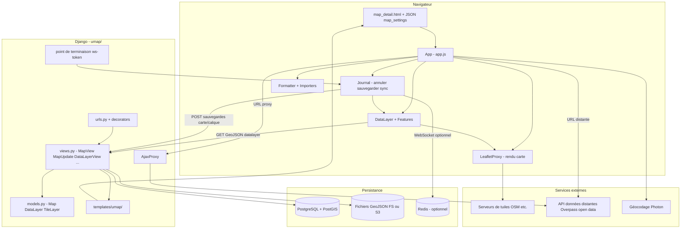

# Intégration uMap — Phase 3 : Modèle mental d'architecture

> **Statut :** Phase 3 sur 13 · Investigation en lecture seule · S'appuie sur la [Phase 1](phase-1-what-is-umap.md) et la [Phase 2](phase-2-domain-primer.md)  
> **Objectif :** Reconstruire comment uMap est réellement structuré — responsabilités, frontières et flux de données — depuis le dépôt consulté

---

## Avant d'examiner les répertoires

uMap **n'est pas** une SPA React parlant à une API CRUD fine. C'est plutôt une **application web Django classique avec un grand éditeur dans le navigateur** :

1. Le serveur **rend une page HTML** et embarque un blob JSON (`map_settings`) qui initialise le client.
2. Le navigateur exécute une **application ES modules vanilla** (`App` dans `app.js`) qui possède l'édition, le rendu, l'import et la plupart de la logique géo.
3. Le serveur **persiste les métadonnées de carte dans PostgreSQL** et les **entités de calque dans des fichiers GeoJSON versionnés** (filesystem ou S3).
4. Les mutations pendant l'édition sont suivies côté client dans un **Journal** (annuler/rétablir, état dirty, synchronisation temps réel optionnelle via WebSocket + Redis).

**FAITE :** Vue d'ensemble développeur (`docs/dev/overview.md`) : *« The server is meant to be a simple layer to do the storage and serve the JavaScript. »*

**INFÉRENCE :** Cette description est directionnellement vraie pour la **géométrie des entités**, mais sous-estime le rôle du serveur dans **l'auth, les permissions, la recherche, le proxy, le versionnement, la résolution de fusion/conflits et la coordination temps réel**.

Gardez cette séparation en tête :

| Côté | Possède |
|---|---|
| **Serveur** | Utilisateurs, permissions, enregistrements carte/calque, stockage fichiers GeoJSON, shell HTML, API JSON, proxy ajax, sync WebSocket optionnelle |
| **Client** | Rendu Leaflet, UX dessin/édition, parsing d'import, règles de style, calculs choroplèthe, orchestration fetch distant, interface optimiste |

---

## Couches architecturales majeures

Chaque sous-section suit le même contrat : **responsabilité**, **entrées**, **sorties**, **voisins**, et **ce qu'elle ne doit pas posséder**.

---

### 1. Application HTTP Django (`umap/`)

**FAITE :** Projet Django unique ; l'application `umap` contient modèles, vues, urls, templates, assets statiques, commandes de gestion et code de sync.

| | |
|---|---|
| **Possède** | Routage HTTP, modèles ORM, vérifications de permissions, réponses HTML, points de terminaison de mutation JSON, admin, commandes de gestion |
| **Reçoit** | Requêtes HTTP navigateur (GET pages, POST sauvegardes, GET fichiers GeoJSON) |
| **Produit** | Pages HTML, réponses JSON, octets de fichiers GeoJSON, redirections |
| **Communique avec** | PostgreSQL/PostGIS, filesystem/S3 (`STORAGES["data"]`), Redis optionnel (via sync) |
| **Ne doit PAS posséder** | Rendu Leaflet, algorithmes de style d'entités, logique d'interaction de dessin |

**Comparer à :** Une app Node/Express servant des templates EJS + endpoints REST — sauf que la persistance utilise l'ORM Django et des fichiers GeoJSON au lieu de stocker les entités en lignes SQL.

---

### 2. Persistance — PostgreSQL + fichiers GeoJSON

**FAITE :** `docs/config/storage.md` : métadonnées dans PostgreSQL ; contenu des calques en GeoJSON sur filesystem ou S3.

**FAITE :** `STORAGES` a trois clés (`umap/settings/base.py`) :

- `default` — uploads de pictogrammes
- `staticfiles` — assets statiques hashés (`UmapManifestStaticFilesStorage`)
- `data` — GeoJSON des calques (`umap.storage.fs.FSDataStorage` ou `umap.storage.s3.S3DataStorage`)

**FAITE :** `FSDataStorage` écrit des fichiers versionnés sous la forme `{uuid}_{timestamp_ms}.geojson` dans `datalayer/{map_id_suffix}/...` et purge les anciennes versions (`UMAP_KEEP_VERSIONS`, défaut 10).

| | |
|---|---|
| **Possède** | Enregistrements durables carte/calque ; fichiers de géométrie d'entités ; historique de versions |
| **Reçoit** | Sauvegardes POST multipart du client ; sauvegardes de modèles depuis les vues Django |
| **Produit** | Lignes ORM ; fichiers `.geojson` / `.geojson.gz` ; en-têtes `X-Datalayer-Version` |
| **Communique avec** | `DataLayerView` (sert les fichiers), `DataLayerUpdate` (écrit + fusion) |
| **Ne doit PAS posséder** | Résultats Overpass live ; données d'API distantes (sauf si copiées dans un calque) |

**Comparer à :** Firebase Auth + Firestore pour les métadonnées, Cloud Storage pour les gros blobs JSON — même séparation **enregistrement d'index** vs. **payload blob**.

---

### 3. Modèles de domaine (`umap/models.py`)

**FAITE :** Entités centrales :

| Modèle | Rôle |
|---|---|
| `Map` | Carte de premier niveau : centre (`PointField`), zoom, slug, propriétaire, éditeurs, équipe, statut partage/édition, JSON `settings` |
| `DataLayer` | Métadonnées de calque + `FileField` geojson ; PK UUID ; `parent` optionnel pour calques imbriqués |
| `TileLayer` | Définitions de fond de carte configurées en admin (modèle d'URL, plage de zoom, flag TMS) |
| `Team`, `Star`, `Licence`, `Pictogram` | Collaboration, favoris, licences, icônes |

**FAITE :** `Map.can_view()` / `Map.can_edit()` et `DataLayer.can_edit()` (avec `INHERIT`) encodent l'autorisation en Python, reflétée par les décorateurs d'URL.

| | |
|---|---|
| **Possède** | Règles métier pour visibilité, droits d'édition, clonage, corbeille, cookies de propriété anonyme |
| **Reçoit** | `request` Django (utilisateur, cookies, session) |
| **Produit** | Autorisation booléenne ; dictionnaires de métadonnées pour l'initialisation client |
| **Communique avec** | Vues, décorateurs, interface permissions client |
| **Ne doit PAS posséder** | Historique d'annulation client ; état des couches Leaflet |

---

### 4. Routage URL et décorateurs de permissions (`umap/urls.py`, `umap/decorators.py`)

**FAITE :** Les routes sont regroupées par capacité :

| Décorateur | Utilisé pour |
|---|---|
| `can_view_map` | Page carte, points de terminaison lecture GeoJSON, GET fichier datalayer |
| `can_edit_map` | Paramètres carte, création calque, clonage, suppression carte, token WS |
| `can_edit_datalayer` | Mise à jour calque (droits d'édition par calque) |
| `datalayer_belong_to_map` | Vérifie que le calque appartient à la carte |
| `login_required` / `login_required_if_not_anonymous_allowed` | Tableau de bord, création carte |

**FAITE :** Les points de terminaison d'édition utilisent `FormLessEditMixin` — **POST uniquement**, réponses JSON via `simple_json_response()`.

| | |
|---|---|
| **Possède** | Le périmètre de sécurité aux frontières HTTP |
| **Reçoit** | Requêtes brutes avant l'exécution des vues |
| **Produit** | 403/PermissionDenied ou passe `map_inst` / `datalayer_inst` aux vues |
| **Ne doit PAS posséder** | Basculement mode édition côté client (l'interface peut masquer les commandes, le serveur doit toujours appliquer) |

---

### 5. Initialisation de la page carte (templates Django → `App`)

**FAITE :** Flux pour consulter une carte :

```
GET /map/{slug}_{id}
  → MapView (can_view_map)
  → MapDetailMixin.get_context_data()
  → construit un dict geojson avec properties + arborescence métadonnées datalayer
  → map_detail.html → map_init.html
```

**FAITE :** `map_init.html` embarque les paramètres et démarre le client :

```html
<script id="map-settings" data-settings="{{ map_settings|escape }}"></script>
<script defer type="module">
    import App from '.../app.js'
    U.SETTINGS = JSON.parse(document.getElementById('map-settings').dataset.settings)
    U.MAP = new App("map", U.SETTINGS)
</script>
```

**FAITE :** `MapDetailMixin.get_map_properties()` injecte la config serveur : liste des couches de tuiles, config importateur, schéma, URLs, liste des licences, flag websocket, i18n, infos utilisateur, choix statut édition/partage.

| | |
|---|---|
| **Possède** | Transfert initial serveur→client (bootstrap JSON unique) |
| **Reçoit** | Objet ORM Map + requête |
| **Produit** | JSON échappé dans le HTML ; hints preconnect pour les domaines de tuiles |
| **Communique avec** | `App.init()` côté client |
| **Ne doit PAS posséder** | Chargement ultérieur de la géométrie datalayer (fetch paresseux) |

**Comparer à :** `getServerSideProps` Next.js passant des props à un composant client — sauf que le payload est un document de forme GeoJSON avec `properties` imbriquées.

---

### 6. Application navigateur — `App` (`umap/static/umap/js/modules/app.js`)

**FAITE :** `App` étend `Utils.WithEvents` (pub/sub). C'est l'**orchestrateur racine**.

**FAITE :** À l'initialisation, il :

- Fusionne les surcharges de la query string dans les propriétés de carte (paramètres d'intégration iframe)
- Instancie `LeafletProxy` (ou `OLProxy` si `?openlayers`)
- Câble l'interface : panneaux, barres, contrôles, importateur, formatter, permissions
- Crée des instances `DataLayer` depuis les métadonnées de bootstrap
- Charge paresseusement `Journal` pour édition/sauvegarde/annulation/temps réel

| | |
|---|---|
| **Possède** | Mode édition, orchestration de sauvegarde, état UI, routage d'événements entre modules |
| **Reçoit** | JSON de bootstrap ; saisie utilisateur ; réponses HTTP carte/calque |
| **Produit** | POST sauvegardes ; fetch distants ; mises à jour carte Leaflet |
| **Communique avec** | `LeafletProxy`, `DataLayer`, `Journal`, `Request`/`ServerRequest` |
| **Ne doit PAS posséder** | Format de persistance long terme ; authentification utilisateur (utilise session + vérifications serveur) |

**Comparer à :** Un store Redux racine + coordinateur — mais implémenté comme une classe avec événements `fire()`, pas React.

---

### 7. Couche de rendu — `LeafletProxy` (`rendering/leaflet.js`)

**FAITE :** Encapsule `L.Map`, couches de tuiles, couches d'entités, hooks d'édition, helpers bbox/centre.

**FAITE :** Changelog 3.8.0 : migration OpenLayers en cours ; `?openlayers` bascule vers `OLProxy` (`rendering/openlayers.js`).

| | |
|---|---|
| **Possède** | Fenêtre cartographique, pan/zoom, affichage tuiles, pont Leaflet↔entités uMap |
| **Reçoit** | Entités GeoJSON depuis `DataLayer` ; commandes UI (ajuster bornes, éditer géométrie) |
| **Produit** | Événements utilisateur (`moveend`, `feature:click`) ; positions écran |
| **Ne doit PAS posséder** | Sauvegarde serveur ; vérifications de permissions |

---

### 8. Calque de données client — `DataLayer` (`data/layer.js`, `data/features.js`)

**FAITE :** Le `DataLayer` client reflète le calque serveur : propriétés, collection d'entités, type de rendu, config données distantes, règles, filtres.

**FAITE :** Les calques stockés chargent la géométrie via GET `datalayer/{map_id}/{uuid}/` (`_dataUrl()`).

**FAITE :** La sauvegarde envoie un `FormData` : nom, rang, JSON settings, blob geojson → `datalayer_update` ou `datalayer_create`.

| | |
|---|---|
| **Possède** | Ensemble d'entités en mémoire ; type de style de calque ; cycle de vie fetch distant |
| **Reçoit** | GeoJSON depuis serveur ou URL distante ; opérations journal |
| **Produit** | `umapGeoJSON()` pour sauvegarde ; entités rendues via sous-couches de rendu |
| **Ne doit PAS posséder** | Paramètres au niveau carte (délègue à `App`) |

---

### 9. Journal — édition/sync/sauvegarde (`journal/engine.js`)

**FAITE :** Résumé de la docstring :

> *Records every mutation as an operation, syncs with peers over websocket, persists on save, exposes undo/redo.*

**FAITE :** `save()` parcourt les objets dirty (carte, datalayer, permissions), appelle `.save()` sur chaque objet, efface les flags dirty.

**FAITE :** Temps réel optionnel : `REALTIME_ENABLED` + Redis + WebSocket dans `umap/sync/app.py` ; le client obtient un token depuis `map/{id}/ws-token/`.

| | |
|---|---|
| **Possède** | Journal d'opérations, annuler/rétablir, fusion optimiste avec les pairs, ordre de sauvegarde (parent avant enfant) |
| **Reçoit** | `journal.update()` / `upsert()` / `delete()` depuis les actions UI |
| **Produit** | POST HTTP ; `OperationMessage`s WebSocket |
| **Ne doit PAS posséder** | Routage HTTP ; versionnement de fichiers sur disque (le stockage serveur fait cela à la sauvegarde) |

**Comparer à :** Transformation opérationnelle / event sourcing léger — plus présence style Firebase pour l'édition collaborative quand activé.

---

### 10. Services d'import, d'export et de proxy

| Composant | Rôle |
|---|---|
| `Formatter` (`formatter.js`) | Parse gpx/kml/csv/osm/georss/geojson → GeoJSON |
| `importers/*.js` | Assistants (Overpass, OpenDataSoft, communes, etc.) |
| `AjaxProxy` (`views.py`) | Fetch côté serveur + cache disque pour URL distantes (`/ajax-proxy/{ttl}/?url=`) |
| APIs externes | Recherche Photon, routage OpenRouteService (clés configurables) |

| | |
|---|---|
| **Possède** | Conversion de format ; contournement CORS pour données distantes ; réponses proxy en cache |
| **Ne doit PAS posséder** | Stockage de données distantes sauf si l'utilisateur copie dans un calque |

**FAITE :** Depuis 3.8.0, le cache du proxy ajax est géré en Python (`AJAX_PROXY_CACHE_DIR`), pas uniquement Nginx.

---

### 11. Authentification et sessions

**FAITE :** Backends d'auth par défaut (`umap/settings/base.py`) :

- `OpenStreetMapOAuth2` optionnel si clés env définies
- Toujours `ModelBackend` (connexion par nom d'utilisateur désactivée par défaut : `ENABLE_ACCOUNT_LOGIN=False`)

**FAITE :** Les cartes anonymes utilisent des **cookies signés** (`ANONYMOUS_COOKIE_MAX_AGE` = 30 jours) définis sur `MapCreate` / `MapClone`.

**FAITE :** URLs `social_django` sous l'espace de noms `/` ; le flux popup de connexion se termine à `login_popup_end`.

| | |
|---|---|
| **Possède** | Identité utilisateur, session, handshake OAuth |
| **Ne doit PAS posséder** | Autorisation d'édition de carte au-delà de l'identité (c'est `Map.can_edit`) |

---

### 12. Tests et outillage (rôle architectural)

**FAITE :** `make test` exécute les tests unitaires Python, les tests unitaires JS (Mocha), les tests d'intégration Playwright (`docs/contributing.md`).

| Suite | Emplacement | Prouve |
|---|---|---|
| Python pytest | `umap/tests/` | Modèles, vues, stockage, fusion, permissions |
| JS Mocha | `umap/static/umap/unittests/` | geoutils, schéma, etc. |
| Playwright | `umap/tests/integration/` | Flux navigateur de bout en bout |

**UTILE PLUS TARD** — la Phase 12 approfondit.

---

## Diagramme d'architecture



---

## Narration du diagramme

**Commencez ici :** l'utilisateur ouvre `GET /map/my-festival_26381`.

**Suivez cette flèche :** `MapView` charge la `Map` depuis PostgreSQL, vérifie `can_view`, construit une structure JSON (centre, paramètres, **métadonnées datalayer uniquement** — pas les payloads complets d'entités), et rend `map_detail.html`.

**Ce composant existe parce que…** Django livre un premier rendu rapide et injecte tout ce que le client doit savoir sur les permissions, les couches de tuiles et les modèles d'URL d'API — sans nécessiter une étape de build SPA séparée.

**La frontière importante ici :** le HTML initial inclut la **liste des calques + paramètres**, mais la **géométrie des entités est chargée séparément** par calque via `datalayer/{map_id}/{uuid}/` quand le client en a besoin. Les calques distants sautent le fetch fichier et frappent les URL à la place.

**Quand l'utilisateur édite :** les actions UI appellent `journal.update(...)`. Rien touche le serveur jusqu'à **Enregistrer** (`Ctrl+S` → `saveAll()` → `journal.save()`). Les objets `DataLayer` dirty POSTent des blobs GeoJSON ; les objets `Map` dirty POSTent du JSON de paramètres.

**Quand l'utilisateur déplace une carte avec calque distant dynamique :** le client appelle `fetchRemoteData()` — soit directement vers l'API distante, soit via `ajax-proxy` si CORS/proxy est configuré.

**Chemin temps réel optionnel :** si `websocketEnabled`, le client s'authentifie via `ws-token`, connecte WebSocket (routes ASGI vers `sync/app.py`), échange des opérations via pub/sub Redis pendant l'édition. La sauvegarde persiste toujours vers Django + fichiers.

**Où le frontend s'arrête :** dessin, style, classes choroplèthes, parsing d'import, événements Leaflet.

**Où le backend commence :** application des permissions, stockage durable, versionnement/fusion en cas de conflit (HTTP 412), indexation de recherche, admin, cache proxy.

---

## Carte du dépôt (chemins importants uniquement)

Pas un arbre complet — seulement ce qui compte pour la navigation.

| Chemin | Pourquoi il existe |
|---|---|
| `umap/models.py` | Modèle de domaine + `can_edit` / `can_view` |
| `umap/views.py` | Tous les gestionnaires HTTP (~1500 lignes) |
| `umap/urls.py` | Câblage route → décorateur → vue |
| `umap/decorators.py` | Portes de permissions |
| `umap/templates/umap/` | Shells HTML (`map_detail.html`, `map_init.html`) |
| `umap/static/umap/js/modules/app.js` | Racine client |
| `umap/static/umap/js/modules/data/` | `DataLayer`, `Feature`, champs |
| `umap/static/umap/js/modules/journal/` | Sauvegarde, annulation, sync websocket |
| `umap/static/umap/js/modules/rendering/` | Adaptateurs Leaflet/OpenLayers |
| `umap/static/umap/js/modules/importers/` | Assistants d'import |
| `umap/storage/` | Versionnement fichiers GeoJSON (FS/S3) |
| `umap/sync/` | Temps réel WebSocket + Redis |
| `umap/settings/` | `base.py` + surcharges `local.py` |
| `umap/tests/integration/` | E2E Playwright |
| `docs/dev/frontend.md` | Notes mainteneur sur la structure client |
| `docs/config/storage.md` | Documentation du modèle de stockage |
| `Makefile` | `make develop`, `make test`, lint/format |

**Moins important pour les premières contributions :** `charts/` (Helm), `docker/`, la plupart des `management/commands/` sauf pour l'ops.

---

## Conventions de nommage et d'organisation (propres à uMap)

**FAITE — patterns observés :**

| Zone | Convention |
|---|---|
| Modules Python | Package unique minuscule `umap/` ; vues/modèles dans des fichiers plats |
| Noms d'URL | Snake case : `map_update`, `datalayer_view`, `datalayer_create` |
| Modules client | Modules ES sous `js/modules/` ; export par défaut pour `App` |
| Classes client | `DataLayer`, `LeafletProxy`, `Journal` — PascalCase |
| Événements | Noms chaîne : `datalayer:changed`, `map:moveend` via `WithEvents` |
| Style API | POST + corps JSON ou multipart ; pas de pureté des verbes REST |
| Nommage fichiers calque | `{uuid}_{timestamp}.geojson` sur disque |
| Tests | `test_*.py` pytest ; `test_*.py` Playwright dans `integration/` |

**INFÉRENCE :** Le codebase favorise les **patterns Django pragmatiques** plutôt que des API style DRF. Le client est modulaire mais **pas** basé sur un framework de composants.

---

## Cinq faits architecturaux à retenir

1. **Persistance hybride :** PostgreSQL pour les **métadonnées et permissions** carte/calque ; **fichiers** GeoJSON pour la géométrie des entités (versionnés, compatibles gzip).

2. **Bootstrap rendu serveur + client riche :** Un blob JSON démarre `App` ; l'éditeur tourne entièrement dans le navigateur après le chargement.

3. **Chargement paresseux des calques :** La page carte livre les métadonnées ; la géométrie est fetchée par datalayer (ou par URL distante).

4. **Le Journal est le pipeline d'édition :** UI → opérations journal → suivi dirty → `saveAll()` → POST HTTP. Annuler/rétablir et temps réel optionnel sont ici.

5. **Permissions appliquées deux fois :** Le client masque/désactive l'interface selon `editMode` ; le serveur **doit** rejeter les POST non autorisés via décorateurs + `can_edit`.

---

## Résumé de la Phase 3

### À COMPRENDRE MAINTENANT

- Django sert pages + API JSON ; le client possède l'éditeur de carte
- `Map` / `DataLayer` existent à la fois dans l'ORM et le JS client (objets liés mais pas identiques)
- Les sauvegardes sont explicites (`journal.save()`), pas de sync auto à chaque clic
- Les fichiers GeoJSON sont la source de vérité pour les entités stockées
- Les décorateurs d'URL font autorité sur qui peut lire/écrire

### UTILE PLUS TARD

- Sémantique de fusion temps réel WebSocket/Redis (HLCC dans `journal/hlc.js`)
- Différences stockage S3 vs filesystem
- Migration OpenLayers (`?openlayers`)
- `DataLayerUpdate.merge()` pour conflits 412

### Volontairement reporté

- Visite complète du dépôt avec graphes d'appels (Phase 4)
- Parcours d'exécution (Phase 5)
- Configuration locale (Phase 7)

---

## Ce qui reste incertain

| Sujet | Statut |
|---|---|
| Topologie de déploiement production sur umap.openstreetmap.fr | **INCONNU** depuis le dépôt seul (docs Docker/Helm/Nginx existent ; config d'instance absente) |
| Fréquence d'activation du temps réel en pratique | **INCONNU** — `REALTIME_ENABLED` par défaut `False` |
| Si OpenLayers deviendra bientôt le défaut | **PARTIELLEMENT CONNU** — préparation active en 3.8.x ; Leaflet reste par défaut |
| Séquence exacte de chargement paresseux pour tous les types de calque | **INFÉRENCE** — nécessite trace Phase 5 |

---

## Ce que nous investiguerons ensuite — Phase 4 : Visite du dépôt

La Phase 4 parcourt les **modules importants** avec les relations appelant/appelé :

- Qui appelle `MapDetailMixin.get_context_data` vs. `DataLayerView`
- Comment `urls.js` mappe les noms aux routes Django
- Où `umap.controls.js` s'inscrit par rapport à `app.js`
- Quels répertoires vous toucheriez pour une correction frontend vs. backend typique

Nous n'imprimerons toujours **pas** l'arbre complet.

---

## Pause ici

Vous devriez maintenant avoir une image **structurelle** : où le serveur s'arrête et le navigateur commence, et où les fichiers GeoJSON se situent au milieu.

**Questions utiles avant la Phase 4 :**

- Voulez-vous que la visite Phase 4 soit pondérée vers les **modules frontend** ou les **vues/modèles Django** ?
- Devons-nous retracer d'abord le **chemin de sauvegarde** ou le **chemin de chargement de carte** en Phase 5 ?
- Une couche du diagramme reste-t-elle une boîte noire ?

Quand vous êtes prêt, dites **« continuer vers la Phase 4 »** ou posez des questions.
