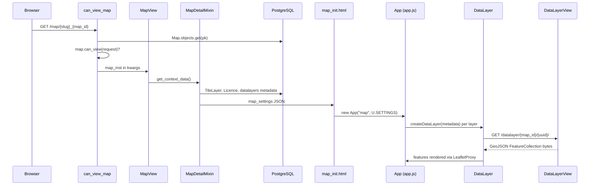
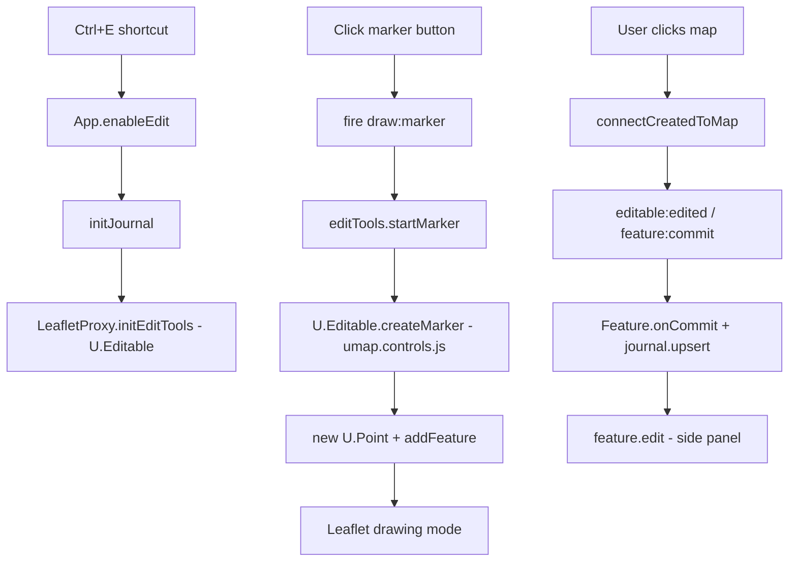
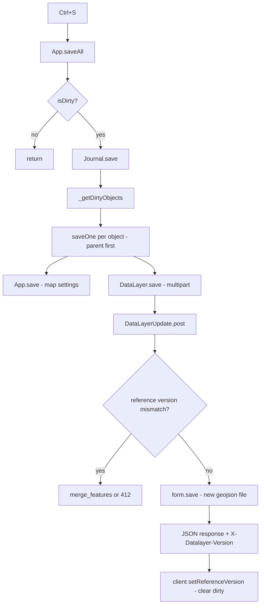
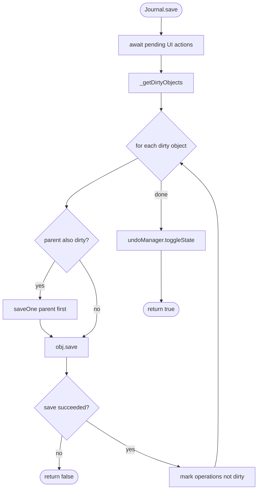
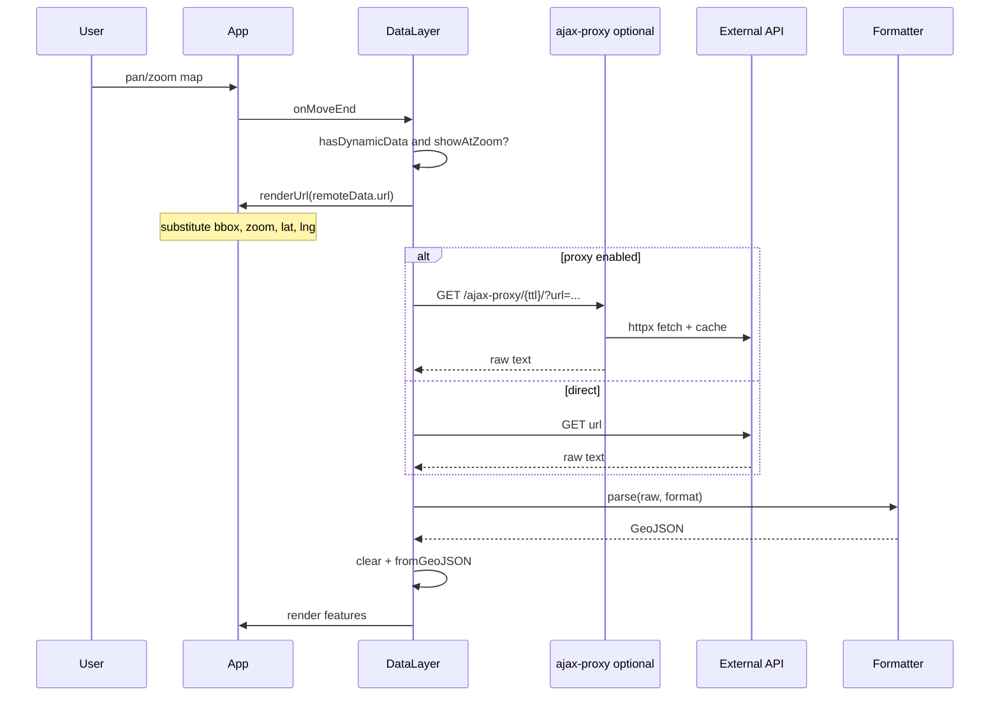

# Intégration uMap — Phase 5 : Parcours verticaux d'exécution

> **Statut :** Phase 5 sur 13 · Investigation en lecture seule · S'appuie sur la [Phase 4](phase-4-repository-tour.md)  
> **Objectif :** Suivre des actions utilisateur réelles dans le code — fichiers, fonctions et transitions d'état exacts

---

## Comment lire cette phase

Chaque parcours suit une action visible par l'utilisateur du navigateur jusqu'à la persistance (et retour). Pour les étapes significatives :

**Fonction** → entrées/état → décision/algorithme → transformation → sorties → frontière suivante

Labels de preuve :

- **OBSERVÉ** — directement depuis l'implémentation
- **INFÉRENCE** — raisonnable d'après la structure du code
- **INCONNU** — non vérifié dans ce passage

Nous couvrons quatre flux qui expliquent ensemble la majeure partie du système :

1. **Ouvrir une carte existante** (chemin de lecture)
2. **Entrer en mode édition et dessiner un marqueur** (chemin d'édition client)
3. **Sauvegarder la carte** (chemin d'écriture + gestion des conflits)
4. **Charger une couche de données distante dynamique** (récupération client + proxy)

---

## Flux 1 — Ouvrir une carte existante

### Action utilisateur

Vous ouvrez une URL comme `/en/map/festival-des-3-continents_26381` dans le navigateur.

### Diagramme d'ensemble



### Pas à pas

#### 1. Routage HTTP et contrôle de permission

**OBSERVÉ :** `umap/urls.py` enregistre :

```python
path("map/<slug:slug>_<int:map_id>", views.MapView.as_view(), name="map")
```

enveloppé avec `@can_view_map` et `@ensure_csrf_cookie`.

**`can_view_map`** (`umap/decorators.py`) :

→ **Entrée :** `request`, `map_id` depuis l'URL  
→ **Algorithme :** `get_object_or_404(Map, pk=map_id)` ; si `not map_inst.can_view(request)` → `PermissionDenied`  
→ **Sortie :** `kwargs["map_inst"]` injecté ; la vue continue  
→ **Suivant :** `MapView.get()`

**`Map.can_view()`** (`umap/models.py`) :

→ **Entrée :** `request` (utilisateur, session, cookies)  
→ **Branches :** `share_status` PUBLIC/OPEN → autoriser ; DRAFT/PRIVATE → propriétaire, éditeur ou membre d'équipe uniquement ; cartes anonymes → vérification cookie si `UMAP_ALLOW_ANONYMOUS`  
→ **Sortie :** booléen  
→ **Suivant :** page 403 ou continuation

**À comparer à :** règles de sécurité Firebase évaluées à la lecture — sauf qu'ici c'est Python sur le serveur avant l'envoi de tout HTML.

---

#### 2. Construire le JSON de bootstrap

**`MapView.get()`** → appelle `DetailView.get()` → `get_context_data()`.

**`MapDetailMixin.get_context_data()`** (`umap/views.py`) :

→ **Entrée :** `self.object` (= `map_inst`), `request`  
→ **Appelle :** `get_map_properties()`, `get_geojson()`, `get_datalayers()`  
→ **Algorithme :**
  1. Départ de `self.get_geojson()` — **OBSERVÉ :** retourne `self.object.settings` (JSONField) avec `name`, `permissions`, `author` injectés
  2. Fusion des propriétés serveur : liste des fonds de carte, modèles d'URL, schéma, importateurs, `editMode`, i18n, infos utilisateur
  3. Attache l'arborescence `datalayers` depuis `get_datalayers()`
  4. `json_dumps(geojson)` → variable template `map_settings`

**`MapView.get_datalayers()`** :

→ **Entrée :** queryset `self.object.datalayers`  
→ **Algorithme :** `[layer.metadata(request) for layer in datalayers]` puis `layers_tree(layers)`  
→ **Sortie :** Tableau imbriqué de **métadonnées de couche uniquement** — `id`, `rank`, `parent`, `properties` (settings), `permissions`, `referenceVersion`, `editMode`  
→ **NON inclus :** géométries des features (elles arrivent plus tard)

**`DataLayer.metadata()`** (`umap/models.py`) :

→ **Entrée :** ligne ORM + request  
→ **Sortie :** dictionnaire sans features GeoJSON — le client utilise `referenceVersion` pour savoir que la couche existe sur le serveur

**`layers_tree()`** (`umap/utils.py`) :

→ **Entrée :** liste plate de couches avec pointeurs `parent`  
→ **Algorithme :** Construire une map par id ; attacher les enfants au tableau `layers` du parent ; supprimer les nœuds non-racine  
→ **Sortie :** Arborescence pour les groupes de couches imbriqués

---

#### 3. Rendre le HTML et démarrer le client

**`map_detail.html`** → inclut **`map_init.html`** :

```html
<script id="map-settings" data-settings="{{ map_settings|escape }}"></script>
<script type="module">
    import App from '.../app.js'
    U.SETTINGS = JSON.parse(document.getElementById('map-settings').dataset.settings)
    U.MAP = new App("map", U.SETTINGS)
</script>
```

**`App.init()`** (`umap/static/umap/js/modules/app.js`) — points saillants dans l'ordre :

→ **Entrée :** bootstrap `geojson` (géométrie = point central de la carte ; `properties` = tout le reste)  
→ **Transformations :**
  1. `this.properties = { ...defaults, ...geojson.properties }`
  2. `new LeafletProxy(this, element)` — crée `L.Map`, pas encore de tuiles
  3. `this.urls = new URLs(this.properties.urls)` — modèles d'URL Django depuis `_urls_for_js()`
  4. `initDataLayers()` — voir ci-dessous
  5. `mapProxy.render()` — tuiles, centre, hash
→ **Sortie :** Enveloppe de carte interactive ; couches en chargement asynchrone

---

#### 4. Créer les DataLayers client (métadonnées uniquement)

**`App.initDataLayers()`** :

```javascript
for (const spec of datalayers) {
  const datalayer = this.createDataLayer(spec, false)  // sync=false
}
// ...
for (const datalayer of this.layers.tree) {
  if (datalayer.showAtLoad()) toLoad.push(() => datalayer.show())
}
await Promise.all(chunk.map((func) => func()))  // batches of 10
this.fire('dataloaded')
```

**`createDataLayer(spec, sync)`** :

→ **Entrée :** spec de métadonnées serveur  
→ **Algorithme :** `new DataLayer(this, spec)` ; si `spec.features` présent (rare au chargement de page) → `fromUmapGeoJSON` ; si `sync !== false` → upsert journal (ignoré au chargement initial)  
→ **Sortie :** `DataLayer` client dans l'arborescence `LayerManager`

**Constructeur `DataLayer`** — flags clés :

→ **`createdOnServer`** = `Boolean(this.referenceVersion)` — **OBSERVÉ**  
→ **`_needsFetch`** = `createdOnServer || isRemoteLayer()` — géométrie pas encore en mémoire

---

#### 5. Chargement paresseux de la géométrie des couches

**`DataLayer.show()`** (appelé pour les couches avec `displayOnLoad` / `showAtLoad()`) :

→ **Entrée :** flag de visibilité de la couche  
→ **Algorithme :**
  1. `mapProxy.showLayer(this.id)` — crée le pane Leaflet si nécessaire
  2. Si `!isLoaded()` → `fetchData()`
→ **Sortie :** Features sur la carte

**`DataLayer.fetchData()`** :

→ **Entrée :** `_dataUrl()` = `datalayer_view` + query anti-cache si éditeur  
→ **HTTP :** `ServerRequest.get(url)` — en-tête CSRF sur POST uniquement ; GET retourne le corps JSON parsé en GeoJSON  
→ **En-têtes de réponse :** `X-Datalayer-Version` → `setReferenceVersion()`  
→ **Corps :** `FeatureCollection` depuis le disque  
→ **Suivant :** `fromUmapGeoJSON(geojson)`

**Serveur : `DataLayerView.render_to_response()`** (`umap/views.py`) :

→ **Entrée :** ligne ORM `DataLayer`  
→ **Algorithme :** Lire le fichier `object.geojson` ; gzip optionnel ; définir `X-Datalayer-Version`  
→ **Sortie :** octets `application/geo+json` (ou X-Sendfile en production)

**Branche `fromUmapGeoJSON()`** :

→ Si `isRemoteLayer()` → `fetchRemoteData()` (Flux 4)  
→ Sinon → `fromGeoJSON()` → `addData()` par feature → `addFeature()` → `mapProxy.addFeature()`

---

### Flux 1 — ce qu'il faut retenir

- Première réponse = **HTML + JSON de métadonnées riche**, pas toutes les géométries.
- **La vérification de permission se fait en quelque sorte deux fois :** serveur avant le HTML ; `editMode` client désactive l'UI mais n'est pas la sécurité.
- **L'événement `dataloaded`** = toutes les couches `showAtLoad()` ont fini leur récupération.

### Flux 1 — incertitudes

- En-têtes de cache exacts sur `DataLayerView` en mode X-Sendfile production — **OBSERVÉ** le commentaire indique que le mode dev n'a pas d'en-têtes de cache ; le chemin production dépend de la config nginx (**INCONNU** depuis le dépôt seul).

---

## Flux 2 — Entrer en mode édition et dessiner un marqueur

### Action utilisateur

Sur une carte que vous pouvez éditer : appuyez sur **Ctrl+E**, cliquez sur l'outil marqueur, cliquez sur la carte pour placer un marqueur.

### Diagramme d'ensemble



### Pas à pas

#### 1. Activer le mode édition

**Raccourci** (`App.initShortcuts`) : `Ctrl+e` → `enableEdit()` si `hasEditMode()`.

**`App.enableEdit()`** :

→ **Entrée :** carte déjà chargée  
→ **Algorithme :**
  1. `document.body.classList.add('umap-edit-enabled')`
  2. `await initJournal()` — import paresseux de `Journal`, auth WebSocket optionnelle
  3. `editEnabled = true` ; afficher la barre d'édition
  4. `mapProxy.initEditTools()` → `new U.Editable(this.app)` si inexistant
→ **Sortie :** Outils de dessin disponibles ; suivi dirty actif  
→ **Suivant :** L'utilisateur choisit un outil

**`hasEditMode()`** — **OBSERVÉ :** dérivé du bootstrap `properties.editMode` (`advanced`, `simple`, ou `disabled`) défini côté serveur dans `MapView.edit_mode`.

---

#### 2. Démarrer le dessin de marqueur

**Barre d'édition** (`ui/bar.js`) : clic bouton marqueur → `app.fire('draw:marker')`.

**`LeafletProxy`** (`rendering/leaflet.js`) écoute :

```javascript
this.app.on('draw:marker', () => this.map.editTools.startMarker())
```

**`L.Editable.startMarker()`** (vendor) → appelle la surcharge **`U.Editable.createMarker(latlng)`** (`umap.controls.js`) :

→ **Entrée :** `latlng` depuis le clic ou le centre de la carte  
→ **Algorithme :**
  1. `datalayer = app.defaultEditDataLayer()` — dernière utilisée, ou première couche visible autorisant les features, ou `createDataLayer()`
  2. `point = new U.Point(app, datalayer, { geometry: { type: 'Point', coordinates: [lng, lat] } })`
  3. `point._needs_upsert = true` — signale le journal au commit
  4. `datalayer.addFeature(point)` — **sync=false** (pas encore de journal)
  5. `mapProxy.startDrawing(layerId, point.toRenderer())` — construit la couche Leaflet
→ **Sortie :** Le marqueur suit le curseur en mode dessin

**`defaultEditDataLayer()`** (`app.js`) — **OBSERVÉ** priorité : dernière utilisée → couche navigable visible → toute couche navigable → créer une nouvelle couche.

---

#### 3. Placer le marqueur

**Leaflet.Editable** au clic → `connect()` → **`U.Editable.connectCreatedToMap(layer)`** → `LeafletProxy.connectDrawing(layer)` ajoute la couche au groupe de features.

**`editable:edited`** sur le marqueur → **`LeafletMarker.onCommit`** (`rendering/ui.js`) déclenche `feature:commit` avec `toGeometry()`.

**`LeafletProxy`** écoute :

```javascript
this.map.on('feature:commit', (event) => {
  this.getFeatureById(event.id)?.onCommit(event.geometry)
})
```

**`Feature.onCommit(geometry)`** (`data/features.js`) :

→ **Entrée :** géométrie GeoJSON `{ type: 'Point', coordinates: [lng, lat] }`  
→ **Algorithme :**
  1. Stocker `_geometry` ; sauvegarder la précédente
  2. Si couche distante → retour anticipé (pas de journal local)
  3. Si `_needs_upsert` → `journal.upsert(toJournal())` puis effacer le flag
  4. Sinon → `journal.update('geometry', ...)`
→ **Sortie :** Opération dans le journal ; `isDirty` devient true  
→ **Suivant :** `editable:drawing:commit` → `feature.edit()` ouvre le panneau d'édition

**Upsert journal** (`journal/engine.js`) :

→ Ajoute l'opération à `_operations` ; `_undoManager` enregistre l'étape ; diffuse éventuellement sur WebSocket si sync activée.

---

### Flux 2 — ce qu'il faut retenir

- Le dessin fait le pont entre **`U.Editable` hérité** et **`Feature` module** via les événements (`feature:commit`).
- Les features **ne sont pas journalisées sur `addFeature`** pendant le dessin — le commit se fait sur **`onCommit`** quand `_needs_upsert` est défini.
- **Rien n'est persisté sur le serveur** avant Sauvegarder (Flux 3).

---

## Flux 3 — Sauvegarder la carte (Ctrl+S)

### Action utilisateur

Après édition, appuyez sur **Ctrl+S** (ou cliquez sur Sauvegarder).

### Diagramme d'ensemble



### Pas à pas

#### 1. Orchestration de la sauvegarde client

**`App.saveAll()`** :

→ **Entrée :** `isDirty` depuis `journal._undoManager.isDirty()`  
→ **Algorithme :** si l'emprise par défaut inchangée, `_setCenterAndZoom()` ; `await journal.save()`  
→ **En cas de succès :** `render(...)`, alerte de succès, `fire('saved')`

**`Journal.save()`** (`journal/engine.js`) :

```text
await pending user actions
dirtyMap = _getDirtyObjects()   // Map of object → dirty operations
for each obj in dirtyMap:
    saveOne(obj)                // parents before children
    obj.save()                  // App.save or DataLayer.save
    mark operations dirty=false
undoManager.toggleState()
```

**`_getDirtyObjects()`** — **OBSERVÉ :** Si `!app.id` (nouvelle carte), force `App` dans l'ensemble dirty même sans opérations (première sauvegarde crée la ligne carte).

---

#### 2. Sauvegarder les métadonnées de carte (si dirty)

**`App.save()`** (`app.js`) :

→ **Entrée :** `properties`, géométrie du centre  
→ **Construit `FormData` :**
  - `name`, `is_template`, `tags`
  - `center` = JSON.stringify géométrie Point
  - `settings` = JSON.stringify objet entier type Feature de la carte (`exportProperties()`)
→ **POST :** `urls.map_save({ map_id })` → `map_create` ou `map_update`  
→ **En-têtes :** `X-CSRFToken` depuis le cookie (`ServerRequest.post`)  
→ **Réponse :** `{ id, url, permissions, user }` — à la première création, définit `this.properties.id`

**Serveur : `MapUpdate.form_valid`** / **`MapCreate.form_valid`** :

→ Écrit le JSONField `Map.settings`, PointField centre, slug, etc.  
→ Retourne `simple_json_response(...)`

---

#### 3. Sauvegarder la géométrie de couche

**`DataLayer.save()`** (`data/layer.js`) :

→ **Entrée :** features en mémoire  
→ **Algorithme :**
  1. Si non chargée et non distante → `fetchData()` d'abord
  2. Construire `FormData` :
     - `name`, `parent`, `display_on_load`, `rank`
     - `settings` = JSON.stringify propriétés de couche (remoteData, type, rules, …)
     - `geojson` = Blob de `umapGeoJSON()` FeatureCollection
  3. `POST datalayer_save` avec en-tête `X-Datalayer-Reference: referenceVersion` si mise à jour
→ **Sortie :** booléen de succès

**`umapGeoJSON()`** — sérialise toutes les features de la couche en FeatureCollection GeoJSON pour le blob.

---

#### 4. Détection de conflit et fusion serveur

**`DataLayerUpdate.post()`** (`umap/views.py`) :

→ **Entrée :** en-tête `X-Datalayer-Reference`, fichier geojson uploadé  
→ **Algorithme :**

```text
if incoming referenceVersion != object.reference_version:
    merged = merge(referenceVersion)
    if merged is None: return HTTP 412
    replace request.FILES['geojson'] with merged bytes
    session['needs_reload'] = True
return super().post()  # form validation
```

**`merge()`** — **OBSERVÉ :**
1. Charger le fichier version **référence** (base des modifications client)
2. Charger le **dernier** depuis le fichier `geojson` actuel
3. Charger l'**entrant** depuis l'upload
4. `merge_features(reference.features, latest.features, incoming.features)` dans `utils.py`
5. Sur `ConflictError` → retourner None → 412

**Client sur 412** (`DataLayer._trySave`) :

→ `AlertConflict` propose une re-sauvegarde forcée ; l'utilisateur peut choisir le chemin de résolution fusionnée.

**`form_valid`** en cas de succès :

→ `DataLayer.save()` → nouveau fichier `.geojson` horodaté via `FSDataStorage`  
→ `onDatalayerSave` purge les anciennes versions (garde `UMAP_KEEP_VERSIONS`)  
→ Réponse JSON inclut `metadata` mis à jour + `geojson` complet optionnel si rechargement après fusion nécessaire  
→ En-tête `X-Datalayer-Version` mis à jour

---

#### 5. Persistance sur disque

**`FSDataStorage.make_filename()`** — **OBSERVÉ :**

```python
name = "%s_%s.geojson" % (instance.pk, int(time.time() * 1000))
```

Chemin : `datalayer/{map_id_suffix}/.../{uuid}_{timestamp}.geojson`

→ La **ligne PostgreSQL** met à jour `settings`, `name`, `rank`, pointeur de fichier  
→ Le **fichier** contient toutes les features

---

### Algorithme de sauvegarde (pseudocode)

```text
function journalSave():
  await allPendingUIActions()
  dirtyObjects = collectObjectsWithDirtyOperations()
  for obj in topologicalOrder(dirtyObjects):  // parent layers first
    if not await obj.saveToServer():
      return false
  clearDirtyFlags()
  notifyPeersSaved()  // if websocket
  return true
```



### Parcours du diagramme à voix haute

Commencez à **Journal.save**. D'abord nous attendons toute action UI en cours pour que le journal des opérations soit complet. Ensuite **`_getDirtyObjects`** parcourt toutes les opérations du journal marquées dirty et les regroupe par objet cible — carte, datalayer, permissions de feature, etc.

Pour chaque objet, **`saveOne`** vérifie si le parent doit être sauvegardé en premier (couches imbriquées). Puis il appelle la méthode **`save()`** de cet objet. Pour la carte, c'est **`App.save`** postant les settings. Pour une couche, c'est **`DataLayer.save`** postant du GeoJSON multipart.

Si une sauvegarde échoue — y compris conflit HTTP 412 — tout **`Journal.save`** retourne false et les flags dirty restent. En cas de succès complet, les opérations sont marquées propres et le gestionnaire d'annulation bascule l'état pour aligner les frontières annuler/rétablir sur ce point de sauvegarde.

---

### Flux 3 — ce qu'il faut retenir

- La sauvegarde est **explicite** et **orientée lot** via le Journal.
- Les sauvegardes de couche sont **multipart** avec un **en-tête de version** pour la concurrence optimiste.
- Le **fichier GeoJSON est réécrit** à chaque sauvegarde, pas des mises à jour SQL ligne par feature.

---

## Flux 4 — Couche de données distante dynamique

### Action utilisateur

Une couche est configurée avec une URL distante (ex. requête Overpass) et le mode **dynamique**. Vous déplacez la carte ; les features se rafraîchissent pour la vue courante.

### Diagramme d'ensemble



### Pas à pas

#### 1. La couche est marquée distante

**`DataLayer.isRemoteLayer()`** — **OBSERVÉ :**

```javascript
return Boolean(this.properties.remoteData?.url && this.properties.remoteData.format)
```

Configuré via le dialogue d'import (« Lier à la couche comme données distantes ») ou l'UI des paramètres de couche → stocké dans le JSON `settings` de la couche (base) mais **pas** dans le contenu geojson des features.

**`fromUmapGeoJSON()`** sur une telle couche ignore les features du fichier → **`fetchRemoteData()`** immédiatement.

---

#### 2. Re-récupération au déplacement de la carte

**Constructeur** enregistre :

```javascript
this.app.on('map:moveend', () => this.onMoveEnd())
```

**`onMoveEnd()`** :

→ **Entrée :** bbox/zoom courant de la carte dans `mapProxy`  
→ **Condition :** `hasDynamicData()` ET `showAtZoom()`  
→ **Action :** `fetchRemoteData()`

**`hasDynamicData()`** = couche distante + `remoteData.dynamic === true`.

**`showAtZoom()`** — vérifie les propriétés de couche optionnelles `fromZoom` / `toZoom` contre le zoom courant.

---

#### 3. Construire l'URL et récupérer

**`fetchRemoteData()`** :

→ **Entrée :** `remoteData.url`, `format`, `proxy` optionnel, `ttl`  
→ **Algorithme :**
  1. `remoteUrl = app.renderUrl(remoteData.url)` — remplace `{bbox}`, `{north}`, `{south}`, `{east}`, `{west}`, `{lat}`, `{lng}`, `{zoom}` depuis `LeafletProxy.getGeoContext()`
  2. Si `proxy` → `app.proxyUrl(url, ttl)` → `/ajax-proxy/{ttl}/?url=encoded`
  3. `getUrl()` → `Request.get` (pas ServerRequest — distant peut être cross-origin sans CSRF)
  4. En cas de succès : `clear(false)`, `formatter.parse(raw, format)`, `fromGeoJSON(geojson, false)`
→ **Sortie :** Features en mémoire remplacées ; carte redessinée

**`App.renderUrl()`** :

```javascript
return Utils.greedyTemplate(url, this.mapProxy.getGeoContext(), true)
```

**`getGeoContext()`** (`leaflet.js`) — **OBSERVÉ :**

```javascript
{ bbox: "west,south,east,north", north, south, east, west, lat, lng, zoom, ... }
```

---

#### 4. Proxy Ajax (optionnel)

**`AjaxProxy.get()`** (`umap/views.py`) — async :

→ **Entrée :** paramètre query `url`, segment de chemin `ttl`  
→ **Algorithme :** valider l'URL (pas d'IP privées) ; vérifier le cache disque dans `AJAX_PROXY_CACHE_DIR` ; si périmé, récupérer avec `httpx` (max 25 Mo) ; mettre en cache le fichier  
→ **Sortie :** réponse proxyée au navigateur  
→ **Pourquoi :** contournement CORS + cache côté serveur (changelog 3.8 : déplacé de nginx vers Python)

---

#### 5. Parser et rendre

**`Formatter.parse(str, format)`** — switch sur `geojson`, `osm`, `gpx`, `kml`, `csv`, `georss`.

Pour Overpass → typiquement **`osm`** → `osm2geojson` → FeatureCollection.

**`fromGeoJSON(..., sync=false)`** — ne journalise pas les features distantes comme modifications locales (les éditions de couche distante sont bloquées sur plusieurs chemins).

---

### Distant vs stocké — tableau de décision

| Mode | Stocké dans le fichier geojson uMap ? | Re-fetch au pan ? |
|---|---|---|
| Copier dans la couche | Oui | Non |
| URL distante statique | Non | Non (fetch une fois à l'affichage) |
| **Dynamique** distant | Non | Oui (`onMoveEnd`) |

---

### Flux 4 — ce qu'il faut retenir

- Les couches distantes ont toujours une ligne en base + JSON settings ; seules les **features** sont externes.
- Les modèles d'URL lient le mouvement de la carte aux requêtes API — même mécanisme que les tutoriels OpenDataSoft `in_bbox()`.
- Le **proxy est optionnel** par couche (`remoteData.proxy`).

---

## Comparaison transversale des flux

| Préoccupation | Ouvrir carte | Dessiner marqueur | Sauvegarder | Couche distante |
|---|---|---|---|---|
| Aller-retour serveur | HTML + N×GET geojson | Aucun avant sauvegarde | POST carte + POST couches | GET externe ou proxy |
| Permission | `can_view_map` | `editMode` client + `can_edit_map` à la sauvegarde | `can_edit_datalayer` | Voir carte ; fetch depuis le navigateur |
| Persistance | Lire fichiers | Mémoire + journal | Écrire fichiers + base | Source externe |
| Classe client clé | `App.init` | `U.Editable`, `Feature` | `Journal` | `DataLayer.fetchRemoteData` |
| Classe serveur clé | `MapView`, `DataLayerView` | — | `MapUpdate`, `DataLayerUpdate` | `AjaxProxy` |

---

## Résumé de la Phase 5

### À COMPRENDRE MAINTENANT

1. **Chargement carte = bootstrap de métadonnées + GET paresseux par couche** pour les couches stockées.
2. **Édition = opérations journal en mémoire** ; les événements Leaflet valident la géométrie dans le journal.
3. **Sauvegarde = le Journal parcourt les objets dirty** ; les couches POST du GeoJSON multipart avec en-tête de version.
4. **Les couches distantes dynamiques re-fetch sur `moveend`** avec substitution de modèle d'URL.
5. **La fusion de conflit** utilise trois versions : référence (base client), dernier (serveur), entrant (upload).

### UTILE PLUS TARD

- Diffusion d'opérations WebSocket pendant l'édition (parallèle au journal, ne remplace pas la sauvegarde)
- Détails de l'algorithme `merge_features` dans `utils.py`
- Chemin de première sauvegarde de nouvelle carte (cas spécial `!app.id` dans `_getDirtyObjects`)

### Volontairement reporté

- Recompute choropleth au chargement
- Chemin journal drag spiderfy cluster
- Flux complet de sauvegarde du panneau d'édition des permissions

---

## Ce qui reste incertain

| Sujet | Statut |
|---|---|
| Ordre exact de sauvegarde carte vs couche quand les deux sont dirty | **OBSERVÉ** l'ordre d'itération de `_getDirtyObjects` dépend du tri du journal des opérations — la carte sauvegarde généralement quand les settings ont changé |
| Si tous les déploiements utilisent le proxy ajax pour Overpass | **INFÉRENCE** — les instances publiques activent souvent le proxy pour CORS ; configurable par couche |
| Couverture de tests Playwright pour l'UX de fusion 412 | **OBSERVÉ** `test_optimistic_merge.py` existe — non tracé ici |

---

## Ce que nous investiguons ensuite — Phase 6 : Algorithmes et transformations de données

La Phase 6 approfondit :

- Fusion à trois voies `merge_features`
- Normalisation d'import `Formatter`
- Algorithmes de classes choropleth dans `types.js`
- Évaluation conditionnelle `rules.js`
- `layers_tree` et inférence de champs

---

## Pause ici

Vous devriez maintenant pouvoir **simuler** l'ouverture d'une carte, le placement d'un marqueur, la sauvegarde et le rafraîchissement de données distantes — avec les noms de fichiers attachés à chaque étape.

**Questions avant la Phase 6 :**

- Voulez-vous une **fiche mémo des payloads réseau** (champs FormData exacts) en encart ?
- La Phase 6 doit-elle commencer par les algorithmes de **fusion/conflit** ou **import/format** ?
- Un flux ci-dessus reste-t-il une boîte noire ?

Quand vous êtes prêt, dites **« continuer vers la Phase 6 »** ou posez des questions.
