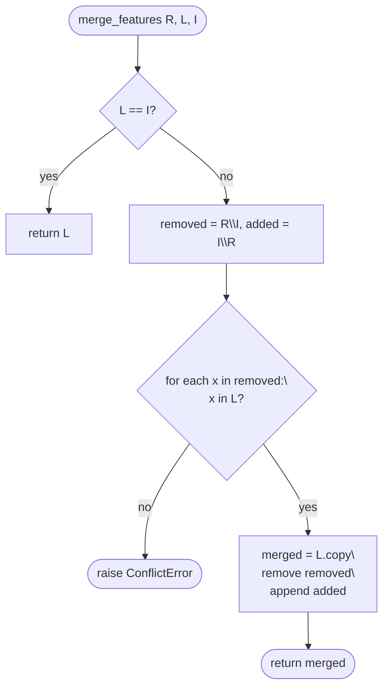

# Intégration uMap — Phase 6 : Algorithmes et transformations de données

> **Statut :** Phase 6 sur 13 · Investigation en lecture seule · S'appuie sur la [Phase 5](phase-5-runtime-walkthroughs.md)  
> **Objectif :** Comprendre où vit la vraie réflexion algorithmique — entrées, branches, cas limites, et pourquoi le code est structuré ainsi

---

## Comment lire cette phase

La Phase 5 a suivi le **flux de contrôle**. La Phase 6 zoome sur les **transformations** : ce qui change, comment, et ce qui peut mal tourner.

Chaque section :

1. Énonce le **problème**
2. Montre **entrées → étapes → sorties** (agnostique du langage d'abord, puis correspondance fichiers)
3. Signale les **branches et cas limites**
4. Note **pourquoi** l'implémentation a cette forme

Preuve : **OBSERVÉ** = depuis le code/tests ; **INFÉRENCE** = intention de conception.

---

## Carte des domaines algorithmiques

| Domaine | Emplacement | Quand ça s'exécute |
|---|---|---|
| Fusion de features à trois voies | `umap/utils.py` → `merge_features` | Conflit de sauvegarde de couche (chemin HTTP 412) |
| Normalisation d'import | `formatter.js` | Import, parse de récupération distante |
| Sérialisation de sauvegarde | `data/layer.js` → `umapGeoJSON` | Chaque sauvegarde de couche |
| Résolution de style | `data/layer.js` → `getProperty` | Rendu, popups, prévisualisation d'export |
| Règles conditionnelles | `rules.js` + `data/fields.js` | Style par feature |
| Classification de type de couche | `data/types.js` | Choropleth, Categorized, Circles, Cluster, Heat |
| Inférence de champs | `data/layer.js` → `inferFields` | Nouvelles features importées/dessinées |
| Construction de l'arborescence de couches | `utils.py` → `layers_tree` | Bootstrap serveur |
| Validation d'URL proxy | `utils.py` → `validate_url` | Requêtes proxy Ajax |
| Filtres du navigateur de données | `filters.js` | Filtrage UI (client uniquement) |

---

## 1. Fusion de features à trois voies (`merge_features`)

### Problème

Deux éditeurs sauvegardent la même couche en concurrence. Le client envoie du GeoJSON basé sur la **version de référence R**. Le fichier courant du serveur est **dernier L**. L'upload est **entrant I**. Comment combiner sans perdre l'intention de chaque partie ?

### Algorithme OBSERVÉ

```text
function merge_features(reference, latest, incoming):
  if latest == incoming:
    return latest                    // fast path: no server change since client loaded

  removed = features in reference not in incoming   // client deleted these
  added   = features in incoming not in reference // client added these

  for item in removed:
    if item not in latest:
      raise ConflictError            // someone else already removed/changed it

  merged = copy(latest)
  for item in removed:
    merged.remove(item)              // apply client deletions
  for item in added:
    merged.append(item)              // apply client additions

  return merged
```

**Détail critique :** L'égalité est l'**égalité de dictionnaire feature entier** (`==` Python), pas un diff basé sur les ID. Les tests utilisent des listes simples comme `["A","B"]` et des dicts de type GeoJSON.

### Décisions de branchement

| Cas | Résultat |
|---|---|
| `latest == incoming` | Retourner `latest` inchangé |
| Feature supprimée par le client encore dans `latest` | Supprimer du fusionné |
| Feature supprimée par le client **pas** dans `latest` | **ConflictError** (412) — un autre éditeur l'a déjà modifiée |
| Nouvelles features ajoutées par le client | Ajouter au fusionné |
| Même feature « modifiée » des deux côtés (présente dans la référence, différente dans latest et incoming) | **ConflictError** — traité comme ambiguïté remove+add |

**OBSERVÉ** depuis `umap/tests/test_merge_features.py` :

- Ajout + suppression en une édition fonctionne : `reference [A,B]`, `latest [A,C]`, `incoming [A,B,D]` → `[A,C,D]`
- L'ordre des features dans `latest` est préservé ; les nouveaux éléments s'ajoutent à la fin
- Si la référence n'a pas d'ID mais latest/incoming ont des ID différents → **ConflictError** (`test_merge_with_ids_raises`)

### Pourquoi structuré ainsi

**INFÉRENCE :** C'est une **fusion par diff d'ensembles**, pas une fusion OT au niveau des champs. C'est simple et rapide pour les éditions « ajouter/supprimer des features » mais **ne peut pas fusionner deux modifications de la géométrie/propriétés de la même feature**. Ce cas lève 412 et force l'utilisateur à choisir (le client affiche `AlertConflict`).

**À comparer à :** fusion Git sur les lignes — la fusion uMap est plus proche d'une **fusion par identité de feature en tant que blobs opaques**.



### Connexion Python

`DataLayerUpdate.post()` dans `umap/views.py` charge R depuis le fichier de version, L depuis le fichier courant, I depuis l'upload, appelle `merge_features`, remplace l'upload en cas de succès.

---

## 2. Normalisation d'import (`Formatter`)

### Problème

Les utilisateurs collent/téléchargent GPX, KML, CSV, XML OSM, GeoRSS ou GeoJSON. L'éditeur a besoin d'une **`FeatureCollection`** uniforme avec des propriétés compatibles uMap.

### Pipeline

```text
raw string
  → parse(format) switch
  → adapter (togeojson / osm2geojson / csv2geojson / JSON.parse)
  → optional cleanup
  → FeatureCollection
  → DataLayer.makeFeatures → Point | LineString | Polygon instances
```

### Transformations par format (OBSERVÉ)

| Format | Étapes clés |
|---|---|
| **geojson** | `JSON.parse` — pas de normalisation |
| **gpx** | `togeojson.gpx` ; copier `desc` → `description` ; supprimer les clés `_` et les propriétés de type objet |
| **kml** | `togeojson.kml` avec `skipNullGeometry: true` |
| **osm** | `osm2geojson` avec `flatProperties: true` ; séparer `properties.id` en `osm_type`, `osm_id` |
| **georss** | `GeoRSSToGeoJSON.parse` |
| **csv** | `csv2geojson` délimiteur auto ; virgule décimale européenne ; si pas de lat/lon, scanner les colonnes `geom`, `geometry`, `wkt`, `geojson` et parser via JSON ou WKT **betterknown** |

### Cas limite CSV (important)

Si `csv2geojson` produit `geometry: null` pour toutes les lignes :

1. Essayer les colonnes de géométrie embarquées
2. Si toujours null → **erreur** : *"No geo column found: must be either lat/lon or geom(etry)"*
3. CSV vide (≤2 lignes) → log debug uniquement, pas d'alerte

### Après parse : `makeFeatures`

**OBSERVÉ** (`data/layer.js`) :

1. Normaliser en tableau de features
2. `Utils.sortFeatures(collection, sortKey, lang)` — tri stable pour l'ordre d'affichage
3. `GeometryCollection` → diviser en plusieurs features partageant les propriétés
4. `MultiPoint` en mode édition → alerte d'erreur ; sinon traité par type de géométrie
5. `inferFields(feature)` pour chaque nouvelle feature — ajoute les types de colonnes au schéma de couche

### Export (`stringify`)

Adaptateurs symétriques : GeoJSON, GPX (ajouter `desc`), KML, CSV (ajouter colonnes Lat/Lon, supprimer `_umap_options`), colonne WKT via betterknown.

**INFÉRENCE :** L'import/export est délibérément **avec perte pour les clés internes uMap** (`_umap_options` supprimé à l'export CSV) — l'aller-retour peut perdre le style sauf s'il est stocké dans les propriétés normales.

---

## 3. Sérialisation de sauvegarde (`umapGeoJSON`)

### Problème

Persister l'état d'une couche dans un seul fichier GeoJSON que le serveur peut stocker et re-servir.

### Forme OBSERVÉE

```javascript
umapGeoJSON() {
  features = isRemoteLayer ? [] : all features
  return {
    type: 'FeatureCollection',
    features: features.map(f => f.toJournal()),  // { type, geometry, properties, id }
    properties: layer.properties,              // remoteData, type, rules, fields…
    id: layer.id,
    rank: layer.rank,
    parent: parentId,
  }
}
```

**Décisions clés :**

- **Les couches distantes sauvegardent `features[]` vide** — la géométrie vit à l'URL, pas sur disque
- **`toJournal()`** = `toGeoJSON()` + `id` de la feature (UUID client)
- Métadonnées de couche dupliquées : JSON `settings` en base **et** clés de premier niveau dans le fichier (compatibilité historique)

### Séparation rendu vs sauvegarde

| Méthode | Rôle |
|---|---|
| `umapGeoJSON()` | Persistance — propriétés brutes, pas de styles résolus |
| `toRenderer()` | Affichage carte — inclut `style` calculé par feature, filtre les features vides/filtrées |

**Commentaire OBSERVÉ :** *« `style`. Never saved (cf umapGeoJSON, the save format). »*

**INFÉRENCE :** La classification (couleurs choropleth) est **recalculée au chargement** via `compute()`, pas stockée par feature dans le fichier — sauf si encodée dans `_umap_options` sur les features.

---

## 4. Cascade de résolution de style (`getProperty`)

### Problème

La couleur/icône/épaisseur visible d'une feature peut venir de nombreuses sources : math de type de couche, règles, défauts de couche, groupe parent, défauts de carte, surcharges au niveau feature.

### Ordre de résolution OBSERVÉ (`DataLayer.getProperty`)

```text
function getProperty(key, feature):
  if computed[feature.id][key] exists:     // Choropleth/Categorized/Circles output
    return it

  if feature:
    value = rules.getOption(key, feature) // first matching conditional rule
    if value defined: return it

  if layer owns key in settings:
    return layer value

  if layer.Type.defaults[key]:
    return default

  return parent.getProperty(key, feature) // parent group or App
```

**`Feature.getOption`** remonte : `_umap_options` de la feature → datalayer → app.

**`Feature.getDynamicOption`** exécute en plus `greedyTemplate` pour la substitution `{variable}` dans les chaînes de style ; résultat invalide retombe sur la valeur par défaut du schéma.

### Pourquoi cet ordre

**INFÉRENCE :**

1. **Les types de couche calculés** gagnent — ce sont des visualisations pilotées par les données
2. **Les règles** surchargent les paramètres statiques de couche pour les features correspondantes
3. **L'héritage** correspond au modèle mental utilisateur (carte → groupe → couche → feature)

```mermaid
flowchart TD
    Q[getProperty key, feature] --> C{computed[id][key]?}
    C -->|yes| R1[return computed]
    C -->|no| RU{rules match?}
    RU -->|yes| R2[return rule property]
    RU -->|no| LO{layer own property?}
    LO -->|yes| R3[return layer]
    LO -->|no| TD{Type default?}
    TD -->|yes| R4[return default]
    TD -->|no| R5[parent.getProperty]
```

---

## 5. Règles de style conditionnelles (`rules.js`)

### Problème

Appliquer des styles quand `population>10000`, `name=`, `status!=true`, etc. La première correspondance gagne (selon la FAQ).

### Parsing de règle (`Rule.parse`)

**OBSERVÉ :**

1. Scanner la chaîne de condition pour les opérateurs dans l'ordre : `>`, `<`, `!=`, `=` (aussi HTML `&lt;` pour `<`)
2. Diviser en `[field, expected]`
3. Résoudre `field` via le registre `Fields` de la couche (typé) ou champ ad hoc `String`
4. Lier la méthode d'opérateur : `gt`, `lt`, `not_equal`, `equal` sur la classe de champ
5. **Expected vide** (`mycolumn=`) : les vérifications de cast testent null/undefined/'' 
6. **Comparaison numérique sur champ non-Number** : coercition avec `parseFloat` pour `>`/`<`

### Correspondance (`Rule.match`)

```text
match(props):
  if no operator or inactive or no field: return false
  return operator(expected, cast(props[field.key]))
```

### Application (`Rules.getOption`)

```text
for rule in rules in order:
  if rule.match(feature.properties):
    if rule.properties[key] is schema-valid:
      return value
// else undefined → fall through cascade
```

**Cas limites :**

- Règles inactives (`active=false`) ignorées
- Réordonnancement par glisser-déposer met à jour l'ordre du tableau `rules` → journal `properties.rules`
- Même propriété dans plusieurs règles : **la première correspondance gagne** (documenté dans la FAQ)

**À comparer à :** cascade CSS avec `@rules` ordonnées explicites — pas de scores de spécificité, juste l'ordre de la liste.

---

## 6. Classification choropleth (`types.js` → `Choropleth.compute`)

### Problème

Colorier les polygones par propriété numérique (ex. population) avec des classes statistiques.

### Entrées

- Config `properties.choropleth` (clé de propriété, mode, classes, schéma brewer, classes manuelles)
- `features[]` avec `properties[key]` numérique
- Liste `fields` pour repli de clé par défaut

### Algorithme

```text
values = features.map(f => +f.properties[key])
classes = min(requested_classes, values.length)

switch mode:
  manual:     parse comma-separated breaks
  equidistant: equalIntervalBreaks(values, classes)    // simple-statistics
  jenks:      jenks(values, classes)
  quantiles:  quantile at 0, 1/n, 2/n, …, 1
  default:    ckmeans(values, classes) + max(values)   // k-means variant

thresholds = breaks.slice(1)   // first break is lower bound only
colors = colorbrewer[scheme][thresholds.length]

for each feature:
  find first threshold where value <= threshold
  assign colors[index] to feature.id in output map

build legend items from consecutive break pairs
```

### Branches / cas limites

- Pas de valeurs → `{ properties: {}, caption: null }` vide
- Schéma brewer invalide → repli `'Blues'`
- Valeurs NaN → la boucle peut ne pas assigner de couleur (la feature garde le repli de cascade)

### Pourquoi côté client

**OBSERVÉ :** S'exécute dans `DataLayer.compute()` après `addData`, avant `toRenderer()`. Re-s'exécute quand les données changent — pas d'aller-retour serveur.

**INFÉRENCE :** Approprié pour le réglage interactif ; le coût scale avec le nombre de features (tests utilisent Playwright `test_choropleth.py`).

```mermaid
flowchart TD
    Start([Choropleth.compute]) --> V[extract numeric values]
    V --> Empty{values empty?}
    Empty -->|yes| E([return empty])
    Empty -->|no| Mode{mode}
    Mode --> M[compute breaks array]
    M --> T[thresholds = breaks[1:]]
    T --> Col[assign colorbrewer colors]
    Col --> Map[for each feature:\\nfirst threshold where value <= t]
    Map --> Out([properties per feature id + caption])
```

---

## 7. Types de couche associés (plus court)

### Categorized (`Categorized.compute`)

- **Entrée :** clé de propriété chaîne
- **Catégories :** liste manuelle séparée par virgules OU valeurs uniques triées (`naturalSort`)
- **Sortie :** map `feature.id → color` depuis la palette ColorBrewer/Accent
- **Cas d'usage :** données nominales (type de POI, statut)

### Cercles proportionnels (`Circles.compute`)

- **Entrée :** propriété numérique
- **Rayon :** échelle sqrt entre `minPX` et `maxPX` (défaut 2–50px)
- **Formule (OBSERVÉ) :**

```text
radius = minPX + ((sqrt(value) - sqrt(min)) / (sqrt(max) - sqrt(min))) * (maxPX - minPX)
```

- **Pourquoi sqrt :** Perception de surface — doubler la valeur devrait ressentir comme ~1,4× le rayon, pas 2×

### Cluster (`rendering/layers/cluster.js`)

- Regroupe les marqueurs coïncidents/proches ; **spiderfy** utilise une disposition en spirale en espace pixel (`_spiderfyLatLng`)
- Recalcule sur `moveend` (changelog : correction redraw cluster)
- L'algorithme est géométrique/UI, pas statistique

### Heat (`rendering/layers/heat.js`)

- Délègue à Leaflet.heat — noyau de densité en espace écran (**UTILE PLUS TARD** pour approfondissement)

---

## 8. Inférence de champs (`inferFields`)

### Problème

Les features importées ou dessinées apportent des clés de propriétés arbitraires. L'éditeur de tableau, les règles et les filtres ont besoin d'un **schéma**.

### Algorithme OBSERVÉ (`DataLayer.inferFields`)

```text
for key in feature.properties:
  skip if key starts with '_'
  skip if value is object
  skip if any ancestor layer already has field key

  type = 'String'
  if key == 'description': type = 'Text'

  fields.add({ key, type })
```

**Non inféré :** types Number/Date depuis les valeurs — l'utilisateur peut changer dans l'éditeur de champs.

**Champs par défaut** (`getDefaultFields`) : `name` (ou `U.DEFAULT_LABEL_KEY`) + `description`.

**INFÉRENCE :** Typage conservateur évite de classer `"2024"` comme Number ; garde l'import tolérant.

---

## 9. Arborescence de couches (`layers_tree`)

### Problème

Les lignes `DataLayer` plates ont `parent_id` pour les groupes. Le client et le bootstrap ont besoin de tableaux `layers[]` **imbriqués**.

### Algorithme OBSERVÉ (`utils.py`)

```text
root = { id: { ...layer, layers: [] } for each layer }
for branch in root.values():
  if branch.parent:
    attach branch to root[parent].layers
for branch in root.copy():
  if branch.parent: delete from root  // keep only roots
  delete parent key from node
  if layers empty: delete layers key
return list(root.values())
```

**Cas limite :** Parent manquant logue une erreur, ignore l'attachement (métadonnées orphelines).

**À comparer à :** Construire une forêt depuis une liste d'adjacence — O(n) en un passage.

---

## 10. Validation du proxy Ajax (`validate_url`)

### Problème

Le serveur récupère des URL fournies par l'utilisateur. Doit bloquer le SSRF vers les réseaux internes et exiger un referer même site.

### Vérifications OBSERVÉES

1. GET uniquement ; paramètre query `url` requis
2. URLValidator (espaces → `+` pour les requêtes Overpass)
3. Le hostname de `HTTP_REFERER` doit correspondre au hostname de `SITE_URL`
4. La cible doit avoir un hostname ; pas `localhost` ; pas le même netloc que le site
5. `assert_public_ip` : résolution DNS de toutes les adresses ; rejeter les IP privées

**INFÉRENCE :** Défense en profondeur contre l'abus de proxy ouvert — pertinent si vous touchez `AjaxProxy` ou la doc données distantes.

---

## 11. Filtres du navigateur de données (`filters.js`) — client uniquement

### Problème

Filtrer les features visibles dans « Parcourir les données » sans modifier les données sauvegardées.

### OBSERVÉ

- Types de widget : MinMax, Choices, Checkbox, etc.
- `match(value)` retourne **true si la feature doit être masquée** (logique inversée dans MinMax : `min > value` → masquée)
- `feature.isFiltered()` consulté dans `toRenderer()` — features filtrées exclues du redraw carte

**Non persisté** sauf si l'utilisateur sauvegarde explicitement après des actions de filtre qui mutent les données — les filtres sont principalement un **état de vue**.

---

## Transversal : pipeline batch `addData`

Quand des features entrent dans une couche (import, fetch, chargement) :

```text
_batch = true
makeFeatures(geojson)        // create Feature objects, optional journal sync
_batch = false
dataChanged()
await compute()              // Choropleth/Categorized/Circles
mapProxy.clear(layerId)
mapProxy.addData(layerId, toRenderer())
```

**Pourquoi clear puis add :** Commentaire — *« reimporting into the same layer duplicates features »* si on ajoute.

---

## Résumé de la Phase 6

### À COMPRENDRE MAINTENANT

1. **La fusion est un diff d'ensemble au niveau feature** — modifications concurrentes de la même feature → 412, pas de fusion auto des champs
2. **L'import vise toujours une FeatureCollection** — les adaptateurs normalisent les formats externes
3. **Les chemins sauvegarde et rendu diffèrent** — `umapGeoJSON` vs `toRenderer` / `compute()`
4. **Le style = cascade ordonnée** — calculé → règles → couche → défauts → parent
5. **Règles : première correspondance, l'ordre de la liste compte**
6. **Choropleth/Circles s'exécutent côté client** dans `compute()` avec simple-statistics

### UTILE PLUS TARD

- Géométrie spiderfy cluster
- Paramètres du noyau heat
- Internes des widgets de filtre
- Moteur de variables de template (`greedyTemplate` dans `utils.js`)

### Sûr de reporter

- Math des pyramides de tuiles
- Requêtes spatiales PostGIS
- Ordonnancement websocket HLC (`journal/hlc.js`)

---

## Ce qui reste incertain

| Sujet | Statut |
|---|---|
| Si l'égalité de feature dans la fusion utilise des ID stables en GeoJSON de production | **OBSERVÉ** les tests utilisent des chaînes de géométrie ; les vraies features incluent le champ `id` — l'égalité est une correspondance de dict complet |
| Déclencheurs de recompute pour `compute()` au-delà de `addData` | **PARTIELLEMENT CONNU** — aussi sur les changements de propriétés affectant la classification (via chemins `dataChanged` / redraw) |
| Algorithmes de géométrie côté serveur | **OBSERVÉ** minimal — merge seul algorithme geo Python significatif |

---

## Ce que nous investiguons ensuite — Phase 7 : Exécuter uMap localement

La Phase 7 parcourt `docs/install.md` et les cibles `Makefile` de manière narrative :

- Configuration PostgreSQL/PostGIS
- `make develop` / `uv sync`
- settings dans `umap/settings/local.py.sample`
- ports attendus et signaux de succès
- écarts si la doc est obsolète

---

## Pause ici

Vous devriez maintenant voir **où vit la complexité** : conflits de fusion, adaptateurs d'import, cascade de style et classification — pas la couche URL Django.

**Questions avant la Phase 7 :**

- Voulez-vous une **plongée plus profonde sur merge_features** avec des exemples de fixtures GeoJSON réelles ?
- **Choropleth vs règles** — lequel correspond à votre zone de première contribution probable ?
- Prêt à **exécuter localement** (Phase 7) ?

Dites **« continuer vers la Phase 7 »** ou posez des questions.
