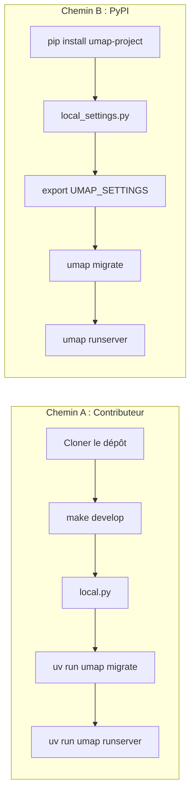

# Intégration uMap — Phase 7 : Exécuter uMap en local

> **Statut :** Phase 7 sur 13 · Investigation en lecture seule (guide d'installation, non exécuté ici) · S'appuie sur la [Phase 6](phase-6-algorithms-and-data-transformations.md)  
> **Objectif :** Savoir exactement comment démarrer une instance de développement à partir de ce checkout — prérequis, paramètres, commandes, signaux de succès, et là où la documentation officielle diverge du dépôt

---

## Comment lire cette phase

Les phases 1 à 6 étaient de l'**archéologie du code**. La phase 7 est **opérationnelle** : quoi installer, quoi configurer, quoi exécuter, et comment savoir que ça a fonctionné.

Libellés de preuve :

- **OBSERVÉ** — à partir des fichiers du dépôt (`Makefile`, `pyproject.toml`, `umap/settings/`, etc.)
- **INFÉRENCE** — déduction raisonnable à partir de la structure + des conventions Django/GeoDjango
- **INCONNU** — non vérifié sur votre machine lors de cette passe (nous avons inspecté mais n'avons pas exécuté l'installation complète)

---

## Instantané de votre machine (vérifié au moment de la rédaction)

**OBSERVÉ** sur ce Mac :

| Outil | Statut |
|---|---|
| Homebrew | `/opt/homebrew/bin/brew` ✓ |
| Python système | 3.9.6 (`/usr/bin/python3`) — **trop ancien** pour ce dépôt |
| `uv` | introuvable |
| `psql` | introuvable |
| `umap/settings/local.py` | absent |

**OBSERVÉ** le dépôt exige **Python ≥ 3.12** (`pyproject.toml` → `requires-python = ">=3.12"`). Vous aurez besoin d'une version plus récente de Python (via `uv`, `pyenv`, ou Homebrew) avant que `make develop` réussisse.

---

## Deux chemins d'installation (choisissez-en un)

| Chemin | Quand l'utiliser | Commande d'entrée |
|---|---|---|
| **A — Contributeur (ce checkout)** | Vous allez modifier uMap, lancer les tests, ouvrir des PR | `make develop` + `uv run umap …` |
| **B — Consommateur (paquet PyPI)** | Vous voulez seulement une instance en marche, pas l'arborescence git | `pip install umap-project` + `umap …` |

**INFÉRENCE :** Pour votre objectif d'intégration (contributeur OSS), utilisez le **Chemin A**. `docs/install.md` décrit le Chemin B ; `docs/contributing.md` oriente les contributeurs vers `make develop`.



---

## Chemin A — Configuration contributeur (recommandé)

### Étape 0 — Dépendances système (macOS)

**OBSERVÉ** depuis `docs/install.md` (section OS X) :

```bash
brew install postgis
```

**INFÉRENCE :** `postgis` via Homebrew installe généralement PostgreSQL. GeoDjango a aussi besoin des bibliothèques GDAL/GEOS ; la formule PostGIS satisfait habituellement ce besoin sur macOS. Si `umap migrate` échoue avec des erreurs GDAL/GEOS, consultez la [documentation d'installation GeoDjango](https://docs.djangoproject.com/en/stable/ref/contrib/gis/install/#macos).

Créer la base de données et l'extension :

```bash
# Si postgres n'est pas encore démarré :
brew services start postgresql@14   # la version peut varier — vérifiez `brew info postgis`

createuser umap --createdb || true
createdb umap -O umap
psql umap -c "CREATE EXTENSION IF NOT EXISTS postgis"
```

**Note :** Sous Linux, `docs/install.md` exige parfois un utilisateur Unix nommé `umap` pour l'authentification peer. Sur macOS avec Postgres Homebrew, votre nom d'utilisateur macOS comme propriétaire de la base convient généralement — définissez `USER` dans `DATABASES` si nécessaire.

### Étape 1 — Installer `uv` et Python 3.12+

**OBSERVÉ :** `Makefile` utilise `uv` pour toutes les commandes Python.

```bash
curl -LsSf https://astral.sh/uv/install.sh | sh
# redémarrer le shell, puis :
cd /path/to/umap
make develop
```

**Ce que fait `make develop`** (`Makefile`) :

1. `uv sync --extra dev,test,sync,s3` — installe les dépendances Python dans le venv du projet
2. `uv run playwright install` — navigateurs pour les tests d'intégration

**OBSERVÉ** les extras incluent : `dev` (lint/docs), `test` (pytest, playwright), `sync` (uvicorn, redis, websockets pour le temps réel), `s3` (backend de stockage optionnel).

Vous n'avez **pas** besoin de Playwright pour *lancer* le serveur de dev — seulement pour `make test-integration`.

### Étape 2 — Outils JavaScript (optionnel pour le premier démarrage)

**OBSERVÉ :** Les bibliothèques vendored se trouvent sous `umap/static/umap/vendors/` (commitées). `npm install` sert au **linting** (`make lint`, Biome, Mocha) et à la reconstruction des vendors (`make vendors`), pas requis pour charger la carte en dev.

```bash
npm install   # seulement si vous allez lancer make testjs ou make lint
```

### Étape 3 — Paramètres locaux

**OBSERVÉ** résolution des paramètres (`umap/settings/__init__.py`) :

1. variable d'environnement `UMAP_SETTINGS` (chemin vers un fichier `.py`), sinon
2. `/etc/umap/umap.conf`, sinon
3. `umap/settings/local.py` (ignoré par git)

**Convention contributeur :** copier l'exemple vers le chemin attendu :

```bash
cp umap/settings/local.py.sample umap/settings/local.py
```

Modifiez `umap/settings/local.py`. Modifications minimales pour une instance de dev fonctionnelle sur **http://localhost:8000** :

```python
import os
import tempfile
from pathlib import Path

# Chemins relatifs au dépôt (remplacent les chemins /srv/umap/* de l'exemple)
BASE_DIR = Path(__file__).resolve().parent.parent.parent
STATIC_ROOT = str(BASE_DIR / "var" / "static")
MEDIA_ROOT = str(BASE_DIR / "var" / "data")

SECRET_KEY = "dev-only-change-me"  # openssl rand -base64 32 pour un usage réel

DATABASES = {
    "default": {
        "ENGINE": "django.contrib.gis.db.backends.postgis",
        "NAME": "umap",
        # Ajoutez USER/HOST/PORT si votre Postgres n'utilise pas l'auth peer par défaut :
        # "USER": "your_mac_username",
    }
}

SITE_URL = "http://localhost:8000"   # doit correspondre au port de runserver
CSRF_TRUSTED_ORIGINS = ["http://localhost:8000"]

# Obligatoire depuis 3.8.0 — ABSENT de local.py.sample (voir « Lacunes doc » ci-dessous)
AJAX_PROXY_CACHE_DIR = str(BASE_DIR / "var" / "proxy-cache")

# Auth locale plus simple sans applications OAuth
ENABLE_ACCOUNT_LOGIN = True
UMAP_ALLOW_ANONYMOUS = True
SOCIAL_AUTH_REDIRECT_IS_HTTPS = False   # l'exemple a True — casse les callbacks OAuth http://

DEBUG = True
UMAP_DEMO_SITE = True
EMAIL_BACKEND = "django.core.mail.backends.console.EmailBackend"
```

Créer les répertoires inscriptibles :

```bash
mkdir -p var/static var/data var/proxy-cache
```

**INFÉRENCE :** Sans `AJAX_PROXY_CACHE_DIR`, la vérification système Django `umap.E001` échoue au démarrage (`umap/checks.py`). Les couches de données distantes et le proxy ajax ne fonctionneront pas tant que ce répertoire n'existe pas.

### Étape 4 — Initialiser la base de données

```bash
uv run umap migrate
uv run umap collectstatic --noinput
uv run umap createsuperuser    # optionnel mais utile pour /admin
uv run umap runserver 0.0.0.0:8000
```

**OBSERVÉ :** la CLI `umap` est `umap.bin:main` → fine enveloppe autour du `manage.py` Django (`umap/bin/__init__.py`). Toutes les commandes Django fonctionnent : `migrate`, `runserver`, `createsuperuser`, `shell`, etc.

**OBSERVÉ :** la migration `0003_add_tilelayer` amorce un fond de carte **Positron** par défaut s'il n'en existe aucun — vous devriez voir les tuiles sans configuration manuelle dans l'admin.

### Étape 5 — Signaux de succès

Ouvrez **http://localhost:8000/** (ou `/en/`).

| Signal | Ce que cela signifie |
|---|---|
| La page d'accueil se charge, pas de page d'erreur Django | Paramètres + connexion DB OK |
| `Loaded local config from …/local.py` dans le terminal | Fichier de paramètres pris en compte |
| L'éditeur de carte s'ouvre sur `/en/map/new` (si anonyme autorisé) | Auth + templates OK |
| Tuiles du fond de carte visibles | Seed TileLayer + fichiers statiques OK |
| Dessiner un marqueur, Ctrl+S enregistre | MEDIA_ROOT inscriptible, API datalayer OK |
| Récupération de couche distante fonctionne | `AJAX_PROXY_CACHE_DIR` inscriptible |

**Admin :** http://localhost:8000/admin/ — couches de tuiles, licences, gestion des utilisateurs.

**Barre de débogage :** **OBSERVÉ** `debug_toolbar` est ajouté à `INSTALLED_APPS` quand `DEBUG=True` (`base.py`).

---

## Chemin B — Installation PyPI (référence uniquement)

Depuis `docs/install.md` :

```bash
python -m venv venv && source venv/bin/activate
pip install umap-project
wget …/local.py.sample -O local_settings.py
export UMAP_SETTINGS=$(pwd)/local_settings.py
# éditer DATABASES, SECRET_KEY, STATIC_ROOT, MEDIA_ROOT, AJAX_PROXY_CACHE_DIR
umap migrate && umap collectstatic && umap createsuperuser
umap runserver 0.0.0.0:8000
```

**INFÉRENCE :** Le Chemin B installe la version **publiée** du paquet, pas l'arborescence de travail `3.8.1` de votre checkout. Utilisez le Chemin A pour le développement.

---

## Chemin C — Docker Compose (alternative)

**OBSERVÉ** le `docker-compose.yml` à la racine exécute :

- `postgis/postgis:14-3.3-alpine` (db)
- `redis` (collaboration temps réel)
- `umap/umap:3.6.1` (image préconstruite — **plus ancienne** que le checkout `3.8.1`)
- proxy `nginx` sur le port hôte **8000**

```bash
docker compose up
# → http://localhost:8000 (via nginx)
```

**INFÉRENCE :** Pratique pour « voir uMap tourner » sans la chaîne d'outils Python ; **pas** idéal pour modifier le JS/Python de ce checkout — il faudrait monter les sources ou construire une image locale (`docs/deploy/docker.md`).

Pour le temps réel en local sans compose complet, **OBSERVÉ** `REALTIME_ENABLED` + `REDIS_URL` dans les paramètres (`base.py`, `docker-compose.yml`).

---

## Chargement des paramètres — modèle mental

```mermaid
flowchart TD
    Start([Django démarre]) --> Base[umap/settings/base.py defaults]
    Base --> Override{Source de surcharge ?}
    Override -->|UMAP_SETTINGS env| Exec[exec file into module]
    Override -->|/etc/umap/umap.conf| Exec
    Override -->|umap/settings/local.py| Exec
    Override -->|none| EnvOnly[Variables env via django-environ]
    Exec --> Merge[Pour chaque clé UPPER : globals key = value]
    Merge --> Checks[Vérifications système Django umap.E001 proxy dir]
```



**OBSERVÉ** valeurs par défaut de `base.py` :

- `DATABASES` par défaut : `postgis://localhost:5432/umap`
- `STATIC_ROOT` par défaut : `./static` (relatif)
- `MEDIA_ROOT` par défaut : `./uploads` (relatif)
- `SECRET_KEY` par défaut : `None` (à définir dans la config locale)
- Nombreux drapeaux `UMAP_*` via variables d'environnement `django-environ`

**OBSERVÉ** `docs/config/settings.md` documente la configuration par variables d'environnement pour la production ; un fichier `.py` local convient pour le dev.

---

## Commandes Makefile que vous utiliserez vraiment

| Commande | Objectif |
|---|---|
| `make develop` | Installer toutes les dépendances Python + Playwright |
| `make install` | Dépendances Python uniquement (sans Playwright) |
| `make help` | Lister les cibles |
| `make test-unit` | `pytest umap/tests/` (exclut l'intégration) |
| `make test-integration` | Tests navigateur Playwright |
| `make testjs` | Tests unitaires Mocha dans `umap/static/umap/unittests/` |
| `make test` | Les trois suites |
| `make lint` | ESLint, djlint, isort, ruff |
| `make format` | Auto-formatage Python/templates |

**OBSERVÉ** valeurs par défaut pytest (`pyproject.toml`) :

- `DJANGO_SETTINGS_MODULE = umap.tests.settings` (pas votre `local.py`)
- `--no-migrations --reuse-db --numprocesses auto`

**OBSERVÉ** base de test (`umap/tests/settings.py`) : utilise `postgres`/`postgres` sur GitHub Actions ; localement, la base `test_umap` peut être nécessaire (voir `docs/contributing.md`).

---

## Lacunes doc et références obsolètes

| Sujet | La doc dit | Réalité du dépôt |
|---|---|---|
| Backends OAuth | `social_auth.backends.*` dans `install.md` | **OBSERVÉ** `social_core.backends.*` dans `local.py.sample` |
| Emplacement du fichier de paramètres | `local_settings.py` + `UMAP_SETTINGS` dans le cwd | **OBSERVÉ** l'exemple indique `umap/settings/local.py` ; les deux fonctionnent |
| Port de dev | `runserver 0.0.0.0:8000` dans `install.md` | **OBSERVÉ** exemple `SITE_URL = http://localhost:8019` — décalage provoque des problèmes CSRF/proxy |
| Répertoire cache proxy | Documenté dans `docs/config/settings.md` depuis 3.8.0 | **OBSERVÉ** absent de `local.py.sample` — échec au démarrage sans lui |
| Chemins STATIC/MEDIA | L'exemple utilise `/srv/umap/var/*` | Inadapté au dev macOS sans surcharge — utilisez `var/` relatif au dépôt |
| Chemin tests JS | `contributing.md` → `umap/static/test` | **OBSERVÉ** `Makefile` → `umap/static/umap/unittests/` |
| Point d'entrée frontend | `docs/dev/frontend.md` → `umap.js` / `U.Map` | **OBSERVÉ** `app.js` / `App` (Phase 4) |
| Version Python | Les classifiers mentionnent 3.11 | **OBSERVÉ** `requires-python = ">=3.12"` |
| Tag image Docker | `docker-compose.yml` → `3.6.1` | Version checkout **3.8.1** (`umap/__init__.py`) |

Quand la doc et le code divergent, **faites confiance au dépôt** et envisagez une PR doc plus tard.

---

## Modes d'échec courants

### `umap.E001: AJAX_PROXY_CACHE_DIR is not set`

Créez le répertoire, définissez-le dans `local.py`, redémarrez le serveur. **OBSERVÉ** appliqué dans `umap/checks.py`.

### Bibliothèque GDAL / GEOS introuvable

GeoDjango ne peut pas charger les libs natives. Sur macOS : assurez-vous que PostGIS est installé via Homebrew ; il peut falloir :

```bash
brew install gdal geos
```

Puis définissez les variables d'environnement si Django ne les trouve toujours pas (voir la doc GeoDjango macOS).

### `SECRET_KEY` / ImproperlyConfigured

Définissez `SECRET_KEY` dans `local.py` ou la variable d'environnement `SECRET_KEY=…`.

### CSRF ou boucles de redirection à la connexion

`SITE_URL` doit correspondre à l'URL dans votre navigateur **port inclus**. Ajoutez l'origine à `CSRF_TRUSTED_ORIGINS`. Définissez `SOCIAL_AUTH_REDIRECT_IS_HTTPS = False` pour du dev http simple.

### Carte vide / pas de tuiles

Lancez `collectstatic`. Vérifiez `/admin/` → les Tile Layers existent (la migration devrait amorcer Positron). Vérifiez l'onglet réseau du navigateur pour des 404 sur `/static/`.

### Échec d'enregistrement / erreurs de permission sur la couche

Assurez-vous que `MEDIA_ROOT` existe et est inscriptible — les fichiers GeoJSON arrivent ici via `umap.storage.fs.FSDataStorage`.

### `psql: command not found`

Installez Postgres/PostGIS via Homebrew (`brew install postgis`).

### Version Python trop ancienne

Installez 3.12+ via `uv python install 3.12` ou `brew install python@3.12`. N'utilisez pas le Python système macOS 3.9 pour ce projet.

---

## Checklist minimale « première heure »

Séquence orientée copier-coller pour **ce Mac + ce dépôt** :

```bash
# 1. Système
brew install postgis
brew services start postgresql@14    # ajuster la version si nécessaire
createuser umap --createdb 2>/dev/null || true
createdb umap -O umap 2>/dev/null || true
psql umap -c "CREATE EXTENSION IF NOT EXISTS postgis"

# 2. Chaîne d'outils Python
curl -LsSf https://astral.sh/uv/install.sh | sh
cd ~/Documents/ChatGPT/umap
make install    # ignorer playwright au premier passage : make install pas develop

# 3. Paramètres
cp umap/settings/local.py.sample umap/settings/local.py
# → éditer selon « Étape 3 » ci-dessus (SITE_URL, chemins, AJAX_PROXY_CACHE_DIR)
mkdir -p var/static var/data var/proxy-cache

# 4. Démarrage
uv run umap migrate
uv run umap collectstatic --noinput
uv run umap createsuperuser
uv run umap runserver 0.0.0.0:8000
```

Puis ouvrez http://localhost:8000/en/ et créez une carte de test.

---

## Ce que l'exécution locale débloque (Phases 8–9)

| Phase | Vous pouvez maintenant… |
|---|---|
| **8 — DevTools** | Poser des points d'arrêt dans l'onglet Réseau sur les enregistrements `datalayer/`, observer le bootstrap `map_settings` |
| **9 — Expérience d'apprentissage** | Changer une petite chose (ex. zoom par défaut), vérifier le comportement |
| **12 — Tests** | `make test-unit` avec la base `test_umap` |

**INFÉRENCE :** Tant que la Phase 7 n'a pas réussi, les Phases 8–12 restent théoriques.

---

## Résumé de la Phase 7

### À COMPRENDRE MAINTENANT

1. **Les contributeurs utilisent `uv` + `make develop`**, pas `pip install` depuis PyPI
2. **Les paramètres** se chargent depuis `umap/settings/local.py` (ou `UMAP_SETTINGS`)
3. **`AJAX_PROXY_CACHE_DIR` est obligatoire** depuis 3.8.0
4. **`SITE_URL` doit correspondre à l'URL de votre navigateur** (port inclus)
5. **Le GeoJSON vit sous `MEDIA_ROOT`** ; Postgres contient métadonnées/permissions
6. **La CLI `umap` = gestion Django** — mêmes commandes que sur d'autres projets Django

### UTILE PLUS TARD

- Docker compose pour temps réel + redis
- `UMAP_SETTINGS` pointant hors du dépôt (schéma de déploiement)
- `make test-integration` + `PWDEBUG=1` pour le débogage Playwright

### Peut attendre

- Charts Helm, ASGI/nginx production
- Backend de stockage S3 (extra `[s3]` de `pyproject.toml`)
- Enregistrement de fournisseurs OAuth (utilisez d'abord la connexion Django)

---

## Ce que nous investiguerons ensuite — Phase 8 : Relier le navigateur au code

La Phase 8 parcourt les workflows DevTools sur votre instance en marche :

- Lire `U.SETTINGS` / `U.MAP` dans la console
- Tracer un enregistrement dans l'onglet Réseau jusqu'à `DataLayerUpdate`
- Observer le chargement paresseux des couches (`GET datalayer/…`)
- Source maps et où poser des points d'arrêt dans `app.js` / `data/layer.js`

---

## Pause ici

La Phase 7 est une **recette**, pas quelque chose que nous avons exécuté de bout en bout dans cette session (votre machine a encore besoin de `uv`, Postgres, et `local.py`).

**Questions avant la Phase 8 :**

- Voulez-vous **parcourir l'installation ensemble** étape par étape sur votre Mac (j'exécute les commandes avec vous) ?
- Préférez-vous **Docker** à Postgres/Python natif ?
- Un **blocage** suite à une tentative d'installation partielle ?

Dites **« continuer vers la Phase 8 »** une fois que vous avez une instance en marche, ou demandez de l'aide pratique pour la configuration.
