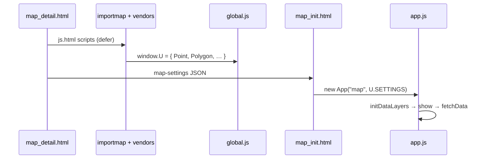

# Intégration uMap — Phase 8 : Relier le comportement du navigateur au code

> **Statut :** Phase 8 sur 13 · Investigation en lecture seule · Suppose la [Phase 7](phase-7-run-locally.md) (ou umap.org public)  
> **Objectif :** Utiliser les DevTools du navigateur pour observer l'état d'exécution d'uMap et relier les signaux Réseau/DOM/Console aux fichiers et fonctions exacts

---

## Comment lire cette phase

La Phase 5 a tracé les chemins de code sur papier. La Phase 8 fait la même chose **dans un navigateur en marche** — la compétence que vous utiliserez quotidiennement en tant que contributeur.

Chaque exercice :

1. **Vous faites** quelque chose dans l'interface
2. **DevTools affiche** un signal (Réseau, Console, DOM, point d'arrêt)
3. **Nous relions** ce signal au code

Libellés de preuve : **OBSERVÉ** / **INFÉRENCE** / **INCONNU**.

**Prérequis :** Une instance uMap en marche (`http://localhost:8000` depuis la Phase 7, ou toute carte publique que vous pouvez éditer). Les DevTools Chrome ou Firefox conviennent ; les exemples utilisent la nomenclature Chrome.

---

## Configuration DevTools (une minute)

1. Ouvrez une page de carte, ex. `/en/map/my-map_42` ou créez une nouvelle carte.
2. **F12** (ou Cmd+Option+I sur Mac) → ancrez DevTools sur le côté.
3. Activez **Preserve log** dans l'onglet Réseau (les requêtes survivent à la navigation).
4. Console → icône engrenage → activez **« Log XMLHttpRequests »** (optionnel ; l'onglet Réseau est prioritaire).
5. Sources → ouvrez `umap/js/modules/app.js` via l'arborescence de la page (pas de bundler — les fichiers se chargent en modules ES).

**OBSERVÉ :** Le JS applicatif **n'est pas bundlé**. Les modules se chargent depuis `/static/umap/js/modules/*.js` via `import` + importmap (`umap/templates/umap/js.html`). Vous pouvez poser des points d'arrêt dans les fichiers source originaux.

**OBSERVÉ :** **Pas de source maps** pour le code applicatif uMap (seulement certaines libs vendored comme Leaflet). Les numéros de ligne dans DevTools correspondent directement aux fichiers du dépôt.

---

## Anatomie du démarrage de page

### Ce que le serveur envoie

**OBSERVÉ** `map_detail.html` → inclut `map_init.html` :

```html
<div id="map"></div>
<script id="map-settings" data-settings="…escaped JSON…"></script>
<script type="module">
  import App from '/static/umap/js/modules/app.js'
  U.SETTINGS = JSON.parse(document.getElementById('map-settings').dataset.settings)
  U.MAP = new App("map", U.SETTINGS)
</script>
```

La charge utile de bootstrap est du **JSON de type GeoJSON construit côté serveur** (`map_settings` depuis `MapDetailMixin` / `views.py`), pas un appel API séparé.

### Ordre de chargement des scripts (simplifié)



**OBSERVÉ** `global.js` n'expose que des helpers géométriques sur `window.U`. L'instance de carte est assignée dans `map_init.html` comme **`U.MAP`**, pas à l'intérieur de `global.js`.

### Test de fumée console

Une fois la carte chargée :

```javascript
// Bootstrap
U.MAP                    // instance App
U.SETTINGS               // même objet passé au constructeur (jusqu'à mutation par App)
U.MAP.dataloaded         // true quand les couches visibles ont fini de charger
U.MAP.id                 // pk de la carte (undefined sur une carte neuve non enregistrée)
U.MAP.properties.urls    // toutes les routes Django nommées pour le client

// Santé rapide
U.MAP.layers.tree.length
U.MAP.isDirty            // false jusqu'à édition
U.MAP.editEnabled        // false jusqu'au mode édition
```

**INFÉRENCE :** Les tests d'intégration Playwright attendent `U.MAP.dataloaded === true` (`umap/tests/integration/conftest.py`) — utilisez le même signal manuellement.

### Lire le bootstrap sans `U.SETTINGS`

Onglet Éléments → `#map-settings` → attribut `data-settings`, ou Console :

```javascript
JSON.parse(document.getElementById('map-settings').dataset.settings)
```

**Ce qu'il faut remarquer dans ce JSON :**

| Clé | Signification |
|---|---|
| `properties.datalayers[]` | **Métadonnées** de couche uniquement (uuid, nom, paramètres) — généralement **pas de features** |
| `properties.urls` | Modèles d'URI depuis `_urls_for_js()` (`umap/utils.py`) |
| `properties.permissions` | Pouvez-vous éditer ? anonyme ? |
| `geometry.coordinates` | Centre de la carte `[lng, lat]` |
| `properties.websocketEnabled` | Temps réel disponible sur cette instance |

**OBSERVÉ :** Les features sont **chargées paresseusement** par couche via `GET /datalayer/{map_id}/{uuid}/`, pas dans le HTML initial.

---

## Signaux DOM ↔ code

| DOM / CSS | Code |
|---|---|
| `<body class="umap-edit-enabled">` | `App.enableEdit()` ajoute la classe (`app.js`) |
| `#map` | Conteneur Leaflet/OpenLayers ; id d'élément du constructeur `App` |
| `.umap-ui-container` | Superpositions attachées par `mapProxy.attachUI` |
| `.edit-save` visible | Mode édition + état dirty (CSS dans `bar.css`) |
| Spinner de chargement | `Loader` écoute les événements `dataloading` de `server`/`request` |

**Exercice :** Basculez le mode édition → observez le changement de classe `<body>` dans Éléments → corrèle avec `enableEdit()` / `disableEdit()`.

---

## Exercice 1 — Ouvrir une carte existante (chemin lecture)

### Action interface

Ouvrez une URL de carte enregistrée (pas `/map/new`).

### Onglet Réseau

1. Filtre : `datalayer`
2. Vous devriez voir des requêtes **GET** comme :

   `/en/datalayer/42/a1b2c3d4-…-uuid/`

   Paramètre anti-cache optionnel si vous avez la permission d'édition : `?1736…` (**OBSERVÉ** `_dataUrl()` dans `data/layer.js`).

3. Cliquez une requête → **Headers** :

   | En-tête | Signification |
   |---|---|
   | `Content-Type: application/geo+json` | Octets bruts FeatureCollection |
   | `X-Datalayer-Version` | Jeton de version fichier serveur pour détection de conflit |

4. Aperçu **Response** : GeoJSON `FeatureCollection` avec `features[]`, `properties` de premier niveau (paramètres de couche), `id`, `rank`.

### Chemin de code

```text
App.initDataLayers()
  → createDataLayer(spec)     // métadonnées du bootstrap
  → datalayer.show()          // si displayOnLoad / règles de visibilité
    → fetchData()             // si createdOnServer && not loaded
      → server.get(_dataUrl())
      → fromUmapGeoJSON(geojson)
```

**Suggestion de point d'arrêt :** `data/layer.js` → `fetchData` ligne avec `await this.app.server.get`.

**Console après chargement :**

```javascript
const layer = U.MAP.layers.tree[0]
layer.id                    // chaîne uuid
layer.isLoaded()            // true
layer.referenceVersion      // correspond à X-Datalayer-Version du Réseau
layer.features.count()      // nombre de features
```

---

## Exercice 2 — Entrer en mode édition

### Action interface

Cliquez le crayon / contrôle « Enable editing ».

### Signaux

| Signal | Attendu |
|---|---|
| `<body class="… umap-edit-enabled">` | Interface d'édition visible |
| Console | Peut afficher `You go Leaflet` au premier chargement ; import journal dynamique |
| Réseau | Possible `GET …/websocket-auth-token/` si temps réel activé |

### Chemin de code

```text
enableEdit()
  → initJournal()           // import dynamique journal/engine.js
  → editEnabled = true
  → mapProxy.enableEdit()
```

**Point d'arrêt :** `app.js` → `enableEdit`.

**Console :**

```javascript
U.MAP.editEnabled           // true
U.MAP.journal               // proxy journal existe
U.MAP.hasEditMode()         // vérification permission depuis bootstrap
```

**OBSERVÉ :** `disableEdit()` refuse de quitter si `isDirty` — essayez de basculer hors édition après une modification.

---

## Exercice 3 — Dessiner un marqueur (chemin édition client)

### Action interface

En mode édition : ajoutez une couche (si besoin) → outil dessin → placez un marqueur.

### Signaux

| Signal | Où |
|---|---|
| Événements draw Leaflet | Internes à `Leaflet.Editable` / `rendering/leaflet.js` |
| `U.MAP.isDirty` | `true` après commit |
| Bouton Enregistrer activé | `.edit-save` dans le DOM |

### Chemin de code (résumé Phase 5)

```text
draw:marker
  → U.Editable.createMarker
  → feature:commit
  → journal.upsert / journal.update
  → undoManager marks dirty
```

**Inspection console :**

```javascript
U.MAP.isDirty
const f = U.MAP.layers.tree.find(l => !l.group)?.features.all()[0]
f?.toGeoJSON()              // géométrie [lng, lat], properties
f?.properties
```

**Candidats points d'arrêt :**

- `data/features.js` — commit feature
- `journal/engine.js` — `upsert` / `update`
- `rendering/leaflet.js` — gestionnaires `onCommit`

**INFÉRENCE :** Rien n'atteint le serveur avant **Enregistrer** — les éditions restent côté client en mémoire + journal jusqu'à `saveAll()`.

---

## Exercice 4 — Enregistrer (chemin écriture)

### Action interface

**Ctrl+S** (ou Cmd+S) ou cliquez Enregistrer.

### Onglet Réseau (filtre : `datalayer` ou `map`)

Séquence typique pour une carte dirty avec une couche éditée :

| # | Méthode | Motif de chemin | Corps |
|---|---|---|---|
| 1 | POST | `/en/map/edit/{id}/` ou création carte | `settings`, `center`, `name`, … |
| 2 | POST | `/en/map/{id}/datalayer/{uuid}/update/` | `multipart/form-data` |

**OBSERVÉ** piège de nommage dans `urls.js` :

```javascript
datalayer_save({ created: true })  // → datalayer_update (couche déjà sur le serveur)
datalayer_save({ created: false }) // → datalayer_create
```

### Détails de requête à inspecter

**POST enregistrement couche** (`DataLayer.save()`) :

| Partie | Contenu |
|---|---|
| Champ formulaire `geojson` | Blob : FeatureCollection `umapGeoJSON()` |
| Champ formulaire `settings` | Chaîne JSON des propriétés de couche |
| En-tête `X-CSRFToken` | Depuis cookie `csrftoken` (`request.js`) |
| En-tête `X-Datalayer-Reference` | `referenceVersion` précédente du dernier GET/POST |
| En-tête `X-Requested-With` | `XMLHttpRequest` |

**Réponse succès :**

- Métadonnées JSON (pas geojson complet sauf fusion)
- En-tête `X-Datalayer-Version` — nouveau jeton de version

**Conflit :**

- Statut **412** → `AlertConflict` → enregistrement forcé optionnel (`data/layer.js` `_trySave`)
- Correspond à `merge_features()` côté serveur (`umap/utils.py`, Phase 6)

### Chemin de code

```text
Ctrl+S shortcut → saveAll()
  → journal.save()
    → _getDirtyObjects()
    → saveOne(app) / saveOne(datalayer)  // parents d'abord
      → app.save()        // POST métadonnées carte
      → datalayer.save()  // POST multipart couche
  → fire('saved')
```

**Points d'arrêt :**

1. `app.js` → `saveAll`
2. `journal/engine.js` → `save` / `saveOne`
3. `data/layer.js` → `save` / `_trySave`
4. Serveur : `umap/views.py` → `DataLayerUpdate.post`

**Console après enregistrement réussi :**

```javascript
U.MAP.isDirty              // false
U.MAP.layers.tree[0].referenceVersion  // mis à jour
```

### Surveiller les problèmes CSRF

Si POST retourne **403** :

- Vérifiez que le cookie `csrftoken` existe (Django `ensure_csrf_cookie` sur la vue carte)
- Vérifiez que `SITE_URL` / `CSRF_TRUSTED_ORIGINS` correspondent à l'origine du navigateur (Phase 7)

---

## Exercice 5 — Couche de données distante / proxifiée

### Action interface

Ajoutez une couche avec URL de **données distantes** (ou déplacez la carte avec couche distante dynamique).

### Onglet Réseau

| Requête | Quand |
|---|---|
| URL externe directement | `remoteData.proxy` est false |
| `/en/ajax-proxy/{ttl}/?url=…` | `remoteData.proxy` est true |
| `GET datalayer/…` | Se produit toujours pour l'enveloppe de couche ; **features peuvent être vides** dans le fichier enregistré |

**OBSERVÉ** `fetchRemoteData()` (`data/layer.js`) :

```text
renderUrl(remoteData.url)     // substitution bbox
→ proxyUrl if proxy enabled
→ formatter.parse(raw, format)
→ fromGeoJSON
```

**Point d'arrêt :** `data/layer.js` → `fetchRemoteData`.

**Serveur :** `umap/views.py` → `AjaxProxy` (valide le referer, bloque les IP privées — Phase 6).

---

## Registre d'URL côté client

Le bootstrap inclut `properties.urls` — un dict noms de routes Django → modèles d'URI.

**Console :**

```javascript
U.MAP.urls.get('datalayer_view', { map_id: U.MAP.id, pk: U.MAP.layers.tree[0].id })
U.MAP.urls.get('datalayer_save', { map_id: U.MAP.id, pk: '…', created: true })
```

**OBSERVÉ** construit côté serveur par `_urls_for_js()` (`umap/utils.py`) depuis `umap.urls` (+ routes sync si `REALTIME_ENABLED`).

**INFÉRENCE :** Quand un enregistrement retourne 404, comparez l'URL Réseau à la sortie de `urls.get(...)` — souvent un décalage de préfixe `map_id` / locale.

---

## Bus d'événements (console avancée)

`App` étend `WithEvents`. Utile pour tracer sans points d'arrêt :

```javascript
// Journaliser chaque changement de datalayer
U.MAP.on('datalayer:changed', () => console.log('datalayer:changed'))

// Une fois quand toutes les données de couches visibles sont chargées
U.MAP.once('dataloaded', () => console.log('dataloaded'))

// Après enregistrement
U.MAP.on('saved', () => console.log('saved'))
```

**OBSERVÉ** événements incluent : `datalayersloaded`, `dataloaded`, `datalayer:changed`, `edit:enabled`, `edit:disabled`, `saved`, `feature:endedit`.

---

## Carte des points d'arrêt (antisèche contributeur)

| Symptôme | Premier point d'arrêt |
|---|---|
| La carte ne démarre pas | `app.js` → `init` |
| Liste de couches vide | `app.js` → `initDataLayers` |
| La couche ne charge jamais la géométrie | `data/layer.js` → `show` / `fetchData` |
| Le dessin ne persiste pas | `journal/engine.js` → `upsert` |
| Enregistrement sans effet | `app.js` → `saveAll` ; vérifiez `isDirty` |
| Enregistrement 412 | `data/layer.js` → `_trySave` |
| Échec import distant | `formatter.js` → `parse` |
| Style incorrect | `data/layer.js` → `getProperty` |
| Choroplèthe incorrect | `data/types.js` → `Choropleth.compute` |

### Expérience OpenLayers

**OBSERVÉ :** le paramètre de requête `?openlayers` bascule le moteur de rendu (`app.js` init) — la console affiche `So you wanna run OL`. Utile pour le travail sur la migration Leaflet → OpenLayers.

---

## Playwright ↔ DevTools (comment les mainteneurs déboguent)

Les tests d'intégration utilisent les mêmes globaux `U.MAP` :

```bash
PWDEBUG=1 uv run pytest --headed -n1 -k test_name umap/tests/integration/
```

**OBSERVÉ** depuis `docs/contributing.md` : l'inspecteur Playwright = pas à pas avec navigateur live ; mêmes outils Réseau/Console.

**INFÉRENCE :** Quand un test d'intégration CI échoue, reproduisez localement avec `PWDEBUG=1` et les mêmes points d'arrêt ci-dessus.

---

## Antisèche filtres Réseau

| Filtre | Trouve |
|---|---|
| `datalayer` | GET/POST/versions de couche |
| `map/edit` | Enregistrement métadonnées carte |
| `ajax-proxy` | Récupération distante proxifiée |
| `websocket` | Sync temps réel (si activé) |
| `geojson` | Endpoint export carte |
| `static/umap/js` | Chargements de modules (404 debug) |

---

## Erreurs DevTools courantes

| Erreur | Correction |
|---|---|
| Chercher `U.Map` | **OBSERVÉ** c'est `U.MAP` (MAP en majuscules) |
| Attendre des features dans `#map-settings` | Métadonnées seulement ; surveillez GET `datalayer` |
| Pas de POST au dessin | Enregistrements explicites ; vérifiez `isDirty` |
| Point d'arrêt jamais atteint | Rechargement forcé ; vérifiez l'URL module correcte sous Sources |
| `U.SETTINGS.datalayers[0].features` | Peut être absent jusqu'à la fin du fetch — utilisez `layer.features` |
| Erreurs CORS sur couche distante | Utilisez le toggle proxy ou le chemin ajax-proxy |

---

## Résumé de la Phase 8

### À COMPRENDRE MAINTENANT

1. **`U.MAP` est l'instance `App` live** — commencez chaque investigation Console là
2. **JSON bootstrap ≠ géométrie de couche** — `GET datalayer/{map_id}/{uuid}/` paresseux
3. **Les éditions restent locales jusqu'à Enregistrer** — `journal` suit l'état dirty ; `saveAll` → `journal.save`
4. **Les en-têtes Réseau portent le versionnement** — `X-Datalayer-Version` / `X-Datalayer-Reference`
5. **`datalayer_save({ created: true })` signifie UPDATE** — nommage inversé
6. **Les modules ES se chargent non bundlés** — points d'arrêt directement dans `umap/static/umap/js/modules/`

### UTILE PLUS TARD

- Messages WebSocket dans Réseau → onglet WS (`journal/engine.js`)
- Pas à pas Playwright `PWDEBUG`
- Bascule moteur `?openlayers`

### Peut attendre

- Noms d'événements internes Leaflet
- Fusion websocket HLC (`journal/hlc.js`)
- Panneau SQL Django Debug Toolbar

---

## Ce que nous investiguerons ensuite — Phase 9 : Une expérience d'apprentissage contrôlée

La Phase 9 choisit **un petit changement réversible** (avec votre accord) pour boucler la boucle :

- Hypothèse → emplacement code → modification → vérification navigateur → revert ou branche

Exemples : ajuster le zoom par défaut, changer une chaîne de traduction, ajouter un console.log derrière un drapeau.

**Toujours en lecture seule jusqu'à ce que vous approuviez explicitement l'expérimentation.**

---

## Pause ici

Vous devriez maintenant pouvoir **partir des DevTools** et atterrir dans le bon fichier en un ou deux sauts.

**Questions avant la Phase 9 :**

- Voulez-vous une **session guidée live** sur une carte (vous partagez ce que vous voyez dans Réseau) ?
- Quelle expérience vous intéresse : **interface**, **import**, **enregistrement/conflit**, ou **style** ?
- Votre **instance locale tourne-t-elle** déjà ?

Dites **« continuer vers la Phase 9 »** quand vous êtes prêt pour un premier changement contrôlé, ou demandez de l'aide DevTools sur un comportement précis.
