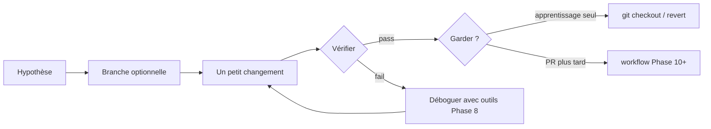

# Intégration uMap — Phase 9 : Une expérience d'apprentissage contrôlée

> **Statut :** Phase 9 sur 13 · **Première phase pouvant toucher le code** (seulement avec votre accord explicite) · S'appuie sur la [Phase 8](phase-8-connect-browser-to-code.md)  
> **Objectif :** Boucler la boucle — hypothèse → petit changement → vérification → revert — sans prétendre avoir déjà contribué

---

## Comment lire cette phase

Les phases 1 à 8 étaient **observer et comprendre**. La phase 9 est **une répétition sûre** de la boucle contributeur :

1. Branche (optionnel mais recommandé)
2. Changez **une seule chose**
3. Vérifiez avec **test automatisé ou navigateur**
4. Revenez en arrière ou gardez sur une branche jetable

Ce document **ne fait pas** les changements pour vous. Il propose **trois expériences classées** et un script complet pour celle recommandée. Dites quelle expérience vous voulez quand vous êtes prêt à exécuter.

Libellés de preuve : **OBSERVÉ** / **INFÉRENCE** / **INCONNU**.

---

## Règles pour cette phase

| Règle | Pourquoi |
|---|---|
| **Un sujet par expérience** | Les diffs multi-fichiers masquent ce que vous avez appris |
| **Réversible en &lt; 30 secondes** | `git checkout -- file` ou supprimer la modification `local.py` |
| **Pas de refactors opportunistes** | Ce n'est pas le moment de corriger des problèmes sans lien |
| **Pas de commit/push/PR sauf demande** | Intégration ≠ contribution encore |
| **Ne pas éditer le code vendored** | `umap/static/umap/vendors/` est tiers |
| **Préférer les tests aux chemins production** | Quand Postgres n'est pas encore configuré |



---

## Choisissez votre expérience

| # | Expérience | Serveur local requis ? | Postgres requis ? | Touche fichiers suivis git ? | Enseigne |
|---|---|---|---|---|---|
| **A** | Zoom par défaut via `local.py` | Oui | Oui (migrate une fois) | **Non** (`local.py` ignoré par git) | Paramètres serveur → JSON bootstrap → `U.MAP` |
| **B** | Ajouter un test unitaire Mocha | Non | Non | **Oui** (`unittests/URLs.js`) | Boucle tests JS, helper URL visible à chaque enregistrement |
| **C** | `console.debug` temporaire à l'enregistrement | Oui | Oui | **Oui** (`app.js` ou `journal/engine.js`) | Pipeline d'enregistrement live dans DevTools |

**Recommandation :**

- **Pas encore d'uMap local ?** → Commencez par **l'expérience B** (`npm install` + `make testjs` seulement).
- **Serveur en marche ?** → Faites **A** puis **C** en une session (chaîne config, puis trace runtime).
- **Réalisme OSS maximal ?** → **B** sur une branche nommée `onboarding/experiment-b`.

---

## Expérience A — Zoom par défaut (config → navigateur)

### Hypothèse

**INFÉRENCE :** Changer `LEAFLET_ZOOM` dans les paramètres locaux modifie le zoom initial sur `/en/map/new` parce que `MapNew` l'intègre dans le JSON bootstrap.

**OBSERVÉ** code serveur (`umap/views.py`, `MapNew.get_geojson`) :

```python
"zoom": getattr(settings, "LEAFLET_ZOOM", 6),
```

Le centre vient de `LEAFLET_LATITUDE` / `LEAFLET_LONGITUDE` via `DEFAULT_CENTER` dans `umap/forms.py`.

### Étapes

1. Dans `umap/settings/local.py` (depuis la Phase 7), définissez :

   ```python
   LEAFLET_ZOOM = 10
   LEAFLET_LATITUDE = 48.85   # Paris — choisissez votre ville
   LEAFLET_LONGITUDE = 2.35
   ```

2. Redémarrez `uv run umap runserver …`.

3. Ouvrez **http://localhost:8000/en/map/new** (rechargement forcé).

### Vérifier

**Console :**

```javascript
U.SETTINGS.properties.zoom        // attendu 10
U.SETTINGS.geometry.coordinates   // attendu [2.35, 48.85] (lng, lat)
U.MAP.mapProxy.zoom               // devrait correspondre après rendu carte
```

**Réseau :** Pas d'appel API supplémentaire — la valeur est dans le HTML `#map-settings` (Phase 8).

### Revenir en arrière

Supprimez ou commentez ces trois lignes dans `local.py` ; redémarrez le serveur.

### Ce que vous avez appris

Paramètres serveur `settings` → vue Django `get_geojson()` → JSON template `map_settings` → `U.SETTINGS` → vue Leaflet. **Aucun changement JavaScript requis** pour les valeurs par défaut à l'échelle de l'instance.

---

## Expérience B — Ajouter un test unitaire (recommandé sans DB)

### Hypothèse

La méthode `URLs.has()` signale correctement si un nom de route existe dans le dict d'URL bootstrap — helper utilisé avant de construire les URL d'enregistrement/récupération.

### Pourquoi ce fichier

**OBSERVÉ :** `umap/static/umap/unittests/URLs.js` teste déjà le nommage `datalayer_save` (piège Phase 6/8). L'étendre enseigne la **boucle de test la plus légère** du dépôt.

### Prérequis

```bash
cd /path/to/umap
npm install          # une fois
make testjs          # baseline : tous les tests verts
```

### Étapes

1. Créez une branche (recommandé) :

   ```bash
   git checkout -b onboarding/experiment-b
   ```

2. Modifiez `umap/static/umap/unittests/URLs.js` — ajoutez dans le bloc `describe('URLs')` de premier niveau :

   ```javascript
   describe('has()', () => {
     it('returns true when the url name exists', () => {
       expect(urls.has('map_create')).to.be.true
     })

     it('returns false for unknown url names', () => {
       expect(urls.has('not_a_route')).to.be.false
     })
   })
   ```

3. Lancez :

   ```bash
   make testjs
   # ou : node_modules/mocha/bin/mocha.js umap/static/umap/unittests/
   ```

### Vérifier

- Mocha signale **2 nouveaux tests passants**.
- Si `has()` n'existait pas, les tests échoueraient — vérifiez `umap/static/umap/js/modules/urls.js` (`has(urlName)` est **OBSERVÉ** aux lignes 8–10).

### Revenir en arrière

```bash
git checkout -- umap/static/umap/unittests/URLs.js
# ou restez sur la branche et supprimez-la plus tard
```

### Extension (optionnel)

Ajoutez un test affirmant que `datalayer_save({ created: true })` cible le nom de route **update** — documentez dans un commentaire *pourquoi* `created: true` signifie update (Phase 6). N'ouvrez pas de PR encore sauf si vous comptez contribuer docs/tests pour de vrai.

### Ce que vous avez appris

- Les tests JS tournent avec **Mocha + Chai**, pas Jest.
- `make testjs` est le contrat du projet avant de toucher code URL/routage.
- De petits ajouts de tests sont des premières contributions valides.

---

## Expérience C — Tracer l'enregistrement dans DevTools (debug temporaire)

### Hypothèse

Quand vous appuyez sur **Ctrl+S**, `saveAll()` s'exécute seulement si `isDirty`, puis `journal.save()` itère les objets dirty.

**OBSERVÉ** (`app.js`) :

```javascript
async saveAll() {
  if (!this.isDirty) return
  const status = await this.journal.save()
  // ...
}
```

### Étapes

1. Branche :

   ```bash
   git checkout -b onboarding/experiment-c
   ```

2. Ajoutez **une** ligne de debug dans `umap/static/umap/js/modules/journal/engine.js` à l'intérieur de `async save()`, avant `_getDirtyObjects()` :

   ```javascript
   console.debug('[onboarding] journal.save()', {
     dirty: this._getDirtyObjects().size,
     mapId: this.app.id,
   })
   ```

   **Note :** Appelez `_getDirtyObjects()` une fois ici pour le log seulement ; le vrai `save()` l'appelle à nouveau — acceptable pour une trace jetable.

3. Rechargement forcé de la page carte (les modules ES mettent agressivement en cache).

4. Ouvrez carte → activez édition → dessinez un marqueur → **Ctrl+S**.

### Vérifier

| Signal | Attendu |
|---|---|
| Console | `[onboarding] journal.save()` avec `dirty >= 1` |
| Réseau | POST mise à jour carte + mise à jour datalayer (Phase 8) |
| Console après enregistrement | `U.MAP.isDirty === false` |

5. Éditez à nouveau **sans** enregistrer → `saveAll` devrait encore logger au prochain Ctrl+S.

6. Chargez la carte, **sans édition** → Ctrl+S → **pas de log** (retour anticipé dans `saveAll`).

### Revenir en arrière

```bash
git checkout -- umap/static/umap/js/modules/journal/engine.js
```

### Ce que vous avez appris

Le suivi dirty est **côté client** jusqu'à l'enregistrement ; le journal est le gardien des objets qui POSTent.

---

## Feuille de travail expérience (copiez pour vos notes)

```markdown
## Mon expérience Phase 9

- **Choix :** A / B / C
- **Hypothèse :**
- **Fichiers touchés :**
- **Commandes exécutées :**
- **Résultat vérification :** pass / fail
- **Surprise (ce que je n'attendais pas) :**
- **Revert effectué :** oui / non (nom de branche)
```

---

## Ce qu'il NE faut PAS faire comme « première expérience »

| Idée tentante | Pourquoi attendre |
|---|---|
| Corriger l'absence de `AJAX_PROXY_CACHE_DIR` dans `local.py.sample` | Bonne **vraie** PR, mais touche doc déploiement + exemple — à faire en Phase 10+ avec tests |
| Refactoriser `saveAll` / journal | Forte portée ; nécessite tests d'intégration |
| Mettre à jour un vendor (Leaflet, Turf) | `make vendors` + énorme diff |
| Changer l'algorithme de fusion | Nécessite tests Python + fixtures de conflit |
| Éditer `en.json` juste pour le plaisir | Les traductions passent par Transifex (`docs/contributing.md`) |
| Lancer `make test` complet sans DB | Les tests d'intégration nécessitent Postgres + Playwright |

---

## Si la vérification échoue

Utilisez le playbook Phase 8 :

| Échec | Vérifier |
|---|---|
| Commande `make testjs` introuvable | `npm install` d'abord |
| Test échoue sur `has()` | Lisez `urls.js` — signature de méthode changée ? |
| Pas de log console à l'enregistrement | Mode édition activé ? `isDirty` ? Rechargement forcé ? Bon chemin de fichier ? |
| Zoom inchangé après A | Django redémarré ? Bon `local.py` chargé ? (terminal affiche `Loaded local config from`) |
| POST 403 sur C | CSRF / `SITE_URL` (Phase 7) |

---

## Lien avec une vraie contribution

Cette phase **n'est délibérément pas une PR**. Vous avez :

- Lu le code (Phases 1–6)
- Tracé l'exécution (Phases 5, 8)
- Touché la chaîne d'outils (Phase 9)

Une vraie contribution ajoute :

- Issue ou accord mainteneur sur le périmètre
- Tests conformes au style du projet
- `make lint` / CI vert
- Workflow fork/upstream (Phase 11)

**INFÉRENCE :** L'expérience B est la plus proche d'un artefact fusionnable ; les expériences A et C sont **apprentissage seul** (A est ignoré par git ; C doit être revertée).

---

## Résumé de la Phase 9

### À COMPRENDRE MAINTENANT

1. **Vérifiez avant de croire** — navigateur ou runner de tests, pas la lecture seule du code
2. **Un changement, une hypothèse** — écrivez-la
3. **`local.py` vs fichiers suivis** — les expériences config ne pratiquent pas git ; les tests unitaires oui
4. **Revert = succès** — vous avez prouvé le lien causal
5. **Chemin enregistrement :** `isDirty` → `journal.save()` → `.save()` par objet (Phase 8)

### UTILE PLUS TARD

- Combiner B + correction doc dans une PR (PRs séparées par compétence)
- `PWDEBUG=1` pour observer le même enregistrement dans Playwright

### Peut attendre

- Ouvrir votre première issue GitHub
- `make test-integration` tant que Postgres + Playwright ne sont pas installés

---

## Ce que nous investiguerons ensuite — Phase 10 : Culture d'ingénierie

La Phase 10 couvre ce à quoi les mainteneurs uMap s'attendent :

- Normes PR (`docs/contributing.md`)
- Lint/format (`make lint`, Biome, ruff)
- Quand ajouter tests Python vs JS vs Playwright
- Transifex vs chaînes dans le dépôt
- Lire le changelog et le rythme de release

---

## Pause ici — à vous de jouer

La Phase 9 est un **menu**, pas un changement de code automatique.

**Répondez par l'une des options :**

1. **`run experiment B`** — j'appliquerai le test unitaire avec vous (dépendances minimales)
2. **`run experiment A` ou `C`** — suppose votre serveur local de la Phase 7 en marche
3. **`continuer vers la Phase 10`** — rester en lecture seule pour culture/docs
4. **Votre propre micro-idée** — je vérifierai le périmètre avant que vous éditiez

Tant que vous ne choisissez pas, le dépôt reste inchangé.
