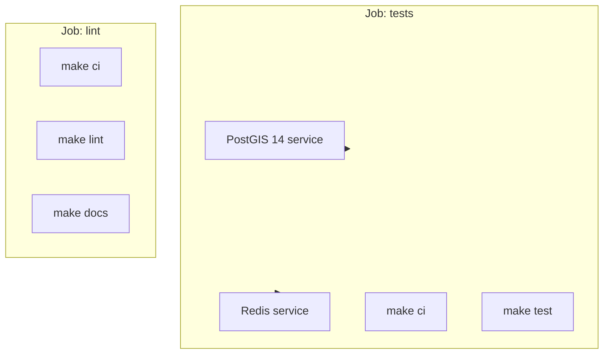
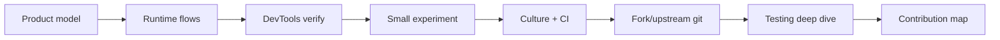

# uMap Onboarding — Phase 10: Engineering Culture

> **Status:** Phase 10 of 13 · Read-only investigation · Builds on [Phase 9](phase-9-controlled-learning-experiment.md)  
> **Goal:** Understand how uMap maintainers expect work to look — before you fork, branch, or open a PR

---

## How to read this phase

You know the product (Phases 1–3), the code (4–6), runtime (5, 8), and local setup (7). Phase 10 is **social and procedural**: how contributions are shaped, reviewed, tested, and released.

Evidence: **OBSERVED** from repo/docs/CI; **INFERENCE** from maintainer patterns; **UNKNOWN** where not verified.

---

## uMap is bigger than pull requests

**OBSERVED** `docs/contributing.md` lists four contribution areas:

| Area | Entry point | Good first step |
|---|---|---|
| **Translation** | [Transifex](https://www.transifex.com/openstreetmap/umap/) | Fix one UI string in your language |
| **Bug triage** | [GitHub Issues](https://github.com/umap-project/umap/issues) | Reproduce + comment on an open bug |
| **Documentation** | `docs/`, `docs-users/` | Fix stale `frontend.md` (`umap.js` references) |
| **Code** | This repo | Bugfix + test, or small enhancement with issue buy-in |

**INFERENCE:** Answering forum questions or confirming a bug report is legitimate OSS participation — not a “lesser” path to a first merge.

**Community channels** (from `README.md`):

- Matrix: [#umap:matrix.org](https://matrix.to/#/#umap:matrix.org)
- Forum: [forum.openstreetmap.fr — uMap](https://forum.openstreetmap.fr/c/utiliser/umap/29)
- Mailing list: [lists.openstreetmap.org/umap](https://lists.openstreetmap.org/listinfo/umap)

---

## License: AGPLv3 matters

**OBSERVED** `LICENSE` — **GNU Affero General Public License v3**.

**INFERENCE for contributors:**

- Network-facing changes (the Django app) stay under AGPL obligations if you distribute or run as a service.
- Vendored libs in `umap/static/umap/vendors/` have their own licenses.
- Historical note: project switched from WTFPL to AGPLv3 for sponsor/OSI compliance (`docs/changelog.md`, ~#1605).

You do not need to be a license expert to contribute, but **do not strip license headers** or assume MIT-style permissiveness.

---

## Issue culture: reproduce or it may be ignored

**OBSERVED** bug template (`.github/ISSUE_TEMPLATE/bug_report.md`) is blunt:

> **⚠️ VERY IMPORTANT! Your issue will probably be ignored without that link**

Required for bugs:

1. **Link to a map** (public, or minimal repro map)
2. **Steps to reproduce** on that map
3. Browser/OS/screenshots as needed

**INFERENCE:** Maintainers optimize for **reproducibility**, not feature wishlists without context. For enhancements, use the feature template — describe problem, proposed solution, alternatives.

**Good bug report shape:**

```markdown
## Map
https://umap.org/en/map/…

## Steps
1. Open map in edit mode (Chrome 130, macOS)
2. Add remote layer with proxy enabled, URL …
3. Pan west past …

## Expected
Layer reloads with new features

## Actual
Console: … Network: 412 on …/datalayer/update/…
```

Tie reports to **Phase 8 skills** (Network tab, `U.MAP` console state).

---

## Pull request norms

### What docs say

**OBSERVED** `docs/contributing.md`:

- `make develop` before hacking
- Work on a **branch**, open a PR for review
- **One maintainer approval** required to merge
- **Be patient** — review latency is normal

### What git history shows

**OBSERVED** recent commits on `master`:

| Pattern | Example |
|---|---|
| `fix:` prefix | `fix: fix race in tableeditor when editing from a cell (#3481)` |
| `chore:` prefix | `chore: bump ruff from 0.15.22 to 0.16.4 (#3478)` |
| Dependabot PRs | `chore: bump social-auth-core … (#3477)` |
| PR number in merge | `(#3481)` on squash/merge commits |

**INFERENCE:** Use **lowercase conventional prefixes** (`fix:`, `chore:`, `feat:` if adding feature). Keep subject line imperative and specific. Body should explain **why** for non-obvious changes.

### PR size and scope

**INFERENCE** from project shape (large JS surface, Playwright suite):

| PR type | Maintainer-friendly |
|---|---|
| Single bug + test | ✅ Ideal first code PR |
| Docs fix with evidence | ✅ Very welcome |
| Dependency bump (Dependabot) | ✅ Automated |
| Refactor + behavior change | ⚠️ Needs strong justification |
| “While I was here” cleanup | ❌ Split out |

**OBSERVED** Phase 4 note: `.github/workflows/` in this tree runs **test-docs** on push/PR — not a separate giant matrix file, but `make test` + `make lint` + `make docs` in CI.

---

## CI: what runs before merge

**OBSERVED** `.github/workflows/test-docs.yml`:



| Step | Command | What it covers |
|---|---|---|
| Install | `make ci` | `uv sync` + Playwright chromium-headless-shell |
| Test | `make test` | Python unit + integration + `make testjs` |
| Lint | `make lint` | ESLint, djlint, isort, ruff format check |
| Docs | `make docs` | MkDocs build must succeed |

**Matrix:** Python **3.12** and **3.14** on Ubuntu.

**Env in CI:** `UMAP_SETTINGS=umap/tests/settings.py`, Redis on localhost, `PLAYWRIGHT_TIMEOUT=20000`.

**UNKNOWN / quirk:** Workflow `pull_request` trigger uses `path:` (singular) not `paths:` — may limit when CI runs on PRs. **INFERENCE:** Run `make test` and `make lint` locally before pushing; do not rely only on green GitHub UI without verifying.

---

## Toolchain: format before you argue

### One command to rule style checks

```bash
make lint    # check
make format  # auto-fix Python templates + much JS workflow
```

**OBSERVED** `Makefile` breakdown:

| Tool | Target | Files |
|---|---|---|
| **ruff format** | Python | `umap/` (line length 88, py310 target) |
| **isort** | Python imports | black profile |
| **djlint** | Django templates | `umap/templates/` |
| **ESLint** | JS compat | `umap/static/umap/js/` (via `npx eslint`) |
| **Biome** | JS format/lint | `make pretty` → `umap/static/umap/js/` |

**OBSERVED** `biome.json`: 2-space indent, single quotes, line width **88** (matches ruff), semicolons `asNeeded`.

**OBSERVED** `docs/contributing.md`: format JS with Biome; **newline at end of file**.

**INFERENCE:** EditorConfig-style habit — trailing newline avoids noisy diffs.

### Python style in practice

**OBSERVED** test files: plain pytest functions, minimal comments, descriptive `test_*` names (`test_merge_features.py`).

**OBSERVED** `pyproject.toml`: Django 6.x in dev extra while runtime dep is `Django>=5.1` — dev/CI may run newer Django than minimum supported.

---

## Testing mental model (preview of Phase 12)

Three suites — **OBSERVED** `Makefile` + `docs/contributing.md`:

| Suite | Command | Location | Needs |
|---|---|---|---|
| **Python unit** | `make test-unit` | `umap/tests/` (not `integration/`) | PostGIS `test_umap` DB |
| **Integration** | `make test-integration` | `umap/tests/integration/` | Postgres + Playwright + Redis |
| **JS unit** | `make testjs` | `umap/static/umap/unittests/` | `npm install` only |

### When to add which test

| You changed… | Prefer |
|---|---|
| `umap/utils.py` algorithm | Python unit (`test_merge_features.py` style) |
| Django view / form / model | Python unit (`test_datalayer_views.py`, `test_map_views.py`) |
| Client save/draw/UI flow | Playwright (`test_save.py`, `test_edit_marker.py`) |
| Pure JS helper (`urls.js`, `rules.js`) | Mocha in `unittests/` |
| Template HTML structure | Often Playwright; sometimes djlint only |

**OBSERVED** integration test example (`test_save.py`): records network requests during undo/save to assert **only datalayer POST** fires — tests real browser behavior, not mocks.

**OBSERVED** pytest defaults: parallel workers (`--numprocesses auto`), `--reuse-db`, `--no-migrations`. On Mac peer-auth Postgres, use `pytest -n 0` per contributing docs.

**Debug integration:**

```bash
PWDEBUG=1 uv run pytest --headed -n1 -k test_save umap/tests/integration/
```

---

## Internationalization (i18n)

### Runtime

**OBSERVED** client strings use `translate('English source string')` (`i18n.js`). Locale files: `umap/static/umap/locale/{lang}.js` and `.json`.

Server loads locale script in `js.html` when `locale` is set in template context.

### Contribution path

**OBSERVED** `docs/contributing.md`:

- **Translations:** Transifex — not direct PRs to `en.json` for production locales
- **Maintainers pulling translations:** `tx pull -f` → `make compilemessages`

**INFERENCE for your first PRs:**

- **Do** add new `translate('…')` keys in English source JS when adding UI
- **Do not** bulk-edit `fr.json` / `de.json` unless doing a maintainer-coordinated Transifex sync
- User-facing docs in `docs-users/` (French tutorials are substantive per Phase 4)

---

## Dependencies and vendoring

**OBSERVED** `docs/dev/dependencies.md`:

| Stack | Pinning | Updates |
|---|---|---|
| **Python** | Pinned in `pyproject.toml` | Dependabot weekly (`chore:` PRs) |
| **npm** | `^` semver ranges | Manual; not Dependabot in observed config |
| **Browser libs** | Copied to `vendors/` | `scripts/vendorsjs.sh` + `make vendors` |

**INFERENCE:** Adding a new JS library is **non-trivial** (package.json + vendors script + importmap in `js.html`). Prefer using existing deps (Turf, simple-statistics, togeojson, etc.).

---

## Versioning and releases

**OBSERVED:**

- Version in `umap/__init__.py` → `VERSION = "3.8.1"`
- `make version` → `uv run hatch version`
- `make patch` / `make minor` → hatch bump
- `docs/changelog.md` — release notes with PR credits (`* fix … by @user in #1234`)
- Docker image tags in `docker-compose.yml` often **lag** checkout version (Phase 7)

**INFERENCE:** Contributors rarely cut releases; maintainers bump version + changelog. Your PR may appear in next changelog line after merge.

---

## Documentation culture

| Doc | Audience | Trust level |
|---|---|---|
| `docs/install.md` | Self-hosters | Mostly accurate; some stale OAuth naming |
| `docs/contributing.md` | Contributors | Accurate; JS test path wrong (`static/test` vs `unittests/`) |
| `docs/dev/frontend.md` | Hackers | **Stale** (`umap.js`, `U.Map`) — verify against `app.js` |
| `docs/changelog.md` | Everyone | Good for “what changed recently” |
| `docs-users/fr/` | End users | Real tutorials |

**INFERENCE:** **Docs fixes are valued** and low-risk first PRs — especially when tied to code you verified (Phases 4–8). Run `make docs` before submitting doc-only changes.

---

## Communication and review etiquette

**INFERENCE** from issue templates + contributing tone:

| Do | Avoid |
|---|---|
| Link maps and reproduction steps | “It doesn’t work” without URL |
| Mention browser + uMap version | Assuming maintainer has your local DB state |
| Keep PR description short with test plan | Force-push without comment |
| Respond to review comments | Disappear for weeks mid-review |
| Split unrelated changes | Mix refactor + feature + i18n sync |

**OBSERVED:** Merging requires **one** maintainer — not consensus of many. Review may be thorough or light depending on risk.

**Funding context** (`README.md`): NLnet / NGI — project has sponsored development; still volunteer-driven review queue.

---

## Good first PR archetypes (ranked)

| Rank | PR type | Why |
|---|---|---|
| 1 | **Doc fix** with file:line evidence | Low risk, helps everyone |
| 2 | **Bug fix + pytest** | Shows you read code + test culture |
| 3 | **Mocha test** for pure JS helper | No Postgres (Phase 9 Experiment B) |
| 4 | **Issue triage** comment with repro | Zero code; builds reputation |
| 5 | **Transifex** translation | No git; user-visible impact |

| Defer | Why |
|---|---|
| OpenLayers migration internals | Active large refactor (3.8.x changelog) |
| Merge algorithm changes | Needs careful unit + integration coverage |
| New npm dependency | Vendoring ceremony |
| `local.py.sample` + settings docs together | Good PR but touch multiple concerns — still valid with clear description |

---

## Pre-PR checklist (copy before opening)

```markdown
## Scope
- [ ] One logical change (or explained split)
- [ ] Issue linked (or maintainer agreed in issue/forum)

## Quality
- [ ] `make lint` (or `make format` then `make lint`)
- [ ] `make test-unit` at minimum; integration if UI touched
- [ ] `make testjs` if JS modules changed
- [ ] `make docs` if docs touched

## Description
- [ ] What / why / how to test
- [ ] Screenshots or map URL if visual

## i18n
- [ ] New UI strings use translate()
- [ ] Did NOT edit non-English locale files (unless Transifex sync)
```

---

## How culture connects to your onboarding arc



Phase 10 is the bridge between **learning** (Phases 1–9) and **doing for real** (Phases 11–13).

---

## Phase 10 summary

### MUST UNDERSTAND NOW

1. **Reproducible bugs** — map URL + steps, or issue may be ignored
2. **CI ≈ `make test` + `make lint` + `make docs`** on Python 3.12/3.14
3. **Three test layers** — pytest unit, Playwright integration, Mocha JS
4. **Biome + ruff + djlint + ESLint** — run `make lint` before PR
5. **Translations via Transifex** — English `translate()` in code, not random locale JSON edits
6. **One maintainer merge** — patient, focused PRs win
7. **AGPLv3** — network copyleft project

### USEFUL LATER

- `PWDEBUG=1` for failing Playwright tests
- `make changelog` (maintainer release notes helper)
- Matrix/forum for design questions before coding

### Safe to defer

- Helm/Docker release pipelines
- `tx push` / Transifex maintainer workflow
- Hatch `make publish` to PyPI

---

## What remains uncertain

| Topic | Status |
|---|---|
| Whether PR CI always runs (workflow `path:` typo) | **UNKNOWN** — run checks locally |
| Informal style guide beyond tooling | **INFERENCE** from commits — no `CONTRIBUTING` style doc |
| Required CLA | **OBSERVED** none in repo — AGPL + GitHub fork flow only |

---

## What we investigate next — Phase 11: OSS Git Workflow

Phase 11 is **mandatory** before your first real PR:

- Fork `umap-project/umap` vs work on clone
- `upstream` remote, fetch, rebase vs merge
- Branch naming, force-push etiquette
- Opening PR with `gh pr create`
- Staying synced with `master`

---

## Pause here

You should know **what “done” looks like** to maintainers: small diff, tests, lint green, repro steps, patience.

**Questions before Phase 11:**

- Want a **first PR idea shortlist** matched to your skills (React background → which uMap areas)?
- Curious about **AGPL** implications for self-hosting only?
- Ready to **`continue to Phase 11`** (git workflow)?

Say **"continue to Phase 11"** or ask questions.
