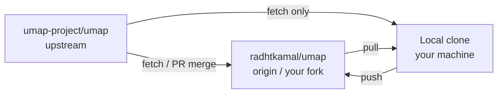
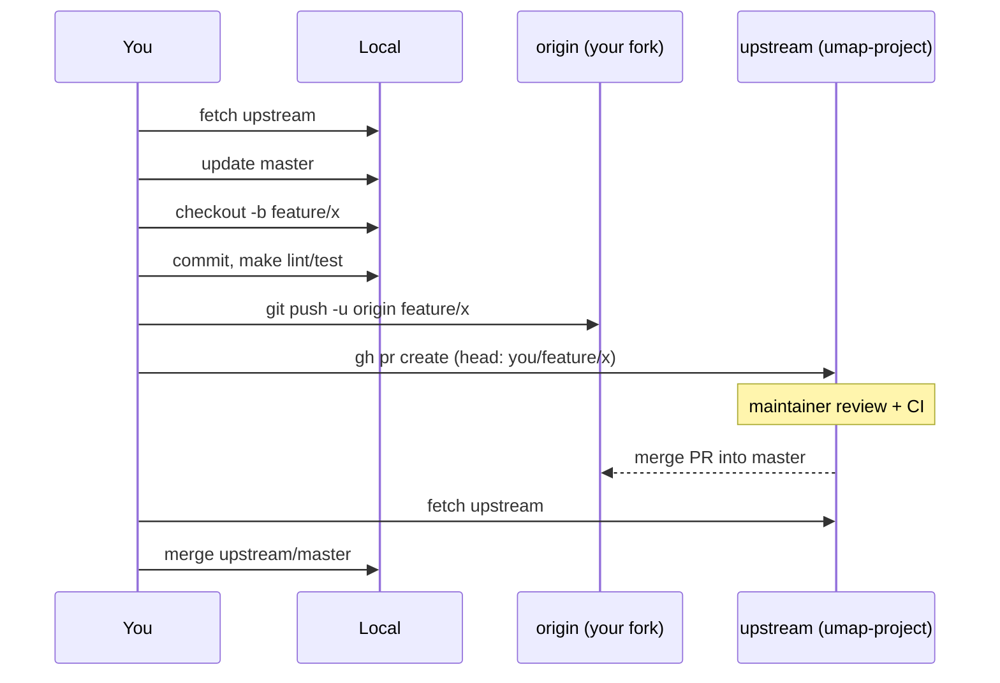

# uMap Onboarding — Phase 11: OSS Git Workflow

> **Status:** Phase 11 of 13 · Read-only investigation · **Mandatory before your first real PR** · Builds on [Phase 10](phase-10-engineering-culture.md)  
> **Goal:** Work like an external contributor — fork, sync with upstream, branch, push, open PR — without git surprises

---

## How to read this phase

Phase 10 described **what maintainers expect**. Phase 11 describes **how you deliver it** using Git and GitHub.

This phase uses **your actual clone** where possible, plus the standard uMap upstream layout.

Evidence: **OBSERVED** / **INFERENCE** / **UNKNOWN**.

---

## Your clone today (OBSERVED)

Checked on this machine:

```text
origin   https://github.com/radhtkamal/umap.git      (your fork)
upstream https://github.com/umap-project/umap.git   (official repo)
branch   master  →  tracks origin/master
HEAD     1047364d  chore: try to fix flaky tests in CI
untracked onboarding/   (your learning notes — not in upstream)
```

**Good news:** Fork + `upstream` remote are **already configured** — you skip the “first-time fork setup” steps below.

**Note:** uMap’s default branch is **`master`**, not `main` (**OBSERVED** `origin/HEAD → origin/master`, CI triggers on `master`).

---

## Mental model: three repos, two remotes



| Remote | Read | Push | Purpose |
|---|---|---|---|
| **upstream** | ✅ | ❌ never | Canonical code; open PRs **from your fork into** this |
| **origin** | ✅ | ✅ | Your GitHub fork; hosts branches you push |
| **local** | — | — | Where you commit |

**INFERENCE:** Treat `upstream` as read-only sacred history. All your writes go to `origin` on feature branches.

---

## One-time setup (if you did not have remotes)

Skip if your `git remote -v` already matches the table above.

### 1. Fork on GitHub

GitHub → [umap-project/umap](https://github.com/umap-project/umap) → **Fork** → creates `YOUR_USER/umap`.

### 2. Clone your fork

```bash
git clone https://github.com/YOUR_USER/umap.git
cd umap
```

### 3. Add upstream

```bash
git remote add upstream https://github.com/umap-project/umap.git
git fetch upstream
```

### 4. Track the right default branch

```bash
git checkout master
git branch -u origin/master
```

---

## Daily sync: stay current before you branch

**INFERENCE:** Start each work session (or at least each new branch) from fresh `upstream/master`.

```bash
cd /path/to/umap

# 1. Fetch latest from official repo (no merge yet)
git fetch upstream

# 2. Update local master from upstream
git checkout master
git merge upstream/master
# Alternative (linear history): git rebase upstream/master

# 3. Push updated master to YOUR fork (keeps origin in sync)
git push origin master
```

### Merge vs rebase onto upstream

| Approach | Command on `master` | History | When |
|---|---|---|---|
| **Merge** | `git merge upstream/master` | Merge commit OK | Simple, safe default |
| **Rebase** | `git rebase upstream/master` | Linear | You prefer clean log on personal fork |

**For feature branches**, rebasing onto latest `upstream/master` before PR is common:

```bash
git checkout my-feature-branch
git fetch upstream
git rebase upstream/master
git push --force-with-lease origin my-feature-branch
```

Use **`--force-with-lease`**, not bare `--force` — aborts if someone else pushed to your branch.

---

## Feature branch workflow (the contributor loop)

### 1. Branch from updated master

```bash
git checkout master
git merge upstream/master   # or rebase
git checkout -b fix/ajax-proxy-cache-sample
```

### Branch naming (INFERENCE — not enforced, but readable)

| Pattern | Example |
|---|---|
| `fix/short-description` | `fix/local-py-sample-proxy-dir` |
| `feat/short-description` | `feat/datalayer-version-header-test` |
| `docs/short-description` | `docs/frontend-app-entry` |
| `onboarding/...` | Personal learning only — **don’t open PR** unless intentional |

### 2. Make commits (atomic)

**OBSERVED** upstream commit style: `fix: …`, `chore: …` with optional `(#PR)`.

```bash
# After each logical slice:
git add path/to/changed/files
git commit -m "$(cat <<'EOF'
fix: document AJAX_PROXY_CACHE_DIR in local.py.sample

Sample settings omitted mandatory proxy cache dir since 3.8.0,
causing umap.E001 on first local boot.

EOF
)"
```

**Rules (from Phase 10 + git hygiene):**

- One concern per commit when possible
- Message explains **why**
- Do not commit `umap/settings/local.py` (gitignored secrets/local paths)
- Do not commit `var/`, `.env`, credentials

### 3. Run checks locally

```bash
make lint
make test-unit          # minimum before most PRs
# make testjs           # if JS changed
# make test-integration # if UI/integration paths changed
```

### 4. Push branch to your fork

```bash
git push -u origin fix/ajax-proxy-cache-sample
```

### 5. Open pull request (target: umap-project/umap)

**Using GitHub CLI** (`gh`):

```bash
# Ensure gh is authenticated: gh auth status

gh pr create \
  --repo umap-project/umap \
  --head YOUR_GITHUB_USER:fix/ajax-proxy-cache-sample \
  --base master \
  --title "fix: document AJAX_PROXY_CACHE_DIR in local.py.sample" \
  --body "$(cat <<'EOF'
## Summary
- Add `AJAX_PROXY_CACHE_DIR` to `local.py.sample` with repo-relative default
- Mention requirement in install troubleshooting (optional second commit)

## Test plan
- [ ] Copy sample to `local.py`, run `uv run umap check` — no umap.E001
- [ ] `make lint`

## Issue
Fixes #(issue) if applicable

EOF
)"
```

**INFERENCE:** `--head YOUR_USER:branch` is required when PR originates from a **fork**; base is always **`master`** for uMap.

**Without gh:** GitHub UI → your fork → “Compare & pull request” → base repository `umap-project/umap` base `master`.

### 6. After review

```bash
# More commits on same branch:
git add …
git commit -m "fix: address review comment on path default"
git push origin fix/ajax-proxy-cache-sample
# PR updates automatically

# If you rebased after review started:
git push --force-with-lease origin fix/ajax-proxy-cache-sample
```

Comment on the PR when you force-push so reviewers know history changed.

---

## End-to-end diagram



---

## What about `onboarding/`?

**OBSERVED:** `onboarding/` is **untracked** in your clone — these phase notes are for **your learning**, not part of uMap upstream.

| Intent | Action |
|---|---|
| Keep notes private / local only | Add `onboarding/` to **your** `.git/info/exclude` or don’t commit |
| Share notes in your fork only | Commit on branch `onboarding/notes`, **no PR** to upstream |
| Contribute docs to uMap | Extract relevant fixes into `docs/` PRs — not the whole onboarding series unless maintainers want it |

**INFERENCE:** A PR containing only `onboarding/phase-*.md` is unlikely to match upstream scope unless proposed on an issue first.

---

## Fork maintenance

### Keep fork’s `master` aligned

After your PR merges (or weekly):

```bash
git fetch upstream
git checkout master
git merge upstream/master
git push origin master
```

### Delete merged branches

```bash
git branch -d fix/ajax-proxy-cache-sample
git push origin --delete fix/ajax-proxy-cache-sample
```

GitHub UI: “Delete branch” after merge.

---

## Conflict resolution (when rebase fails)

```bash
git fetch upstream
git rebase upstream/master
# CONFLICT in umap/views.py

# Edit files, then:
git add umap/views.py
git rebase --continue

# Abort if needed:
git rebase --abort
```

**INFERENCE:** For uMap, conflicts often appear in `umap/static/umap/js/modules/` during active development — resolve carefully, run `make test` on touched areas.

---

## Force-push etiquette

| Situation | OK? |
|---|---|
| Force-push **your** feature branch before review | ✅ with `--force-with-lease` after rebase |
| Force-push **your** feature branch after review feedback | ✅ if you rebased; leave PR comment |
| Force-push `master` on your fork | ⚠️ Only if you’re sure; prefer merge |
| Force-push `umap-project/umap` | ❌ You don’t have permission |

---

## `gh` quick reference

```bash
gh auth login
gh repo fork umap-project/umap --clone=false   # if starting fresh

gh pr list --repo umap-project/umap
gh pr view 3481 --repo umap-project/umap
gh pr checkout 3481 --repo umap-project/umap    # review someone else's PR locally

gh issue list --repo umap-project/umap
gh issue create --repo umap-project/umap
```

---

## Common mistakes (and fixes)

| Mistake | Fix |
|---|---|
| PR from `master` with many unrelated commits | New branch from clean `upstream/master`, cherry-pick or redo |
| Opened PR against wrong repo (fork → fork) | Close; reopen base `umap-project/umap` |
| Pushed to `upstream` by URL mistake | Should fail (no write access); push to `origin` |
| Committed `local.py` | `git rm --cached`; rotate secrets if any; add to gitignore already there |
| Branch based on stale master | `git fetch upstream && git rebase upstream/master` |
| Included `onboarding/` accidentally | `git reset`, unstage, or split PR |
| Used `main` as base | uMap uses **`master`** |

---

## Checklist: first real PR

```markdown
## Before coding
- [ ] Issue or maintainer ack (for non-trivial work)
- [ ] `git fetch upstream` && master updated

## Branch
- [ ] `git checkout -b fix/…` from current upstream/master
- [ ] onboarding/ and local.py NOT in commits (unless intentional)

## Quality
- [ ] make lint
- [ ] make test-unit (and integration/js if relevant)

## Publish
- [ ] git push -u origin fix/…
- [ ] gh pr create → base umap-project/umap master
- [ ] PR body: summary + test plan + issue link

## After merge
- [ ] fetch upstream, update local + origin master
- [ ] delete feature branch
```

---

## How this connects to Phase 12–13

| Phase | Topic |
|---|---|
| **12** | Testing mental model — what CI runs, pytest/Playwright/Mocha details |
| **13** | Contribution surface map + readiness assessment |

Phase 11 is the **git rail**; Phase 12 is the **quality rail**. You need both before calling yourself “ready to contribute.”

---

## Phase 11 summary

### MUST UNDERSTAND NOW

1. **`upstream` = read-only canonical; `origin` = your fork**
2. **Default branch is `master`**
3. **Sync `fetch upstream` → update master → branch → push `origin` → PR to `umap-project/umap`**
4. **`gh pr create --head YOUR_USER:branch --base master`**
5. **`--force-with-lease` on feature branches only**, with PR comment
6. **`onboarding/` is separate** from upstream contribution unless you plan it

### USEFUL LATER

- `gh pr checkout` to test others’ PRs locally
- Cherry-pick for backport branches (`upstream/2.9.x` etc. exist for old releases)

### Safe to defer

- Release branch workflows (`make patch`, Docker publish)
- Maintainer merge permissions on upstream

---

## Your clone: suggested next commands (no changes made)

When you are ready for a real contribution (not now unless you say so):

```bash
cd ~/Documents/ChatGPT/umap
git fetch upstream
git checkout master
git merge upstream/master
git push origin master
git checkout -b fix/your-first-fix
# … edit, test, commit …
git push -u origin fix/your-first-fix
gh pr create --repo umap-project/umap --head radhtkamal:fix/your-first-fix --base master
```

Replace branch name and PR content with your actual fix.

---

## Pause here

Phase 11 is complete when you can explain the fork/upstream diagram without looking.

**Questions before Phase 12:**

- Walk through opening a **draft PR** with no code change (dry run)?
- Which **first PR target** fits you (docs vs pytest vs JS test)?
- **`continue to Phase 12`** (testing deep dive)?

Say **"continue to Phase 12"** or ask git workflow questions.
