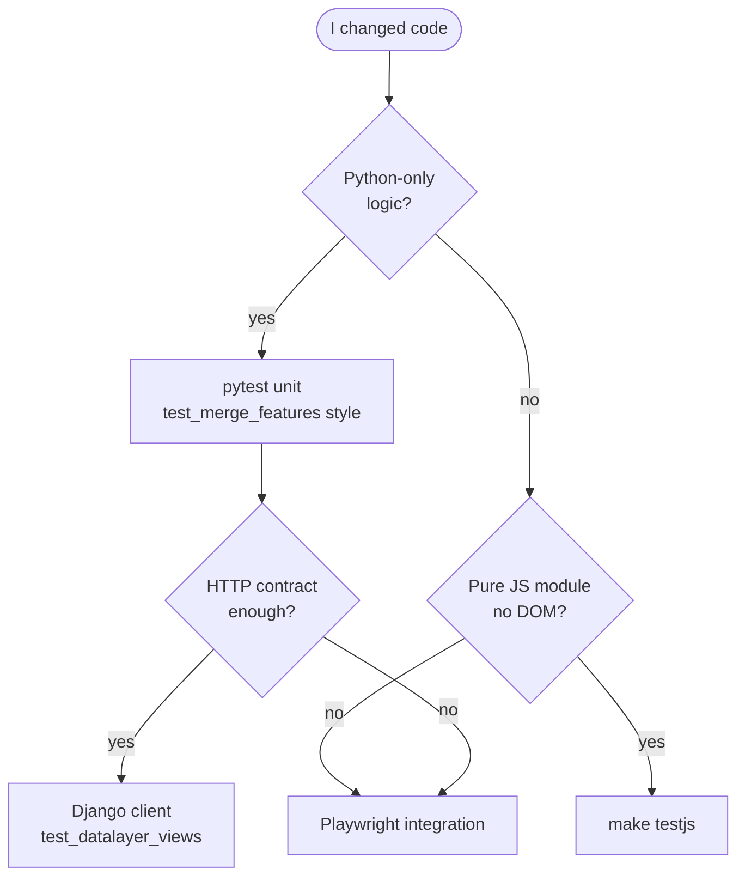

# uMap Onboarding — Phase 12: Testing Mental Model

> **Status:** Phase 12 of 13 · Read-only investigation · Builds on [Phase 11](phase-11-oss-git-workflow.md)  
> **Goal:** Know which tests exist, what they need, how to run them, and what to add when you change code

---

## How to read this phase

Phase 10 previewed testing. Phase 12 goes **deep enough to run and extend tests** without memorizing every file.

Evidence: **OBSERVED** / **INFERENCE** / **UNKNOWN**.

---

## The test pyramid (uMap-specific)

```mermaid
pyramid
    title uMap test layers
    "Playwright integration (~50 files)" : 35
    "Python unit (~25 files)" : 45
    "Mocha JS unit (8 files)" : 20
```

| Layer | Count (approx.) | Speed | Confidence |
|---|---|---|---|
| **Mocha** (`unittests/`) | 8 spec files | Seconds | Pure JS helpers, journal logic |
| **pytest unit** (`umap/tests/`, not `integration/`) | ~25 modules | Seconds–minutes | Views, models, `merge_features`, proxy |
| **pytest + Playwright** (`integration/`) | ~50 modules | Minutes | Real browser, save/draw/import flows |

**INFERENCE:** CI runs **all three** via `make test`. A good PR usually adds tests at the **lowest layer that still proves the behavior**.

---

## Commands cheat sheet

| Goal | Command |
|---|---|
| Everything (CI-like) | `make test` |
| Python unit only | `make test-unit` |
| Integration only | `make test-integration` |
| JS unit only | `make testjs` (needs `npm install`) |
| One pytest by name | `uv run pytest -k test_merge_with_ids -vv` |
| One integration test | `uv run pytest umap/tests/integration/test_save.py -vv` |
| Serial pytest (Mac peer auth) | `uv run pytest -n 0 -vv umap/tests/` |
| Debug browser test | `PWDEBUG=1 uv run pytest --headed -n1 -k test_save umap/tests/integration/` |
| Drop into failure | `uv run pytest -k failing_test --pdb` |

**OBSERVED** `Makefile`:

```makefile
test-unit:
	uv run pytest -vv umap/tests/ --ignore=umap/tests/integration

test-integration:
	uv run pytest -vv umap/tests/integration/ --dist=loadgroup --reruns 1 --maxfail 3
```

Integration suite uses **pytest-xdist `loadgroup`** (websocket tests share a group), **1 rerun** on flake, **stop after 3 failures**.

---

## Test settings ≠ your `local.py`

**OBSERVED:** Tests never use `umap/settings/local.py`.

| Setting source | Used when |
|---|---|
| `umap/tests/settings.py` | All pytest (`DJANGO_SETTINGS_MODULE` in `pyproject.toml`) |
| `UMAP_SETTINGS=umap/tests/settings.py` | CI explicit env |
| Your `local.py` | Dev server only |

**OBSERVED** test settings highlights (`umap/tests/settings.py`):

- `SECRET_KEY = "justfortests"`
- `AJAX_PROXY_CACHE_DIR = tempfile.gettempdir()`
- `PASSWORD_HASHERS = [MD5PasswordHasher]` — fast hashes
- `REALTIME_ENABLED = True`, `REDIS_URL = redis://localhost:6379/15`
- On GitHub Actions: explicit Postgres `postgres`/`postgres`@localhost

**INFERENCE:** If integration tests fail locally with Redis errors, start Redis (`brew services start redis` or Docker). CI always has Redis.

---

## pytest configuration

**OBSERVED** `pyproject.toml`:

```ini
[tool.pytest.ini_options]
DJANGO_SETTINGS_MODULE = "umap.tests.settings"
addopts = "--pdbcls=IPython.terminal.debugger:Pdb --no-migrations --numprocesses auto --reuse-db"
asyncio_mode = "auto"
```

| Flag | Meaning |
|---|---|
| `--no-migrations` | Sync DB from models, don’t run migration files (faster) |
| `--reuse-db` | Keep test DB between runs |
| `--numprocesses auto` | Parallel workers (xdist) |
| `--pdbcls=…` | IPython debugger on failure |

**OBSERVED** `conftest.py` hooks:

- `pytest_configure`: sets `MEDIA_ROOT` to temp dir; **`multiprocessing.set_start_method("fork")`** for Daphne/ASGI (Python 3.14 note in comment)
- `pytest_runtest_teardown`: wipes temp media + clears cache

---

## Database setup (local)

### GitHub Actions / Docker style

Postgres superuser `postgres`/`postgres` — works out of the box with test settings on GHA.

### macOS Homebrew peer auth

**OBSERVED** `docs/contributing.md`:

```bash
createuser -s $USER 2>/dev/null || true
createdb test_umap
psql test_umap -c "CREATE EXTENSION postgis"
uv run pytest -n 0 umap/tests/test_merge_features.py -vv
```

Use **`-n 0`** when one shared `test_umap` DB — parallel workers want `test_umap_gw0`, `test_umap_gw1`, …

**INFERENCE:** For day-to-day unit work on Mac, `-n 0` is the least friction path until you create worker DBs.

---

## Layer 1 — Python unit tests

### What they test

- Django **views** (HTTP status, headers, JSON bodies)
- **Models** and storage helpers
- Pure functions (`merge_features` in `umap/utils.py`)
- Management commands, utils, permissions edge cases

### Patterns

**1. Factory Boy fixtures** (`umap/tests/base.py` + `conftest.py`):

| Factory / fixture | Creates |
|---|---|
| `UserFactory` | User, password `123123` |
| `MapFactory` | Map with realistic `settings` JSON |
| `DataLayerFactory` | Layer + GeoJSON file on disk |
| `TileLayerFactory` | OSM-style tile template |
| `map`, `datalayer`, `openmap`, `tilelayer` | pytest fixtures wiring factories |

**OBSERVED** `DataLayerFactory` writes real GeoJSON to `ContentFile` — tests hit filesystem storage like production.

**2. Django test client** — no browser:

```python
pytestmark = pytest.mark.django_db

def test_get_with_public_mode(client, datalayer, map):
    map.share_status = Map.PUBLIC
    map.save()
    url = reverse("datalayer_view", args=(map.pk, datalayer.pk))
    response = client.get(url)
    assert response.status_code == 200
    assert response["X-Datalayer-Version"] is not None
```

(`umap/tests/test_datalayer_views.py`)

**3. Pure unit — no DB:**

```python
def test_changing_same_element():
    with pytest.raises(ConflictError):
        merge_features(["A", "B"], ["A", "D"], ["A", "C"])
```

(`umap/tests/test_merge_features.py` — maps directly to Phase 6 algorithm)

### When to add a Python unit test

| You changed | Add test near |
|---|---|
| `umap/utils.py` | `test_utils.py` or `test_merge_features.py` |
| `umap/views.py` datalayer endpoints | `test_datalayer_views.py` |
| Map CRUD / permissions | `test_map_views.py` |
| Proxy cache command | `test_clear_proxy_cache.py` |
| S3 storage backend | `test_datalayer_s3.py` (uses **moto**) |

---

## Layer 2 — Playwright integration tests

### What they test

End-to-end **browser behavior**: edit mode, draw tools, save queue, import, choropleth UI, websocket sync, query string params, etc.

### Infrastructure

**OBSERVED** `umap/tests/integration/conftest.py`:

| Fixture | Role |
|---|---|
| `live_server` | Django test server (pytest-django) |
| `page` / `new_page` | Playwright page; logs console + page errors |
| `mock_tiles` | Intercepts `tile.*` URLs → empty PNG (faster, no network) |
| `wait_for_loaded` | `U.MAP.dataloaded === true` |
| `wait_for_edit_mode` | `U.MAP.editEnabled === true` |
| `login` | Fills Django login form |
| `asgi_live_server` | **Daphne** ASGI server for websocket tests |

**OBSERVED** timeouts: `PLAYWRIGHT_TIMEOUT` env (7500 ms default, 20000 in CI).

### Example: save only dirty layer

```python
def test_resetting_map_would_remove_from_save_queue(
    live_server, openmap, page, datalayer
):
    page.goto(f"{live_server.url}{openmap.get_absolute_url()}?edit")
    # … undo map name edit, edit layer name, save …
    assert requests == [
        ("POST", f"{live_server.url}/en/map/{openmap.pk}/datalayer/update/{datalayer.pk}/"),
    ]
```

(`umap/tests/integration/test_save.py` — proves Phase 8 save path)

### Example: concurrent edit / merge

`test_optimistic_merge.py` opens **two browser pages**, draws markers, saves, expects merge or 412 behavior — ties Phase 6 to UI.

### Websocket tests

**OBSERVED:** `test_websocket_sync.py` marks tests `@pytest.mark.xdist_group(name="websockets")` so parallel workers don’t stomp shared Redis state.

**Requires:** Redis running locally.

### Platform note

**OBSERVED** `test_edit_marker.py` uses `Meta` vs `Control` for Shift-click edit on Darwin vs Linux.

### When to add integration tests

| You changed | Consider integration test if… |
|---|---|
| Client save / journal | Unit can’t catch it; use `test_save.py` pattern |
| Draw tool / popup UI | Playwright like `test_edit_marker.py` |
| Import wizard | `test_import.py` family |
| Realtime sync | `test_websocket_sync.py` + Redis |

**INFERENCE:** Integration tests are **slower and flakier** — prefer unit tests when HTTP-level assertions suffice.

---

## Layer 3 — Mocha JS unit tests

### Location

**OBSERVED:** `umap/static/umap/unittests/` (not `docs/contributing.md`’s stale `static/test` path).

| File | Tests |
|---|---|
| `URLs.js` | URL template helpers |
| `journal.js` | Journal engine, updaters |
| `hlc.js` | Hybrid logical clock |
| `schema.js` | Map property schema |
| `utils.js`, `geoutils.js`, `i18n.js` | Utilities |

### Setup

**OBSERVED** `.mocharc.json`:

```json
{ "file": "umap/static/umap/unittests/setup.js" }
```

`setup.js` loads **JSDOM** globally before modules import (needed for `schema.js` / DOM purify).

### Run

```bash
npm install
make testjs
```

### Style

```javascript
import { describe, it } from 'mocha'
import pkg from 'chai'
const { expect } = pkg

import URLs from '../js/modules/urls.js'

describe('URLs', () => {
  it('should return the update URL if created is true', () => { … })
})
```

**OBSERVED:** ES modules, Mocha 10, Chai `expect`, Sinon in journal tests.

### When to add Mocha tests

| You changed | Add to |
|---|---|
| `urls.js`, `utils.js`, `geoutils.js` | Matching `unittests/*.js` |
| `journal/engine.js` | `journal.js` (may need mocks) |
| `schema.js` | `schema.js` |
| Leaflet rendering | Usually **Playwright**, not Mocha |

---

## Decision flow: which test to write?



| Change example | Right layer |
|---|---|
| Fix `merge_features` edge case | `test_merge_features.py` |
| Fix `X-Datalayer-Version` header | `test_datalayer_views.py` |
| Fix `datalayer_save` URL routing | `URLs.js` Mocha |
| Fix Ctrl+S not saving layer | `test_save.py` Playwright |
| Fix marker shift-click edit | `test_edit_marker.py` Playwright |
| Fix websocket permission broadcast | `test_websocket_sync.py` + Redis |

---

## Mapping tests to onboarding phases

| Phase topic | Test anchor |
|---|---|
| Merge / 412 | `test_merge_features.py`, `test_optimistic_merge.py` |
| Datalayer GET lazy load | `test_datalayer_views.py`, `test_lazy_loading.py` |
| Save pipeline | `test_save.py`, `test_datalayer_views.py` POST tests |
| Rules / choropleth | `test_conditional_rules.py`, `test_choropleth.py` |
| Remote / proxy | `test_remote_data.py`, `test_views.py` ajax proxy |
| Journal / undo | `unittests/journal.js`, `test_undo_redo.py` |

Use `grep -r "keyword" umap/tests/` to find existing coverage before writing new tests.

---

## Running a minimal test loop (no full Postgres)

If Postgres is not ready yet:

```bash
cd /path/to/umap
npm install
make testjs
```

**OBSERVED:** JS suite needs **no database**.

Next step when Postgres exists:

```bash
make develop   # or make install
# create test_umap + postgis
uv run pytest -n 0 -vv umap/tests/test_merge_features.py
```

---

## Debugging failed tests

### pytest

```bash
# Verbose, stop on first fail
uv run pytest -x -vv umap/tests/test_datalayer_views.py::test_get_with_public_mode

# Print locals on fail (addopts already sets IPython pdb class)
uv run pytest -k test_name --pdb
```

### Playwright

```bash
# Inspector + headed browser
PWDEBUG=1 uv run pytest --headed -n1 -k test_created_markers_are_merged umap/tests/integration/

# See browser console (integration conftest prints non-warning console lines)
uv run pytest -s umap/tests/integration/test_save.py -vv
```

### Flaky integration tests

**OBSERVED:** CI uses `--reruns 1`. Locally, re-run single test before assuming bug.

**OBSERVED:** `test_optimistic_merge.py` has `sleep(1)` around saves — timing-sensitive; flake source documented in comment.

---

## What CI enforces (recap)

From `.github/workflows/test-docs.yml`:

1. **tests** job: `make ci` → `make test` on Python 3.12 + 3.14, PostGIS + Redis services
2. **lint** job: `make lint` + `make docs`

**INFERENCE:** A PR that passes `make test-unit` + `make lint` locally is a strong baseline; maintainers may still expect integration tests for UI changes.

---

## Anti-patterns (don’t)

| Don’t | Do instead |
|---|---|
| Test vendored Leaflet internals | Test uMap wrapper behavior |
| Mock entire Django stack for view bugs | `client.get` / `client.post` with factories |
| Add Playwright for pure `merge_features` fix | Unit test only |
| Edit `umap/tests/settings.py` for personal DB | Env-specific override or document in PR |
| Run integration without Redis when testing sync | Start Redis or skip websocket tests with `-k 'not websocket'` |
| Assume `make test` passes on Mac without `test_umap` | Create DB or use `-n 0` |

---

## Phase 12 summary

### MUST UNDERSTAND NOW

1. **Three suites:** Mocha (JS pure), pytest unit (Django/HTTP/algos), Playwright integration (browser)
2. **Tests use `umap/tests/settings.py`**, not your `local.py`
3. **`make test-unit`** = fast default; **`make test-integration`** needs Postgres + Playwright + Redis
4. **Factories** (`MapFactory`, `DataLayerFactory`) are the standard way to build fixtures
5. **Pick the lowest test layer** that proves your change
6. **Mac peer auth:** `test_umap` + `pytest -n 0` unless you create `test_umap_gw*`

### USEFUL LATER

- `moto` for S3 tests
- `@pytest.mark.xdist_group` for shared resources
- `asgi_live_server` for websocket debugging

### Safe to defer

- Writing Playwright tests for every UI tweak
- Full `make test` before every commit during exploration

---

## What we investigate next — Phase 13: Contribution Surface & Readiness

Phase 13 closes onboarding:

- Map of **good first issues** by skill area (docs, JS, Python, GIS)
- Your readiness checklist (skills × repo gaps)
- Suggested **90-day contributor path**
- Final mental model diagram tying all phases together

---

## Pause here

You should know **where tests live** and **which command to run** for your change type.

**Questions before Phase 13:**

- Walk through **creating one test** for Experiment B (`URLs.has`) end-to-end?
- Help **setting up `test_umap`** on your Mac?
- **`continue to Phase 13`** for contribution map and readiness?

Say **"continue to Phase 13"** or ask testing questions.
