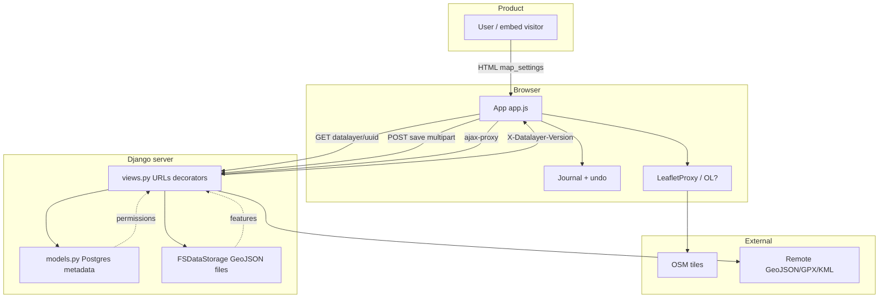

# uMap Onboarding — Phase 13: Contribution Surface & Readiness

> **Status:** Phase 13 of 13 · Finale · Builds on [Phase 12](phase-12-testing-mental-model.md)  
> **Goal:** Map where you can contribute, assess readiness honestly, and leave with a durable mental model — not a list of “easy issues”

---

## You made it through the arc

Thirteen phases, read-only by design until you chose otherwise. Here is what you now have that a drive-by contributor does not:

| Phase | You can now… |
|---|---|
| [1 — What is uMap?](phase-1-what-is-umap.md) | Explain product scope vs OSM editor vs GIS |
| [2 — Domain primer](phase-2-domain-primer.md) | Speak GeoJSON, layers, permissions, tiles |
| [3 — Architecture](phase-3-architecture.md) | Draw server/client/storage boundaries |
| [4 — Repository tour](phase-4-repository-tour.md) | Navigate to the right file in minutes |
| [5 — Runtime walkthroughs](phase-5-runtime-walkthroughs.md) | Trace open → edit → save → remote layer |
| [6 — Algorithms](phase-6-algorithms-and-data-transformations.md) | Reason about merge, import, rules, choropleth |
| [7 — Run locally](phase-7-run-locally.md) | Bootstrap PostGIS + `uv` + `local.py` |
| [8 — DevTools](phase-8-connect-browser-to-code.md) | Tie Network tab to `U.MAP` and journal |
| [9 — Experiment](phase-9-controlled-learning-experiment.md) | Run a reversible change with verification |
| [10 — Culture](phase-10-engineering-culture.md) | Match maintainer expectations (lint, i18n, AGPL) |
| [11 — Git workflow](phase-11-oss-git-workflow.md) | Fork → branch → PR to `umap-project/umap` `master` |
| [12 — Testing](phase-12-testing-mental-model.md) | Pick pytest vs Playwright vs Mocha |

**INFERENCE:** You are **onboarded to the codebase**, not yet a **proven contributor** — that requires shipped PRs and review cycles.

---

## Final mental model (one diagram)



**Single sentence version:** uMap is a **Django permission and storage layer** wrapped around a **vanilla JS map editor** that keeps features in **versioned GeoJSON files** and loads them **lazily** into a **journal-backed** client.

---

## Contribution surface map

### By activity type

| Surface | Effort to start | Impact | Your fit (React/TS strong) |
|---|---|---|---|
| **Docs fixes** (`docs/`, `docs/dev/`) | Low | High clarity for all | ★★★★★ |
| **Bug triage** (repro comments on issues) | Low | Unblocks maintainers | ★★★★☆ |
| **Transifex** (non-English UI) | Low | User-visible | ★★★☆☆ (if multilingual) |
| **Mocha unit tests** (`unittests/`) | Low | CI confidence | ★★★★★ |
| **Client UI / edit flows** (`app.js`, `data/`, `rendering/`) | Medium | User-visible | ★★★★☆ |
| **Import/export** (`formatter.js`) | Medium | Data pipelines | ★★★☆☆ |
| **Django views / merge** (`views.py`, `utils.py`) | Medium–high | Correctness | ★★☆☆☆ (Python learning) |
| **Playwright tests** (`integration/`) | Medium | Regression safety | ★★★★☆ |
| **Realtime / websockets** (`sync/`, Redis) | High | Collaboration | ★★☆☆☆ |
| **OpenLayers migration** (`?openlayers`) | High | Strategic | ★★★☆☆ |
| **Deploy / Helm / Docker** | High | Ops | ★★☆☆☆ |

### By codebase zone (from Phase 4)

| Zone | Example work | Typical tests |
|---|---|---|
| `umap/static/umap/js/modules/app.js` | Shortcuts, panel behavior, save UX | Playwright |
| `data/layer.js`, `data/features.js` | Layer load/save, feature commit | Playwright + unit |
| `journal/` | Undo, dirty state, sync | Mocha + Playwright |
| `formatter.js` | CSV/KML/GPX edge cases | Mocha + `test_import.py` |
| `rules.js`, `data/types.js` | Styling, choropleth | `test_conditional_rules.py`, `test_choropleth.py` |
| `umap/views.py` | HTTP codes, headers, merge | `test_datalayer_views.py` |
| `umap/utils.py` | `merge_features`, `layers_tree` | `test_merge_features.py` |
| `umap/templates/` | Bootstrap HTML | djlint + Playwright |
| `docs/install.md`, `local.py.sample` | Onboarding gaps you found | `make docs` |
| `docs-users/fr/` | End-user tutorials | Manual review |

---

## Issue landscape (OBSERVED snapshot)

Fetched open issues on `umap-project/umap` during onboarding — **not** a curated “pick these” list. Use to see **themes**:

| Theme | Example issues | Contributor angle |
|---|---|---|
| **UI polish** | #3480 Escape closes popup; #3492 deactivate context menu | Client + Playwright |
| **Caption / panel** | #3493 caption bar name when panel not caption | `app.js` / panel + test |
| **Import / fields** | #3473 custom fields; #3383 FeatureCollection properties on import | `formatter.js`, `layer.js` |
| **Docs / i18n** | #3249 update documentation; #3490 Transifex JA pickup | Docs PR or maintainer process |
| **Config / hosting** | #3482 OPENROUTESERVICE_HOST default | Settings + small pytest |
| **Data bugs** | #3491 markers move randomly | Needs repro map + investigation |

**INFERENCE:** uMap does **not** heavily label `good first issue`. Best path: find a bug **you can reproduce**, comment with map URL + steps (Phase 10), then offer a fix.

**Do not** start with: websocket sync, OpenLayers parity, or vendor upgrades.

---

## Readiness self-assessment

Score yourself **0–2** per row: 0 = not yet, 1 = partial, 2 = confident.

| # | Criterion | 0 | 1 | 2 |
|---|---|---|---|---|
| 1 | Explain Map → DataLayer → Feature without notes | | | |
| 2 | Draw bootstrap vs lazy datalayer GET | | | |
| 3 | Describe save path through journal | | | |
| 4 | Explain 412 / `merge_features` limitation | | | |
| 5 | Run local uMap (or explain blockers) | | | |
| 6 | Use `U.MAP` in DevTools | | | |
| 7 | Run `make testjs` or `make test-unit` | | | |
| 8 | Fork/upstream/PR flow (`radhtkamal` → `umap-project`) | | | |
| 9 | Know when Mocha vs pytest vs Playwright | | | |
| 10 | Identified one contribution zone matching your skills | | | |

| Total | Readiness |
|---|---|
| 16–20 | **Ready for first real PR** — pick scoped issue |
| 11–15 | **Almost** — close one gap (usually local run or one test suite) |
| 0–10 | **Still learning** — revisit phases marked 0–1 |

### Your likely profile (INFERENCE from onboarding arc)

| Strength | Leverage in uMap |
|---|---|
| React/TS/Node | Client modules, Playwright, form/panel UX, async fetch |
| Firebase mental model | Permissions, document-shaped map settings |
| Python beginner | Start with docs + Mocha + pure pytest (`merge_features`), not `views.py` monolith |
| GIS learning | GeoJSON literacy is enough for v1; defer PostGIS internals |

### Known gaps from this clone (OBSERVED)

| Gap | Unblock |
|---|---|
| Local server not verified | Phase 7 checklist |
| `onboarding/` untracked | Personal notes — separate from upstream PRs |
| `test_umap` not created | Phase 12 DB setup |
| Phase 9 experiment not run | `make testjs` or local.py zoom tweak |

---

## Suggested 90-day contributor path

Not a commitment — a **default trajectory** for someone with your background.

### Days 1–14 — Legitimacy without code

- [ ] Join Matrix or lurk forum — introduce yourself as learning contributor
- [ ] Reproduce one open bug; post comment with map URL (even if you don’t fix it)
- [ ] Run `make testjs` successfully
- [ ] Complete Phase 7 local boot OR document why blocked

### Days 15–30 — First mergeable artifact

Pick **one**:

| Option | Deliverable |
|---|---|
| **A** | Docs PR: fix `docs/dev/frontend.md` (`app.js` / `App`, not `umap.js`) |
| **B** | Docs PR: add `AJAX_PROXY_CACHE_DIR` to `local.py.sample` + install note |
| **C** | Test PR: extend `unittests/URLs.js` (Phase 9 Experiment B) |
| **D** | Tiny fix + pytest if you found a server bug with clear repro |

Run `make lint` + relevant tests; open PR via Phase 11 flow.

### Days 31–60 — Second PR in client or tests

- [ ] Fix a small UI issue you reproduced (#3480-style) with Playwright test
- [ ] Review someone else’s PR on GitHub — learn review vocabulary
- [ ] Run `make test-unit` routinely; attempt one integration file with `PWDEBUG=1`

### Days 61–90 — Recurring contributor habits

- [ ] One PR per month **or** steady triage/comments
- [ ] Own a zone (e.g. import, rules, panel UX, docs)
- [ ] Read changelog on each release — note what changed in your zone
- [ ] Optional: Transifex translations if you have language skills

**INFERENCE:** “Recurring OSS contributor” = **sustained small merges + community presence**, not one heroic PR.

---

## First PR templates (concrete)

### Template 1 — Documentation only

```text
Title: docs: align frontend.md with app.js entry point

- Replace umap.js / U.Map references with modules/app.js / App
- Note map_init.html bootstrap pattern
- Link to docs/dev/overview.md

Test plan: make docs
```

**OBSERVED stale lines:** `docs/dev/frontend.md` lines 25–32 (`umap.js`, `U.Map`).

### Template 2 — Sample settings fix

```text
Title: fix: add AJAX_PROXY_CACHE_DIR to local.py.sample

Mandatory since 3.8.0 (umap.E001). Uses repo-relative var/proxy-cache.

Test plan:
- Copy sample to local.py, mkdir var/proxy-cache, uv run umap check
```

### Template 3 — Client behavior + test

```text
Title: fix: close popup on Escape when focus in map

Fixes #3480

Test plan:
- PWDEBUG=1 pytest -k escape umap/tests/integration/… (new or extended test)
- make lint
```

---

## What “done” with onboarding means

You are **graduated from this onboarding series** when:

1. You can **navigate** from symptom → file without this doc
2. You have **run at least one** verification loop (test or browser)
3. You have **synced** `upstream/master` and know PR target
4. You have **one intended first PR** scoped to &lt; ~200 lines

You are **not** required to:

- Master Python/Django/PostGIS
- Complete OpenLayers migration work
- Run full `make test` on every machine (CI exists for that)

---

## Anti-goals (tourist vs contributor)

| Tourist | Contributor |
|---|---|
| “Any easy issues?” | “I reproduced #3493 on map X; proposing fix in `panel.js`” |
| Giant refactor PR | Focused fix + test |
| Edit 20 locale files | Transifex or English `translate()` only |
| Ghost after opening PR | Respond to review within days |
| Fork never synced | Weekly `fetch upstream` |

---

## Keep these commands on a sticky note

```bash
# Sync
git fetch upstream && git checkout master && git merge upstream/master

# Branch
git checkout -b fix/short-name

# Quality
make lint
make testjs                    # JS-only changes
uv run pytest -n 0 -k name …   # Python unit (Mac)

# PR
git push -u origin fix/short-name
gh pr create --repo umap-project/umap --head YOUR_USER:fix/short-name --base master
```

---

## Onboarding index (all phases)

| # | File |
|---|---|
| 1 | [phase-1-what-is-umap.md](phase-1-what-is-umap.md) |
| 2 | [phase-2-domain-primer.md](phase-2-domain-primer.md) |
| 3 | [phase-3-architecture.md](phase-3-architecture.md) |
| 4 | [phase-4-repository-tour.md](phase-4-repository-tour.md) |
| 5 | [phase-5-runtime-walkthroughs.md](phase-5-runtime-walkthroughs.md) |
| 6 | [phase-6-algorithms-and-data-transformations.md](phase-6-algorithms-and-data-transformations.md) |
| 7 | [phase-7-run-locally.md](phase-7-run-locally.md) |
| 8 | [phase-8-connect-browser-to-code.md](phase-8-connect-browser-to-code.md) |
| 9 | [phase-9-controlled-learning-experiment.md](phase-9-controlled-learning-experiment.md) |
| 10 | [phase-10-engineering-culture.md](phase-10-engineering-culture.md) |
| 11 | [phase-11-oss-git-workflow.md](phase-11-oss-git-workflow.md) |
| 12 | [phase-12-testing-mental-model.md](phase-12-testing-mental-model.md) |
| 13 | **This file** |

---

## Phase 13 summary — the whole story in one paragraph

uMap lets people author **shareable thematic maps** on OSM basemaps. The server (Django + PostGIS metadata + GeoJSON files) boots a **vanilla JS** editor (`App`) that lazy-loads layers, edits through a **journal**, and saves via multipart POST with **version headers** and **set-diff merge** on conflict. You contribute by matching work to the right layer — docs, Mocha, pytest, or Playwright — syncing your **fork**, and shipping **small repro-driven PRs** to `umap-project/umap` `master` with `make lint` and targeted tests green. Recurring contribution is a habit of **repro, fix, test, review, repeat** — not finishing a tutorial.

---

## Graduation — what now?

The onboarding sequence is **complete**. Suggested immediate next steps (pick one):

1. **Run Experiment B** — `URLs.has()` Mocha tests → first PR  
2. **Docs PR** — `frontend.md` or `local.py.sample` proxy dir  
3. **Triage** — reproduce #3493 or #3480 with a public/minimal map  
4. **Local boot** — Phase 7 until `U.MAP.dataloaded` is true on localhost  

If you want pairing on any of these, say which option and we switch from onboarding mode to **contribution mode** (still no commits unless you ask).

---

## Pause here — final questions

- Which **zone** do you want to own first: docs, client UI, import, or server?
- Want help **scoping a first PR** from the templates above?
- Should `onboarding/` stay **local-only** or be proposed upstream as contributor docs?

Thank you for working through all thirteen phases. You have the map; the territory is the next PR.
