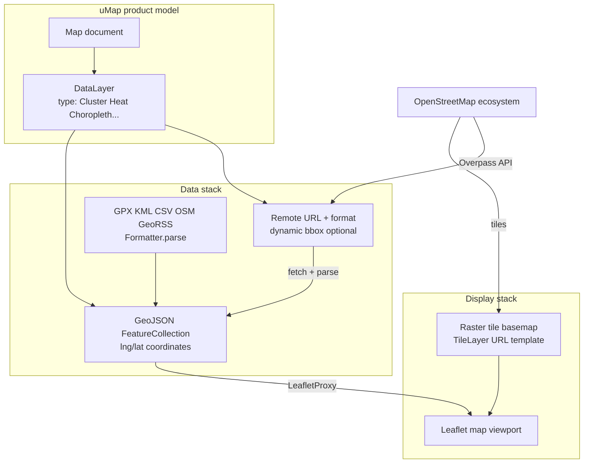

# uMap Onboarding — Phase 2: Domain Primer

> **Status:** Phase 2 of 13 · Read-only investigation · Builds on [Phase 1](phase-1-what-is-umap.md)  
> **Goal:** Teach only the geospatial concepts this repository actually uses — no generic GIS lecture

---

## How to read this phase

Each concept below answers four questions:

1. **What is it?**
2. **Why does it exist?**
3. **Where does uMap use it?**
4. **What familiar concept can I compare it to?**

Labels:

- **FACT** — directly from code, tests, or repo documentation
- **INFERENCE** — reasonable conclusion from evidence
- **UNKNOWN** — not established from this repo alone

Concepts marked **MUST UNDERSTAND NOW** will block you in Phases 3–5 if skipped. **USEFUL LATER** can wait until you touch that subsystem.

---

## The one coordinate rule that will bite you

Before anything else: **GeoJSON and uMap store positions as `[longitude, latitude]`**, not `[lat, lng]`.

**FACT:** When a marker is created in `umap.controls.js`, the geometry is:

```javascript
geometry: { type: 'Point', coordinates: [latlng.lng, latlng.lat] }
```

**FACT:** Leaflet internally uses `LatLng` objects as `{ lat, lng }`. The rendering layer converts between conventions. In `leaflet.js`, map center from server properties is stored as `[lon, lat]` but passed to Leaflet as `[lat, lon]`:

```javascript
const [lon, lat] = this.app.properties.center
this.map.setView([lat, lon], this.app.properties.zoom)
```

**FACT:** Test fixture `umap/tests/fixtures/test_circles_layer.geojson` shows Nantes-area points as `[-1.58, 47.19]` — longitude first, latitude second.

**Compare to:** JSON APIs where field order rarely matters. Here, **swapping lat/lng silently places features in the wrong hemisphere**. When you read coordinates, always ask: *which convention is this object using?*

**MUST UNDERSTAND NOW.**

---

## Geographic features and geometry types

### What is it?

A **geographic feature** is something on the map with a **geometry** (where it is) and **properties** (what it means: name, color, capacity, etc.).

**FACT:** uMap's editor creates three primary geometry types:

| User action | GeoJSON type | Example use |
|---|---|---|
| Marker | `Point` | A venue, parking spot, label |
| Line / route | `LineString` | A path, itinerary, border segment |
| Polygon | `Polygon` | An area, zone, building footprint |

**FACT:** `formatter.js` and Turf utilities also handle `MultiPoint`, `MultiLineString`, `MultiPolygon` — compound shapes. `geoutils.js` has `shapeAt()` to pick which sub-polygon or sub-line a click belongs to.

### Why does it exist?

Maps need both **location** and **attributes**. Separating geometry from properties is what lets uMap style by data (`population>10000` → red) without changing coordinates.

### Where does uMap use it?

- Drawing tools in `umap.controls.js` bootstrap empty geometries, then Leaflet.Editable fills coordinates as the user clicks
- `umap/static/umap/js/modules/data/features.js` — `Point`, `LineString`, `Polygon` classes wrap individual features
- Every stored layer file is ultimately a `FeatureCollection` of these objects

### Compare to

A Firestore document: `geometry` ≈ structured location field; `properties` ≈ the rest of the document. Popups and templates read from `properties`; the map renderer reads from `geometry`.

**MUST UNDERSTAND NOW.**

---

## GeoJSON

### What is it?

**GeoJSON** is JSON for geographic data. A layer file is typically:

```json
{
  "type": "FeatureCollection",
  "features": [
    {
      "type": "Feature",
      "id": "capa0",
      "geometry": { "type": "Point", "coordinates": [-1.58, 47.19] },
      "properties": { "name": "...", "amenity": "bicycle_parking" }
    }
  ]
}
```

### Why does it exist?

It is the **lingua franca** between uMap's storage, import pipelines, export, remote APIs, and Leaflet's `L.GeoJSON` layer.

**FACT:** Developer overview: *"Most of the data is stored as geoJSON files, on the server."*

**FACT:** `DataLayer.geojson` is a Django `FileField` — each layer's features live in a `.geojson` file on disk or object storage (`umap/models.py`).

**FACT:** Legacy layers may embed metadata under `_umap_options` inside the GeoJSON file. `DataLayer._fallback_properties_from_file()` reads this when DB `settings` are empty. Newer code normalizes to `properties` on the client (`app.js`).

### Where does uMap use it?

| Stage | Location |
|---|---|
| Persistence | `DataLayer.geojson` file per layer |
| API delivery | `MapViewGeoJSON`, datalayer views serve GeoJSON to the client |
| Import | `Formatter.parse()` converts other formats → GeoJSON |
| Export | `EXPORT_FORMATS` in `formatter.js` |
| Rendering | `LeafletProxy` adds features via Leaflet GeoJSON layers |

### Compare to

**GeoJSON is uMap's internal representation** — like how your React app might normalize all API responses into a single TypeScript interface before rendering. GPX, KML, CSV, OSM XML are **input adapters**; GeoJSON is what the app actually works with.

**MUST UNDERSTAND NOW.**

---

## Bounding boxes (bbox)

### What is it?

A **bounding box** is the rectangle that contains a set of features or the current map view: west, south, east, north edges in degrees.

**FACT:** `geoutils.js` documents the convention explicitly:

> *"Bounding boxes are kept in geojson order: [west, south, east, north]."*

**FACT:** `LeafletProxy.getGeoContext()` exposes:

```javascript
{
  bbox: "west,south,east,north",  // comma-joined string
  north, south, east, west,
  lat, lng, zoom,
  left: west, bottom: south, right: east, top: north
}
```

**FACT:** Remote data URLs can include template variables like `{bbox}`, `{south}`, `{west}`, `{north}`, `{east}` (FAQ + tutorial 10). `app.renderUrl()` substitutes them via `greedyTemplate()` before fetch.

### Why does it exist?

- **Fit map to data** — zoom the viewport to show all features
- **Dynamic remote queries** — only fetch POIs visible in the current view (Overpass, OpenDataSoft `in_bbox()`)
- **Search bias** — Photon search can use current map extent (`autocomplete.js`)

### Where does uMap use it?

- `GeoUtils.bbox()`, `unionBbox()`, `bboxIntersects()` — Turf-backed helpers
- `fetchRemoteData()` in `data/layer.js` — re-fetches on `moveend` when `remoteData.dynamic` is true
- Import/filter UI — bbox filtering in data browser

### Compare to

A SQL `WHERE lat BETWEEN ? AND ? AND lng BETWEEN ? AND ?` — but expressed as a geographic rectangle and often embedded in URL templates rather than query builders.

**MUST UNDERSTAND NOW** for remote layers. **USEFUL LATER** for choropleth/bounds math.

---

## Projections and coordinate systems (minimal version)

### What is it?

The Earth is a sphere; screens are flat. A **projection** maps lat/lng to x/y pixels. **WGS84** (EPSG:4326) is standard GPS lat/lng. **Web Mercator** (EPSG:3857) is what most web map tiles use.

### Why does it exist?

Tile servers and Leaflet need a consistent math model to place zoom levels and panes correctly.

### Where does uMap use it?

**FACT:** Map center is stored as a Django `PointField(geography=True)` on `Map` — PostGIS geography type for the map's default center.

**FACT:** OpenDataSoft importer requests `epsg=4326` in export URLs (`opendata.js`) — WGS84 lat/lng, not projected meters.

**FACT:** `TileLayer` model has a `tms` boolean — some tile schemes flip the Y axis (TMS vs XYZ). Comment links to OSM wiki on TMS.

**INFERENCE:** uMap does **not** ask users to pick projections. Data stays in WGS84 degrees; Leaflet + tile providers handle display projection. You rarely touch projection math as a contributor.

### Compare to

You store timestamps in UTC in the database and let the browser format for locale. uMap stores WGS84 coordinates and lets Leaflet project for display.

**USEFUL LATER** unless you work on tile layer bugs or PostGIS queries. **Do not rabbit-hole here.**

---

## Tiles, basemaps, and TileLayer

### What is it?

A **raster tile layer** is a grid of pre-rendered map images (PNG/WebP) fetched by zoom level and x/y index. Together they form the **basemap** — streets, labels, terrain — underneath user-drawn vectors.

**FACT:** `TileLayer` Django model fields: `url_template` (with `{z}/{x}/{y}` placeholders per OSM tile format), `minZoom`, `maxZoom`, `attribution`, `rank`, `tms`.

**FACT:** `LeafletProxy` creates a `TileLayerManager` that initializes from `app.properties.tilelayers` — configured per map, with a server default from `TileLayer.get_default()`.

### Why does it exist?

Rendering the whole planet as vectors in the browser would be impossibly heavy. Tiles are cached, CDN-friendly image pyramids.

### Where does uMap use it?

- Background map while editing and viewing
- Map settings UI — users can switch basemaps, adjust opacity
- `umap clean_tilelayer` management command — bulk-replace tile URLs in stored map settings

### Compare to

A CSS `background-image` that changes resolution as you zoom — except each "resolution" is a separate network request indexed by zoom/x/y.

**MUST UNDERSTAND NOW:** basemap tiles ≠ your data layers. They are separate systems that stack visually.

---

## Vector vs. raster (only what matters here)

### What is it?

- **Raster:** pixel images (tile basemap)
- **Vector:** geometric objects (your markers, lines, polygons, remote GeoJSON)

### Where does uMap use it?

**FACT:** User features are **vectors** stored/served as GeoJSON, rendered by Leaflet as SVG/Canvas paths and markers.

**FACT:** Basemap is **raster** tiles.

**INFERENCE:** Recent changelog mentions vector tiles funding (README NLnet grant for "uMapVectorTiles") — future direction, not the primary storage model today.

**Compare to:** Figma canvas — background image (raster) + editable vector shapes on top.

**MUST UNDERSTAND NOW** at this level only.

---

## Data layers (uMap's "layer" — not Leaflet's)

This word is overloaded. uMap uses "layer" in **three** related senses:

### 1. DataLayer (product concept) — **MUST UNDERSTAND NOW**

A named group of features with its own settings, permissions, legend entry, and optional remote data source.

**FACT:** Django `DataLayer` model + client `DataLayer` class in `data/layer.js`.

### 2. Rendering layer type (visualization mode)

**FACT:** From `docs/dev/frontend.md` and `data/types.js`, a data layer has a **type** that controls how features are drawn:

| Type | Purpose |
|---|---|
| Default | Standard markers/paths |
| Cluster | Group nearby points at low zoom |
| Heat | Density heatmap |
| Choropleth | Color polygons by numeric property |
| Categorized | Distinct styles per category value |
| Circles | Proportional circles by value |

**FACT:** Choropleth uses statistical breaks — k-means, Jenks, quantiles, equidistant (`data/types.js` + `simple-statistics`).

### 3. Leaflet map pane / overlay

**FACT:** Each `DataLayer` creates an overlay pane (`createOverlayPane`) so z-ordering and visibility are per-layer.

### Compare to

- DataLayer ≈ a Firestore subcollection with its own schema and security rules
- Rendering type ≈ chart type in a dashboard (bar vs. pie — same data, different visual encoding)
- Leaflet pane ≈ CSS `z-index` stacking context

**Do not confuse** "toggle layer visibility" (product) with "switch basemap tile layer" (background).

---

## Map styles, rules, and properties

### What is it?

**Styling** controls how features look: color, icon, weight, opacity, labels. uMap supports:

- **Per-feature properties** — set in the edit panel
- **Layer defaults** — inherited by new features
- **Conditional rules** — `property>value` → apply style (FAQ documents syntax)
- **Template variables** — `{name}`, `{lat}`, `{measure}` in descriptions and popups

### Where does uMap use it?

**FACT:** `rules.js` + schema `rules` property — evaluated client-side when rendering

**FACT:** `features.js` builds template context via `getGeoContext()` plus feature properties, rank, layer name, measure (length/area via Turf in `geoutils.js`)

### Compare to

CSS with conditional classes, or a spreadsheet with conditional formatting rules — data-driven presentation without changing underlying geometry.

**USEFUL LATER** until you work on styling, popups, or import property mapping.

---

## Import and export formats

### What is it?

uMap accepts several **file/API formats**, always normalizing to GeoJSON internally.

**FACT:** `Formatter.parse()` supports:

| Format | Handler | Notes |
|---|---|---|
| `geojson` | `JSON.parse` | Native |
| `gpx` | `togeojson.gpx` | Tracks, elevation — tutorial 13 |
| `kml` | `togeojson.kml` | Google Earth |
| `csv` | `csv2geojson` | Needs `lat`/`lon` or `geometry` column |
| `osm` | `osm2geojson` | OSM XML — sets `osm_id`, `osm_type` on properties |
| `georss` | `GeoRSSToGeoJSON` | RSS with geo extensions |

**FACT:** Integration tests also reference `umap` as an import format (`test_import.py`).

**FACT:** Export formats in `EXPORT_FORMATS`: geojson, gpx, kml, csv, wkt — plus image export (jpg/png) in share UI.

### Why does it exist?

Users arrive with data from spreadsheets, GPS devices, OSM exports, and open-data portals. uMap meets them where they are.

### Compare to

Your API's content-type negotiation — `Accept: application/json` vs. `text/csv` — except uMap converts everything to one internal model.

**MUST UNDERSTAND NOW:** GeoJSON and OSM XML (for Overpass). **USEFUL LATER:** GPX/KML/CSV edge cases.

---

## Remote data layers

### What is it?

A data layer whose features are **not** read from uMap's stored GeoJSON file, but **fetched from a URL** at runtime (optionally re-fetched as the map moves).

**FACT:** A layer is remote when both are set (`data/layer.js`):

```javascript
isRemoteLayer() {
  return Boolean(this.properties.remoteData?.url && this.properties.remoteData.format)
}
```

**FACT:** Fetch flow:

1. `renderUrl()` substitutes `{bbox}`, `{zoom}`, etc.
2. Optional **proxy** via Django (`remoteData.proxy` + TTL) — server-side caching (changelog 3.8.0 moved proxy to Python)
3. `formatter.parse(raw, format)` → GeoJSON
4. `fromGeoJSON()` loads features into memory
5. If `remoteData.dynamic`, `onMoveEnd()` triggers re-fetch

**FACT:** Remote layers show a distinct icon in the UI (`icon-remote` class in `app.js`). Saving does not persist fetched features into the layer file — `features.js` skips certain mutations for remote layers.

### Why does it exist?

Live datasets (bike availability, OSM queries, open data APIs) would go stale if copied. Dynamic layers keep maps lightweight and up to date.

### Compare to

React query hook fetching from an API on dependency change — here the dependency is often **map bbox** or **zoom level**, not a React state variable.

**MUST UNDERSTAND NOW** — this is a major product differentiator and a common contributor touchpoint.

---

## OpenStreetMap, Overpass, and OSM XML

### What is it?

- **OpenStreetMap (OSM):** collaborative geographic database (nodes, ways, relations with tags)
- **Overpass API:** query language (Overpass QL) to extract OSM subsets
- **OSM XML:** XML serialization of OSM elements — distinct from Overpass JSON output

### Why does it exist?

OSM is the default data universe for uMap's community. Overpass lets authors pull tagged features (bike parking, drinking water, etc.) without maintaining their own database.

### Where does uMap use it?

**FACT:** Tutorial 11 (French): Overpass Turbo defaults to `[out:json]`; uMap **cannot** parse that Overpass JSON. Users must use **`[out:xml]`** and select format **`osm`** in uMap's remote data settings.

**FACT:** Built-in Overpass importer (`importers/overpass.js`) builds queries, uses Photon for area search, sets `importer.format = 'osm'`.

**FACT:** Imported OSM features get `osm_id` and `osm_type` properties (`formatter.fromOSM`) — matching FAQ template variables.

### Compare to

- OSM ≈ Wikipedia for maps — community-edited source of truth
- Overpass ≈ SQL `SELECT` against OSM's database
- OSM XML in uMap ≈ one supported **response encoding** — like choosing `Content-Type: application/xml` vs. a vendor-specific JSON shape

**MUST UNDERSTAND NOW** if you touch import/remote data. **Critical pitfall:** Overpass JSON ≠ OSM XML ≠ GeoJSON — three different things.

---

## Leaflet (and the OpenLayers transition)

### What is it?

**Leaflet** is a lightweight browser library for interactive maps: tiles, markers, vector layers, events.

**FACT:** `docs/dev/overview.md`: client uses vanilla JavaScript on top of Leaflet.

**FACT:** `LeafletProxy` in `rendering/leaflet.js` wraps `L.Map`, manages tile layers, translates uMap features to Leaflet layers, proxies events (`moveend`, `feature:click`, etc.) back to the uMap app.

**FACT:** Drawing/editing uses **Leaflet.Editable** (`vendors/editable/Leaflet.Editable.js`).

**FACT:** Changelog 3.8.0: project is **preparing a switch from Leaflet to OpenLayers**. `app.js` can instantiate `OLProxy` when URL has `?openlayers` — experimental path in `rendering/openlayers.js`.

### Why does it exist?

Leaflet is the current rendering engine. uMap extends it rather than wrapping React — no virtual DOM, direct DOM + event bus (`app.fire(...)`).

### Compare to

Using Mapbox GL or Google Maps SDK in a vanilla JS app — uMap's `Map` class (`umap.js` / `app.js`) is your application root; Leaflet is the map viewport driver, similar to how you might embed a `<canvas>` chart library inside a React component without the chart being React-native.

**MUST UNDERSTAND NOW:** Leaflet is the current production renderer. **USEFUL LATER:** OpenLayers migration — relevant if you contribute to rendering code in 2026+.

---

## Geocoding and search (not quite "GIS")

### What is it?

**Geocoding** converts place names ↔ coordinates. **Reverse geocoding** converts coordinates → place label.

**FACT:** Default search endpoint: Photon (`https://photon.komoot.io/api/?`) — configured in `umap/settings/base.py` and overridable per deployment.

**FACT:** `autocomplete.js` supports typing coordinates directly and reverse search via Photon.

**FACT:** Route drawing can use **OpenRouteService** (`importers/openrouteservice.js`) — external routing API returning GeoJSON.

### Compare to

Google Places Autocomplete in a delivery app — external geospatial service, swappable per deployment config.

**USEFUL LATER** unless you work on search or routing importers.

---

## Spatial database (PostGIS) — small footprint

### What is it?

PostgreSQL + PostGIS adds geographic column types and queries.

### Where does uMap use it?

**FACT:** `Map.center` is `PointField(geography=True)`.

**FACT:** Developer overview: *"PostGIS is used for some of its geo features, but for the most part, the computation is done on the frontend with Leaflet."*

**FACT:** Tests require PostGIS-enabled PostgreSQL (`docs/contributing.md`).

**INFERENCE:** Feature geometry is **not** primarily in PostGIS tables — it is in GeoJSON files. PostGIS supports map metadata, admin, and Django GIS integration, not per-feature spatial SQL.

### Compare to

Storing a user's `lastLoginLocation` in Postgres while the actual document content lives in S3 — split storage by responsibility.

**USEFUL LATER** for backend work. **Do not assume** you will write PostGIS queries for feature editing.

---

## Client-side geospatial libraries (Turf)

### What is it?

**Turf.js** provides geometry measurements and predicates in JavaScript.

**FACT:** `geoutils.js` imports Turf modules: `area`, `length`, `centroid`, `bbox`, `distance`, `booleanPointInPolygon`, etc. — with bundle-size comments showing deliberate lazy imports.

**FACT:** Used for measurements in popups (`{measure}`), centering, bbox union, multi-geometry hit testing.

### Compare to

`lodash` for geometry — utility functions you call from business logic, not a framework.

**USEFUL LATER** until you touch measurements, filters, or geometry editing edge cases.

---

## Concept map — how they connect



**Narration:** Start at **Map** — the document. Each **DataLayer** either loads a **GeoJSON file** from uMap's server or **fetches remote data** (often OSM/Overpass/open data). Everything becomes GeoJSON in the browser. **Leaflet** draws vectors on top of **raster tiles**. PostGIS only anchors a few server-side fields like map center; it is not the main geometry engine.

---

## Phase 2 summary — what to remember

### MUST UNDERSTAND NOW

1. **Coordinates are `[lng, lat]` in GeoJSON** — Leaflet flips at the boundary
2. **GeoJSON is the internal format** — everything else is converted in `Formatter`
3. **Basemap tiles ≠ data layers** — raster background vs. vector overlays
4. **DataLayer** is the organizing unit — with visualization types (cluster, heat, choropleth…)
5. **Remote layers** fetch URL → parse → render; may re-fetch on pan/zoom
6. **Overpass for uMap means OSM XML format**, not Overpass JSON
7. **Most geometry math is client-side** (Leaflet + Turf); files on disk are GeoJSON

### USEFUL LATER

- Projection/EPSG details, TMS tile schemes
- Choropleth break algorithms (Jenks, k-means)
- PostGIS beyond `Map.center`
- OpenLayers migration path
- Photon / OpenRouteService configuration

### Deliberately skipped (not needed yet)

- GDAL, shapefiles, WMS/WFS servers
- Advanced cartographic projection choice
- Full OSM data model (nodes/ways/relations) beyond import context
- Spatial indexing theory

---

## What remains uncertain

| Topic | Status |
|---|---|
| Timeline for Leaflet → OpenLayers default switch | **PARTIALLY KNOWN** — active preparation in 3.8.x; Leaflet still default |
| Whether vector tile basemaps will replace raster TileLayer | **INFERENCE** from NLnet grant name; not implemented as primary path in checked code |
| Full list of `remoteData` schema fields and UI | **KNOWN** exists in `schema.js`; detailed UI behavior deferred to Phase 5 |
| Server-side spatial queries beyond center | **UNKNOWN** without deeper backend audit |

---

## What we investigate next — Phase 3: Architecture Mental Model

With domain vocabulary in place, we reconstruct uMap's **actual** architecture from the repository:

- Django apps, views, URL routes
- How map init JSON reaches the browser
- Storage (filesystem vs. S3)
- Auth and permissions boundaries
- The frontend module graph (`app.js`, `data/layer.js`, `rendering/leaflet.js`)
- Realtime/journal subsystem (hints in `journal/engine.js`)
- Test layout

We will produce a focused Mermaid diagram and narrate the boundaries: what the server owns vs. what the client owns.

---

## Pause here

Phase 2 gave you vocabulary. Phase 3 gives you **structure**.

**Questions worth asking before Phase 3:**

- Does the lng/lat convention feel solid, or do you want a worked example with real coordinates from a test fixture?
- Are you leaning toward frontend or backend contributions? (I will weight Phase 3 narration accordingly.)
- Any concept above that still feels abstract?

When ready, say **"continue to Phase 3"** or ask questions.
