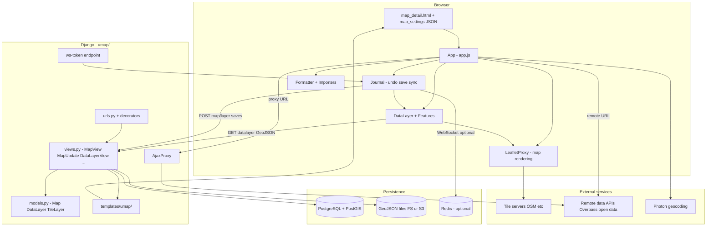

# uMap Onboarding — Phase 3: Architecture Mental Model

> **Status:** Phase 3 of 13 · Read-only investigation · Builds on [Phase 1](phase-1-what-is-umap.md) and [Phase 2](phase-2-domain-primer.md)  
> **Goal:** Reconstruct how uMap is actually structured — responsibilities, boundaries, and data flow — from the checked-out repository

---

## Before we look at directories

uMap is **not** a React SPA talking to a thin CRUD API. It is closer to a **classic Django web app with a large in-browser editor**:

1. The server **renders an HTML page** and embeds a JSON blob (`map_settings`) that bootstraps the client.
2. The browser runs a **vanilla ES-module application** (`App` in `app.js`) that owns editing, rendering, import, and most geo logic.
3. The server **persists map metadata in PostgreSQL** and **layer features in versioned GeoJSON files** (filesystem or S3).
4. Mutations during editing are tracked client-side in a **Journal** (undo/redo, dirty state, optional realtime sync over WebSocket + Redis).

**FACT:** Developer overview (`docs/dev/overview.md`): *"The server is meant to be a simple layer to do the storage and serve the JavaScript."*

**INFERENCE:** That description is directionally true for **feature geometry**, but understates the server’s role in **auth, permissions, search, proxying, versioning, merge/conflict resolution, and realtime coordination**.

Hold this split in mind:

| Side | Owns |
|---|---|
| **Server** | Users, permissions, map/layer records, GeoJSON file storage, HTML shell, JSON APIs, ajax proxy, optional WebSocket sync |
| **Client** | Leaflet rendering, drawing/editing UX, import parsing, styling rules, choropleth math, remote fetch orchestration, optimistic UI |

---

## Major architectural layers

Each subsection follows the same contract: **responsibility**, **inputs**, **outputs**, **neighbors**, and **what it should not own**.

---

### 1. Django HTTP application (`umap/`)

**FACT:** Single Django project; the `umap` app contains models, views, urls, templates, static assets, management commands, and sync code.

| | |
|---|---|
| **Owns** | HTTP routing, ORM models, permission checks, HTML responses, JSON mutation endpoints, admin, management commands |
| **Receives** | Browser HTTP requests (GET pages, POST saves, GET GeoJSON files) |
| **Produces** | HTML pages, JSON responses, GeoJSON file bytes, redirects |
| **Talks to** | PostgreSQL/PostGIS, filesystem/S3 (`STORAGES["data"]`), optional Redis (via sync) |
| **Should NOT own** | Leaflet rendering, feature styling algorithms, drawing interaction logic |

**Compare to:** A Node/Express app serving EJS templates + REST endpoints — except persistence uses Django ORM and GeoJSON files instead of storing features in SQL rows.

---

### 2. Persistence — PostgreSQL + GeoJSON files

**FACT:** `docs/config/storage.md`: metadata in PostgreSQL; layer content in GeoJSON on filesystem or S3.

**FACT:** `STORAGES` has three keys (`umap/settings/base.py`):

- `default` — pictogram uploads
- `staticfiles` — hashed static assets (`UmapManifestStaticFilesStorage`)
- `data` — datalayer GeoJSON (`umap.storage.fs.FSDataStorage` or `umap.storage.s3.S3DataStorage`)

**FACT:** `FSDataStorage` writes versioned files as `{uuid}_{timestamp_ms}.geojson` under `datalayer/{map_id_suffix}/...` and purges old versions (`UMAP_KEEP_VERSIONS`, default 10).

| | |
|---|---|
| **Owns** | Durable map/layer records; durable feature geometry files; version history |
| **Receives** | POST multipart saves from client; model saves from Django views |
| **Produces** | ORM rows; `.geojson` / `.geojson.gz` files; `X-Datalayer-Version` headers |
| **Talks to** | `DataLayerView` (serves files), `DataLayerUpdate` (writes + merge) |
| **Should NOT own** | Live Overpass results; remote API data (unless copied into a layer) |

**Compare to:** Firebase Auth + Firestore for metadata, Cloud Storage for large JSON blobs — same separation of **index record** vs. **blob payload**.

---

### 3. Domain models (`umap/models.py`)

**FACT:** Core entities:

| Model | Role |
|---|---|
| `Map` | Top-level map: center (`PointField`), zoom, slug, owner, editors, team, share/edit status, `settings` JSON |
| `DataLayer` | Layer metadata + `geojson` FileField; UUID PK; optional `parent` for nested layers |
| `TileLayer` | Admin-configured basemap definitions (URL template, zoom range, TMS flag) |
| `Team`, `Star`, `Licence`, `Pictogram` | Collaboration, favorites, licensing, icons |

**FACT:** `Map.can_view()` / `Map.can_edit()` and `DataLayer.can_edit()` (with `INHERIT`) encode authorization in Python, mirrored by URL decorators.

| | |
|---|---|
| **Owns** | Business rules for visibility, edit rights, cloning, trash, anonymous ownership cookies |
| **Receives** | Django `request` (user, cookies, session) |
| **Produces** | Boolean authorization; metadata dicts for client bootstrap |
| **Talks to** | Views, decorators, client permissions UI |
| **Should NOT own** | Client-side undo history; Leaflet layer state |

---

### 4. URL routing & permission decorators (`umap/urls.py`, `umap/decorators.py`)

**FACT:** Routes are grouped by capability:

| Decorator | Used for |
|---|---|
| `can_view_map` | Map page, GeoJSON read endpoints, datalayer file GET |
| `can_edit_map` | Map settings, create layer, clone, delete map, WS token |
| `can_edit_datalayer` | Layer update (per-layer edit rights) |
| `datalayer_belong_to_map` | Ensures layer belongs to map |
| `login_required` / `login_required_if_not_anonymous_allowed` | Dashboard, map create |

**FACT:** Edit endpoints use `FormLessEditMixin` — **POST-only**, JSON responses via `simple_json_response()`.

| | |
|---|---|
| **Owns** | The security perimeter at HTTP boundaries |
| **Receives** | Raw requests before views run |
| **Produces** | 403/PermissionDenied or passes `map_inst` / `datalayer_inst` into views |
| **Should NOT own** | Client-side edit mode toggling (UI can hide controls, server must still enforce) |

---

### 5. Map page bootstrap (Django templates → `App`)

**FACT:** Flow for viewing a map:

```
GET /map/{slug}_{id}
  → MapView (can_view_map)
  → MapDetailMixin.get_context_data()
  → builds geojson dict with properties + datalayer metadata tree
  → map_detail.html → map_init.html
```

**FACT:** `map_init.html` embeds settings and starts the client:

```html
<script id="map-settings" data-settings="{{ map_settings|escape }}"></script>
<script defer type="module">
    import App from '.../app.js'
    U.SETTINGS = JSON.parse(document.getElementById('map-settings').dataset.settings)
    U.MAP = new App("map", U.SETTINGS)
</script>
```

**FACT:** `MapDetailMixin.get_map_properties()` injects server config: tile layer list, importer config, schema, URLs, licence list, websocket flag, i18n, user info, edit/share status choices.

| | |
|---|---|
| **Owns** | Initial server→client handoff (single JSON bootstrap) |
| **Receives** | Map ORM object + request |
| **Produces** | Escaped JSON in HTML; preconnect hints for tile domains |
| **Talks to** | `App.init()` on the client |
| **Should NOT own** | Subsequent datalayer geometry loading (lazy fetch) |

**Compare to:** Next.js `getServerSideProps` passing props into a client component — except the payload is one GeoJSON-shaped document with nested `properties`.

---

### 6. Browser application — `App` (`umap/static/umap/js/modules/app.js`)

**FACT:** `App` extends `Utils.WithEvents` (pub/sub). It is the **root orchestrator**.

**FACT:** On init it:

- Merges query-string overrides into map properties (iframe embed params)
- Instantiates `LeafletProxy` (or `OLProxy` if `?openlayers`)
- Wires UI: panels, bars, controls, importer, formatter, permissions
- Creates `DataLayer` instances from bootstrap metadata
- Lazily loads `Journal` for edit/save/undo/realtime

| | |
|---|---|
| **Owns** | Edit mode, save orchestration, UI state, event routing between modules |
| **Receives** | Bootstrap JSON; user input; map/datalayer HTTP responses |
| **Produces** | POST saves; remote fetches; Leaflet map updates |
| **Talks to** | `LeafletProxy`, `DataLayer`, `Journal`, `Request`/`ServerRequest` |
| **Should NOT own** | Long-term persistence format; user authentication (uses session + server checks) |

**Compare to:** A Redux root store + coordinator — but implemented as a class with `fire()` events, not React.

---

### 7. Rendering layer — `LeafletProxy` (`rendering/leaflet.js`)

**FACT:** Wraps `L.Map`, tile layers, feature layers, editing hooks, bbox/center helpers.

**FACT:** Changelog 3.8.0: OpenLayers migration in progress; `?openlayers` switches to `OLProxy` (`rendering/openlayers.js`).

| | |
|---|---|
| **Owns** | Map viewport, pan/zoom, tile display, Leaflet↔uMap feature bridge |
| **Receives** | GeoJSON features from `DataLayer`; UI commands (fit bounds, edit geometry) |
| **Produces** | User events (`moveend`, `feature:click`); screen positions |
| **Should NOT own** | Saving to server; permission checks |

---

### 8. Data layer client — `DataLayer` (`data/layer.js`, `data/features.js`)

**FACT:** Client `DataLayer` mirrors server layer: properties, features collection, rendering type, remote data config, rules, filters.

**FACT:** Stored layers load geometry via GET `datalayer/{map_id}/{uuid}/` (`_dataUrl()`).

**FACT:** Save posts `FormData`: name, rank, settings JSON, geojson blob → `datalayer_update` or `datalayer_create`.

| | |
|---|---|
| **Owns** | In-memory feature set; layer styling type; remote fetch lifecycle |
| **Receives** | GeoJSON from server or remote URL; journal operations |
| **Produces** | `umapGeoJSON()` for save; rendered features via rendering sublayers |
| **Should NOT own** | Map-level settings (delegates to `App`) |

---

### 9. Journal — edit/sync/save (`journal/engine.js`)

**FACT:** Docstring summary:

> *Records every mutation as an operation, syncs with peers over websocket, persists on save, exposes undo/redo.*

**FACT:** `save()` walks dirty objects (map, datalayer, permissions), calls each object's `.save()`, clears dirty flags.

**FACT:** Optional realtime: `REALTIME_ENABLED` + Redis + WebSocket in `umap/sync/app.py`; client gets token from `map/{id}/ws-token/`.

| | |
|---|---|
| **Owns** | Operation log, undo/redo, optimistic merge with peers, save ordering (parent before child) |
| **Receives** | `journal.update()` / `upsert()` / `delete()` from UI actions |
| **Produces** | HTTP POSTs; WebSocket `OperationMessage`s |
| **Should NOT own** | HTTP routing; file versioning on disk (server storage does that on save) |

**Compare to:** Operational transformation / event sourcing lite — plus Firebase-style presence for collaborative editing when enabled.

---

### 10. Import, export, proxy services

| Component | Role |
|---|---|
| `Formatter` (`formatter.js`) | Parse gpx/kml/csv/osm/georss/geojson → GeoJSON |
| `importers/*.js` | Wizard UIs (Overpass, OpenDataSoft, communes, etc.) |
| `AjaxProxy` (`views.py`) | Server-side fetch + disk cache for remote URLs (`/ajax-proxy/{ttl}/?url=`) |
| External APIs | Photon search, OpenRouteService routing (configurable keys) |

| | |
|---|---|
| **Owns** | Format conversion; CORS bypass for remote data; cached proxy responses |
| **Should NOT own** | Storing remote data unless user copies into a layer |

**FACT:** Since 3.8.0, ajax proxy cache is Python-managed (`AJAX_PROXY_CACHE_DIR`), not Nginx-only.

---

### 11. Authentication & sessions

**FACT:** Default auth backends (`umap/settings/base.py`):

- Optional `OpenStreetMapOAuth2` if env keys set
- Always `ModelBackend` (username login disabled by default: `ENABLE_ACCOUNT_LOGIN=False`)

**FACT:** Anonymous maps use **signed cookies** (`ANONYMOUS_COOKIE_MAX_AGE` = 30 days) set on `MapCreate` / `MapClone`.

**FACT:** `social_django` URLs at `/` namespace; login popup flow ends at `login_popup_end`.

| | |
|---|---|
| **Owns** | User identity, session, OAuth handshake |
| **Should NOT own** | Map edit authorization beyond identity (that's `Map.can_edit`) |

---

### 12. Tests & tooling (architectural role)

**FACT:** `make test` runs Python unit tests, JS unit tests (Mocha), Playwright integration tests (`docs/contributing.md`).

| Suite | Location | Proves |
|---|---|---|
| Python pytest | `umap/tests/` | Models, views, storage, merge, permissions |
| JS Mocha | `umap/static/umap/unittests/` | geoutils, schema, etc. |
| Playwright | `umap/tests/integration/` | End-to-end browser flows |

**USEFUL LATER** — Phase 12 goes deeper.

---

## Architecture diagram



---

## Narrating the diagram

**Start here:** the user opens `GET /map/my-festival_26381`.

**Follow this arrow:** `MapView` loads the `Map` from PostgreSQL, checks `can_view`, builds a JSON structure (center, settings, datalayer **metadata only** — not full feature payloads), and renders `map_detail.html`.

**This component exists because…** Django delivers a fast first paint and injects everything the client needs to know about permissions, tile layers, and API URL templates — without requiring a separate SPA build step.

**The important boundary here:** the initial HTML includes **layer list + settings**, but **feature geometry is loaded separately** per layer via `datalayer/{map_id}/{uuid}/` when the client needs it. Remote layers skip file fetch and hit URLs instead.

**When the user edits:** UI actions call `journal.update(...)`. Nothing hits the server until **Save** (`Ctrl+S` → `saveAll()` → `journal.save()`). Dirty `DataLayer` objects POST GeoJSON blobs; dirty `Map` objects POST settings JSON.

**When the user pans a dynamic remote layer:** the client calls `fetchRemoteData()` — either directly to the remote API or through `ajax-proxy` if CORS/proxy is configured.

**Optional realtime path:** if `websocketEnabled`, the client authenticates via `ws-token`, connects WebSocket (ASGI routes to `sync/app.py`), exchanges operations through Redis pub/sub while editing. Save still persists to Django + files.

**Where frontend ends:** drawing, styling, choropleth breaks, import parsing, Leaflet events.

**Where backend begins:** permission enforcement, durable storage, versioning/merge on conflict (HTTP 412), search indexing, admin, proxy cache.

---

## Repository map (important paths only)

Not a full tree — only what matters for navigation.

| Path | Why it exists |
|---|---|
| `umap/models.py` | Domain model + `can_edit` / `can_view` |
| `umap/views.py` | All HTTP handlers (~1500 lines) |
| `umap/urls.py` | Route → decorator → view wiring |
| `umap/decorators.py` | Permission gates |
| `umap/templates/umap/` | HTML shells (`map_detail.html`, `map_init.html`) |
| `umap/static/umap/js/modules/app.js` | Client root |
| `umap/static/umap/js/modules/data/` | `DataLayer`, `Feature`, fields |
| `umap/static/umap/js/modules/journal/` | Save, undo, websocket sync |
| `umap/static/umap/js/modules/rendering/` | Leaflet/OpenLayers adapters |
| `umap/static/umap/js/modules/importers/` | Import wizards |
| `umap/storage/` | GeoJSON file versioning (FS/S3) |
| `umap/sync/` | WebSocket + Redis realtime |
| `umap/settings/` | `base.py` + `local.py` overrides |
| `umap/tests/integration/` | Playwright E2E |
| `docs/dev/frontend.md` | Maintainer notes on client structure |
| `docs/config/storage.md` | Storage model documentation |
| `Makefile` | `make develop`, `make test`, lint/format |

**Less important for first contributions:** `charts/` (Helm), `docker/`, most `management/commands/` unless doing ops.

---

## Naming & organization conventions (uMap’s own)

**FACT patterns observed:**

| Area | Convention |
|---|---|
| Python modules | Lowercase single package `umap/`; views/models in flat files |
| URL names | Snake case: `map_update`, `datalayer_view`, `datalayer_create` |
| Client modules | ES modules under `js/modules/`; default export for `App` |
| Client classes | `DataLayer`, `LeafletProxy`, `Journal` — PascalCase |
| Events | String names: `datalayer:changed`, `map:moveend` via `WithEvents` |
| API style | POST + JSON body or multipart; not REST verb purity |
| Layer file naming | `{uuid}_{timestamp}.geojson` on disk |
| Tests | `test_*.py` pytest; `test_*.py` Playwright in `integration/` |

**INFERENCE:** The codebase favors **pragmatic Django patterns** over DRF-style APIs. The client is modular but **not** component-framework-based.

---

## Five architectural facts to remember

1. **Hybrid persistence:** PostgreSQL for map/layer **metadata and permissions**; GeoJSON **files** for feature geometry (versioned, gzip-capable).

2. **Server-rendered bootstrap + fat client:** One JSON blob starts `App`; the editor runs entirely in the browser after load.

3. **Lazy layer loading:** Map page ships metadata; geometry fetched per datalayer (or per remote URL).

4. **Journal is the edit pipeline:** UI → journal operations → dirty tracking → `saveAll()` → HTTP POSTs. Undo/redo and optional realtime sit here.

5. **Permissions enforced twice:** Client hides/disables UI by `editMode`; server **must** reject unauthorized POSTs via decorators + `can_edit`.

---

## Phase 3 summary

### MUST UNDERSTAND NOW

- Django serves pages + JSON APIs; client owns the map editor
- `Map` / `DataLayer` exist in both ORM and client JS (related but not identical objects)
- Saves are explicit (`journal.save()`), not auto-sync on every click
- GeoJSON files are the source of truth for stored features
- URL decorators are the authority for who can read/write

### USEFUL LATER

- WebSocket/Redis realtime merge semantics (HLCC in `journal/hlc.js`)
- S3 vs filesystem storage differences
- OpenLayers migration (`?openlayers`)
- `DataLayerUpdate.merge()` for 412 conflicts

### Deliberately deferred

- Full repository tour with call graphs (Phase 4)
- Runtime walkthroughs (Phase 5)
- Local setup (Phase 7)

---

## What remains uncertain

| Topic | Status |
|---|---|
| Production deployment topology on umap.openstreetmap.fr | **UNKNOWN** from repo alone (Docker/Helm/Nginx docs exist; instance config does not) |
| How often realtime is enabled in practice | **UNKNOWN** — `REALTIME_ENABLED` defaults `False` |
| Whether OpenLayers will become default soon | **PARTIALLY KNOWN** — active prep in 3.8.x; Leaflet still default |
| Exact lazy-load sequence for all layer types | **INFERENCE** — needs Phase 5 trace |

---

## What we investigate next — Phase 4: Repository Tour

Phase 4 walks the **important modules** with caller/callee relationships:

- Who calls `MapDetailMixin.get_context_data` vs. `DataLayerView`
- How `urls.js` maps names to Django routes
- Where `umap.controls.js` fits relative to `app.js`
- Which directories you would touch for a typical frontend vs. backend fix

We still will **not** print the full tree.

---

## Pause here

You should now have a **structural** picture: where the server stops and the browser starts, and where GeoJSON files sit in the middle.

**Questions worth asking before Phase 4:**

- Do you want the Phase 4 tour weighted toward **frontend modules** or **Django views/models**?
- Should we trace the **save path** or **map load path** first in Phase 5?
- Any layer in the diagram that still feels like a black box?

When ready, say **"continue to Phase 4"** or ask questions.
