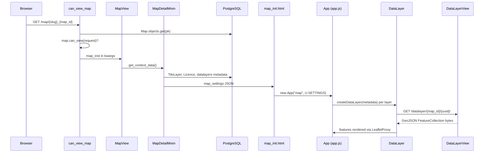
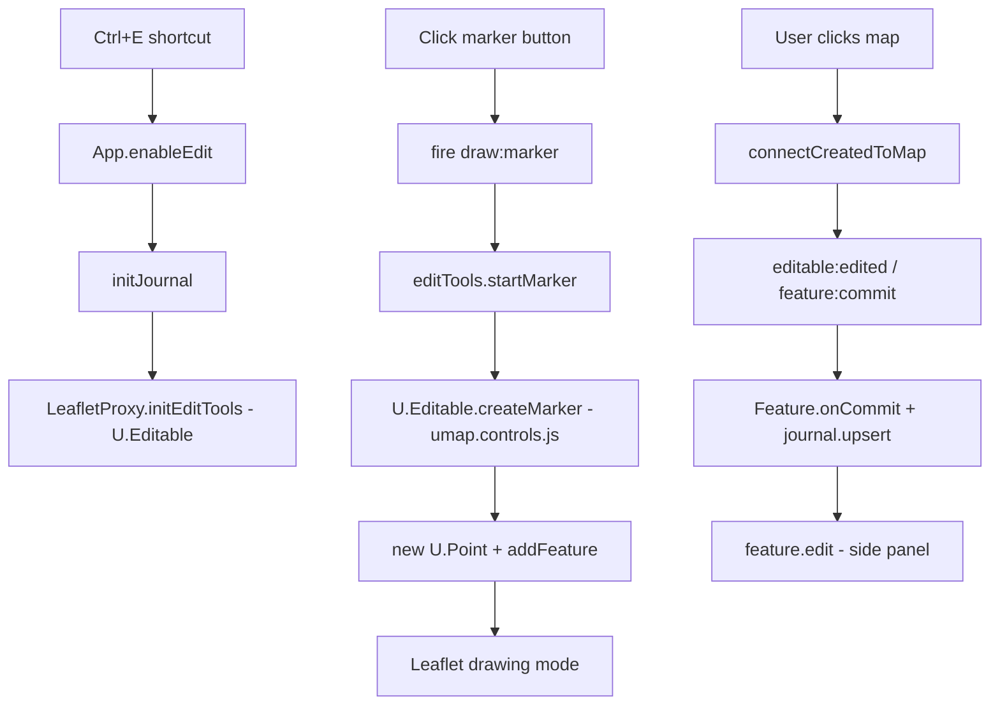
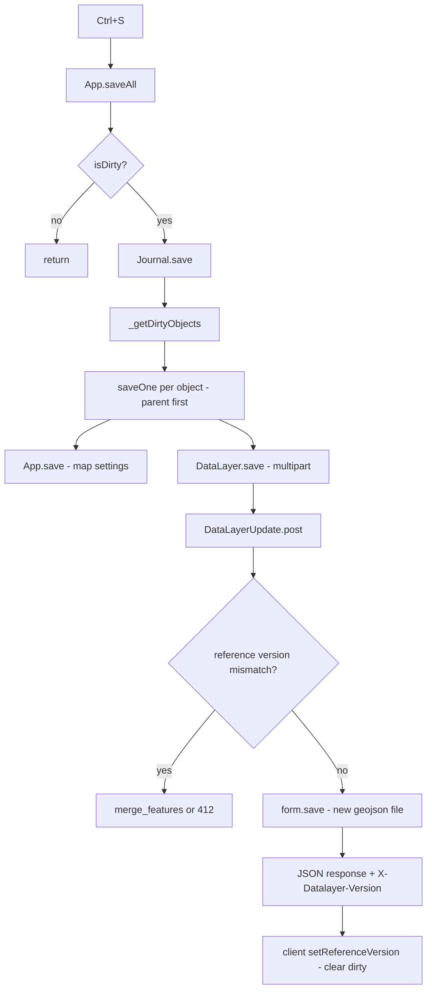
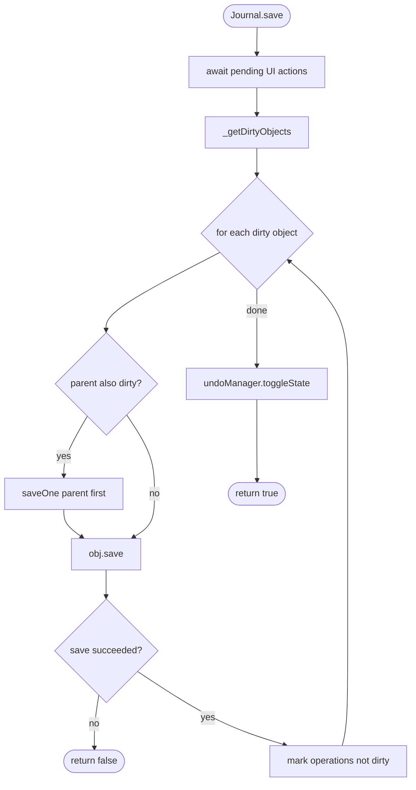
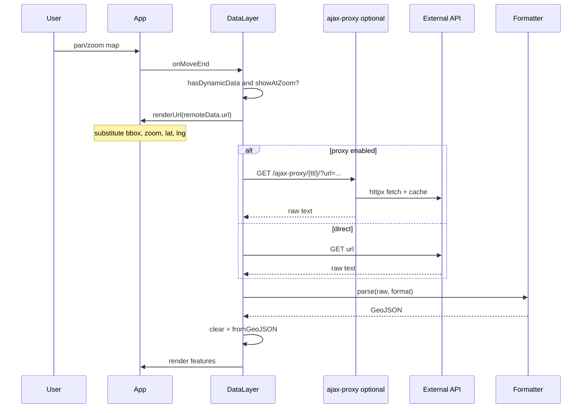

# uMap Onboarding — Phase 5: Vertical Runtime Walkthroughs

> **Status:** Phase 5 of 13 · Read-only investigation · Builds on [Phase 4](phase-4-repository-tour.md)  
> **Goal:** Follow real user actions through actual code — exact files, functions, and state transitions

---

## How to read this phase

Each walkthrough follows one user-visible action from browser to persistence (and back). For significant steps:

**Function** → inputs/state → decision/algorithm → transformation → outputs → next boundary

Evidence labels:

- **OBSERVED** — directly from implementation
- **INFERENCE** — reasonable from code structure
- **UNKNOWN** — not verified in this pass

We cover four flows that together explain most of the system:

1. **Open an existing map** (read path)
2. **Enter edit mode and draw a marker** (client edit path)
3. **Save the map** (write path + conflict handling)
4. **Load a dynamic remote data layer** (client fetch + proxy)

---

## Flow 1 — Open an existing map

### User action

You open a URL like `/en/map/festival-des-3-continents_26381` in the browser.

### Overview diagram



### Step-by-step

#### 1. HTTP routing and permission gate

**OBSERVED:** `umap/urls.py` registers:

```python
path("map/<slug:slug>_<int:map_id>", views.MapView.as_view(), name="map")
```

wrapped with `@can_view_map` and `@ensure_csrf_cookie`.

**`can_view_map`** (`umap/decorators.py`):

→ **Input:** `request`, `map_id` from URL  
→ **Algorithm:** `get_object_or_404(Map, pk=map_id)`; if `not map_inst.can_view(request)` → `PermissionDenied`  
→ **Output:** `kwargs["map_inst"]` injected; view proceeds  
→ **Next:** `MapView.get()`

**`Map.can_view()`** (`umap/models.py`):

→ **Input:** `request` (user, session, cookies)  
→ **Branches:** `share_status` PUBLIC/OPEN → allow; DRAFT/PRIVATE → owner, editor, or team member only; anonymous maps → cookie check if `UMAP_ALLOW_ANONYMOUS`  
→ **Output:** boolean  
→ **Next:** 403 page or continue

**Compare to:** Firebase security rules evaluated on read — except here it is Python on the server before any HTML is sent.

---

#### 2. Build the bootstrap JSON

**`MapView.get()`** → calls `DetailView.get()` → `get_context_data()`.

**`MapDetailMixin.get_context_data()`** (`umap/views.py`):

→ **Input:** `self.object` (= `map_inst`), `request`  
→ **Calls:** `get_map_properties()`, `get_geojson()`, `get_datalayers()`  
→ **Algorithm:**
  1. Start from `self.get_geojson()` — **OBSERVED:** returns `self.object.settings` (JSONField) with injected `name`, `permissions`, `author`
  2. Merge server properties: tile layer list, URL templates, schema, importers, `editMode`, i18n, user info
  3. Attach `datalayers` tree from `get_datalayers()`
  4. `json_dumps(geojson)` → template variable `map_settings`

**`MapView.get_datalayers()`**:

→ **Input:** `self.object.datalayers` queryset  
→ **Algorithm:** `[layer.metadata(request) for layer in datalayers]` then `layers_tree(layers)`  
→ **Output:** Nested array of layer **metadata only** — `id`, `rank`, `parent`, `properties` (settings), `permissions`, `referenceVersion`, `editMode`  
→ **NOT included:** feature geometries (those come later)

**`DataLayer.metadata()`** (`umap/models.py`):

→ **Input:** ORM row + request  
→ **Output:** dict without GeoJSON features — client uses `referenceVersion` to know layer exists on server

**`layers_tree()`** (`umap/utils.py`):

→ **Input:** flat layer list with `parent` pointers  
→ **Algorithm:** Build map by id; attach children to parent's `layers` array; remove non-root nodes  
→ **Output:** Tree for nested layer groups

---

#### 3. Render HTML and start the client

**`map_detail.html`** → includes **`map_init.html`**:

```html
<script id="map-settings" data-settings="{{ map_settings|escape }}"></script>
<script type="module">
    import App from '.../app.js'
    U.SETTINGS = JSON.parse(document.getElementById('map-settings').dataset.settings)
    U.MAP = new App("map", U.SETTINGS)
</script>
```

**`App.init()`** (`umap/static/umap/js/modules/app.js`) — ordered highlights:

→ **Input:** `geojson` bootstrap (geometry = map center point; `properties` = everything else)  
→ **Transformations:**
  1. `this.properties = { ...defaults, ...geojson.properties }`
  2. `new LeafletProxy(this, element)` — creates `L.Map`, no tiles yet
  3. `this.urls = new URLs(this.properties.urls)` — Django URL templates from `_urls_for_js()`
  4. `initDataLayers()` — see below
  5. `mapProxy.render()` — tiles, center, hash
→ **Output:** Interactive map shell; layers loading asynchronously

---

#### 4. Create client DataLayers (metadata only)

**`App.initDataLayers()`**:

```javascript
for (const spec of datalayers) {
  const datalayer = this.createDataLayer(spec, false)  // sync=false
}
// ...
for (const datalayer of this.layers.tree) {
  if (datalayer.showAtLoad()) toLoad.push(() => datalayer.show())
}
await Promise.all(chunk.map((func) => func()))  // batches of 10
this.fire('dataloaded')
```

**`createDataLayer(spec, sync)`**:

→ **Input:** server metadata spec  
→ **Algorithm:** `new DataLayer(this, spec)`; if `spec.features` present (rare in page load) → `fromUmapGeoJSON`; if `sync !== false` → journal upsert (skipped on initial load)  
→ **Output:** Client `DataLayer` in `LayerManager` tree

**`DataLayer` constructor** — key flags:

→ **`createdOnServer`** = `Boolean(this.referenceVersion)` — **OBSERVED**  
→ **`_needsFetch`** = `createdOnServer || isRemoteLayer()` — geometry not in memory yet

---

#### 5. Lazy-load layer geometry

**`DataLayer.show()`** (called for layers with `displayOnLoad` / `showAtLoad()`):

→ **Input:** layer visible flag  
→ **Algorithm:**
  1. `mapProxy.showLayer(this.id)` — create Leaflet pane if needed
  2. If `!isLoaded()` → `fetchData()`
→ **Output:** Features on map

**`DataLayer.fetchData()`**:

→ **Input:** `_dataUrl()` = `datalayer_view` + cache-bust query if editor  
→ **HTTP:** `ServerRequest.get(url)` — CSRF header on POST only; GET returns JSON body parsed as GeoJSON  
→ **Response headers:** `X-Datalayer-Version` → `setReferenceVersion()`  
→ **Body:** `FeatureCollection` from disk  
→ **Next:** `fromUmapGeoJSON(geojson)`

**Server: `DataLayerView.render_to_response()`** (`umap/views.py`):

→ **Input:** `DataLayer` ORM row  
→ **Algorithm:** Read `object.geojson` file; optional gzip; set `X-Datalayer-Version`  
→ **Output:** `application/geo+json` bytes (or X-Sendfile in production)

**`fromUmapGeoJSON()`** branch:

→ If `isRemoteLayer()` → `fetchRemoteData()` (Flow 4)  
→ Else → `fromGeoJSON()` → `addData()` per feature → `addFeature()` → `mapProxy.addFeature()`

---

### Flow 1 — what to remember

- First response = **HTML + fat JSON metadata**, not all geometries.
- **Permission check happens twice in spirit:** server before HTML; client `editMode` disables UI but is not security.
- **`dataloaded` event** = all `showAtLoad()` layers finished fetching.

### Flow 1 — uncertainties

- Exact caching headers on `DataLayerView` in production X-Sendfile mode — **OBSERVED** comment says dev mode lacks cache headers; production path depends on nginx config (**UNKNOWN** from repo alone).

---

## Flow 2 — Enter edit mode and draw a marker

### User action

On a map you can edit: press **Ctrl+E**, click the marker tool, click the map to place a marker.

### Overview diagram



### Step-by-step

#### 1. Enable edit mode

**Shortcut** (`App.initShortcuts`): `Ctrl+e` → `enableEdit()` if `hasEditMode()`.

**`App.enableEdit()`**:

→ **Input:** map already loaded  
→ **Algorithm:**
  1. `document.body.classList.add('umap-edit-enabled')`
  2. `await initJournal()` — lazy-import `Journal`, optional WebSocket auth
  3. `editEnabled = true`; show edit bar
  4. `mapProxy.initEditTools()` → `new U.Editable(this.app)` if not exists
→ **Output:** Drawing tools available; dirty tracking active  
→ **Next:** User picks a tool

**`hasEditMode()`** — **OBSERVED:** derived from bootstrap `properties.editMode` (`advanced`, `simple`, or `disabled`) set server-side in `MapView.edit_mode`.

---

#### 2. Start marker drawing

**Edit bar** (`ui/bar.js`): marker button click → `app.fire('draw:marker')`.

**`LeafletProxy`** (`rendering/leaflet.js`) listens:

```javascript
this.app.on('draw:marker', () => this.map.editTools.startMarker())
```

**`L.Editable.startMarker()`** (vendor) → calls **`U.Editable.createMarker(latlng)`** override (`umap.controls.js`):

→ **Input:** `latlng` from click or map center  
→ **Algorithm:**
  1. `datalayer = app.defaultEditDataLayer()` — last used, or first visible layer that allows features, or `createDataLayer()`
  2. `point = new U.Point(app, datalayer, { geometry: { type: 'Point', coordinates: [lng, lat] } })`
  3. `point._needs_upsert = true` — flags journal on commit
  4. `datalayer.addFeature(point)` — **sync=false** (no journal yet)
  5. `mapProxy.startDrawing(layerId, point.toRenderer())` — builds Leaflet layer
→ **Output:** Marker follows cursor in drawing mode

**`defaultEditDataLayer()`** (`app.js`) — **OBSERVED** priority: last used → visible browsable layer → any browsable → create new layer.

---

#### 3. Place the marker

**Leaflet.Editable** on click → `connect()` → **`U.Editable.connectCreatedToMap(layer)`** → `LeafletProxy.connectDrawing(layer)` adds layer to feature group.

**`editable:edited`** on marker → **`LeafletMarker.onCommit`** (`rendering/ui.js`) fires `feature:commit` with `toGeometry()`.

**`LeafletProxy`** listens:

```javascript
this.map.on('feature:commit', (event) => {
  this.getFeatureById(event.id)?.onCommit(event.geometry)
})
```

**`Feature.onCommit(geometry)`** (`data/features.js`):

→ **Input:** GeoJSON geometry `{ type: 'Point', coordinates: [lng, lat] }`  
→ **Algorithm:**
  1. Store `_geometry`; backup previous
  2. If remote layer → return early (no local journal)
  3. If `_needs_upsert` → `journal.upsert(toJournal())` then clear flag
  4. Else → `journal.update('geometry', ...)`
→ **Output:** Operation in journal log; `isDirty` becomes true  
→ **Next:** `editable:drawing:commit` → `feature.edit()` opens edit panel

**Journal upsert** (`journal/engine.js`):

→ Adds operation to `_operations`; `_undoManager` records stage; optionally broadcasts on WebSocket if sync enabled.

---

### Flow 2 — what to remember

- Drawing bridges **legacy `U.Editable`** and **module `Feature`** via events (`feature:commit`).
- Features are **not journaled on `addFeature`** during draw — commit happens on **`onCommit`** when `_needs_upsert` is set.
- **Nothing is persisted to the server** until Save (Flow 3).

---

## Flow 3 — Save the map (Ctrl+S)

### User action

After editing, press **Ctrl+S** (or click Save).

### Overview diagram



### Step-by-step

#### 1. Client save orchestration

**`App.saveAll()`**:

→ **Input:** `isDirty` from `journal._undoManager.isDirty()`  
→ **Algorithm:** if default extent unchanged, `_setCenterAndZoom()`; `await journal.save()`  
→ **On success:** `render(...)`, success alert, `fire('saved')`

**`Journal.save()`** (`journal/engine.js`):

```text
await pending user actions
dirtyMap = _getDirtyObjects()   // Map of object → dirty operations
for each obj in dirtyMap:
    saveOne(obj)                // parents before children
    obj.save()                  // App.save or DataLayer.save
    mark operations dirty=false
undoManager.toggleState()
```

**`_getDirtyObjects()`** — **OBSERVED:** If `!app.id` (new map), forces `App` into dirty set even without operations (first save creates map row).

---

#### 2. Save map metadata (if dirty)

**`App.save()`** (`app.js`):

→ **Input:** `properties`, center geometry  
→ **Builds `FormData`:**
  - `name`, `is_template`, `tags`
  - `center` = JSON.stringify Point geometry
  - `settings` = JSON.stringify entire map Feature-like object (`exportProperties()`)
→ **POST:** `urls.map_save({ map_id })` → `map_create` or `map_update`  
→ **Headers:** `X-CSRFToken` from cookie (`ServerRequest.post`)  
→ **Response:** `{ id, url, permissions, user }` — on first create, sets `this.properties.id`

**Server: `MapUpdate.form_valid`** / **`MapCreate.form_valid`**:

→ Writes `Map.settings` JSONField, center PointField, slug, etc.  
→ Returns `simple_json_response(...)`

---

#### 3. Save layer geometry

**`DataLayer.save()`** (`data/layer.js`):

→ **Input:** in-memory features  
→ **Algorithm:**
  1. If not loaded and not remote → `fetchData()` first
  2. Build `FormData`:
     - `name`, `parent`, `display_on_load`, `rank`
     - `settings` = JSON.stringify(layer properties (remoteData, type, rules, …))
     - `geojson` = Blob of `umapGeoJSON()` FeatureCollection
  3. `POST datalayer_save` with header `X-Datalayer-Reference: referenceVersion` if updating
→ **Output:** success boolean

**`umapGeoJSON()`** — serializes all features in layer to GeoJSON FeatureCollection for the blob.

---

#### 4. Server conflict detection and merge

**`DataLayerUpdate.post()`** (`umap/views.py`):

→ **Input:** `X-Datalayer-Reference` header, uploaded geojson file  
→ **Algorithm:**

```text
if incoming referenceVersion != object.reference_version:
    merged = merge(referenceVersion)
    if merged is None: return HTTP 412
    replace request.FILES['geojson'] with merged bytes
    session['needs_reload'] = True
return super().post()  # form validation
```

**`merge()`** — **OBSERVED:**
1. Load **reference** version file (what client based edits on)
2. Load **latest** from current `geojson` file
3. Load **incoming** from upload
4. `merge_features(reference.features, latest.features, incoming.features)` in `utils.py`
5. On `ConflictError` → return None → 412

**Client on 412** (`DataLayer._trySave`):

→ `AlertConflict` offers force re-save; user may choose merged resolution path.

**`form_valid`** on success:

→ `DataLayer.save()` → new timestamped `.geojson` file via `FSDataStorage`  
→ `onDatalayerSave` purges old versions (keep `UMAP_KEEP_VERSIONS`)  
→ Response JSON includes updated `metadata` + optional full `geojson` if merge reload needed  
→ Header `X-Datalayer-Version` updated

---

#### 5. Persistence on disk

**`FSDataStorage.make_filename()`** — **OBSERVED:**

```python
name = "%s_%s.geojson" % (instance.pk, int(time.time() * 1000))
```

Path: `datalayer/{map_id_suffix}/.../{uuid}_{timestamp}.geojson`

→ **PostgreSQL row** updates `settings`, `name`, `rank`, file pointer  
→ **File** holds all features

---

### Save algorithm (pseudocode)

```text
function journalSave():
  await allPendingUIActions()
  dirtyObjects = collectObjectsWithDirtyOperations()
  for obj in topologicalOrder(dirtyObjects):  // parent layers first
    if not await obj.saveToServer():
      return false
  clearDirtyFlags()
  notifyPeersSaved()  // if websocket
  return true
```



### Read-Aloud Diagram Walkthrough

Start at **Journal.save**. First we wait for any in-flight UI action so the operation log is complete. Then **`_getDirtyObjects`** walks all journal operations marked dirty and groups them by the target object — map, datalayer, feature permissions, etc.

For each object, **`saveOne`** checks whether the parent must be saved first (nested layers). Then it calls that object's **`save()`** method. For the map, that is **`App.save`** posting settings. For a layer, it is **`DataLayer.save`** posting multipart GeoJSON.

If any save fails — including HTTP 412 conflict — the whole **`Journal.save`** returns false and dirty flags remain. On full success, operations are marked clean and the undo manager toggles state so undo/redo boundaries align with this save point.

---

### Flow 3 — what to remember

- Save is **explicit** and **batch-oriented** through Journal.
- Layer saves are **multipart** with a **version header** for optimistic concurrency.
- **GeoJSON file is rewritten** on each save, not row-per-feature SQL updates.

---

## Flow 4 — Dynamic remote data layer

### User action

A layer is configured with a remote URL (e.g. Overpass query) and **dynamic** mode. You pan the map; features refresh for the current view.

### Overview diagram



### Step-by-step

#### 1. Layer is marked remote

**`DataLayer.isRemoteLayer()`** — **OBSERVED:**

```javascript
return Boolean(this.properties.remoteData?.url && this.properties.remoteData.format)
```

Configured via import dialog ("Link to layer as remote data") or layer settings UI → stored in layer `settings` JSON (DB) but **not** in geojson file content for features.

**`fromUmapGeoJSON()`** on such a layer skips file features → **`fetchRemoteData()`** immediately.

---

#### 2. Re-fetch on map move

**Constructor** registers:

```javascript
this.app.on('map:moveend', () => this.onMoveEnd())
```

**`onMoveEnd()`**:

→ **Input:** current map bbox/zoom in `mapProxy`  
→ **Condition:** `hasDynamicData()` AND `showAtZoom()`  
→ **Action:** `fetchRemoteData()`

**`hasDynamicData()`** = remote layer + `remoteData.dynamic === true`.

**`showAtZoom()`** — checks optional `fromZoom` / `toZoom` layer properties against current zoom.

---

#### 3. Build URL and fetch

**`fetchRemoteData()`**:

→ **Input:** `remoteData.url`, `format`, optional `proxy`, `ttl`  
→ **Algorithm:**
  1. `remoteUrl = app.renderUrl(remoteData.url)` — substitutes `{bbox}`, `{north}`, `{south}`, `{east}`, `{west}`, `{lat}`, `{lng}`, `{zoom}` from `LeafletProxy.getGeoContext()`
  2. If `proxy` → `app.proxyUrl(url, ttl)` → `/ajax-proxy/{ttl}/?url=encoded`
  3. `getUrl()` → `Request.get` (not ServerRequest — remote may be cross-origin without CSRF)
  4. On success: `clear(false)`, `formatter.parse(raw, format)`, `fromGeoJSON(geojson, false)`
→ **Output:** Replaced in-memory features; map redrawn

**`App.renderUrl()`**:

```javascript
return Utils.greedyTemplate(url, this.mapProxy.getGeoContext(), true)
```

**`getGeoContext()`** (`leaflet.js`) — **OBSERVED:**

```javascript
{ bbox: "west,south,east,north", north, south, east, west, lat, lng, zoom, ... }
```

---

#### 4. Ajax proxy (optional)

**`AjaxProxy.get()`** (`umap/views.py`) — async:

→ **Input:** `url` query param, `ttl` path segment  
→ **Algorithm:** validate URL (no private IPs); check disk cache in `AJAX_PROXY_CACHE_DIR`; if stale, fetch with `httpx` (max 25MB); cache file  
→ **Output:** proxied response to browser  
→ **Why:** CORS bypass + server-side caching (changelog 3.8: moved from nginx to Python)

---

#### 5. Parse and render

**`Formatter.parse(str, format)`** — switch on `geojson`, `osm`, `gpx`, `kml`, `csv`, `georss`.

For Overpass → typically **`osm`** → `osm2geojson` → FeatureCollection.

**`fromGeoJSON(..., sync=false)`** — does not journal remote features as local edits (remote layer edits are blocked in several paths).

---

### Remote vs stored — decision table

| Mode | Stored in uMap geojson file? | Refetch on pan? |
|---|---|---|
| Copy into layer | Yes | No |
| Remote static URL | No | No (fetch once when shown) |
| Remote **dynamic** | No | Yes (`onMoveEnd`) |

---

### Flow 4 — what to remember

- Remote layers still have a DB row + settings JSON; only **features** are external.
- URL templates tie map motion to API queries — same mechanism as OpenDataSoft `in_bbox()` tutorials.
- **Proxy is optional** per layer (`remoteData.proxy`).

---

## Cross-flow comparison

| Concern | Open map | Draw marker | Save | Remote layer |
|---|---|---|---|---|
| Server round-trip | HTML + N×GET geojson | None until save | POST map + POST layers | GET external or proxy |
| Permission | `can_view_map` | `editMode` client + `can_edit_map` on save | `can_edit_datalayer` | View map; fetch from browser |
| Persistence | Read files | Memory + journal | Write files + DB | External source |
| Key client class | `App.init` | `U.Editable`, `Feature` | `Journal` | `DataLayer.fetchRemoteData` |
| Key server class | `MapView`, `DataLayerView` | — | `MapUpdate`, `DataLayerUpdate` | `AjaxProxy` |

---

## Phase 5 summary

### MUST UNDERSTAND NOW

1. **Map load = metadata bootstrap + lazy per-layer GET** for stored layers.
2. **Edit = journal operations in memory**; Leaflet events commit geometry into journal.
3. **Save = Journal walks dirty objects**; layers POST multipart GeoJSON with version header.
4. **Remote dynamic layers refetch on `moveend`** with URL template substitution.
5. **Conflict merge** uses three versions: reference (client base), latest (server), incoming (upload).

### USEFUL LATER

- WebSocket operation broadcast during edit (parallel to journal, not replace save)
- `merge_features` algorithm details in `utils.py`
- New map first-save path (`!app.id` special case in `_getDirtyObjects`)

### Deliberately deferred

- Choropleth recompute on load
- Cluster spiderfy drag journal path
- Full permission edit panel save flow

---

## What remains uncertain

| Topic | Status |
|---|---|
| Exact order of map vs layer save when both dirty | **OBSERVED** `_getDirtyObjects` iteration order depends on operation log sort — map usually saves when settings changed |
| Whether all deployments use ajax proxy for Overpass | **INFERENCE** — public instances often enable proxy for CORS; configurable per layer |
| Playwright test coverage for 412 merge UX | **OBSERVED** `test_optimistic_merge.py` exists — not traced here |

---

## What we investigate next — Phase 6: Algorithms & Data Transformations

Phase 6 goes deeper on:

- `merge_features` three-way merge
- `Formatter` import normalization
- Choropleth break algorithms in `types.js`
- Conditional `rules.js` evaluation
- `layers_tree` and field inference

---

## Pause here

You should now be able to **simulate** opening a map, placing a marker, saving, and refreshing remote data — with file names attached to each step.

**Questions before Phase 6:**

- Want a **network payload cheat sheet** (exact FormData fields) as a sidebar?
- Should Phase 6 start with **merge/conflict** or **import/format** algorithms?
- Any flow above that felt like a black box still?

When ready, say **"continue to Phase 6"** or ask questions.
