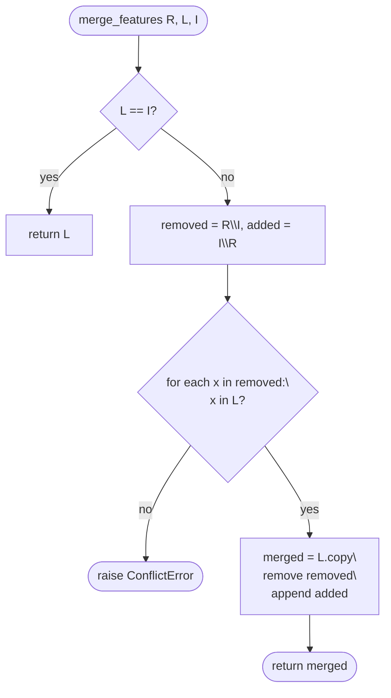

# uMap Onboarding — Phase 6: Algorithms & Data Transformations

> **Status:** Phase 6 of 13 · Read-only investigation · Builds on [Phase 5](phase-5-runtime-walkthroughs.md)  
> **Goal:** Understand where real algorithmic thinking lives — inputs, branches, edge cases, and why the code is shaped this way

---

## How to read this phase

Phase 5 followed **control flow**. Phase 6 zooms into **transformations**: what changes, how, and what can go wrong.

Each section:

1. States the **problem**
2. Shows **inputs → steps → outputs** (language-agnostic first, then file mapping)
3. Calls out **branching and edge cases**
4. Notes **why** the implementation looks this way

Evidence: **OBSERVED** = from code/tests; **INFERENCE** = design intent.

---

## Map of algorithmic areas

| Area | Location | When it runs |
|---|---|---|
| Three-way feature merge | `umap/utils.py` → `merge_features` | Layer save conflict (HTTP 412 path) |
| Import normalization | `formatter.js` | Import, remote fetch parse |
| Save serialization | `data/layer.js` → `umapGeoJSON` | Every layer save |
| Style resolution | `data/layer.js` → `getProperty` | Render, popups, export preview |
| Conditional rules | `rules.js` + `data/fields.js` | Per-feature styling |
| Layer type classification | `data/types.js` | Choropleth, Categorized, Circles, Cluster, Heat |
| Field inference | `data/layer.js` → `inferFields` | New/imported features |
| Layer tree build | `utils.py` → `layers_tree` | Server bootstrap |
| Proxy URL validation | `utils.py` → `validate_url` | Ajax proxy requests |
| Data browser filters | `filters.js` | UI filtering (client-only) |

---

## 1. Three-way feature merge (`merge_features`)

### Problem

Two editors save the same layer concurrently. The client sends GeoJSON based on **reference version R**. The server’s current file is **latest L**. The upload is **incoming I**. How do you combine without losing either party’s intent?

### OBSERVED algorithm

```text
function merge_features(reference, latest, incoming):
  if latest == incoming:
    return latest                    // fast path: no server change since client loaded

  removed = features in reference not in incoming   // client deleted these
  added   = features in incoming not in reference // client added these

  for item in removed:
    if item not in latest:
      raise ConflictError            // someone else already removed/changed it

  merged = copy(latest)
  for item in removed:
    merged.remove(item)              // apply client deletions
  for item in added:
    merged.append(item)              // apply client additions

  return merged
```

**Critical detail:** Equality is **whole-feature dict equality** (Python `==`), not ID-based diff. Tests use simple lists like `["A","B"]` and GeoJSON-like dicts.

### Branching decisions

| Case | Result |
|---|---|
| `latest == incoming` | Return `latest` unchanged |
| Client removed feature still in `latest` | Remove from merged |
| Client removed feature **not** in `latest` | **ConflictError** (412) — another editor already changed it |
| Client added new features | Append to merged |
| Same feature “changed” on both sides (present in reference, different in latest and incoming) | **ConflictError** — treated as remove+add ambiguity |

**OBSERVED** from `umap/tests/test_merge_features.py`:

- Adding + removing in one edit works: `reference [A,B]`, `latest [A,C]`, `incoming [A,B,D]` → `[A,C,D]`
- Order of features in `latest` is preserved; new items append at end
- If reference lacks IDs but latest/incoming have different IDs → **ConflictError** (`test_merge_with_ids_raises`)

### Why structured this way

**INFERENCE:** This is a **set-diff merge**, not a field-level OT merge. It is simple and fast for “add/remove features” edits but **cannot merge two edits to the same feature’s geometry/properties**. That case raises 412 and forces the user to choose (client shows `AlertConflict`).

**Compare to:** Git merge on lines — uMap merge is closer to **merge by feature identity as opaque blobs**.



### Python connection

`DataLayerUpdate.post()` in `umap/views.py` loads R from version file, L from current file, I from upload, calls `merge_features`, replaces upload on success.

---

## 2. Import normalization (`Formatter`)

### Problem

Users paste/upload GPX, KML, CSV, OSM XML, GeoRSS, or GeoJSON. The editor needs a uniform **`FeatureCollection`** with uMap-friendly properties.

### Pipeline

```text
raw string
  → parse(format) switch
  → adapter (togeojson / osm2geojson / csv2geojson / JSON.parse)
  → optional cleanup
  → FeatureCollection
  → DataLayer.makeFeatures → Point | LineString | Polygon instances
```

### Per-format transformations (OBSERVED)

| Format | Key steps |
|---|---|
| **geojson** | `JSON.parse` — no normalization |
| **gpx** | `togeojson.gpx`; copy `desc` → `description`; strip `_` keys and object-valued properties |
| **kml** | `togeojson.kml` with `skipNullGeometry: true` |
| **osm** | `osm2geojson` with `flatProperties: true`; split `properties.id` into `osm_type`, `osm_id` |
| **georss** | `GeoRSSToGeoJSON.parse` |
| **csv** | `csv2geojson` auto delimiter; European decimal comma; if no lat/lon, scan columns `geom`, `geometry`, `wkt`, `geojson` and parse via JSON or **betterknown** WKT |

### CSV edge case (important)

If `csv2geojson` produces `geometry: null` for all rows:

1. Try embedded geometry columns
2. If still null → **error**: *"No geo column found: must be either lat/lon or geom(etry)"*
3. Blank CSV (≤2 lines) → debug log only, no alert

### After parse: `makeFeatures`

**OBSERVED** (`data/layer.js`):

1. Normalize to array of features
2. `Utils.sortFeatures(collection, sortKey, lang)` — stable sort for display order
3. `GeometryCollection` → split into multiple features sharing properties
4. `MultiPoint` in edit mode → error alert; otherwise handled per geometry type
5. `inferFields(feature)` for each new feature — adds column types to layer schema

### Export (`stringify`)

Symmetric adapters: GeoJSON, GPX (add `desc`), KML, CSV (add Lat/Lon columns, strip `_umap_options`), WKT column via betterknown.

**INFERENCE:** Import/export is deliberately **lossy for uMap-internal keys** (`_umap_options` stripped on CSV export) — round-trip may lose styling unless stored in normal properties.

---

## 3. Save serialization (`umapGeoJSON`)

### Problem

Persist a layer’s state to a single GeoJSON file the server can store and re-serve.

### OBSERVED shape

```javascript
umapGeoJSON() {
  features = isRemoteLayer ? [] : all features
  return {
    type: 'FeatureCollection',
    features: features.map(f => f.toJournal()),  // { type, geometry, properties, id }
    properties: layer.properties,              // remoteData, type, rules, fields…
    id: layer.id,
    rank: layer.rank,
    parent: parentId,
  }
}
```

**Key decisions:**

- **Remote layers save empty `features[]`** — geometry lives at URL, not on disk
- **`toJournal()`** = `toGeoJSON()` + feature `id` (client UUID)
- Layer metadata duplicated: DB `settings` JSON **and** top-level keys in file (historical compatibility)

### Render vs save split

| Method | Purpose |
|---|---|
| `umapGeoJSON()` | Persistence — raw properties, no resolved styles |
| `toRenderer()` | Map display — includes computed `style` per feature, filters empty/filtered features |

**OBSERVED comment:** *"`style`. Never saved (cf umapGeoJSON, the save format)."*

**INFERENCE:** Classification (choropleth colors) is **recomputed on load** via `compute()`, not stored per feature in the file — unless encoded in `_umap_options` on features.

---

## 4. Style resolution cascade (`getProperty`)

### Problem

A feature’s visible color/icon/weight can come from many sources: layer type math, rules, layer defaults, parent group, map defaults, feature-level overrides.

### OBSERVED resolution order (`DataLayer.getProperty`)

```text
function getProperty(key, feature):
  if computed[feature.id][key] exists:     // Choropleth/Categorized/Circles output
    return it

  if feature:
    value = rules.getOption(key, feature) // first matching conditional rule
    if value defined: return it

  if layer owns key in settings:
    return layer value

  if layer.Type.defaults[key]:
    return default

  return parent.getProperty(key, feature) // parent group or App
```

**Feature.getOption** walks up: feature `_umap_options` → datalayer → app.

**Feature.getDynamicOption** additionally runs `greedyTemplate` for `{variable}` substitution in style strings; invalid result falls back to schema default.

### Why this order

**INFERENCE:**

1. **Computed layer types** win — they are data-driven visualizations
2. **Rules** override static layer settings for matching features
3. **Inheritance** matches user mental model (map → group → layer → feature)

```mermaid
flowchart TD
    Q[getProperty key, feature] --> C{computed[id][key]?}
    C -->|yes| R1[return computed]
    C -->|no| RU{rules match?}
    RU -->|yes| R2[return rule property]
    RU -->|no| LO{layer own property?}
    LO -->|yes| R3[return layer]
    LO -->|no| TD{Type default?}
    TD -->|yes| R4[return default]
    TD -->|no| R5[parent.getProperty]
```

---

## 5. Conditional style rules (`rules.js`)

### Problem

Apply styles when `population>10000`, `name=`, `status!=true`, etc. First match wins (per FAQ).

### Rule parsing (`Rule.parse`)

**OBSERVED:**

1. Scan condition string for operators in order: `>`, `<`, `!=`, `=` (also HTML `&lt;` for `<`)
2. Split into `[field, expected]`
3. Resolve `field` via layer `Fields` registry (typed) or ad-hoc `String` field
4. Bind operator method: `gt`, `lt`, `not_equal`, `equal` on field class
5. **Empty expected** (`mycolumn=`): cast checks null/undefined/'' 
6. **Numeric comparison on non-Number field**: coerce with `parseFloat` for `>`/`<`

### Matching (`Rule.match`)

```text
match(props):
  if no operator or inactive or no field: return false
  return operator(expected, cast(props[field.key]))
```

### Application (`Rules.getOption`)

```text
for rule in rules in order:
  if rule.match(feature.properties):
    if rule.properties[key] is schema-valid:
      return value
// else undefined → fall through cascade
```

**Edge cases:**

- Inactive rules (`active=false`) skipped
- Reorder via drag updates `rules` array order → journal `properties.rules`
- Same property in multiple rules: **first match wins** (documented in FAQ)

**Compare to:** CSS cascade with explicit ordered `@rules` — no specificity scores, just list order.

---

## 6. Choropleth classification (`types.js` → `Choropleth.compute`)

### Problem

Color polygons by numeric property (e.g. population) using statistical bins.

### Inputs

- `properties.choropleth` config (property key, mode, classes, brewer scheme, manual breaks)
- `features[]` with numeric `properties[key]`
- `fields` list for default key fallback

### Algorithm

```text
values = features.map(f => +f.properties[key])
classes = min(requested_classes, values.length)

switch mode:
  manual:     parse comma-separated breaks
  equidistant: equalIntervalBreaks(values, classes)    // simple-statistics
  jenks:      jenks(values, classes)
  quantiles:  quantile at 0, 1/n, 2/n, …, 1
  default:    ckmeans(values, classes) + max(values)   // k-means variant

thresholds = breaks.slice(1)   // first break is lower bound only
colors = colorbrewer[scheme][thresholds.length]

for each feature:
  find first threshold where value <= threshold
  assign colors[index] to feature.id in output map

build legend items from consecutive break pairs
```

### Branching / edge cases

- No values → empty `{ properties: {}, caption: null }`
- Invalid brewer scheme → fallback `'Blues'`
- NaN values → loop may not assign color (feature keeps cascade fallback)

### Why client-side

**OBSERVED:** Runs in `DataLayer.compute()` after `addData`, before `toRenderer()`. Re-runs when data changes — no server round-trip.

**INFERENCE:** Appropriate for interactive tuning; cost scales with feature count (tests use Playwright `test_choropleth.py`).

```mermaid
flowchart TD
    Start([Choropleth.compute]) --> V[extract numeric values]
    V --> Empty{values empty?}
    Empty -->|yes| E([return empty])
    Empty -->|no| Mode{mode}
    Mode --> M[compute breaks array]
    M --> T[thresholds = breaks[1:]]
    T --> Col[assign colorbrewer colors]
    Col --> Map[for each feature:\\nfirst threshold where value <= t]
    Map --> Out([properties per feature id + caption])
```

---

## 7. Related layer types (shorter)

### Categorized (`Categorized.compute`)

- **Input:** string property key
- **Categories:** manual comma list OR unique sorted values (`naturalSort`)
- **Output:** map `feature.id → color` from ColorBrewer/Accent palette
- **Use case:** nominal data (type of POI, status)

### Proportional circles (`Circles.compute`)

- **Input:** numeric property
- **Radius:** sqrt scale between `minPX` and `maxPX` (default 2–50px)
- **Formula (OBSERVED):**

```text
radius = minPX + ((sqrt(value) - sqrt(min)) / (sqrt(max) - sqrt(min))) * (maxPX - minPX)
```

- **Why sqrt:** Area perception — doubling value should feel like ~1.4× radius, not 2×

### Cluster (`rendering/layers/cluster.js`)

- Groups coincident/near markers; **spiderfy** uses spiral layout in pixel space (`_spiderfyLatLng`)
- Recomputes on `moveend` (changelog: cluster redraw fix)
- Algorithm is geometric/UI, not statistical

### Heat (`rendering/layers/heat.js`)

- Delegates to Leaflet.heat — density kernel in screen space (**USEFUL LATER** for deep dive)

---

## 8. Field inference (`inferFields`)

### Problem

Imported or drawn features bring arbitrary property keys. The table editor, rules, and filters need a **schema**.

### OBSERVED algorithm (`DataLayer.inferFields`)

```text
for key in feature.properties:
  skip if key starts with '_'
  skip if value is object
  skip if any ancestor layer already has field key

  type = 'String'
  if key == 'description': type = 'Text'

  fields.add({ key, type })
```

**Not inferred:** Number/Date types from values — user can change in field editor.

**Default fields** (`getDefaultFields`): `name` (or `U.DEFAULT_LABEL_KEY`) + `description`.

**INFERENCE:** Conservative typing avoids mis-classifying `"2024"` as Number; keeps import forgiving.

---

## 9. Layer tree (`layers_tree`)

### Problem

Flat `DataLayer` rows have `parent_id` for groups. Client and bootstrap need **nested** `layers[]` arrays.

### OBSERVED algorithm (`utils.py`)

```text
root = { id: { ...layer, layers: [] } for each layer }
for branch in root.values():
  if branch.parent:
    attach branch to root[parent].layers
for branch in root.copy():
  if branch.parent: delete from root  // keep only roots
  delete parent key from node
  if layers empty: delete layers key
return list(root.values())
```

**Edge case:** Missing parent logs error, skips attach (orphan metadata).

**Compare to:** Building a forest from adjacency list — O(n) single pass.

---

## 10. Ajax proxy validation (`validate_url`)

### Problem

Server fetches user-supplied URLs. Must block SSRF to internal networks and require same-site referer.

### OBSERVED checks

1. GET only; `url` query param required
2. URLValidator (spaces → `+` for Overpass queries)
3. `HTTP_REFERER` hostname must match `SITE_URL` hostname
4. Target must have hostname; not `localhost`; not same netloc as site
5. `assert_public_ip`: DNS resolve all addresses; reject private IPs

**INFERENCE:** Defense in depth for open proxy abuse — relevant if you touch `AjaxProxy` or remote data docs.

---

## 11. Data browser filters (`filters.js`) — client-only

### Problem

Filter visible features in “Browse data” without changing saved data.

### OBSERVED

- Widget types: MinMax, Choices, Checkbox, etc.
- `match(value)` returns **true if feature should be hidden** (inverted logic in MinMax: `min > value` → hidden)
- `feature.isFiltered()` consulted in `toRenderer()` — filtered features excluded from map redraw

**Not persisted** unless user explicitly saves after filter actions that mutate data — filters are primarily **view state**.

---

## Cross-cutting: `addData` batch pipeline

When features enter a layer (import, fetch, load):

```text
_batch = true
makeFeatures(geojson)        // create Feature objects, optional journal sync
_batch = false
dataChanged()
await compute()              // Choropleth/Categorized/Circles
mapProxy.clear(layerId)
mapProxy.addData(layerId, toRenderer())
```

**Why clear then add:** Comment — *"reimporting into the same layer duplicates features"* if appending.

---

## Phase 6 summary

### MUST UNDERSTAND NOW

1. **Merge is feature-level set diff** — same-feature concurrent edits → 412, not auto-merge fields
2. **Import always aims at FeatureCollection** — adapters normalize external formats
3. **Save vs render paths differ** — `umapGeoJSON` vs `toRenderer` / `compute()`
4. **Style = ordered cascade** — computed → rules → layer → defaults → parent
5. **Rules: first match, list order matters**
6. **Choropleth/Circles run client-side** in `compute()` using simple-statistics

### USEFUL LATER

- Cluster spiderfy geometry
- Heat kernel parameters
- Filter widget internals
- Template variable engine (`greedyTemplate` in `utils.js`)

### Safe to defer

- Tile pyramid math
- PostGIS spatial queries
- HLC websocket ordering (`journal/hlc.js`)

---

## What remains uncertain

| Topic | Status |
|---|---|
| Whether feature equality in merge uses stable IDs in production GeoJSON | **OBSERVED** tests use geometry strings; real features include `id` field — equality is full dict match |
| Recompute triggers for `compute()` beyond `addData` | **PARTIALLY KNOWN** — also on property changes affecting classification (via `dataChanged` / redraw paths) |
| Server-side geometry algorithms | **OBSERVED** minimal — merge only significant Python geo algorithm |

---

## What we investigate next — Phase 7: Run uMap Locally

Phase 7 walks `docs/install.md` and `Makefile` targets narratively:

- PostgreSQL/PostGIS setup
- `make develop` / `uv sync`
- settings in `umap/settings/local.py.sample`
- expected ports and success signals
- discrepancies if docs are stale

---

## Pause here

You should now see **where complexity lives**: merge conflicts, import adapters, style cascade, and classification — not the Django URL layer.

**Questions before Phase 7:**

- Want a **deeper dive on merge_features** with real GeoJSON fixture examples?
- **Choropleth vs rules** — which fits your likely first contribution area?
- Ready to **run locally** (Phase 7)?

Say **"continue to Phase 7"** or ask questions.
