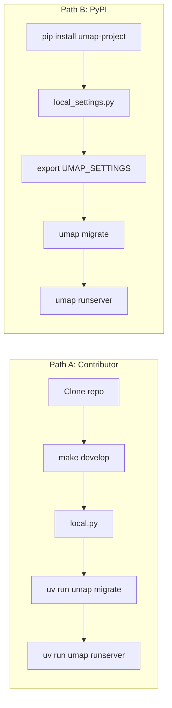
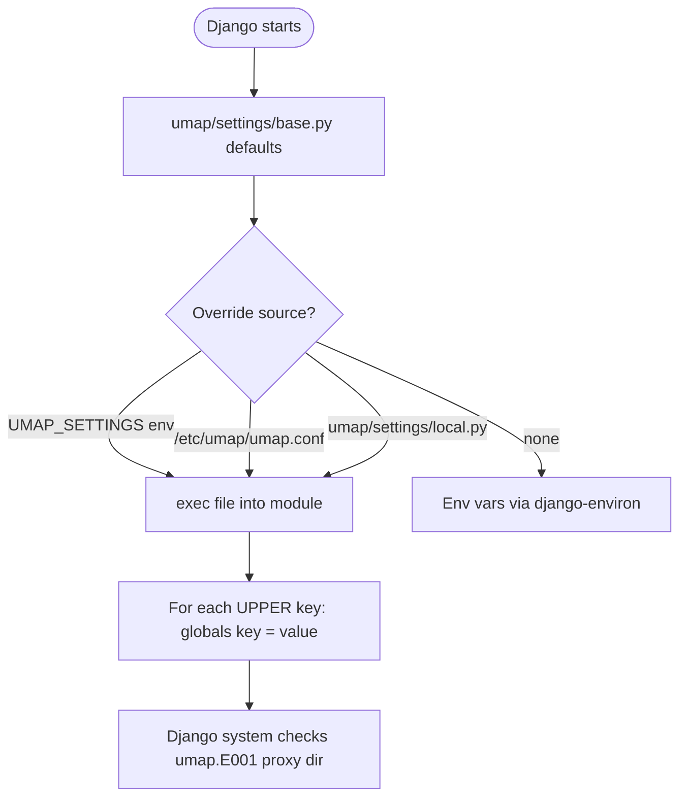

# uMap Onboarding — Phase 7: Run uMap Locally

> **Status:** Phase 7 of 13 · Read-only investigation (setup guide, not executed here) · Builds on [Phase 6](phase-6-algorithms-and-data-transformations.md)  
> **Goal:** Know exactly how to boot a dev instance from this checkout — prerequisites, settings, commands, success signals, and where official docs disagree with the repo

---

## How to read this phase

Phases 1–6 were **code archaeology**. Phase 7 is **operational**: what to install, what to configure, what to run, and how to know it worked.

Evidence labels:

- **OBSERVED** — from repo files (`Makefile`, `pyproject.toml`, `umap/settings/`, etc.)
- **INFERENCE** — reasonable from structure + Django/GeoDjango norms
- **UNKNOWN** — not verified on your machine in this pass (we inspected but did not run the full install)

---

## Your machine snapshot (checked at write time)

**OBSERVED** on this Mac:

| Tool | Status |
|---|---|
| Homebrew | `/opt/homebrew/bin/brew` ✓ |
| System Python | 3.9.6 (`/usr/bin/python3`) — **too old** for this repo |
| `uv` | not found |
| `psql` | not found |
| `umap/settings/local.py` | missing |

**OBSERVED** repo requires **Python ≥ 3.12** (`pyproject.toml` → `requires-python = ">=3.12"`). You will need a newer Python (via `uv`, `pyenv`, or Homebrew) before `make develop` succeeds.

---

## Two installation paths (pick one)

| Path | When to use | Entry command |
|---|---|---|
| **A — Contributor (this checkout)** | You will hack on uMap, run tests, open PRs | `make develop` + `uv run umap …` |
| **B — Consumer (PyPI package)** | You only want a running instance, not the git tree | `pip install umap-project` + `umap …` |

**INFERENCE:** For your onboarding goal (OSS contributor), use **Path A**. `docs/install.md` describes Path B; `docs/contributing.md` points contributors at `make develop`.



---

## Path A — Contributor setup (recommended)

### Step 0 — System dependencies (macOS)

**OBSERVED** from `docs/install.md` (OS X section):

```bash
brew install postgis
```

**INFERENCE:** `postgis` via Homebrew typically pulls PostgreSQL. GeoDjango also needs GDAL/GEOS libraries; the PostGIS formula usually satisfies this on macOS. If `umap migrate` fails with GDAL/GEOS errors, see [GeoDjango install docs](https://docs.djangoproject.com/en/stable/ref/contrib/gis/install/#macos).

Create database and extension:

```bash
# If postgres isn't running yet:
brew services start postgresql@14   # version may vary — check `brew info postgis`

createuser umap --createdb || true
createdb umap -O umap
psql umap -c "CREATE EXTENSION IF NOT EXISTS postgis"
```

**Note:** On Linux, `docs/install.md` sometimes requires a Unix user named `umap` for peer auth. On macOS with Homebrew Postgres, your macOS username as DB owner is usually fine — set `USER` in `DATABASES` if needed.

### Step 1 — Install `uv` and Python 3.12+

**OBSERVED:** `Makefile` uses `uv` for all Python commands.

```bash
curl -LsSf https://astral.sh/uv/install.sh | sh
# restart shell, then:
cd /path/to/umap
make develop
```

**What `make develop` does** (`Makefile`):

1. `uv sync --extra dev,test,sync,s3` — install Python deps into project venv
2. `uv run playwright install` — browsers for integration tests

**OBSERVED** extras include: `dev` (lint/docs), `test` (pytest, playwright), `sync` (uvicorn, redis, websockets for realtime), `s3` (optional storage backend).

You do **not** need Playwright to *run* the dev server — only for `make test-integration`.

### Step 2 — JavaScript tooling (optional for first boot)

**OBSERVED:** Vendored libraries live under `umap/static/umap/vendors/` (committed). `npm install` is for **linting** (`make lint`, Biome, Mocha) and rebuilding vendors (`make vendors`), not required to load the map in dev.

```bash
npm install   # only if you will run make testjs or make lint
```

### Step 3 — Local settings

**OBSERVED** settings resolution (`umap/settings/__init__.py`):

1. `UMAP_SETTINGS` env var (path to any `.py` file), else
2. `/etc/umap/umap.conf`, else
3. `umap/settings/local.py` (gitignored)

**Contributor convention:** copy the sample into the expected path:

```bash
cp umap/settings/local.py.sample umap/settings/local.py
```

Edit `umap/settings/local.py`. Minimum changes for a working **http://localhost:8000** dev instance:

```python
import os
import tempfile
from pathlib import Path

# Repo-relative paths (override sample's /srv/umap/* paths)
BASE_DIR = Path(__file__).resolve().parent.parent.parent
STATIC_ROOT = str(BASE_DIR / "var" / "static")
MEDIA_ROOT = str(BASE_DIR / "var" / "data")

SECRET_KEY = "dev-only-change-me"  # openssl rand -base64 32 for real use

DATABASES = {
    "default": {
        "ENGINE": "django.contrib.gis.db.backends.postgis",
        "NAME": "umap",
        # Add USER/HOST/PORT if your Postgres isn't default peer auth:
        # "USER": "your_mac_username",
    }
}

SITE_URL = "http://localhost:8000"   # must match runserver port
CSRF_TRUSTED_ORIGINS = ["http://localhost:8000"]

# Mandatory since 3.8.0 — NOT in local.py.sample (see "Doc gaps" below)
AJAX_PROXY_CACHE_DIR = str(BASE_DIR / "var" / "proxy-cache")

# Easier local auth without OAuth apps
ENABLE_ACCOUNT_LOGIN = True
UMAP_ALLOW_ANONYMOUS = True
SOCIAL_AUTH_REDIRECT_IS_HTTPS = False   # sample has True — breaks http:// OAuth callbacks

DEBUG = True
UMAP_DEMO_SITE = True
EMAIL_BACKEND = "django.core.mail.backends.console.EmailBackend"
```

Create writable directories:

```bash
mkdir -p var/static var/data var/proxy-cache
```

**INFERENCE:** Without `AJAX_PROXY_CACHE_DIR`, Django system check `umap.E001` fails at startup (`umap/checks.py`). Remote data layers and the ajax proxy will not work until this exists.

### Step 4 — Bootstrap database

```bash
uv run umap migrate
uv run umap collectstatic --noinput
uv run umap createsuperuser    # optional but useful for /admin
uv run umap runserver 0.0.0.0:8000
```

**OBSERVED:** `umap` CLI is `umap.bin:main` → thin wrapper around Django's `manage.py` (`umap/bin/__init__.py`). All Django commands work: `migrate`, `runserver`, `createsuperuser`, `shell`, etc.

**OBSERVED:** Migration `0003_add_tilelayer` seeds a default **Positron** basemap if none exists — you should see tiles without manual admin setup.

### Step 5 — Success signals

Open **http://localhost:8000/** (or `/en/`).

| Signal | What it means |
|---|---|
| Home page loads, no Django error page | Settings + DB connection OK |
| `Loaded local config from …/local.py` in terminal | Settings file picked up |
| Map editor opens at `/en/map/new` (if anonymous allowed) | Auth + templates OK |
| Basemap tiles visible | TileLayer seed + static files OK |
| Draw a marker, Ctrl+S saves | MEDIA_ROOT writable, datalayer API OK |
| Remote layer fetch works | `AJAX_PROXY_CACHE_DIR` writable |

**Admin:** http://localhost:8000/admin/ — tile layers, licences, user management.

**Debug toolbar:** **OBSERVED** `debug_toolbar` is added to `INSTALLED_APPS` when `DEBUG=True` (`base.py`).

---

## Path B — PyPI install (reference only)

From `docs/install.md`:

```bash
python -m venv venv && source venv/bin/activate
pip install umap-project
wget …/local.py.sample -O local_settings.py
export UMAP_SETTINGS=$(pwd)/local_settings.py
# edit DATABASES, SECRET_KEY, STATIC_ROOT, MEDIA_ROOT, AJAX_PROXY_CACHE_DIR
umap migrate && umap collectstatic && umap createsuperuser
umap runserver 0.0.0.0:8000
```

**INFERENCE:** Path B installs the **released** package version, not your checkout's `3.8.1` working tree. Use Path A when developing.

---

## Path C — Docker Compose (alternative)

**OBSERVED** root `docker-compose.yml` runs:

- `postgis/postgis:14-3.3-alpine` (db)
- `redis` (realtime collaboration)
- `umap/umap:3.6.1` (prebuilt image — **older** than checkout `3.8.1`)
- `nginx` proxy on host port **8000**

```bash
docker compose up
# → http://localhost:8000 (via nginx)
```

**INFERENCE:** Good for "see uMap running" without Python toolchain; **not** ideal for hacking this checkout's JS/Python — you'd mount source or build local image (`docs/deploy/docker.md`).

For realtime locally without full compose, **OBSERVED** `REALTIME_ENABLED` + `REDIS_URL` in settings (`base.py`, `docker-compose.yml`).

---

## Settings loading — mental model



**OBSERVED** `base.py` defaults:

- `DATABASES` default: `postgis://localhost:5432/umap`
- `STATIC_ROOT` default: `./static` (relative)
- `MEDIA_ROOT` default: `./uploads` (relative)
- `SECRET_KEY` default: `None` (must set in local config)
- Many `UMAP_*` flags via `django-environ` env vars

**OBSERVED** `docs/config/settings.md` documents env-var configuration for production; local `.py` file is fine for dev.

---

## Makefile commands you'll actually use

| Command | Purpose |
|---|---|
| `make develop` | Install all Python + Playwright deps |
| `make install` | Python deps only (no Playwright) |
| `make help` | List targets |
| `make test-unit` | `pytest umap/tests/` (excludes integration) |
| `make test-integration` | Playwright browser tests |
| `make testjs` | Mocha unit tests in `umap/static/umap/unittests/` |
| `make test` | All three suites |
| `make lint` | ESLint, djlint, isort, ruff |
| `make format` | Auto-format Python/templates |

**OBSERVED** pytest defaults (`pyproject.toml`):

- `DJANGO_SETTINGS_MODULE = umap.tests.settings` (not your `local.py`)
- `--no-migrations --reuse-db --numprocesses auto`

**OBSERVED** test DB (`umap/tests/settings.py`): uses `postgres`/`postgres` on GitHub Actions; locally may need `test_umap` database (see `docs/contributing.md`).

---

## Doc gaps and stale references

| Topic | Docs say | Repo reality |
|---|---|---|
| OAuth backends | `social_auth.backends.*` in `install.md` | **OBSERVED** `social_core.backends.*` in `local.py.sample` |
| Settings file location | `local_settings.py` + `UMAP_SETTINGS` in cwd | **OBSERVED** sample says `umap/settings/local.py`; both work |
| Dev port | `runserver 0.0.0.0:8000` in `install.md` | **OBSERVED** sample `SITE_URL = http://localhost:8019` — mismatch causes CSRF/proxy issues |
| Proxy cache dir | Documented in `docs/config/settings.md` since 3.8.0 | **OBSERVED** missing from `local.py.sample` — startup fails without it |
| STATIC/MEDIA paths | Sample uses `/srv/umap/var/*` | Bad for macOS dev without override — use repo-relative `var/` |
| JS test path | `contributing.md` → `umap/static/test` | **OBSERVED** `Makefile` → `umap/static/umap/unittests/` |
| Frontend entry | `docs/dev/frontend.md` → `umap.js` / `U.Map` | **OBSERVED** `app.js` / `App` (Phase 4) |
| Python version | Classifiers mention 3.11 | **OBSERVED** `requires-python = ">=3.12"` |
| Docker image tag | `docker-compose.yml` → `3.6.1` | Checkout version **3.8.1** (`umap/__init__.py`) |

When docs and code disagree, **trust the repo** and consider a docs PR later.

---

## Common failure modes

### `umap.E001: AJAX_PROXY_CACHE_DIR is not set`

Create directory, set in `local.py`, restart server. **OBSERVED** enforced in `umap/checks.py`.

### GDAL / GEOS library not found

GeoDjango cannot load native libs. On macOS: ensure PostGIS installed via Homebrew; may need:

```bash
brew install gdal geos
```

Then set env vars if Django still can't find them (see GeoDjango macOS docs).

### `SECRET_KEY` / ImproperlyConfigured

Set `SECRET_KEY` in `local.py` or `SECRET_KEY=…` env var.

### CSRF or redirect loops on login

`SITE_URL` must match the URL in your browser **including port**. Add origin to `CSRF_TRUSTED_ORIGINS`. Set `SOCIAL_AUTH_REDIRECT_IS_HTTPS = False` for plain http dev.

### Blank map / no tiles

Run `collectstatic`. Check `/admin/` → Tile Layers exist (migration should seed Positron). Check browser network tab for 404s on `/static/`.

### Save fails / permission errors on layer

Ensure `MEDIA_ROOT` exists and is writable — GeoJSON files land here via `umap.storage.fs.FSDataStorage`.

### `psql: command not found`

Install Postgres/PostGIS via Homebrew (`brew install postgis`).

### Python version too old

Install 3.12+ via `uv python install 3.12` or `brew install python@3.12`. Do not use macOS system 3.9 for this project.

---

## Minimal “first hour” checklist

Copy-paste oriented sequence for **this Mac + this repo**:

```bash
# 1. System
brew install postgis
brew services start postgresql@14    # adjust version if needed
createuser umap --createdb 2>/dev/null || true
createdb umap -O umap 2>/dev/null || true
psql umap -c "CREATE EXTENSION IF NOT EXISTS postgis"

# 2. Python toolchain
curl -LsSf https://astral.sh/uv/install.sh | sh
cd ~/Documents/ChatGPT/umap
make install    # skip playwright on first pass: make install not develop

# 3. Settings
cp umap/settings/local.py.sample umap/settings/local.py
# → edit per "Step 3" above (SITE_URL, paths, AJAX_PROXY_CACHE_DIR)
mkdir -p var/static var/data var/proxy-cache

# 4. Boot
uv run umap migrate
uv run umap collectstatic --noinput
uv run umap createsuperuser
uv run umap runserver 0.0.0.0:8000
```

Then open http://localhost:8000/en/ and create a test map.

---

## What running locally unlocks (Phases 8–9)

| Phase | You can now… |
|---|---|
| **8 — DevTools** | Set breakpoints in Network tab on `datalayer/` saves, watch `map_settings` bootstrap |
| **9 — Learning experiment** | Change one small thing (e.g. default zoom), verify behavior |
| **12 — Tests** | `make test-unit` with `test_umap` database |

**INFERENCE:** Until Phase 7 succeeds, Phases 8–12 stay theoretical.

---

## Phase 7 summary

### MUST UNDERSTAND NOW

1. **Contributors use `uv` + `make develop`**, not `pip install` from PyPI
2. **Settings** load from `umap/settings/local.py` (or `UMAP_SETTINGS`)
3. **`AJAX_PROXY_CACHE_DIR` is mandatory** since 3.8.0
4. **`SITE_URL` must match your browser URL** (port included)
5. **GeoJSON lives under `MEDIA_ROOT`**; Postgres holds metadata/permissions
6. **`umap` CLI = Django management** — same commands you know from other Django projects

### USEFUL LATER

- Docker compose for realtime + redis
- `UMAP_SETTINGS` pointing outside the repo (deploy pattern)
- `make test-integration` + `PWDEBUG=1` for Playwright debugging

### Safe to defer

- Helm charts, production ASGI/nginx
- S3 storage backend (`pyproject.toml` `[s3]` extra)
- OAuth provider registration (use Django login first)

---

## What we investigate next — Phase 8: Connect Browser to Code

Phase 8 walks DevTools workflows against your running instance:

- Reading `U.SETTINGS` / `U.MAP` in the console
- Tracing a save in Network tab to `DataLayerUpdate`
- Watching lazy layer fetch (`GET datalayer/…`)
- Source maps and where to set breakpoints in `app.js` / `data/layer.js`

---

## Pause here

Phase 7 is a **recipe**, not something we executed end-to-end in this session (your machine still needs `uv`, Postgres, and `local.py`).

**Questions before Phase 8:**

- Want to **walk through the install together** step-by-step on your Mac (I run commands with you)?
- Prefer **Docker** over native Postgres/Python?
- Any **blocker** from a partial install attempt?

Say **"continue to Phase 8"** once you have a running instance, or ask for hands-on setup help.
