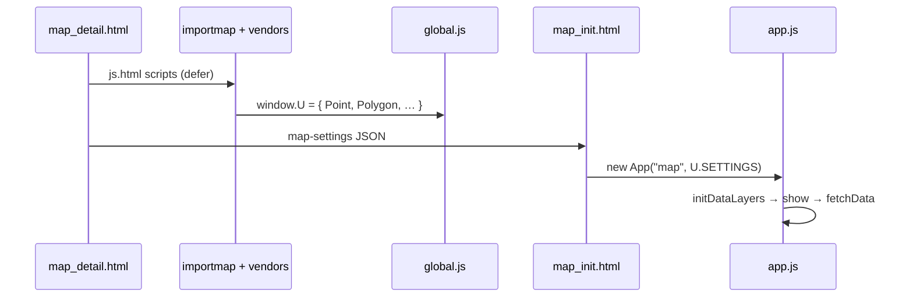

# uMap Onboarding — Phase 8: Connect Browser Behavior to Code

> **Status:** Phase 8 of 13 · Read-only investigation · Assumes [Phase 7](phase-7-run-locally.md) (or public umap.org)  
> **Goal:** Use browser DevTools to observe uMap runtime state and tie Network/DOM/Console signals to exact files and functions

---

## How to read this phase

Phase 5 traced code paths on paper. Phase 8 does the same **in a running browser** — the skill you will use daily as a contributor.

Each exercise:

1. **You do** something in the UI
2. **DevTools shows** a signal (Network, Console, DOM, breakpoint)
3. **We map** that signal to code

Evidence labels: **OBSERVED** / **INFERENCE** / **UNKNOWN**.

**Prerequisite:** A running uMap instance (`http://localhost:8000` from Phase 7, or any public map you can edit). Chrome or Firefox DevTools both work; examples use Chrome naming.

---

## DevTools setup (one minute)

1. Open a map page, e.g. `/en/map/my-map_42` or create a new map.
2. **F12** (or Cmd+Option+I on Mac) → dock DevTools to the side.
3. Enable **Preserve log** on the Network tab (saves survive navigation).
4. Console → gear icon → enable **"Log XMLHttpRequests"** (optional; Network tab is primary).
5. Sources → open `umap/js/modules/app.js` via the page tree (no bundler — files load as ES modules).

**OBSERVED:** Application JS is **not bundled**. Modules load from `/static/umap/js/modules/*.js` via `import` + importmap (`umap/templates/umap/js.html`). You can set breakpoints in original source files.

**OBSERVED:** **No source maps** for uMap application code (only some vendored libs like Leaflet). Line numbers in DevTools match repo files directly.

---

## Page boot anatomy

### What the server sends

**OBSERVED** `map_detail.html` → includes `map_init.html`:

```html
<div id="map"></div>
<script id="map-settings" data-settings="…escaped JSON…"></script>
<script type="module">
  import App from '/static/umap/js/modules/app.js'
  U.SETTINGS = JSON.parse(document.getElementById('map-settings').dataset.settings)
  U.MAP = new App("map", U.SETTINGS)
</script>
```

The bootstrap payload is **server-built GeoJSON-like JSON** (`map_settings` from `MapDetailMixin` / `views.py`), not a separate API call.

### Script load order (simplified)



**OBSERVED** `global.js` only exposes geometry helpers on `window.U`. The map instance is assigned in `map_init.html` as **`U.MAP`**, not inside `global.js`.

### Console smoke test

After the map finishes loading:

```javascript
// Bootstrap
U.MAP                    // App instance
U.SETTINGS               // same object passed to constructor (until App mutates properties)
U.MAP.dataloaded         // true when visible layers finished loading
U.MAP.id                 // map pk (undefined on brand-new unsaved map)
U.MAP.properties.urls    // all named Django routes for client

// Quick health
U.MAP.layers.tree.length
U.MAP.isDirty            // false until you edit
U.MAP.editEnabled        // false until edit mode
```

**INFERENCE:** Playwright integration tests wait on `U.MAP.dataloaded === true` (`umap/tests/integration/conftest.py`) — use the same signal manually.

### Read bootstrap without `U.SETTINGS`

Elements tab → `#map-settings` → `data-settings` attribute, or Console:

```javascript
JSON.parse(document.getElementById('map-settings').dataset.settings)
```

**What to notice in that JSON:**

| Key | Meaning |
|---|---|
| `properties.datalayers[]` | Layer **metadata** only (uuid, name, settings) — usually **no features** |
| `properties.urls` | URI templates from `_urls_for_js()` (`umap/utils.py`) |
| `properties.permissions` | Can you edit? anonymous? |
| `geometry.coordinates` | Map center `[lng, lat]` |
| `properties.websocketEnabled` | Realtime available on this instance |

**OBSERVED:** Features are **lazy-loaded** per layer via `GET /datalayer/{map_id}/{uuid}/`, not in the initial HTML.

---

## DOM signals ↔ code

| DOM / CSS | Code |
|---|---|
| `<body class="umap-edit-enabled">` | `App.enableEdit()` adds class (`app.js`) |
| `#map` | Leaflet/OpenLayers container; `App` constructor element id |
| `.umap-ui-container` | Overlays attached by `mapProxy.attachUI` |
| `.edit-save` visible | Edit mode + dirty state (CSS in `bar.css`) |
| Loader spinner | `Loader` listens to `server`/`request` `dataloading` events |

**Exercise:** Toggle edit mode → watch `<body>` class change in Elements → correlates with `enableEdit()` / `disableEdit()`.

---

## Exercise 1 — Open an existing map (read path)

### UI action

Open a saved map URL (not `/map/new`).

### Network tab

1. Filter: `datalayer`
2. You should see **GET** requests like:

   `/en/datalayer/42/a1b2c3d4-…-uuid/`

   Optional cache-bust query if you have edit permission: `?1736…` (**OBSERVED** `_dataUrl()` in `data/layer.js`).

3. Click a request → **Headers**:

   | Header | Meaning |
   |---|---|
   | `Content-Type: application/geo+json` | Raw FeatureCollection bytes |
   | `X-Datalayer-Version` | Server file version token for conflict detection |

4. **Response** preview: GeoJSON `FeatureCollection` with `features[]`, top-level `properties` (layer settings), `id`, `rank`.

### Code path

```text
App.initDataLayers()
  → createDataLayer(spec)     // metadata from bootstrap
  → datalayer.show()          // if displayOnLoad / visibility rules
    → fetchData()             // if createdOnServer && not loaded
      → server.get(_dataUrl())
      → fromUmapGeoJSON(geojson)
```

**Breakpoint suggestion:** `data/layer.js` → `fetchData` line with `await this.app.server.get`.

**Console after load:**

```javascript
const layer = U.MAP.layers.tree[0]
layer.id                    // uuid string
layer.isLoaded()            // true
layer.referenceVersion      // matches X-Datalayer-Version from Network
layer.features.count()      // feature count
```

---

## Exercise 2 — Enter edit mode

### UI action

Click the pencil / "Enable editing" control.

### Signals

| Signal | Expected |
|---|---|
| `<body class="… umap-edit-enabled">` | Edit UI visible |
| Console | May log `You go Leaflet` at first load; journal import is dynamic |
| Network | Possible `GET …/websocket-auth-token/` if realtime enabled |

### Code path

```text
enableEdit()
  → initJournal()           // dynamic import journal/engine.js
  → editEnabled = true
  → mapProxy.enableEdit()
```

**Breakpoint:** `app.js` → `enableEdit`.

**Console:**

```javascript
U.MAP.editEnabled           // true
U.MAP.journal               // journal proxy exists
U.MAP.hasEditMode()         // permission check from bootstrap
```

**OBSERVED:** `disableEdit()` refuses to exit if `isDirty` — try toggling off after an edit.

---

## Exercise 3 — Draw a marker (client edit path)

### UI action

In edit mode: add layer (if needed) → draw tool → place a marker.

### Signals

| Signal | Where |
|---|---|
| Leaflet draw events | Internal to `Leaflet.Editable` / `rendering/leaflet.js` |
| `U.MAP.isDirty` | `true` after commit |
| Save button enabled | `.edit-save` in DOM |

### Code path (summary from Phase 5)

```text
draw:marker
  → U.Editable.createMarker
  → feature:commit
  → journal.upsert / journal.update
  → undoManager marks dirty
```

**Console inspection:**

```javascript
U.MAP.isDirty
const f = U.MAP.layers.tree.find(l => !l.group)?.features.all()[0]
f?.toGeoJSON()              // geometry [lng, lat], properties
f?.properties
```

**Breakpoint candidates:**

- `data/features.js` — feature commit
- `journal/engine.js` — `upsert` / `update`
- `rendering/leaflet.js` — `onCommit` handlers

**INFERENCE:** Nothing hits the server until **Save** — edits are client-side in memory + journal until `saveAll()`.

---

## Exercise 4 — Save (write path)

### UI action

**Ctrl+S** (or Cmd+S) or click Save.

### Network tab (filter: `datalayer` or `map`)

Typical sequence for a dirty map with one edited layer:

| # | Method | Path pattern | Body |
|---|---|---|---|
| 1 | POST | `/en/map/edit/{id}/` or map create | `settings`, `center`, `name`, … |
| 2 | POST | `/en/map/{id}/datalayer/{uuid}/update/` | `multipart/form-data` |

**OBSERVED** naming trap in `urls.js`:

```javascript
datalayer_save({ created: true })  // → datalayer_update (layer already on server)
datalayer_save({ created: false }) // → datalayer_create
```

### Request details to inspect

**Layer save POST** (`DataLayer.save()`):

| Part | Content |
|---|---|
| Form field `geojson` | Blob: `umapGeoJSON()` FeatureCollection |
| Form field `settings` | JSON string of layer properties |
| Header `X-CSRFToken` | From `csrftoken` cookie (`request.js`) |
| Header `X-Datalayer-Reference` | Prior `referenceVersion` from last GET/POST |
| Header `X-Requested-With` | `XMLHttpRequest` |

**Success response:**

- JSON metadata (not full geojson unless merge happened)
- Header `X-Datalayer-Version` — new version token

**Conflict:**

- Status **412** → `AlertConflict` → optional force save (`data/layer.js` `_trySave`)
- Maps to `merge_features()` on server (`umap/utils.py`, Phase 6)

### Code path

```text
Ctrl+S shortcut → saveAll()
  → journal.save()
    → _getDirtyObjects()
    → saveOne(app) / saveOne(datalayer)  // parents first
      → app.save()        // map metadata POST
      → datalayer.save()  // layer multipart POST
  → fire('saved')
```

**Breakpoints:**

1. `app.js` → `saveAll`
2. `journal/engine.js` → `save` / `saveOne`
3. `data/layer.js` → `save` / `_trySave`
4. Server: `umap/views.py` → `DataLayerUpdate.post`

**Console after successful save:**

```javascript
U.MAP.isDirty              // false
U.MAP.layers.tree[0].referenceVersion  // updated
```

### Watch CSRF issues

If POST returns **403**:

- Check `csrftoken` cookie exists (Django `ensure_csrf_cookie` on map view)
- Check `SITE_URL` / `CSRF_TRUSTED_ORIGINS` match browser origin (Phase 7)

---

## Exercise 5 — Remote / proxied data layer

### UI action

Add a layer with **remote data** URL (or pan map with dynamic remote layer).

### Network tab

| Request | When |
|---|---|
| External URL directly | `remoteData.proxy` is false |
| `/en/ajax-proxy/{ttl}/?url=…` | `remoteData.proxy` is true |
| `GET datalayer/…` | Still happens for layer shell; **features may be empty** in saved file |

**OBSERVED** `fetchRemoteData()` (`data/layer.js`):

```text
renderUrl(remoteData.url)     // bbox substitution
→ proxyUrl if proxy enabled
→ formatter.parse(raw, format)
→ fromGeoJSON
```

**Breakpoint:** `data/layer.js` → `fetchRemoteData`.

**Server:** `umap/views.py` → `AjaxProxy` (validates referer, blocks private IPs — Phase 6).

---

## URL registry in the client

Bootstrap includes `properties.urls` — a dict of Django route names → URI templates.

**Console:**

```javascript
U.MAP.urls.get('datalayer_view', { map_id: U.MAP.id, pk: U.MAP.layers.tree[0].id })
U.MAP.urls.get('datalayer_save', { map_id: U.MAP.id, pk: '…', created: true })
```

**OBSERVED** built server-side by `_urls_for_js()` (`umap/utils.py`) from `umap.urls` (+ sync routes if `REALTIME_ENABLED`).

**INFERENCE:** When a save 404s, compare Network URL to `urls.get(...)` output — often a `map_id` / locale prefix mismatch.

---

## Event bus (advanced console)

`App` extends `WithEvents`. Useful for tracing without breakpoints:

```javascript
// Log every datalayer change
U.MAP.on('datalayer:changed', () => console.log('datalayer:changed'))

// One-shot when all visible layer data loaded
U.MAP.once('dataloaded', () => console.log('dataloaded'))

// After save
U.MAP.on('saved', () => console.log('saved'))
```

**OBSERVED** events include: `datalayersloaded`, `dataloaded`, `datalayer:changed`, `edit:enabled`, `edit:disabled`, `saved`, `feature:endedit`.

---

## Breakpoint map (contributor cheat sheet)

| Symptom | First breakpoint |
|---|---|
| Map doesn't boot | `app.js` → `init` |
| Layers list empty | `app.js` → `initDataLayers` |
| Layer never loads geometry | `data/layer.js` → `show` / `fetchData` |
| Draw doesn't stick | `journal/engine.js` → `upsert` |
| Save no-op | `app.js` → `saveAll`; check `isDirty` |
| Save 412 | `data/layer.js` → `_trySave` |
| Remote import fails | `formatter.js` → `parse` |
| Style wrong | `data/layer.js` → `getProperty` |
| Choropleth wrong | `data/types.js` → `Choropleth.compute` |

### OpenLayers experiment

**OBSERVED:** `?openlayers` query param switches renderer (`app.js` init) — console logs `So you wanna run OL`. Useful when working on the Leaflet → OpenLayers migration.

---

## Playwright ↔ DevTools (how maintainers debug)

Integration tests use the same `U.MAP` globals:

```bash
PWDEBUG=1 uv run pytest --headed -n1 -k test_name umap/tests/integration/
```

**OBSERVED** from `docs/contributing.md`: Playwright inspector = step through with live browser; same Network/Console tools apply.

**INFERENCE:** When a CI integration test fails, reproduce locally with `PWDEBUG=1` and the same breakpoints as above.

---

## Network filter cheat sheet

| Filter | Finds |
|---|---|
| `datalayer` | Layer GET/POST/versions |
| `map/edit` | Map metadata save |
| `ajax-proxy` | Proxied remote fetch |
| `websocket` | Realtime sync (if enabled) |
| `geojson` | Map export endpoint |
| `static/umap/js` | Module loads (debug 404s) |

---

## Common DevTools mistakes

| Mistake | Fix |
|---|---|
| Looking for `U.Map` | **OBSERVED** it's `U.MAP` (all caps MAP) |
| Expecting features in `#map-settings` | Only metadata; watch `datalayer` GET |
| No POST on draw | Saves are explicit; check `isDirty` |
| Breakpoint never hits | Hard-refresh; check correct module URL under Sources |
| `U.SETTINGS.datalayers[0].features` | May be absent until fetch completes — use `layer.features` |
| CORS errors on remote layer | Use proxy toggle or ajax-proxy path |

---

## Phase 8 summary

### MUST UNDERSTAND NOW

1. **`U.MAP` is the live `App` instance** — start every Console investigation there
2. **Bootstrap JSON ≠ layer geometry** — lazy `GET datalayer/{map_id}/{uuid}/`
3. **Edits are local until Save** — `journal` tracks dirty state; `saveAll` → `journal.save`
4. **Network headers carry versioning** — `X-Datalayer-Version` / `X-Datalayer-Reference`
5. **`datalayer_save({ created: true })` means UPDATE** — inverted naming
6. **ES modules load unbundled** — breakpoints work directly in `umap/static/umap/js/modules/`

### USEFUL LATER

- WebSocket messages in Network → WS tab (`journal/engine.js`)
- `PWDEBUG` Playwright stepping
- `?openlayers` renderer switch

### Safe to defer

- Leaflet internal event names
- HLC websocket merge (`journal/hlc.js`)
- Django Debug Toolbar SQL panel

---

## What we investigate next — Phase 9: One Controlled Learning Experiment

Phase 9 picks **one small, reversible change** (with your approval) to close the loop:

- Hypothesis → code location → edit → verify in browser → revert or branch

Examples: tweak default zoom, change a translation string, add a console log behind a flag.

**Still read-only until you explicitly approve experimentation.**

---

## Pause here

You should now be able to **start from DevTools** and land in the right file within one or two hops.

**Questions before Phase 9:**

- Want a **guided live session** on one map (you share what you see in Network)?
- Which experiment interests you: **UI**, **import**, **save/conflict**, or **styling**?
- Is your **local instance running** yet?

Say **"continue to Phase 9"** when ready for a controlled first change, or ask for DevTools help on a specific behavior.
