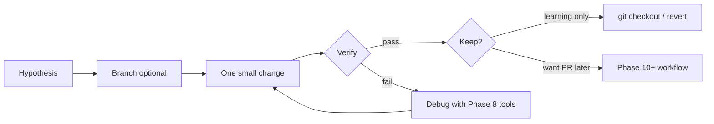

# uMap Onboarding — Phase 9: One Controlled Learning Experiment

> **Status:** Phase 9 of 13 · **First phase that may touch code** (only with your explicit go-ahead) · Builds on [Phase 8](phase-8-connect-browser-to-code.md)  
> **Goal:** Close the loop — hypothesis → small change → verify → revert — without pretending you have contributed yet

---

## How to read this phase

Phases 1–8 were **observe and understand**. Phase 9 is **one safe rep** of the contributor loop:

1. Branch (optional but recommended)
2. Change **one thing**
3. Verify with **automated test or browser**
4. Revert or keep on a throwaway branch

This document does **not** make changes for you. It gives you **three ranked experiments** and a full script for the recommended one. Say which experiment you want when you are ready to execute.

Evidence labels: **OBSERVED** / **INFERENCE** / **UNKNOWN**.

---

## Rules for this phase

| Rule | Why |
|---|---|
| **One concern per experiment** | Multi-file diffs hide what you learned |
| **Reversible in &lt; 30 seconds** | `git checkout -- file` or delete `local.py` tweak |
| **No drive-by refactors** | Not the time to fix unrelated issues |
| **No commit/push/PR unless you ask** | Onboarding ≠ contribution yet |
| **Do not edit vendored code** | `umap/static/umap/vendors/` is third-party |
| **Prefer tests over production paths** | When Postgres is not set up yet |



---

## Pick your experiment

| # | Experiment | Needs local server? | Needs Postgres? | Touches git-tracked files? | Teaches |
|---|---|---|---|---|---|
| **A** | Default zoom via `local.py` | Yes | Yes (migrate once) | **No** (`local.py` gitignored) | Server settings → bootstrap JSON → `U.MAP` |
| **B** | Add one Mocha unit test | No | No | **Yes** (`unittests/URLs.js`) | JS test loop, URL helper you will see on every save |
| **C** | Temporary `console.debug` on save | Yes | Yes | **Yes** (`app.js` or `journal/engine.js`) | Save pipeline live in DevTools |

**Recommendation:**

- **No local uMap yet?** → Start with **Experiment B** (`npm install` + `make testjs` only).
- **Server running?** → Do **A** then **C** in one session (config chain, then runtime trace).
- **Want maximum OSS realism?** → **B** on a branch named `onboarding/experiment-b`.

---

## Experiment A — Default zoom (config → browser)

### Hypothesis

**INFERENCE:** Changing `LEAFLET_ZOOM` in local settings changes the initial zoom on `/en/map/new` because `MapNew` embeds it in bootstrap JSON.

**OBSERVED** server code (`umap/views.py`, `MapNew.get_geojson`):

```python
"zoom": getattr(settings, "LEAFLET_ZOOM", 6),
```

Center comes from `LEAFLET_LATITUDE` / `LEAFLET_LONGITUDE` via `DEFAULT_CENTER` in `umap/forms.py`.

### Steps

1. In `umap/settings/local.py` (from Phase 7), set:

   ```python
   LEAFLET_ZOOM = 10
   LEAFLET_LATITUDE = 48.85   # Paris — pick your city
   LEAFLET_LONGITUDE = 2.35
   ```

2. Restart `uv run umap runserver …`.

3. Open **http://localhost:8000/en/map/new** (hard refresh).

### Verify

**Console:**

```javascript
U.SETTINGS.properties.zoom        // expect 10
U.SETTINGS.geometry.coordinates   // expect [2.35, 48.85] (lng, lat)
U.MAP.mapProxy.zoom               // should match after map renders
```

**Network:** No extra API call — value is in `#map-settings` HTML (Phase 8).

### Revert

Remove or comment out those three lines in `local.py`; restart server.

### What you learned

Server `settings` → Django view `get_geojson()` → `map_settings` template JSON → `U.SETTINGS` → Leaflet view. **No JavaScript change required** for instance-wide defaults.

---

## Experiment B — Add one unit test (recommended if no DB)

### Hypothesis

The `URLs.has()` method correctly reports whether a route name exists in the bootstrap URL dict — a helper used before building save/fetch URLs.

### Why this file

**OBSERVED:** `umap/static/umap/unittests/URLs.js` already tests `datalayer_save` naming (Phase 6/8 trap). Extending it teaches the **lightest** test loop in the repo.

### Prerequisites

```bash
cd /path/to/umap
npm install          # once
make testjs          # baseline: all tests green
```

### Steps

1. Create a branch (recommended):

   ```bash
   git checkout -b onboarding/experiment-b
   ```

2. Edit `umap/static/umap/unittests/URLs.js` — add inside the top-level `describe('URLs')` block:

   ```javascript
   describe('has()', () => {
     it('returns true when the url name exists', () => {
       expect(urls.has('map_create')).to.be.true
     })

     it('returns false for unknown url names', () => {
       expect(urls.has('not_a_route')).to.be.false
     })
   })
   ```

3. Run:

   ```bash
   make testjs
   # or: node_modules/mocha/bin/mocha.js umap/static/umap/unittests/
   ```

### Verify

- Mocha reports **2 new passing tests**.
- If `has()` did not exist, tests would fail — check `umap/static/umap/js/modules/urls.js` (`has(urlName)` is **OBSERVED** at lines 8–10).

### Revert

```bash
git checkout -- umap/static/umap/unittests/URLs.js
# or stay on branch and delete branch later
```

### Stretch (optional)

Add one test asserting `datalayer_save({ created: true })` hits the **update** route name — document in a comment *why* `created: true` means update (Phase 6). Do not open a PR yet unless you intend to contribute docs/tests for real.

### What you learned

- JS tests run with **Mocha + Chai**, not Jest.
- `make testjs` is the project’s contract before touching URL/routing code.
- Small test additions are valid first contributions.

---

## Experiment C — Trace save in DevTools (temporary debug)

### Hypothesis

When you press **Ctrl+S**, `saveAll()` runs only if `isDirty`, then `journal.save()` iterates dirty objects.

**OBSERVED** (`app.js`):

```javascript
async saveAll() {
  if (!this.isDirty) return
  const status = await this.journal.save()
  // ...
}
```

### Steps

1. Branch:

   ```bash
   git checkout -b onboarding/experiment-c
   ```

2. Add **one** debug line in `umap/static/umap/js/modules/journal/engine.js` inside `async save()`, before `_getDirtyObjects()`:

   ```javascript
   console.debug('[onboarding] journal.save()', {
     dirty: this._getDirtyObjects().size,
     mapId: this.app.id,
   })
   ```

   **Note:** Call `_getDirtyObjects()` once here for logging only; the real `save()` calls it again — acceptable for a throwaway trace.

3. Hard-refresh the map page (ES modules cache aggressively).

4. Open map → enable edit → draw a marker → **Ctrl+S**.

### Verify

| Signal | Expected |
|---|---|
| Console | `[onboarding] journal.save()` with `dirty >= 1` |
| Network | POST to map update + datalayer update (Phase 8) |
| Console after save | `U.MAP.isDirty === false` |

5. Edit again **without** saving → `saveAll` should still log on next Ctrl+S.

6. Load map, **no edits** → Ctrl+S → **no log** (early return in `saveAll`).

### Revert

```bash
git checkout -- umap/static/umap/js/modules/journal/engine.js
```

### What you learned

Dirty tracking is **client-side** until save; journal is the gatekeeper for which objects POST.

---

## Experiment worksheet (copy for your notes)

```markdown
## My Phase 9 experiment

- **Chosen:** A / B / C
- **Hypothesis:**
- **Files touched:**
- **Commands run:**
- **Verify result:** pass / fail
- **Surprise (what I didn't expect):**
- **Reverted:** yes / no (branch name)
```

---

## What NOT to do as “first experiment”

| Tempting idea | Why wait |
|---|---|
| Fix `local.py.sample` missing `AJAX_PROXY_CACHE_DIR` | Good **real** PR, but touches deploy docs + sample — do in Phase 10+ with tests |
| Refactor `saveAll` / journal | High blast radius; needs integration tests |
| Upgrade a vendor (Leaflet, Turf) | `make vendors` + huge diff |
| Change merge algorithm | Needs Python tests + conflict fixtures |
| Edit `en.json` only for fun | Translations go through Transifex (`docs/contributing.md`) |
| Run full `make test` without DB | Integration tests need Postgres + Playwright |

---

## If verification fails

Use Phase 8 playbook:

| Failure | Check |
|---|---|
| `make testjs` command not found | `npm install` first |
| Test fails on `has()` | Read `urls.js` — method signature changed? |
| No console log on save | Edit mode on? `isDirty`? Hard refresh? Correct file path? |
| Zoom unchanged after A | Restart Django? Correct `local.py` loaded? (terminal prints `Loaded local config from`) |
| POST 403 on C | CSRF / `SITE_URL` (Phase 7) |

---

## Relationship to a real contribution

This phase is **deliberately not a PR**. You have:

- Read the code (Phases 1–6)
- Traced runtime (Phases 5, 8)
- Touched the toolchain (Phase 9)

A real contribution adds:

- Issue or maintainer agreement on scope
- Tests that match project style
- `make lint` / CI green
- Fork/upstream workflow (Phase 11)

**INFERENCE:** Experiment B is closest to a mergeable artifact; Experiments A and C are **learning-only** (A is gitignored; C must be reverted).

---

## Phase 9 summary

### MUST UNDERSTAND NOW

1. **Verify before you believe** — browser or test runner, not code reading alone
2. **One change, one hypothesis** — write it down
3. **`local.py` vs tracked files** — config experiments do not practice git; unit tests do
4. **Revert is success** — you proved the causal link
5. **Save path:** `isDirty` → `journal.save()` → per-object `.save()` (Phase 8)

### USEFUL LATER

- Combining B + a docs fix in one PR (split PRs per skill)
- `PWDEBUG=1` to watch the same save in Playwright

### Safe to defer

- Opening your first GitHub issue
- `make test-integration` until Postgres + Playwright installed

---

## What we investigate next — Phase 10: Engineering Culture

Phase 10 covers how uMap maintainers expect work to look:

- PR norms (`docs/contributing.md`)
- Lint/format (`make lint`, Biome, ruff)
- When to add Python vs JS vs Playwright tests
- Transifex vs in-repo strings
- Reading changelog and release cadence

---

## Pause here — your move

Phase 9 is a **menu**, not an automatic code change.

**Reply with one of:**

1. **`run experiment B`** — I will apply the unit test with you (smallest deps)
2. **`run experiment A` or `C`** — assumes your local server from Phase 7 is up
3. **`continue to Phase 10`** — stay read-only for culture/docs
4. **Your own micro-idea** — I will sanity-check scope before you edit

Until you pick, the repo stays unchanged.
